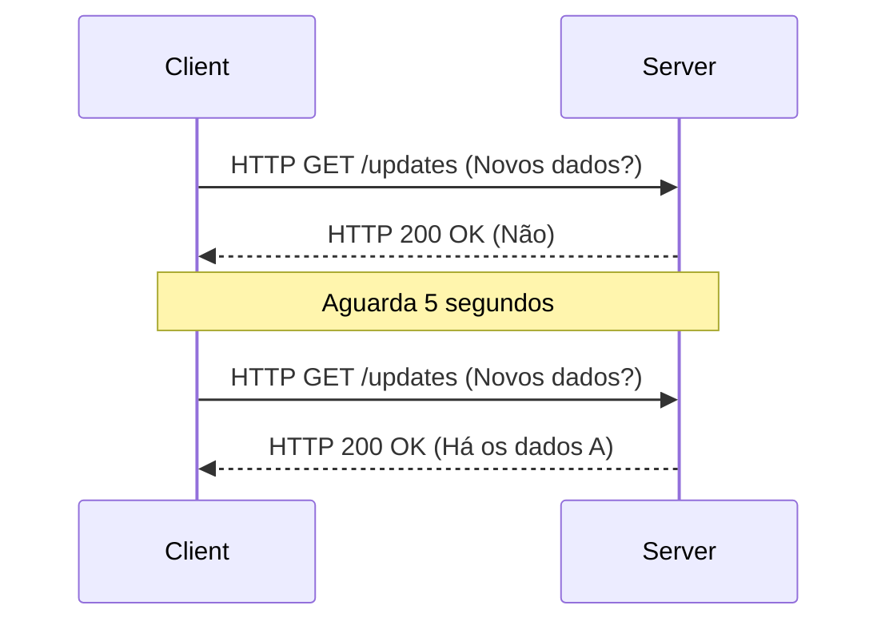
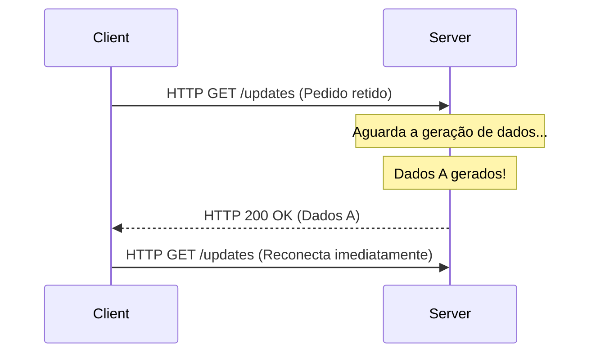
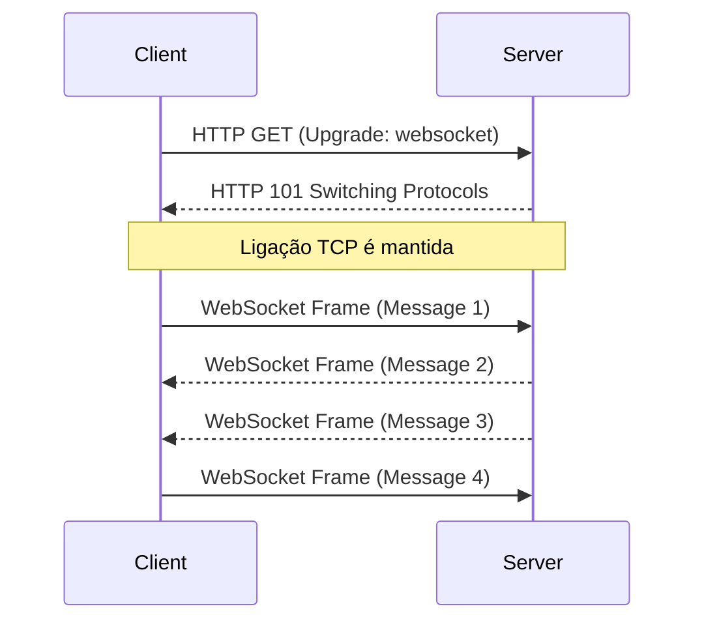
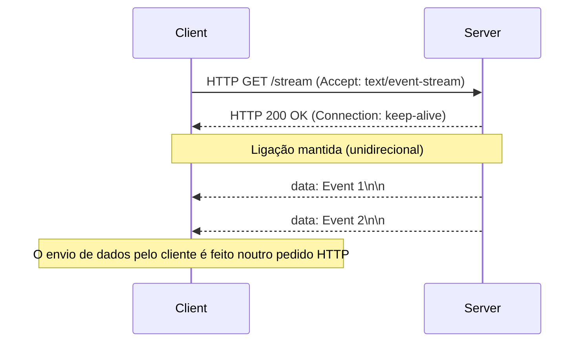

À medida que as aplicações web evoluíram de um mero conjunto de documentos estáticos para plataformas que oferecem experiências ricas e interativas, o "tempo real" tornou-se um dos requisitos mais importantes. As aplicações modernas que utilizamos todos os dias, como dados de ticks de ações, aplicações de chat, atualizações de resultados desportivos ao vivo, jogos multijogador ou a saída de logs em tempo real de pipelines de CI/CD, dependem de mecanismos que enviam dados instantaneamente do servidor para o cliente.

Neste artigo, explicaremos de forma extremamente detalhada os dois gigantes que realizam essa comunicação em tempo real: **WebSocket** e **Server-Sent Events (SSE)**, abordando as suas origens, detalhes dos protocolos, desafios de escalabilidade e diretrizes específicas de quando utilizar cada um.

## As Limitações do HTTP e o Alvorecer da Comunicação em Tempo Real

Para compreender verdadeiramente a importância do WebSocket e do SSE, precisamos primeiro olhar para os problemas fundamentais que tentaram resolver, nomeadamente as limitações do protocolo HTTP tradicional.

### Modelo de Pedido-Resposta Sem Estado (Stateless)
O HTTP (Hypertext Transfer Protocol) adota um modelo rigoroso de "pedido-resposta" onde o cliente envia um pedido ao servidor e o servidor devolve uma resposta. Isto era ideal para os casos de uso iniciais da Web (seguir links para navegar por páginas), mas não suporta o "server push", onde o servidor notifica proativamente o cliente sobre eventos que ocorreram no lado do servidor.

### A Solução Desesperada do Polling
Numa época em que o push por parte do servidor não era suportado a nível de protocolo, os programadores usavam uma técnica chamada "Polling" para simular o tempo real. Esta é uma abordagem em que o cliente envia repetidamente pedidos ao servidor em intervalos regulares (por exemplo, a cada 5 segundos) perguntando: "Há novos dados?".



O Polling tem a vantagem de ser extremamente simples de implementar, mas possui as seguintes desvantagens graves:
1. **Aumento do Overhead**: Uma vez que os pedidos são enviados mesmo quando não há atualização de dados, o overhead dos cabeçalhos HTTP acumula-se, desperdiçando a largura de banda da rede e os recursos do servidor.
2. **Latência**: Pode haver um atraso de até o intervalo de polling entre o momento em que a atualização ocorre e o momento em que o cliente a deteta.

### Melhoria Através do Long-Polling
Para melhorar a ineficiência do polling, foi criado o "Long-Polling". Quando o cliente envia um pedido, o servidor "retém a resposta (espera com a ligação aberta) até que novos dados sejam gerados". No momento em que os dados são gerados, a resposta é devolvida e o cliente envia imediatamente o pedido seguinte assim que recebe a resposta.



O Long-Polling teve sucesso em melhorar o imediatismo e reduzir a comunicação desnecessária, mas como ainda utiliza a estrutura do HTTP, o overhead dos cabeçalhos é inevitável e o custo de restabelecer a ligação de cada vez que os dados são enviados (especialmente o handshake TLS num ambiente HTTPS) permaneceu como um problema que não podia ser ignorado.

---

## WebSocket: Comunicação Bidirecional Completa que Liberta o Poder do TCP

Para resolver fundamentalmente esses problemas, surgiu o **WebSocket**. Este protocolo, padronizado pelo RFC 6455, opera sobre o TCP da mesma forma que o HTTP, mas adota uma abordagem inovadora que quebra as limitações do HTTP.

### Como Funciona o Protocolo WebSocket
A maior característica do WebSocket é que, uma vez estabelecida a ligação, tanto o cliente como o servidor podem realizar "comunicação bidirecional full-duplex", permitindo o envio de dados a qualquer momento usando frames leves.

#### 1. HTTP Upgrade (Handshake)
A ligação WebSocket começa inicialmente como um pedido HTTP normal. O cliente usa o cabeçalho `Upgrade` para solicitar ao servidor que mude para o protocolo WebSocket.

**Pedido do cliente:**
```http
GET /chat HTTP/1.1
Host: server.example.com
Upgrade: websocket
Connection: Upgrade
Sec-WebSocket-Key: dGhlIHNhbXBsZSBub25jZQ==
Sec-WebSocket-Version: 13
```

**Resposta do servidor:**
Se o servidor aceitar este pedido, devolve um código de estado `101 Switching Protocols`, concordando com a mudança de protocolo.
```http
HTTP/1.1 101 Switching Protocols
Upgrade: websocket
Connection: Upgrade
Sec-WebSocket-Accept: s3pPLMBiTxaQ9kYGzzhZRbK+xOo=
```

#### 2. Início da Comunicação de Frames
No momento em que este handshake é concluído, o seu papel como HTTP termina, e a ligação TCP estabelecida transforma-se num canal de comunicação bidirecional de frames binários/texto através do protocolo WebSocket. A partir daí, os cabeçalhos HTTP pesados não são adicionados, sendo possível enviar e receber dados com um overhead mínimo de alguns bytes.



### Pontos Fortes do WebSocket
- **Bidirecionalidade Completa**: Ideal para usos onde o cliente também envia dados com alta frequência, como chats ou jogos online.
- **Overhead Mínimo**: Como não há cabeçalhos HTTP, a eficiência da transferência de dados melhora dramaticamente.
- **Baixa Latência**: Como a ligação é permanente, pode comunicar imediatamente sem atraso de handshake.

### Desafios de Escalabilidade do WebSocket
No entanto, por ser um protocolo poderoso, exige tecnologias avançadas para operações e escalabilidade.

1. **Arquitetura Stateful**: Uma vez que o WebSocket mantém a ligação TCP ativa, o servidor tem de armazenar o estado de cada ligação em memória. Para lidar com o "Problema C10K" ou o "Problema C100K", onde um único servidor processa dezenas a centenas de milhares de ligações simultâneas, a adoção de I/O não bloqueante orientado a eventos (Node.js, Go, Netty, etc.) é essencial.
2. **Configuração de Load Balancers e Proxies**: Muitos load balancers L7 (Nginx, HAProxy, AWS ALB, etc.) têm um tempo limite de inatividade (idle timeout) configurado por padrão, que corta a ligação após um certo tempo (ex.: 60 segundos). Para intermediar corretamente o WebSocket, é necessário permitir explicitamente o upgrade do protocolo e configurar valores de timeout longos, ou implementar um mecanismo keep-alive usando frames Ping/Pong ao nível da aplicação.
3. **Partilha de Estado (No Scale-out Horizontal)**: Se escalar para vários servidores (scale-out), para entregar uma mensagem de chat numa situação em que o utilizador A está ligado ao Servidor 1 e o utilizador B está ligado ao Servidor 2, deve ser introduzido um mecanismo para transmitir mensagens (broadcast) entre os servidores (Redis Pub/Sub, RabbitMQ, Kafka, etc.).

---

## Server-Sent Events (SSE): Streaming Leve Realizado na Estrutura do HTTP

Se o WebSocket é a "arma final da comunicação bidirecional", então o **Server-Sent Events (SSE)** pode ser chamado de "a solução ótima e elegante para streaming unidirecional". O SSE foi estabelecido como parte da especificação HTML5 e é especializado em comunicação de push do servidor para o cliente (Server-to-Client).

### Como Funciona o Protocolo SSE
A maior característica do SSE é que **não introduz um protocolo novo e complexo, mas usa diretamente a estrutura existente do HTTP/1.1 ou HTTP/2**.

#### 1. Pedido HTTP Simples
O cliente envia um pedido HTTP GET normal, mas especifica `text/event-stream` no cabeçalho `Accept`.

**Pedido do cliente:**
```http
GET /stream HTTP/1.1
Host: server.example.com
Accept: text/event-stream
Cache-Control: no-cache
```

#### 2. Resposta de Streaming
O servidor devolve `Content-Type: text/event-stream` e continua a enviar dados de eventos baseados em texto em partes (chunks) sem fechar a ligação.

**Resposta do servidor:**
```http
HTTP/1.1 200 OK
Content-Type: text/event-stream
Cache-Control: no-cache
Connection: keep-alive

data: {"price": 150.25, "symbol": "AAPL"}

event: user_login
data: {"user_id": 12345}

data: Apenas uma mensagem de texto
```



### Pontos Fortes do SSE
- **Simplicidade e Afinidade com o HTTP**: Pode aproveitar a infraestrutura existente (proxies, load balancers, firewalls) tal como está. Não são necessárias configurações especiais, como upgrades de protocolo.
- **Reconexão Automática Integrada**: A API `EventSource` fornecida pelos navegadores inclui funcionalidades nativas para reconectar automaticamente quando a ligação cai e retomar o fluxo enviando ao servidor o ID do último evento recebido (`Last-Event-ID`). Para implementar isto em WebSocket, tem de o fazer manualmente.
- **Boa Compatibilidade com HTTP/2**: Devido à capacidade de multiplexação do HTTP/2, várias streams de SSE podem ser tratadas simultaneamente sobre uma única ligação TCP, melhorando dramaticamente o desempenho (a especificação de extensão para executar o WebSocket sobre o HTTP/2 ainda não está amplamente difundida).

### Limitações do SSE
- **Apenas Unidirecional**: É apenas para comunicação do servidor para o cliente. Se o cliente precisar de enviar dados para o servidor, um pedido HTTP POST/PUT normal deve ser emitido separadamente.
- **Apenas Dados de Texto**: Por padrão, apenas texto UTF-8 pode ser enviado. Se pretender enviar dados binários, terá de aplicar processamento como codificação Base64, o que gera overhead.
- **Limite de Ligações Simultâneas no HTTP/1.1**: Num ambiente HTTP/1.1 mais antigo, as ligações simultâneas ao mesmo domínio estão limitadas a 6-8 por navegador, o que causava o bloqueio de outros pedidos caso se abrisse o SSE em vários separadores (resolvido no HTTP/2).

---

## Desenho da Arquitetura: Qual Escolher?

Não existe uma "bala de prata" no desenho de sistemas. É importante escolher a tecnologia apropriada consoante os requisitos do seu projeto.

### Quando o WebSocket Deve Ser Adotado
Se for necessária interação bidirecional frequente e de baixa latência entre o cliente e o servidor, o WebSocket é a única opção.

- **Ferramentas de Chat / Colaboração em Tempo Real**: Aplicações de edição colaborativa como Slack, Discord, Google Docs.
- **Jogos Multijogador**: Necessitam de comunicação bidirecional de baixa latência ao nível do milissegundo, como coordenadas de posição e ações dos jogadores.
- **Telemetria IoT de Alta Frequência**: Sistemas que continuamente extraem dados de vários dispositivos e simultaneamente enviam comandos.

### Quando o SSE Deve Ser Adotado
Em casos de uso em que "o cliente apenas recebe dados (ou a frequência de envio por parte do cliente é baixa)", o SSE é recomendado por reduzir drasticamente os custos de implementação e operacionais.

- **Dashboards em Tempo Real / Monitorização**: Tickers de ações, monitorização de recursos do servidor, visualização de streams de logs.
- **News Feeds / Sistemas de Notificações**: Atualizações de cronologias de redes sociais e notificações push do sistema.
- **Geração de Respostas de IA/LLM**: Em aplicações LLM como o ChatGPT, transmitindo sucessivamente o texto gerado para o cliente (este é exatamente um bom exemplo de como o SSE é utilizado atualmente em muitas aplicações de IA).

### Resumo da Comparação

| Funcionalidade | WebSocket | Server-Sent Events (SSE) |
| :--- | :--- | :--- |
| **Direção de Comunicação** | Full-Duplex (Bidirecional) | Unidirecional (Servidor → Cliente) |
| **Formato de Dados** | Binário / Texto | Apenas Texto (UTF-8) |
| **Protocolo** | Próprio (Sobre TCP, via HTTP Upgrade) | HTTP/1.1, HTTP/2 |
| **Reconexão Automática** | Não (Necessita de implementação própria) | Sim (Funcionalidade nativa da API EventSource) |
| **Afinidade de Infraestrutura** | Baixa (Requer configuração especial de LB/Proxy) | Alta (Tratado como HTTP standard) |
| **Custo de Implementação** | Alto (Bibliotecas de comunicação, gestão complexa de estado) | Baixo (Extensão de endpoints HTTP existentes) |

## Conclusão

Na evolução da Web em tempo real, o WebSocket e o SSE não estão a substituir-se mutuamente; têm sim uma relação perfeitamente complementar.

A escolha fácil de "usar apenas WebSocket" comporta o risco de tornar a infraestrutura complexa e aumentar os custos de manutenção. Se o caso de uso for tal que o envio de dados do cliente para o servidor é raro (por exemplo, as ações do cliente são feitas via chamadas regulares a uma REST API e este apenas recebe o broadcast dos resultados), a adoção do SSE pode manter a arquitetura simples e maximizar os benefícios do ecossistema HTTP existente.

Analisar os requisitos do sistema (direção, frequência, tipo de dados, ambiente de infraestrutura) calmamente e escolher a tecnologia certa no lugar certo será a chave para construir aplicações modernas robustas e escaláveis.
