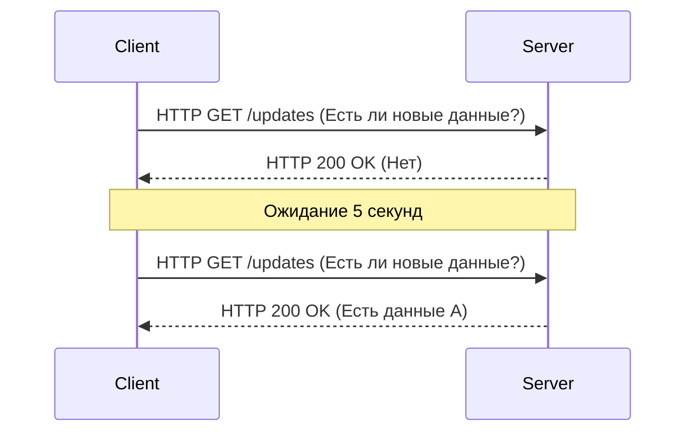
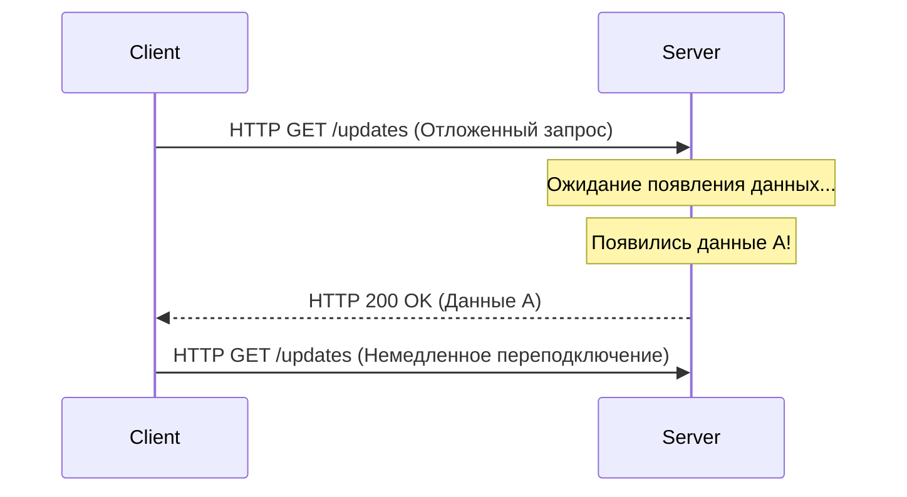
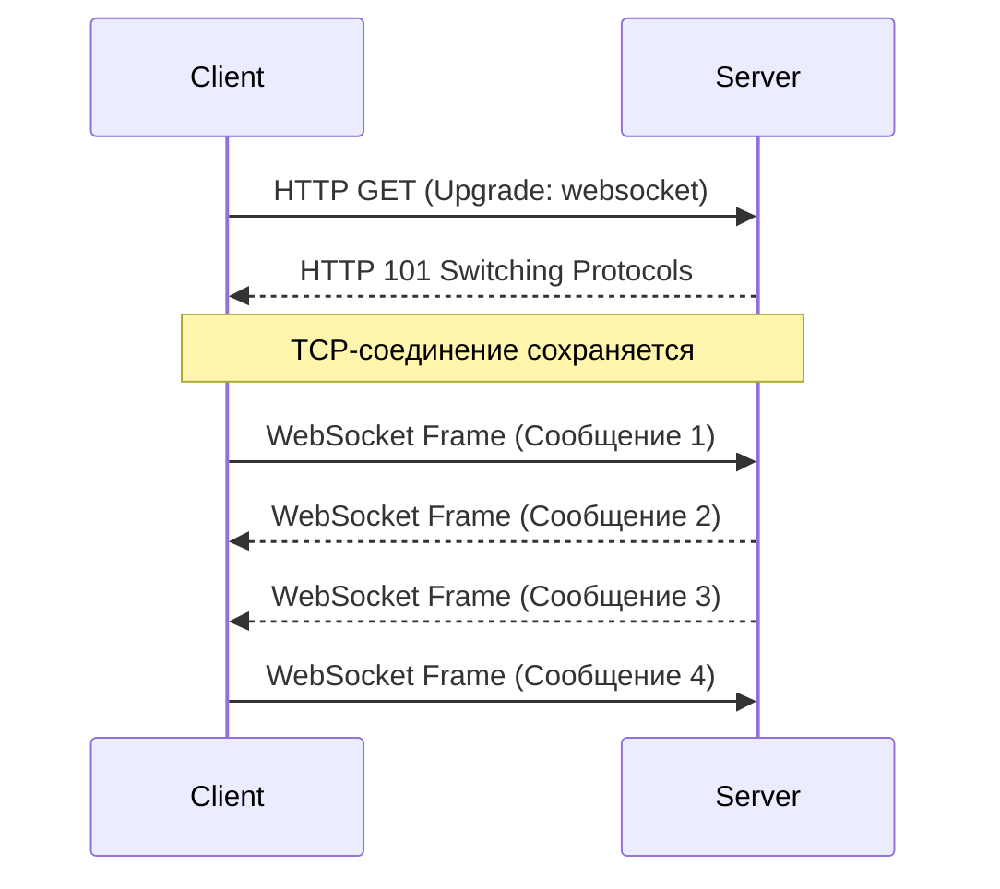
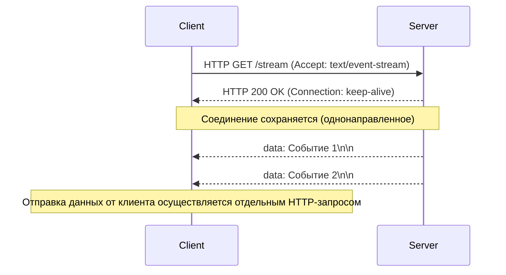

С тех пор как веб-приложения превратились из простого набора статических документов в платформы, предлагающие богатый интерактивный опыт, «работа в реальном времени» стала одним из самых важных требований. Современные приложения, которыми мы пользуемся каждый день — будь то тиковые данные акций, чаты, обновление спортивных счетов в реальном времени, многопользовательские игры или вывод логов CI/CD конвейеров, — зависят от механизмов мгновенной отправки (push) данных с сервера на клиент.

В этой статье мы подробно рассмотрим двух главных гигантов в реализации связи в реальном времени — **WebSocket** и **Server-Sent Events (SSE)**. Мы обсудим их историю, детали протоколов, проблемы масштабирования и конкретные рекомендации по их использованию.

## Ограничения HTTP и заря связи в реальном времени

Чтобы по-настоящему понять важность WebSocket и SSE, необходимо сначала вспомнить фундаментальную проблему, которую они пытались решить, а именно ограничения традиционного протокола HTTP.

### Модель запроса и ответа без состояния (Stateless)
HTTP (Hypertext Transfer Protocol) использует строгую модель «запрос-ответ», в которой клиент отправляет запрос серверу, а сервер возвращает ответ. Это идеально подходило для ранних сценариев использования Интернета (переход по ссылкам для просмотра страниц), но не поддерживает «серверный push» — активное уведомление клиента сервером о произошедших событиях.

### Опрос (Polling) как вынужденная мера
В те времена, когда серверный push не поддерживался на уровне протокола, разработчики использовали метод, называемый «опросом (Polling)», для имитации работы в реальном времени. При таком подходе клиент многократно отправляет запросы на сервер через регулярные интервалы (например, каждые 5 секунд) с вопросом: «Есть ли новые данные?».



Опрос имеет преимущество в том, что его чрезвычайно просто реализовать, но он обладает серьезными недостатками:
1. **Увеличение накладных расходов**: Поскольку запросы отправляются даже при отсутствии обновлений данных, накладные расходы на заголовки HTTP накапливаются, растрачивая пропускную способность сети и ресурсы сервера.
2. **Задержка (Latency)**: Между моментом обновления данных и его обнаружением клиентом может возникнуть задержка, равная интервалу опроса.

### Улучшение с помощью длинного опроса (Long-Polling)
«Длинный опрос (Long-Polling)» был придуман для устранения неэффективности обычного опроса. Когда клиент отправляет запрос, сервер «удерживает ответ (оставляет соединение открытым) до появления новых данных». Как только данные появляются, сервер возвращает ответ, и клиент, получив его, немедленно отправляет следующий запрос.



Длинный опрос успешно улучшил оперативность и сократил ненужный трафик, но поскольку он по-прежнему использует рамки HTTP, накладных расходов на заголовки избежать не удалось, а затраты на повторное установление соединения при каждой передаче данных (особенно TLS-рукопожатие в среде HTTPS) остались проблемой, которую нельзя игнорировать.

---

## WebSocket: полная двунаправленная связь, высвобождающая мощь TCP

Для фундаментального решения этих проблем был создан **WebSocket**. Этот протокол, стандартизированный в RFC 6455, работает поверх TCP, так же как и HTTP, но использует инновационный подход, преодолевающий ограничения HTTP.

### Как работает протокол WebSocket
Главная особенность WebSocket заключается в том, что после установки соединения достигается «полнодуплексная (Full-Duplex) двунаправленная связь», при которой и клиент, и сервер могут отправлять данные в любое время, используя легковесные кадры (фреймы).

#### 1. HTTP Upgrade (Рукопожатие)
Соединение WebSocket изначально начинается как обычный HTTP-запрос. Клиент использует заголовок `Upgrade`, чтобы запросить у сервера «переход на протокол WebSocket».

**Запрос от клиента:**
```http
GET /chat HTTP/1.1
Host: server.example.com
Upgrade: websocket
Connection: Upgrade
Sec-WebSocket-Key: dGhlIHNhbXBsZSBub25jZQ==
Sec-WebSocket-Version: 13
```

**Ответ от сервера:**
Если сервер принимает этот запрос, он возвращает код состояния `101 Switching Protocols`, соглашаясь на смену протокола.
```http
HTTP/1.1 101 Switching Protocols
Upgrade: websocket
Connection: Upgrade
Sec-WebSocket-Accept: s3pPLMBiTxaQ9kYGzzhZRbK+xOo=
```

#### 2. Начало передачи фреймов
В момент завершения этого рукопожатия роль HTTP заканчивается, и установленное TCP-соединение превращается в двунаправленный канал связи для бинарных или текстовых фреймов с использованием протокола WebSocket. В дальнейшем тяжелые HTTP-заголовки не добавляются, и данные можно отправлять и получать с минимальными накладными расходами в несколько байт.



### Преимущества WebSocket
- **Полная двунаправленность**: Идеально подходит для приложений, где клиент часто отправляет данные, таких как чаты и онлайн-игры.
- **Минимальные накладные расходы**: Отсутствие HTTP-заголовков резко повышает эффективность передачи данных.
- **Низкая задержка**: Благодаря постоянному соединению связь происходит мгновенно, без задержек на рукопожатие.

### Проблемы масштабирования WebSocket
Однако, поскольку это мощный протокол, его эксплуатация и масштабирование требуют продвинутых технологий.

1. **Архитектура с сохранением состояния (Stateful)**: Поскольку WebSocket поддерживает TCP-соединение, сервер должен хранить состояние каждого соединения в памяти. Чтобы справиться с «Проблемой C10K» и «Проблемой C100K», когда один сервер обрабатывает от десятков до сотен тысяч одновременных подключений, необходимо использовать событийно-ориентированный неблокирующий ввод-вывод (Node.js, Go, Netty и т. д.).
2. **Настройка балансировщиков нагрузки и прокси-серверов**: Многие балансировщики нагрузки L7 (Nginx, HAProxy, AWS ALB и т. д.) имеют тайм-аут простоя, который по умолчанию обрывает соединения через определенное время (например, 60 секунд). Для правильной ретрансляции WebSocket необходимо явно разрешить обновление протокола и установить более длинное значение тайм-аута или реализовать механизм keep-alive с использованием фреймов Ping/Pong на уровне приложения.
3. **Разделение состояния (при горизонтальном масштабировании)**: При масштабировании серверов, если пользователь А подключен к серверу 1, а пользователь Б — к серверу 2, для доставки сообщений чата необходимо внедрить механизм широковещательной рассылки сообщений между серверами (Redis Pub/Sub, RabbitMQ, Kafka и т. д.).

---

## Server-Sent Events (SSE): Легковесная потоковая передача в рамках HTTP

Если WebSocket — это «совершенное оружие двунаправленной связи», то **Server-Sent Events (SSE)** можно назвать «элегантным и оптимальным решением для однонаправленной потоковой передачи». SSE был разработан как часть спецификации HTML5 и специализируется на push-уведомлениях от сервера к клиенту (Server-to-Client).

### Как работает протокол SSE
Главная особенность SSE в том, что **вместо внедрения нового сложного протокола, он использует существующий фреймворк HTTP/1.1 или HTTP/2 как есть**.

#### 1. Простой HTTP-запрос
Клиент отправляет обычный запрос HTTP GET, но указывает `text/event-stream` в заголовке `Accept`.

**Запрос от клиента:**
```http
GET /stream HTTP/1.1
Host: server.example.com
Accept: text/event-stream
Cache-Control: no-cache
```

#### 2. Потоковый ответ
Сервер возвращает `Content-Type: text/event-stream` и продолжает отправлять текстовые данные событий в виде фрагментов (чанков), не закрывая соединение.

**Ответ от сервера:**
```http
HTTP/1.1 200 OK
Content-Type: text/event-stream
Cache-Control: no-cache
Connection: keep-alive

data: {"price": 150.25, "symbol": "AAPL"}

event: user_login
data: {"user_id": 12345}

data: Простое текстовое сообщение
```



### Преимущества SSE
- **Простота и совместимость с HTTP**: Вы можете использовать существующую инфраструктуру (прокси, балансировщики нагрузки, брандмауэры) как есть. Никаких специальных настроек вроде обновления протокола не требуется.
- **Встроенное автоматическое переподключение**: API `EventSource`, предоставляемое браузерами, имеет встроенную функцию автоматического переподключения в случае потери соединения и механизм возобновления связи, передавая серверу идентификатор последнего полученного события (`Last-Event-ID`). Для реализации этого в WebSocket требуется написание собственного кода.
- **Отличная совместимость с HTTP/2**: Благодаря функции мультиплексирования HTTP/2 несколько потоков SSE могут обрабатываться одновременно в одном TCP-соединении, что резко повышает производительность (в то время как спецификации расширений для работы WebSocket поверх HTTP/2 еще не получили широкого распространения).

### Ограничения SSE
- **Только однонаправленный**: Предназначен исключительно для связи от сервера к клиенту. Для отправки данных от клиента к серверу необходимо отдельно выполнять обычные запросы HTTP POST/PUT.
- **Только текстовые данные**: По умолчанию могут быть отправлены только тексты в кодировке UTF-8. Если вы отправляете бинарные данные, вам потребуется использовать такие процессы, как кодирование Base64, что приведет к накладным расходам.
- **Ограничение количества одновременных подключений в HTTP/1.1**: В старых средах HTTP/1.1 количество одновременных подключений к одному домену ограничено 6–8 на каждый браузер. Поэтому открытие SSE в нескольких вкладках может привести к достижению лимита и блокировке других запросов (эта проблема решена в HTTP/2).

---

## Архитектурное проектирование: что выбрать?

В системном проектировании не существует «серебряной пули». Важно выбрать подходящую технологию в соответствии с требованиями проекта.

### Когда следует использовать WebSocket
Если вам требуется высокочастотное и низколатентное взаимодействие между клиентом и сервером, WebSocket является единственным правильным выбором.

- **Чаты/Инструменты для совместной работы в реальном времени**: Приложения для совместного редактирования, такие как Slack, Discord, Google Docs.
- **Многопользовательские игры**: Требуется низколатентная двунаправленная связь на уровне миллисекунд для обмена координатами позиций, действиями игроков и т. д.
- **Высокочастотная телеметрия IoT**: Системы, которые непрерывно собирают данные с большого количества устройств и одновременно рассылают им команды.

### Когда следует использовать SSE
В случаях, когда «клиент только получает данные (или отправляет их нечасто)», рекомендуется использовать SSE, так как это значительно снижает затраты на реализацию и эксплуатацию.

- **Панели мониторинга (Дашборды) в реальном времени**: Тикеры цен на акции, мониторинг ресурсов сервера, потоковый вывод логов.
- **Ленты новостей/Системы уведомлений**: Обновления временной шкалы в социальных сетях, push-уведомления от системы.
- **Генерация ответов ИИ/LLM**: В приложениях LLM, таких как ChatGPT, потоковая передача генерируемого текста клиенту по мере его создания (это идеальный пример активного использования SSE в современных ИИ-приложениях).

### Сравнение

| Характеристика | WebSocket | Server-Sent Events (SSE) |
| :--- | :--- | :--- |
| **Направление связи** | Полнодуплексная (двунаправленная) | Однонаправленная (Сервер → Клиент) |
| **Формат данных** | Бинарный / Текст | Только текст (UTF-8) |
| **Протокол** | Собственный (поверх TCP, через HTTP Upgrade) | HTTP/1.1, HTTP/2 |
| **Автопереподключение** | Нет (требуется собственная реализация) | Есть (стандартная функция API EventSource) |
| **Совместимость с инфраструктурой** | Низкая (требует специальных настроек LB/Proxy) | Высокая (обрабатывается как стандартный HTTP) |
| **Затраты на реализацию** | Высокие (сложные библиотеки связи, управление состоянием) | Низкие (расширение существующих конечных точек HTTP) |

## Заключение

В эволюции Web реального времени WebSocket и SSE не вытесняют, а прекрасно дополняют друг друга.

Легкомысленный выбор «возьмем WebSocket для всего» несет в себе риск усложнения инфраструктуры и увеличения затрат на ее обслуживание. Если вариант использования предполагает редкую отправку данных от клиента к серверу (например, действия клиента выполняются через обычный REST API, а клиент только получает широковещательные рассылки с результатами), использование SSE позволит сохранить архитектуру простой и извлечь максимальную выгоду из существующей экосистемы HTTP.

Ключом к созданию надежных и масштабируемых современных приложений является спокойный анализ системных требований (направление, частота, типы данных, инфраструктурная среда) и выбор правильной технологии для правильных задач.
