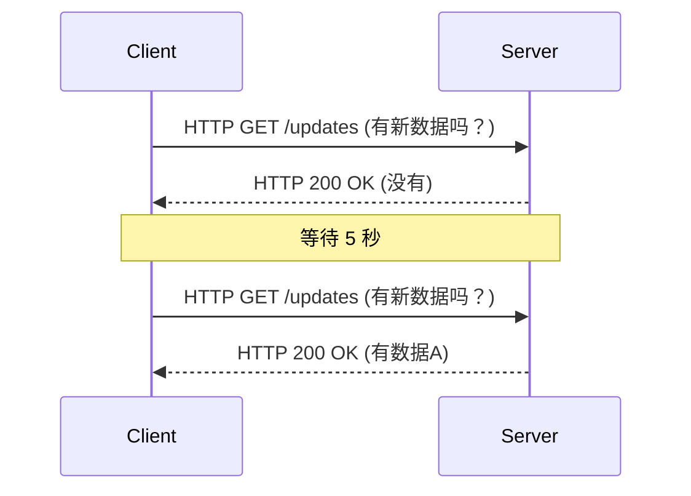
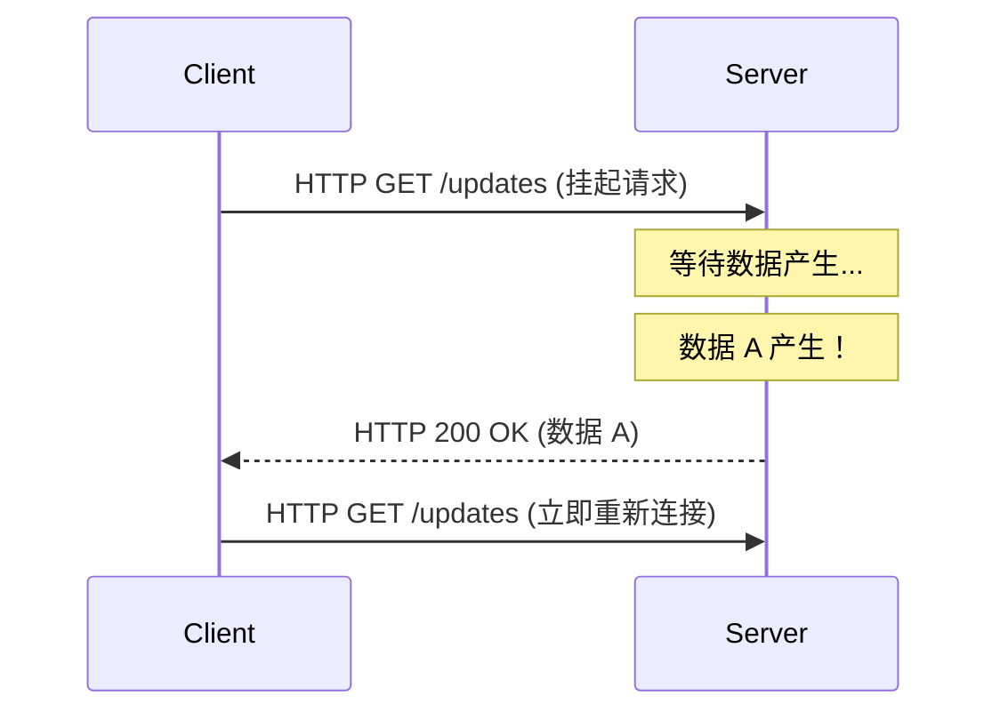
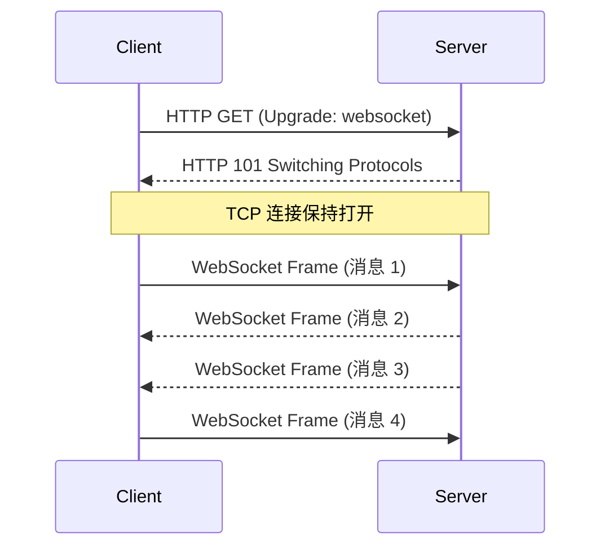
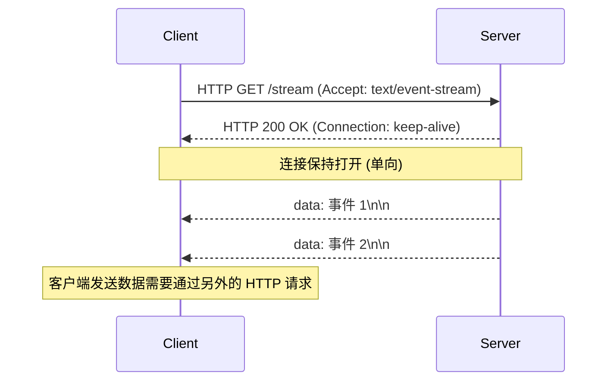

从网页应用仅仅是静态文档集合的时代开始，随着其向提供丰富交互体验平台的演进，“实时性”已成为最重要的需求之一。诸如股票分时数据、聊天应用、实时体育比分更新、多人游戏，或是 CI/CD 流水线的实时日志输出等，我们每天都在使用的现代应用，都高度依赖于从服务器向客户端瞬间推送数据的机制。

在本文中，我们将极其详细地探讨实现这种实时通信的两大巨头——**WebSocket** 和 **Server-Sent Events (SSE)**。我们将深入剖析它们的起源、协议细节、在扩展性方面面临的挑战，以及具体的场景选择指南。

## HTTP 的局限性与实时通信的黎明期

为了真正理解 WebSocket 和 SSE 的重要性，我们必须首先回顾它们试图解决的根本问题，即传统 HTTP 协议的局限性。

### 无状态的请求-响应模型
HTTP（Hypertext Transfer Protocol）采用严格的“请求-响应”模型，即客户端向服务器发送请求，服务器返回响应。这对于早期的 Web 用例（通过点击链接浏览页面）来说是完美的，但它不支持“服务器推送（Server Push）”，即服务器无法主动向客户端通知已发生的事件。

### 轮询（Polling）的无奈之举
在协议层面不支持服务器推送的时代，开发者使用一种称为“轮询（Polling）”的技术来模拟实时性。在这种方法中，客户端以固定的时间间隔（例如：每 5 秒）重复向服务器发送请求，询问：“有新数据吗？”



轮询的优点是实现极其简单，但它有严重的缺点：
1. **开销增加**：即使没有数据更新，请求也会被发送，这导致 HTTP 头部开销不断累积，白白浪费网络带宽和服务器资源。
2. **延迟（Latency）**：从数据更新发生到客户端检测到它之间，最多会产生等于轮询间隔的延迟。

### 长轮询（Long-Polling）带来的改进
为了改善轮询的低效，诞生了“长轮询（Long-Polling）”。当客户端发送请求时，服务器会“保留响应（保持连接打开等待），直到出现新数据”。一旦数据产生，服务器立即返回响应，客户端收到响应后会立即发送下一个请求。



长轮询成功地提高了即时性并减少了无用的通信，但由于它仍然使用 HTTP 框架，无法避免头部开销。此外，每次发送数据时重新建立连接的成本（特别是在 HTTPS 环境下的 TLS 握手）仍然是一个不可忽视的问题。

---

## WebSocket：释放 TCP 力量的完全双向通信

为了从根本上解决这些问题，**WebSocket** 应运而生。这个在 RFC 6455 中标准化的协议与 HTTP 一样运行在 TCP 之上，但它采用了一种打破 HTTP 限制的创新方法。

### WebSocket 协议的工作原理
WebSocket 的最大特点是，一旦建立连接，就实现了“全双工（Full-Duplex）双向通信”，客户端和服务器都可以在任何时间使用轻量级的数据帧（Frame）发送数据。

#### 1. HTTP 升级（握手）
WebSocket 连接最初作为一个普通的 HTTP 请求开始。客户端使用 `Upgrade` 头部向服务器请求“切换到 WebSocket 协议”。

**客户端请求：**
```http
GET /chat HTTP/1.1
Host: server.example.com
Upgrade: websocket
Connection: Upgrade
Sec-WebSocket-Key: dGhlIHNhbXBsZSBub25jZQ==
Sec-WebSocket-Version: 13
```

**服务器响应：**
如果服务器接受此请求，它会返回状态码 `101 Switching Protocols`，同意切换协议。
```http
HTTP/1.1 101 Switching Protocols
Upgrade: websocket
Connection: Upgrade
Sec-WebSocket-Accept: s3pPLMBiTxaQ9kYGzzhZRbK+xOo=
```

#### 2. 开始帧通信
在握手完成的瞬间，HTTP 的使命就结束了，建立的 TCP 连接转变为使用 WebSocket 协议的双向通道，用于传输二进制或文本帧。此后不再附加沉重的 HTTP 头部，只需几个字节的极小开销即可收发数据。



### WebSocket 的优势
- **完全的双向性**：非常适合客户端也需要高频发送数据的应用场景，如聊天应用和网络游戏。
- **极小的开销**：由于没有 HTTP 头部，数据传输效率得到显著提升。
- **低延迟**：由于连接始终保持，通信可以瞬间完成，没有握手的延迟。

### WebSocket 的扩展挑战
然而，正因为它是一个强大的协议，其运维和扩展需要较高的技术水平。

1. **有状态（Stateful）架构**：由于 WebSocket 会持续保持 TCP 连接，服务器必须在内存中保留每个连接的状态。为了应对单台服务器处理数万至数十万并发连接的“C10K 问题”或“C100K 问题”，必须采用事件驱动的非阻塞 I/O（如 Node.js, Go, Netty 等）。
2. **负载均衡器和代理的配置**：许多 L7 负载均衡器（如 Nginx, HAProxy, AWS ALB 等）默认设置了空闲超时，会在一段时间（如 60 秒）后断开连接。为了正确中继 WebSocket，必须显式允许协议升级并设置较长的超时时间，或者在应用层实现基于 Ping/Pong 帧的保活（Keep-Alive）机制。
3. **状态共享（水平扩展时）**：当服务器横向扩展为多台时，如果用户 A 连接到服务器 1，用户 B 连接到服务器 2，要将聊天消息送达，必须引入在服务器之间广播消息的机制（如 Redis Pub/Sub, RabbitMQ, Kafka 等）。

---

## Server-Sent Events (SSE)：在 HTTP 框架下实现的轻量级流媒体

如果说 WebSocket 是“双向通信的终极武器”，那么 **Server-Sent Events (SSE)** 就可以被称为“单向流传输的优雅最优解”。SSE 是作为 HTML5 规范的一部分制定的，专门用于从服务器向客户端的推送通信（Server-to-Client）。

### SSE 协议的工作原理
SSE 的最大特点是，**它没有引入复杂的新协议，而是原封不动地利用了现有的 HTTP/1.1 或 HTTP/2 框架**。

#### 1. 简单的 HTTP 请求
客户端发送一个普通的 HTTP GET 请求，但在 `Accept` 头部中指定 `text/event-stream`。

**客户端请求：**
```http
GET /stream HTTP/1.1
Host: server.example.com
Accept: text/event-stream
Cache-Control: no-cache
```

#### 2. 流式响应
服务器返回 `Content-Type: text/event-stream`，并且在不关闭连接的情况下，持续将基于文本的事件数据作为数据块（Chunk）发送。

**服务器响应：**
```http
HTTP/1.1 200 OK
Content-Type: text/event-stream
Cache-Control: no-cache
Connection: keep-alive

data: {"price": 150.25, "symbol": "AAPL"}

event: user_login
data: {"user_id": 12345}

data: 只是一个普通的文本消息
```



### SSE 的优势
- **简单性与 HTTP 的亲和性**：您可以直接利用现有的基础设施（代理、负载均衡器、防火墙）。不需要进行协议升级等特殊配置。
- **内置自动重新连接**：浏览器提供的 `EventSource` API 原生内置了连接断开时的自动重连功能，并且能将最后接收到的事件 ID（`Last-Event-ID`）发送给服务器以恢复连接。要在 WebSocket 中实现这一点，需要自己编写代码。
- **与 HTTP/2 的绝佳配合**：得益于 HTTP/2 的多路复用功能，多个 SSE 流可以在一个 TCP 连接上同时处理，性能大幅提升（相比之下，WebSocket 在 HTTP/2 上运行的扩展规范尚未普及）。

### SSE 的限制
- **仅限单向**：专用于从服务器到客户端的通信。如果需要从客户端向服务器发送数据，必须额外发起普通的 HTTP POST/PUT 请求。
- **仅限文本数据**：默认情况下只能发送 UTF-8 文本数据。如果需要发送二进制数据，则需要进行 Base64 编码等处理，这会产生开销。
- **HTTP/1.1 下的并发连接限制**：在较旧的 HTTP/1.1 环境中，浏览器对同一域名的并发连接数被限制为 6 到 8 个。因此，如果在多个标签页中打开 SSE，可能会达到上限并阻塞其他请求（该问题已在 HTTP/2 中解决）。

---

## 架构设计：应该选择哪一个？

在系统设计中没有“银弹”。根据项目的需求选择合适的技术至关重要。

### 何时应该选择 WebSocket
如果您的应用需要在客户端和服务器之间进行高频且低延迟的双向交互，WebSocket 是唯一正确的选择。

- **实时聊天/协同工具**：如 Slack、Discord、Google Docs 等协同编辑应用。
- **多人游戏**：需要毫秒级的低延迟双向通信，以交换位置坐标、玩家操作等。
- **高频物联网遥测**：连续从大量设备采集数据并同时下发指令的系统。

### 何时应该选择 SSE
在“客户端仅接收数据（或客户端发送频率较低）”的场景中，强烈推荐使用 SSE，因为它可以大幅降低实现和运维成本。

- **实时仪表盘/监控**：股票行情牌、服务器资源监控、日志流式输出。
- **新闻流/通知系统**：社交网络的时间线更新，或来自系统的推送通知。
- **AI/LLM 的响应生成**：在类似 ChatGPT 这样的 LLM 应用中，将生成中的文本逐字流式传输给客户端（这正是目前 SSE 在众多 AI 应用中被广泛采用的绝佳范例）。

### 对比总结

| 特性 | WebSocket | Server-Sent Events (SSE) |
| :--- | :--- | :--- |
| **通信方向** | 全双工（双向） | 单向（服务器 → 客户端） |
| **数据格式** | 二进制 / 文本 | 仅限文本（UTF-8） |
| **协议** | 独立（基于 TCP，通过 HTTP 升级） | HTTP/1.1, HTTP/2 |
| **自动重连** | 无（需自行实现） | 有（EventSource API 标准功能） |
| **基础设施兼容性** | 低（需对 LB/Proxy 进行特殊配置） | 高（作为标准 HTTP 处理） |
| **实现成本** | 高（通信库和状态管理复杂） | 低（现有 HTTP 端点的自然延伸） |

## 结论

在实时 Web 的发展历程中，WebSocket 和 SSE 并不是谁取代谁的关系，而是完美的互补。

轻易做出“总之就用 WebSocket”的决定，有导致基础设施复杂化和维护成本增加的风险。如果您的用例中客户端向服务器发送数据的情况很少（例如，客户端的操作通过标准的 REST API 完成，而客户端仅接收结果的广播），采用 SSE 将能够保持架构简单，并最大程度地享受现有 HTTP 生态系统带来的红利。

构建健壮且可扩展的现代应用的关键在于冷静分析系统需求（通信方向、频率、数据类型、基础设施环境），并在正确的场景下选择正确的技术。
