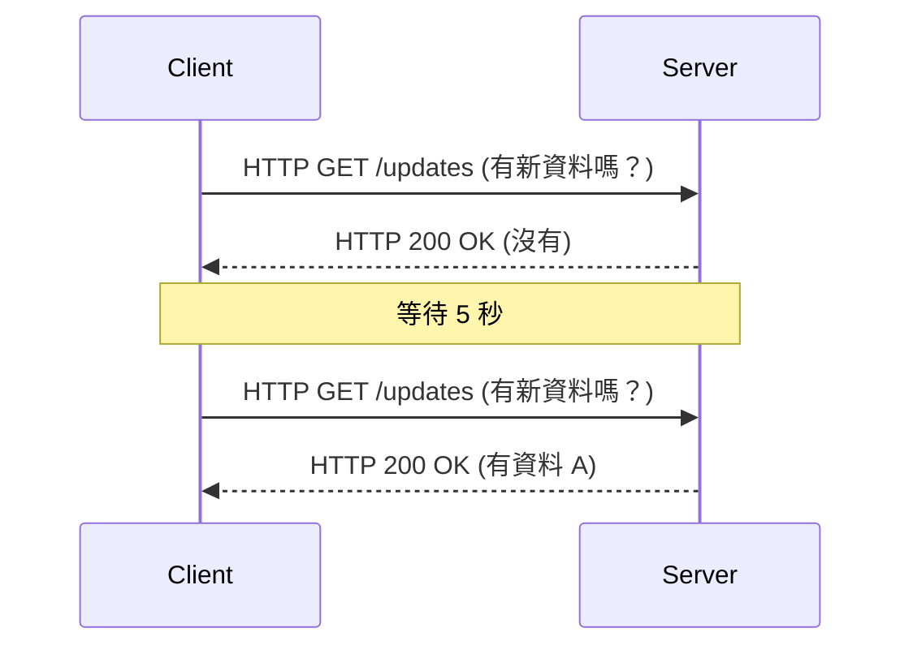
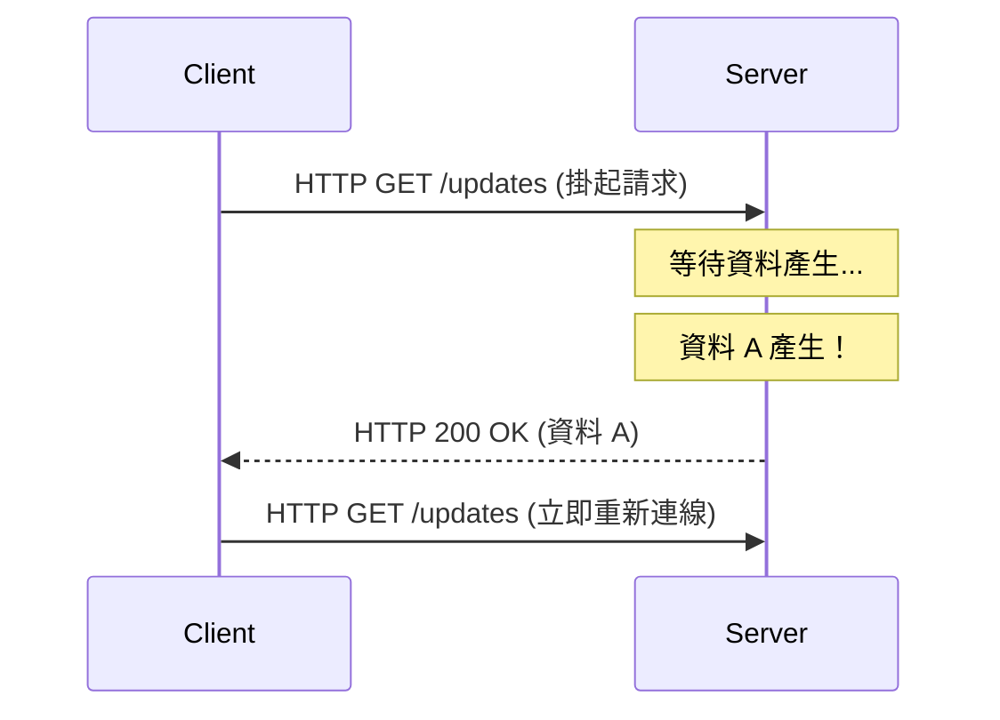
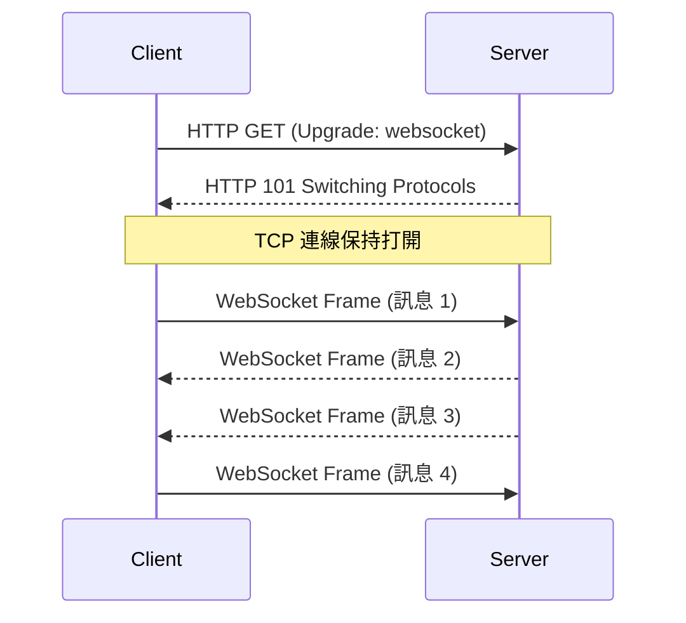
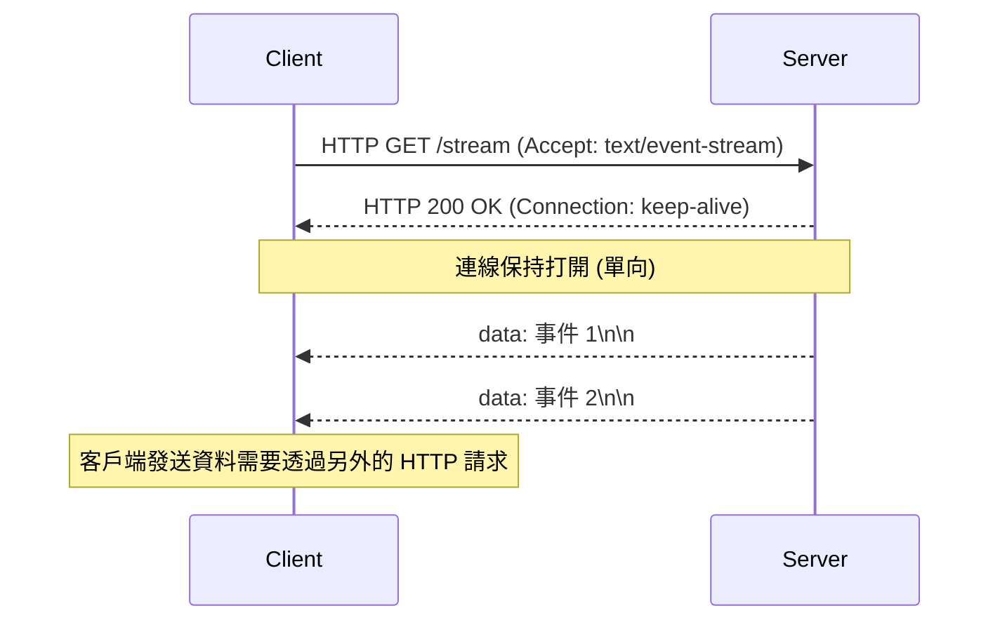

從網頁應用程式僅僅是靜態文件集合的時代開始，隨著其向提供豐富互動體驗平台的演進，「即時性」已成為最重要的需求之一。諸如股票跳動資料、聊天應用程式、即時體育比分更新、多人遊戲，或是 CI/CD 流水線的即時日誌輸出等，我們每天都在使用的現代應用程式，都高度依賴於從伺服器向客戶端瞬間推播資料的機制。

在本文中，我們將極其詳細地探討實現這種即時通訊的兩大巨頭——**WebSocket** 和 **Server-Sent Events (SSE)**。我們將深入剖析它們的起源、協定細節、在擴展性方面面臨的挑戰，以及具體的場景選擇指南。

## HTTP 的侷限性與即時通訊的黎明期

為了真正理解 WebSocket 和 SSE 的重要性，我們必須首先回顧它們試圖解決的根本問題，即傳統 HTTP 協定的侷限性。

### 無狀態的請求-回應模型
HTTP（Hypertext Transfer Protocol）採用嚴格的「請求-回應」模型，即客戶端向伺服器發送請求，伺服器返回回應。這對於早期的 Web 用例（透過點擊連結瀏覽頁面）來說是完美的，但它不支援「伺服器推播（Server Push）」，即伺服器無法主動向客戶端通知已發生的事件。

### 輪詢（Polling）的無奈之舉
在協定層面不支援伺服器推播的時代，開發者使用一種稱為「輪詢（Polling）」的技術來模擬即時性。在這種方法中，客戶端以固定的時間間隔（例如：每 5 秒）重複向伺服器發送請求，詢問：「有新資料嗎？」



輪詢的優點是實現極其簡單，但它有嚴重的缺點：
1. **開銷增加**：即使沒有資料更新，請求也會被發送，這導致 HTTP 標頭開銷不斷累積，白白浪費網路頻寬和伺服器資源。
2. **延遲（Latency）**：從資料更新發生到客戶端檢測到它之間，最多會產生等於輪詢間隔的延遲。

### 長輪詢（Long-Polling）帶來的改進
為了改善輪詢的低效，誕生了「長輪詢（Long-Polling）」。當客戶端發送請求時，伺服器會「保留回應（保持連線打開等待），直到出現新資料」。一旦資料產生，伺服器立即返回回應，客戶端收到回應後會立即發送下一個請求。



長輪詢成功地提高了即時性並減少了無用的通訊，但由於它仍然使用 HTTP 框架，無法避免標頭開銷。此外，每次發送資料時重新建立連線的成本（特別是在 HTTPS 環境下的 TLS 握手）仍然是一個不可忽視的問題。

---

## WebSocket：釋放 TCP 力量的完全雙向通訊

為了從根本上解決這些問題，**WebSocket** 應運而生。這個在 RFC 6455 中標準化的協定與 HTTP 一樣運行在 TCP 之上，但它採用了一種打破 HTTP 限制的創新方法。

### WebSocket 協定的運作原理
WebSocket 的最大特點是，一旦建立連線，就實現了「全雙工（Full-Duplex）雙向通訊」，客戶端和伺服器都可以在任何時間使用輕量級的資料影格（Frame）發送資料。

#### 1. HTTP 升級（握手）
WebSocket 連線最初作為一個普通的 HTTP 請求開始。客戶端使用 `Upgrade` 標頭向伺服器請求「切換到 WebSocket 協定」。

**客戶端請求：**
```http
GET /chat HTTP/1.1
Host: server.example.com
Upgrade: websocket
Connection: Upgrade
Sec-WebSocket-Key: dGhlIHNhbXBsZSBub25jZQ==
Sec-WebSocket-Version: 13
```

**伺服器回應：**
如果伺服器接受此請求，它會返回狀態碼 `101 Switching Protocols`，同意切換協定。
```http
HTTP/1.1 101 Switching Protocols
Upgrade: websocket
Connection: Upgrade
Sec-WebSocket-Accept: s3pPLMBiTxaQ9kYGzzhZRbK+xOo=
```

#### 2. 開始影格通訊
在握手完成的瞬間，HTTP 的使命就結束了，建立的 TCP 連線轉變為使用 WebSocket 協定的雙向通道，用於傳輸二進位或文本影格。此後不再附加沉重的 HTTP 標頭，只需幾個位元組的極小開銷即可收發資料。



### WebSocket 的優勢
- **完全的雙向性**：非常適合客戶端也需要高頻發送資料的應用場景，如聊天應用程式和網路遊戲。
- **極小的開銷**：由於沒有 HTTP 標頭，資料傳輸效率得到顯著提升。
- **低延遲**：由於連線始終保持，通訊可以瞬間完成，沒有握手的延遲。

### WebSocket 的擴展挑戰
然而，正因為它是一個強大的協定，其維運和擴展需要較高的技術水準。

1. **有狀態（Stateful）架構**：由於 WebSocket 會持續保持 TCP 連線，伺服器必須在記憶體中保留每個連線的狀態。為了應對單台伺服器處理數萬至數十萬並發連線的「C10K 問題」或「C100K 問題」，必須採用事件驅動的非阻塞 I/O（如 Node.js, Go, Netty 等）。
2. **負載平衡器和代理的設定**：許多 L7 負載平衡器（如 Nginx, HAProxy, AWS ALB 等）預設設定了閒置逾時，會在一段時間（如 60 秒）後斷開連線。為了正確中繼 WebSocket，必須明確允許協定升級並設定較長的逾時時間，或者在應用層實現基於 Ping/Pong 影格的保活（Keep-Alive）機制。
3. **狀態共享（水平擴展時）**：當伺服器橫向擴展為多台時，如果使用者 A 連線到伺服器 1，使用者 B 連線到伺服器 2，要將聊天訊息送達，必須引入在伺服器之間廣播訊息的機制（如 Redis Pub/Sub, RabbitMQ, Kafka 等）。

---

## Server-Sent Events (SSE)：在 HTTP 框架下實現的輕量級串流

如果說 WebSocket 是「雙向通訊的終極武器」，那麼 **Server-Sent Events (SSE)** 就可以被稱為「單向串流傳輸的優雅最佳解」。SSE 是作為 HTML5 規範的一部分制定的，專門用於從伺服器向客戶端的推播通訊（Server-to-Client）。

### SSE 協定的運作原理
SSE 的最大特點是，**它沒有引入複雜的新協定，而是原封不動地利用了現有的 HTTP/1.1 或 HTTP/2 框架**。

#### 1. 簡單的 HTTP 請求
客戶端發送一個普通的 HTTP GET 請求，但在 `Accept` 標頭中指定 `text/event-stream`。

**客戶端請求：**
```http
GET /stream HTTP/1.1
Host: server.example.com
Accept: text/event-stream
Cache-Control: no-cache
```

#### 2. 串流回應
伺服器返回 `Content-Type: text/event-stream`，並且在不關閉連線的情況下，持續將基於文本的事件資料作為資料塊（Chunk）發送。

**伺服器回應：**
```http
HTTP/1.1 200 OK
Content-Type: text/event-stream
Cache-Control: no-cache
Connection: keep-alive

data: {"price": 150.25, "symbol": "AAPL"}

event: user_login
data: {"user_id": 12345}

data: 只是一個普通的文本訊息
```



### SSE 的優勢
- **簡單性與 HTTP 的親和性**：您可以直接利用現有的基礎設施（代理、負載平衡器、防火牆）。不需要進行協定升級等特殊設定。
- **內建自動重新連線**：瀏覽器提供的 `EventSource` API 原生內建了連線斷開時的自動重連功能，並且能將最後接收到的事件 ID（`Last-Event-ID`）發送給伺服器以恢復連線。要在 WebSocket 中實現這一點，需要自己編寫程式碼。
- **與 HTTP/2 的絕佳配合**：得益於 HTTP/2 的多路復用功能，多個 SSE 串流可以在一個 TCP 連線上同時處理，效能大幅提升（相比之下，WebSocket 在 HTTP/2 上運行的擴展規範尚未普及）。

### SSE 的限制
- **僅限單向**：專用於從伺服器到客戶端的通訊。如果需要從客戶端向伺服器發送資料，必須額外發起普通的 HTTP POST/PUT 請求。
- **僅限文本資料**：預設情況下只能發送 UTF-8 文本資料。如果需要發送二進位資料，則需要進行 Base64 編碼等處理，這會產生開銷。
- **HTTP/1.1 下的並發連線限制**：在較舊的 HTTP/1.1 環境中，瀏覽器對同一網域的並發連線數被限制為 6 到 8 個。因此，如果在多個分頁中打開 SSE，可能會達到上限並阻塞其他請求（該問題已在 HTTP/2 中解決）。

---

## 架構設計：應該選擇哪一個？

在系統設計中沒有「銀彈」。根據專案的需求選擇合適的技術至關重要。

### 何時應該選擇 WebSocket
如果您的應用程式需要在客戶端和伺服器之間進行高頻且低延遲的雙向互動，WebSocket 是唯一正確的選擇。

- **即時聊天/協同工具**：如 Slack、Discord、Google Docs 等協同編輯應用程式。
- **多人遊戲**：需要毫秒級的低延遲雙向通訊，以交換位置座標、玩家操作等。
- **高頻物聯網遙測**：連續從大量設備採集資料並同時下發指令的系統。

### 何時應該選擇 SSE
在「客戶端僅接收資料（或客戶端發送頻率較低）」的場景中，強烈推薦使用 SSE，因為它可以大幅降低實現和維運成本。

- **即時儀表板/監控**：股票行情看板、伺服器資源監控、日誌串流輸出。
- **新聞串流/通知系統**：社群網路的時間軸更新，或來自系統的推播通知。
- **AI/LLM 的回應生成**：在類似 ChatGPT 這樣的 LLM 應用程式中，將生成中的文本逐字串流傳輸給客戶端（這正是目前 SSE 在眾多 AI 應用程式中被廣泛採用的絕佳範例）。

### 對比總結

| 特性 | WebSocket | Server-Sent Events (SSE) |
| :--- | :--- | :--- |
| **通訊方向** | 全雙工（雙向） | 單向（伺服器 → 客戶端） |
| **資料格式** | 二進位 / 文本 | 僅限文本（UTF-8） |
| **協定** | 獨立（基於 TCP，透過 HTTP 升級） | HTTP/1.1, HTTP/2 |
| **自動重連** | 無（需自行實現） | 有（EventSource API 標準功能） |
| **基礎設施相容性** | 低（需對 LB/Proxy 進行特殊設定） | 高（作為標準 HTTP 處理） |
| **實現成本** | 高（通訊庫和狀態管理複雜） | 低（現有 HTTP 端點的自然延伸） |

## 結論

在即時 Web 的發展歷程中，WebSocket 和 SSE 並不是誰取代誰的關係，而是完美的互補。

輕易做出「總之就用 WebSocket」的決定，有導致基礎設施複雜化和維護成本增加的風險。如果您的用例中客戶端向伺服器發送資料的情況很少（例如，客戶端的操作透過標準的 REST API 完成，而客戶端僅接收結果的廣播），採用 SSE 將能夠保持架構簡單，並最大程度地享受現有 HTTP 生態系統帶來的紅利。

構建健壯且可擴展的現代應用程式的關鍵在於冷靜分析系統需求（通訊方向、頻率、資料類型、基礎設施環境），並在正確的場景下選擇正確的技術。
