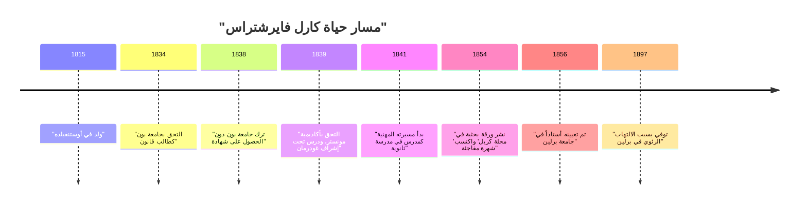
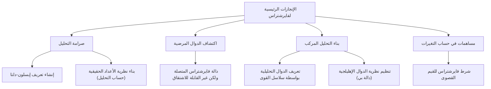

## مقدمة

في تاريخ الرياضيات، الشخص الأكثر شهرة في تأسيس التفاضل والتكامل على أساس صارم هو **كارل فايرشتراس** (1815-1897). يُشاد به كـ "أبو التحليل الحديث" وقد أرسى أسس التفاضل والتكامل (وخاصة تعريف $\epsilon-\delta$) التي ندرسها في الجامعات اليوم. إنجازاته تتجاوز مجرد اكتشاف النظريات؛ فقد غيّر بشكل جذري "السرد" و"طريقة التفكير" في تخصص الرياضيات نفسه. في هذه المقالة، سنتعمق في حلقات حياته المضطربة وإنجازاته المذهلة في الرياضيات.

## السياق التاريخي: العالم الرياضي في القرن التاسع عشر وأزمة التحليل

حقق التفاضل والتكامل، الذي أسسه إسحاق نيوتن وغوتفريد فيلهلم لايبنيز في القرن السابع عشر، تطوراً هائلاً طوال القرن الثامن عشر على يد ليونهارد أويلر وآخرين. ورغم أن تطبيقاته في الفيزياء وعلم الفلك أسفرت عن نتائج رائعة، إلا أن المفاهيم الأساسية لـ "الكميات المتناهية الصغر" و"النهايات" ظلت غامضة للغاية. أصبح التفسير البديهي لـ "الرقم الذي يقترب بشكل لا نهائي من الصفر ولكنه ليس صفراً" هدفاً للنقد الفلسفي وافتقر إلى الصرامة المنطقية.

مع دخول القرن التاسع عشر، شرع أوغستين-لوي كوشي وبرنارد بولزانو وآخرون في جعل التحليل أكثر صرامة، لكن تعريفاتهم لا تزال غير قادرة على القضاء على الحدس تماماً. كان فايرشتراس هو من أخذ على عاتقه المهمة التاريخية لاختراق هذا الوضع، والذي يمكن تسميته "أزمة التحليل"، وإعادة بناء التحليل باستخدام طرق حسابية بحتة دون الاعتماد على الحدس الهندسي.

## الحياة المبكرة وأيام الطالب المحبطة

ولد كارل فايرشتراس في 31 أكتوبر 1815 في أوستنفيلده، مملكة بروسيا (ألمانيا الحالية). كان والده مسؤولاً حكومياً ورجلاً صارماً للغاية. كان والده يرغب بشدة في أن يصبح ابنه إدارياً بروسياً ممتازاً مثله تماماً، وكانت حياة فايرشتراس المبكرة مقيدة بهذه التوقعات القوية.

في عام 1834، وبناءً على رغبة والده، التحق بجامعة بون لدراسة القانون والتمويل. ومع ذلك، لم يكن قلبه يميل إلى القانون أو الاقتصاد، بل كان ينجذب بشدة إلى الرياضيات. ونتيجة لذلك، بدلاً من حضور محاضرات القانون، أمضى وقته في المبارزة وشرب الجعة، وعاش حياة طلابية حرة. وفي الوقت نفسه، كان يلتهم شخصياً كتب الرياضيات (خاصة أعمال بيير سيمون لابلاس، وكارل غوستاف جاكوب جاكوبي، ونيلز هنريك أبيل) وعلّم نفسه الرياضيات المتقدمة. في النهاية، ترك الجامعة بعد أربع سنوات دون الحصول على درجة علمية.

كانت هذه النكسة نقطة تحول كبرى بالنسبة له وخيبت أمل والده بشدة. ومع ذلك، فإن روح الاستقلال والدراسة الذاتية التي نمت خلال هذه الفترة كان لها بلا شك تأثير كبير على أسلوب بحثه اللاحق.

## سنوات طويلة من الغموض كمعلم: حياة بحثية انفرادية

بعد ترك الجامعة، لم يستطع فايرشتراس التخلي عن الرياضيات. وبناءً على نصيحة صديق، التحق مرة أخرى بأكاديمية مونستر (الآن جامعة مونستر). هنا، درس الرياضيات تحت إشراف كريستوف غودرمان، عالم الرياضيات البارز في ذلك الوقت. كان غودرمان خبيراً في نظرية الدوال الإهليلجية، وأصبح فايرشتراس مفتوناً بها. أدرك غودرمان الموهبة غير العادية لفايرشتراس وأشاد به تقديراً عالياً.

بعد حصوله على شهادة التدريس، عمل فايرشتراس كمدرس في صالة الألعاب الرياضية (مدرسة ثانوية) في مدن ريفية مختلفة في بروسيا لمدة 15 عاماً بدءاً من عام 1841. لم تكن حياته مميزة على الإطلاق. يُقال إنه لم يُدرّس الرياضيات فحسب، بل درّس أيضاً الفيزياء، وعلم النبات، والجغرافيا، والتاريخ، وحتى الجمباز والخط.

على الرغم من انشغاله بواجبات التدريس اليومية القاسية، فقد كان يسهر لوقت متأخر من الليل لمواصلة أبحاثه الرياضية. لم تكن لديه أي فرصة للتفاعل مع كبار علماء الرياضيات في ذلك الوقت ونادراً ما قدم أوراقاً بحثية إلى المجلات الأكاديمية. في بيئة معزولة تماماً، وبدون علم أحد، كان يجري أبحاثاً رائعة تشكك في أسس التحليل من الألف إلى الياء. أدى الإرهاق خلال هذه الفترة إلى تدمير صحته وتسبب في نوبات دوار شديدة ابتلي بها لاحقاً.

## عودة مذهلة إلى عالم الرياضيات والمجد

بعد فترة طويلة من الغموض كمدرس مدرسة ريفية، جاءت نقطة تحول دراماتيكية لفايرشتراس في عام 1854. فقد نشر ورقة بحثية رائدة حول الدوال الأبيلية في "مجلة كريل" (مجلة الرياضيات البحتة والتطبيقية)، وهي أكثر المجلات الرياضية موثوقية في ذلك الوقت.

جذبت هذه الورقة انتباه علماء الرياضيات في جميع أنحاء أوروبا على الفور. حلت أبحاثه ببراعة المشكلات الصعبة التي كان علماء الرياضيات البارزون في ذلك الوقت يتصدون لها لسنوات، وكانت حداثة أساليبه وكمال منطقه لا مثيل لها. منحته جامعة كونيغسبرغ درجة الدكتوراه الفخرية تقديراً لإنجازاته، واتخذت وزارة التعليم البروسية أيضاً خطوات لإعفائه من واجباته كمدرس.

وأخيراً، في عام 1856، تم الترحيب به كأستاذ في جامعة برلين. كان ظهوره متأخراً في سن تجاوز الأربعين، ولكن من هنا بدأ تقدمه السريع، وكان سيرفع جامعة برلين إلى مركز الرياضيات على أعلى مستوى عالمي.

## إنجازات رياضية عظيمة

تغطي إنجازات فايرشتراس مجموعة واسعة من المجالات، ولكننا سنشرح هنا بالتفصيل ثلاث مساهمات شهيرة بشكل خاص.

### 1. صرامة التحليل (تعريف إبسلون-دلتا)

كما ذكرنا سابقاً، كان التفاضل والتكامل يعتمد على "الكميات المتناهية الصغر" البديهية. قام فايرشتراس بصياغة مفاهيم النهايات والاستمرارية بالكامل باستخدام عدم المساواة فقط، وإلغاء الكلمات الغامضة تماماً. هذا هو **تعريف $\epsilon-\delta$**، أهم أساس في الرياضيات الحديثة.

تم وصف تعريف الدالة $f(x)$ على أنها مستمرة عند $x = a$ بدقة من قبله على النحو التالي:

$$
\forall \epsilon > 0, \exists \delta > 0 \text{ s.t. } \forall x, |x - a| < \delta \implies |f(x) - f(a)| < \epsilon
$$

الجانب الثوري لهذا التعريف هو أنه حوّل المفهوم الذي ينطوي على الزمن، "التغيير الديناميكي"، إلى "حالة منطقية ثابتة". جعل هذا من الممكن بناء التحليل باستخدام طرق حسابية بحتة دون الاعتماد على الحدس الهندسي. كما قدم تعريفاً صارماً فيما يتعلق باستمرارية الأرقام الحقيقية، ونجح في وضع التحليل على أساس منطقي متين (يسمى هذا حساب التحليل).

### 2. مثال مضاد يتحدى الحدس: صدمة دالة فايرشتراس

علاوة على ذلك، قدم دالة واحدة تسببت في صدمة هائلة في عالم الرياضيات. إنها "دالة متصلة في كل مكان ولكن لا يمكن تفاضلها في أي مكان". تُعرف هذه الآن باسم **دالة فايرشتراس**.

$$
f(x) = \sum_{n=0}^{\infty} a^n \cos(b^n \pi x)
$$
(حيث $0 < a < 1$، و $b$ عدد صحيح فردي موجب، و $ab > 1 + \frac{3}{2}\pi$)

في ذلك الوقت، كان من المنطق السليم والبديهي بين علماء الرياضيات أن "المنحنى المستمر أملس، وباستثناء عدد قليل من النقاط الاستثنائية حيث يكون حاداً، يمكن رسم خط مماس في أي مكان (يمكن تفاضله)". ومع ذلك، من خلال تقديم هذه الدالة، أظهر فايرشتراس أن هناك منحنياً مسنناً بلا حدود ولا يصبح أملساً أبداً بغض النظر عن مقدار تكبيره.

جعل هذا الاكتشاف علماء الرياضيات يدركون بشكل مؤلم مدى عدم موثوقية الحدس الهندسي، ومدى أهمية البراهين بالمنطق الصارم. تعتبر هذه الدالة، التي يمكن اعتبارها مقدمة للهندسة الكسورية اللاحقة، واحدة من أهم الأمثلة المضادة في تاريخ الرياضيات.

### 3. بناء التحليل المركب ونظرية الدوال الإهليلجية

لعب فايرشتراس أيضاً دوراً حاسماً في نظرية الدوال المركبة. بينما أكد كوشي وريمان على الحدس الهندسي والتكامل، تبنى فايرشتراس نهجاً جبرياً قائماً على "سلاسل القوى". لقد حدد بدقة الدوال المركبة باستخدام مفهوم الامتداد التحليلي وأسس الطرق القياسية للتحليل المركب الحديث.

كما بنى نظاماً جميلاً للغاية في مجالات نظرية الدوال الإهليلجية ونظرية الدوال الأبيلية. لا تزال دالة $\wp$ (دالة بي) الخاصة بـ فايرشتراس تستخدم على نطاق واسع حتى اليوم باعتبارها الدالة الأساسية في التعامل مع الدوال الإهليلجية.

## وجهه الحقيقي كمعلم عظيم

في جامعة برلين، لم يكن فايرشتراس باحثاً فحسب، بل كان أيضاً معلماً متميزاً بشكل استثنائي. كانت محاضراته واضحة للغاية، دون أي قفزات في المنطق، وتقترب بثبات من الحقيقة خطوة بخطوة. تم تداول ملاحظات محاضراته بين الطلاب وعوملت ككتب مدرسية في جامعات في جميع أنحاء أوروبا.

وعند سماعهم بشهرته، تجمع حوله طلاب ممتازون من جميع أنحاء أوروبا. من بين تلاميذه وعلماء الرياضيات الذين تأثروا به جورج كانتور (مؤسس نظرية المجموعات)، وفيليكس كلاين، وفرديناند جورج فروبينيوس، وهيرمان شوارز، والعديد من العمالقة الآخرين الذين تركوا أسماءهم لاحقاً في تاريخ الرياضيات.

### الإرشاد والعاطفة مع صوفيا كوفاليفسكايا

لا غنى عن الحديث عن جانب فايرشتراس كمعلم هو الحلقة التي جمعته مع **صوفيا كوفاليفسكايا**، عالمة الرياضيات من روسيا.

في أواخر القرن التاسع عشر في أوروبا، لم يكن من المعترف به تقريباً أن تلتحق النساء بالجامعات ويتلقين تعليماً رسمياً. رغبت كوفاليفسكايا في الدراسة في جامعة برلين، لكن الجامعة رفضت طلبها كطالبة مستمعة. ومع ذلك، أدرك فايرشتراس على الفور موهبتها الرياضية الاستثنائية وقرر، غير مقيد بلوائح الجامعة، إعطاءها توجيهاً شخصياً مجاناً.

تحت التوجيه المخلص لـ فايرشتراس، حققت كوفاليفسكايا نتائج رائعة في المعادلات التفاضلية الجزئية والميكانيكا السماوية، وأصبحت فيما بعد أول امرأة تُعين كأستاذة متفرغة في جامعة حديثة (جامعة ستوكهولم). أحبها فايرشتراس بعمق ليس كطالبة فحسب، بل كواحدة من أقرب أصدقائه. يعبر العدد الهائل من الرسائل المتبادلة بين الاثنين عن رباطهما القوي واحترامهما العميق. عندما توفيت كوفاليفسكايا بسبب المرض في سن مبكرة (41 عاماً)، كان حزن فايرشتراس لا يقاس.

## السنوات الأخيرة والإرث

في سنواته الأخيرة، عاش فايرشتراس نزاعاً شرساً حول أسس الرياضيات مع ليوبولد كرونيكر، زميله وطالبه السابق. صرح كرونيكر قائلاً: "لقد صنع الله الأعداد الصحيحة، وكل ما عدا ذلك هو عمل الإنسان"، وانتقد بشدة تحليل فايرشتراس ونظرية المجموعات لكانتور من وجهة نظر حدسية. جرح هذا الصراع قلب فايرشتراس بعمق.

كما تدهورت صحته تدريجياً، وفي سنواته الأخيرة عانى من الدوار والتهاب الشعب الهوائية، مما أجبره على العيش على كرسي متحرك. ومع ذلك، لم يفقد أبداً شغفه بالرياضيات حتى النهاية، حيث عمل على تجميع أعماله الكاملة بمساعدة تلاميذه.

في 19 فبراير 1897، توفي كارل فايرشتراس بسبب الالتهاب الرئوي في برلين عن عمر يناهز 81 عاماً.

## خاتمة

من خلال منطقه الصارم وروحه التي لا تقهر، طور كارل فايرشتراس الرياضيات إلى شيء أكثر صلابة وجمالاً. من خلال التغلب على النكسات في شبابه وفترة طويلة وحيدة من الغموض كمدرس ريفي ليصل في النهاية إلى قمة العالم، فإن حياته تمنحنا نحن الذين نعيش في العصر الحديث شجاعة هائلة.

بدون الأساس الصلب لـ "الصرامة" الذي بناه، كان تطور الرياضيات المتقدمة الحديثة والفيزياء والهندسة أمراً مستحيلاً. تستمر الإنجازات التي تركها وراءه في التألق ببراعة دون أن تتلاشى في الرياضيات الحديثة، ولهذا السبب بالتحديد يُشاد به باعتباره "أبو التحليل الحديث". سينتقل اسم فايرشتراس إلى الأبد كرمز عظيم يثبت أن الرياضيات هي فن المنطق.
