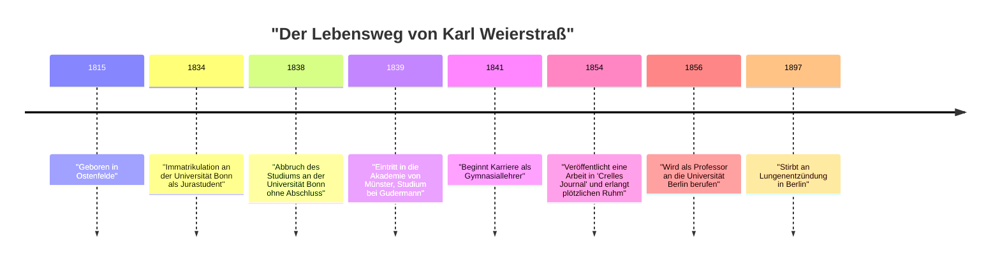
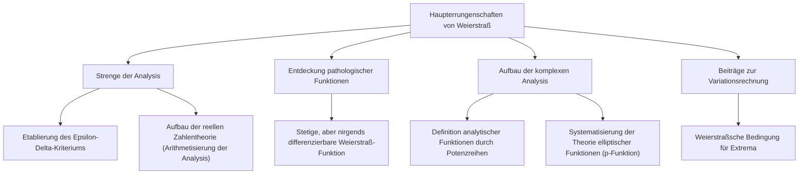

## Einleitung

In der Geschichte der Mathematik ist die Person, die am meisten dafür bekannt ist, die Infinitesimalrechnung auf ein strenges Fundament gestellt zu haben, **[Karl Weierstraß](https://kenji.blog/de/p/weierstrass/)** (1815–1897). Er wird als "Vater der modernen Analysis" gefeiert und legte die Grundlagen der Differential- und Integralrechnung (insbesondere das $\epsilon-\delta$-Kriterium), die wir heute an Universitäten studieren. Seine Errungenschaften gehen über die bloße Entdeckung von Sätzen hinaus; er hat die "Erzählweise" und die "Denkweise" in der Disziplin der Mathematik selbst grundlegend verändert. In diesem Artikel werden wir tief in die Episoden seines turbulenten Lebens und seine erstaunlichen Errungenschaften in der Mathematik eintauchen.

## Historischer Kontext: Die mathematische Welt des 19. Jahrhunderts und die Krise in der Analysis

Die Infinitesimalrechnung, die im 17. Jahrhundert von [Isaac Newton](https://kenji.blog/de/p/newton/) und Gottfried Wilhelm Leibniz begründet wurde, erlebte im Laufe des 18. Jahrhunderts durch [Leonhard Euler](https://kenji.blog/de/p/euler/) und andere eine phänomenale Entwicklung. Während ihre Anwendungen in der Physik und Astronomie bemerkenswerte Ergebnisse lieferten, blieben die zugrunde liegenden Konzepte von "Infinitesimalen" und "Grenzwerten" äußerst mehrdeutig. Die intuitive Erklärung "eine Zahl, die sich unendlich nahe an Null nähert, aber nicht Null ist" wurde zur Zielscheibe philosophischer Kritik und entbehrte logischer Strenge.

Zu Beginn des 19. Jahrhunderts machten sich [Augustin-Louis Cauchy](https://kenji.blog/de/p/cauchy/), Bernhard Bolzano und andere daran, die Analysis strenger zu machen, aber ihre Definitionen konnten die Intuition immer noch nicht vollständig ausschließen. Es war Weierstraß, der die historische Mission übernahm, diese Situation, die man als "Krise in der Analysis" bezeichnen könnte, zu durchbrechen und die Analysis mit rein arithmetischen Methoden neu aufzubauen, ohne sich auf geometrische Intuition zu verlassen.

## Frühes Leben und frustrierende Studentenzeit

[Karl Weierstraß](https://kenji.blog/de/p/weierstrass/) wurde am 31. Oktober 1815 in Ostenfelde im Königreich Preußen (heutiges Deutschland) geboren. Sein Vater war Regierungsbeamter und ein sehr strenger Mann. Sein Vater wünschte sich sehr, dass sein Sohn genau wie er ein ausgezeichneter preußischer Verwaltungsbeamter werden würde, und das frühe Leben von Weierstraß war an diese starken Erwartungen gebunden.

Im Jahr 1834 trat er auf Wunsch seines Vaters in die Universität Bonn ein, um Jura und Finanzwesen zu studieren. Sein Herz schlug jedoch nicht für Jura oder Wirtschaft, sondern fühlte sich stark zur Mathematik hingezogen. Infolgedessen verbrachte er seine Zeit mit Fechten und Biertrinken, anstatt juristische Vorlesungen zu besuchen, und führte ein freizügiges Studentenleben. Gleichzeitig verschlang er privat mathematische Bücher (insbesondere die Werke von Pierre-Simon Laplace, [Carl Gustav Jacob Jacobi](https://kenji.blog/de/p/jacobi/) und [Niels Henrik Abel](https://kenji.blog/de/p/abel/)) und brachte sich selbst höhere Mathematik bei. Letztendlich brach er vier Jahre später das Studium ab, ohne einen Abschluss zu machen.

Dieser Rückschlag war ein großer Wendepunkt für ihn und enttäuschte seinen Vater zutiefst. Der in dieser Zeit kultivierte Geist der Unabhängigkeit und des Selbststudiums hatte jedoch zweifellos großen Einfluss auf seinen späteren Forschungsstil.

## Lange Jahre der Bedeutungslosigkeit als Lehrer: Einsames Forscherleben

Nach dem Abbruch des Universitätsstudiums konnte Weierstraß die Mathematik nicht aufgeben. Auf Anraten eines Freundes trat er wieder in die Akademie von Münster (heute Universität Münster) ein. Hier studierte er Mathematik unter der Leitung von Christoph Gudermann, einem bedeutenden Mathematiker der damaligen Zeit. Gudermann war Experte für die Theorie der elliptischen Funktionen, und Weierstraß war von ihnen fasziniert. Gudermann erkannte Weierstraß' außergewöhnliches Talent und lobte ihn hoch.

Nach Erhalt seines Lehrzertifikats arbeitete Weierstraß ab 1841 15 Jahre lang als Gymnasiallehrer in verschiedenen Landstädten in Preußen. Sein Leben war keineswegs privilegiert. Es heißt, dass er nicht nur Mathematik, sondern auch Physik, Botanik, Geographie, Geschichte und sogar Turnen und Kalligraphie unterrichtete.

Obwohl er mit harten täglichen Lehraufgaben beschäftigt war, blieb er bis spät in die Nacht auf, um seine mathematischen Forschungen fortzusetzen. Er hatte keine Möglichkeit, sich mit den Spitzenmathematikern seiner Zeit auszutauschen, und reichte selten Arbeiten bei akademischen Zeitschriften ein. In einer völlig isolierten Umgebung, ohne dass es jemand wusste, führte er großartige Forschungen durch, die die Grundlagen der Analysis von Grund auf in Frage stellten. Überarbeitung während dieser Zeit ruinierte seine Gesundheit und verursachte die schweren Schwindelanfälle, die ihn später plagen sollten.

## Spektakuläre Rückkehr in die mathematische Welt und Ruhm

Nach einer langen Zeit der Bedeutungslosigkeit als Dorfschullehrer kam 1854 ein dramatischer Wendepunkt für Weierstraß. Er veröffentlichte eine bahnbrechende Arbeit über abelsche Funktionen in "Crelles Journal" (Journal für die reine und angewandte Mathematik), der damals maßgeblichsten mathematischen Zeitschrift.

Dieses Papier zog sofort die Aufmerksamkeit von Mathematikern in ganz Europa auf sich. Seine Forschung löste auf brillante Weise schwierige Probleme, an denen prominente Mathematiker der damaligen Zeit jahrelang gearbeitet hatten, und die Neuheit seiner Methoden und die Perfektion seiner Logik waren beispiellos. Die Universität Königsberg verlieh ihm in Anerkennung seiner Leistungen die Ehrendoktorwürde, und auch das preußische Kultusministerium unternahm Schritte, um ihn von seinen Pflichten als Gymnasiallehrer zu entbinden.

Schließlich wurde er 1856 als Professor an der Universität Berlin willkommen geheißen. Es war ein spätes Debüt im Alter von über 40 Jahren, aber von hier aus begann sein rasanter Aufstieg, und er sollte die Universität Berlin zum Zentrum der Mathematik auf höchstem globalem Niveau erheben.

## Große mathematische Errungenschaften

Die Errungenschaften von Weierstraß erstrecken sich über ein breites Spektrum von Bereichen, aber hier werden wir drei besonders berühmte Beiträge im Detail erläutern.

### 1. Strenge der Analysis (Epsilon-Delta-Kriterium)

Wie bereits erwähnt, stützte sich die Infinitesimalrechnung auf intuitive "Infinitesimale". Weierstraß formulierte die Konzepte von Grenzwerten und Kontinuität vollständig unter Verwendung nur von Ungleichungen, wobei er mehrdeutige Wörter vollständig eliminierte. Dies ist das **$\epsilon-\delta$-Kriterium**, das wichtigste Fundament der modernen Mathematik.

Die Definition einer Funktion $f(x)$, die bei $x = a$ stetig ist, wurde von ihm folgendermaßen streng beschrieben:

$$
\forall \epsilon > 0, \exists \delta > 0 \text{ s.t. } \forall x, |x - a| < \delta \implies |f(x) - f(a)| < \epsilon
$$

Der revolutionäre Aspekt dieser Definition ist, dass sie das Konzept der Zeit, die "dynamische Veränderung", in einen "statischen logischen Zustand" verwandelte. Dies machte es möglich, die Analysis mit rein arithmetischen Methoden aufzubauen, ohne sich auf die geometrische Intuition zu verlassen. Er gab auch eine strenge Definition bezüglich der Kontinuität der reellen Zahlen und stellte die Analysis erfolgreich auf ein solides logisches Fundament (dies wird als Arithmetisierung der Analysis bezeichnet).

### 2. Ein die Intuition herausforderndes Gegenbeispiel: Der Schock der Weierstraß-Funktion

Darüber hinaus präsentierte er eine einzige Funktion, die in der mathematischen Welt einen massiven Schock auslöste. Es ist eine "Funktion, die überall stetig, aber nirgends differenzierbar ist". Diese ist heute als **Weierstraß-Funktion** bekannt.

$$
f(x) = \sum_{n=0}^{\infty} a^n \cos(b^n \pi x)
$$
(wobei $0 < a < 1$, $b$ eine positive ungerade ganze Zahl ist und $ab > 1 + \frac{3}{2}\pi$)

Zu dieser Zeit war es gesunder Menschenverstand und Intuition unter Mathematikern, dass "eine stetige Kurve glatt ist und mit Ausnahme weniger Ausnahmepunkte, an denen sie scharf ist, überall eine Tangente gezogen werden kann (sie ist differenzierbar)". Indem er jedoch diese Funktion präsentierte, zeigte Weierstraß, dass es eine Kurve gibt, die unendlich gezackt ist und niemals glatt wird, egal wie sehr sie vergrößert wird.

Diese Entdeckung machte Mathematikern schmerzlich bewusst, wie unzuverlässig geometrische Intuition sein kann und wie wichtig Beweise durch strenge Logik sind. Diese Funktion, die als Vorläufer der späteren fraktalen Geometrie angesehen werden kann, gilt als eines der wichtigsten Gegenbeispiele in der Geschichte der Mathematik.

### 3. Aufbau der komplexen Analysis und Theorie der elliptischen Funktionen

Weierstraß spielte auch eine entscheidende Rolle in der Theorie der komplexen Funktionen. Während [Cauchy](https://kenji.blog/de/p/cauchy/) und [Riemann](https://kenji.blog/de/p/riemann/) die geometrische Intuition und Integration betonten, wählte Weierstraß einen algebraischen Ansatz, der auf "Potenzreihen" basierte. Er definierte komplexe Funktionen rigoros mit dem Konzept der analytischen Fortsetzung und etablierte die Standardmethoden der modernen komplexen Analysis.

Er konstruierte auch ein extrem schönes System auf den Gebieten der elliptischen Funktionentheorie und der abelschen Funktionentheorie. Die $\wp$-Funktion (p-Funktion) von Weierstraß wird bis heute häufig als die grundlegendste Funktion im Umgang mit elliptischen Funktionen verwendet.

## Sein wahres Gesicht als großer Erzieher

An der Universität Berlin war Weierstraß nicht nur Forscher, sondern auch ein außergewöhnlich herausragender Erzieher. Seine Vorlesungen waren sehr klar, ohne logische Sprünge, und näherten sich stetig Schritt für Schritt der Wahrheit. Seine Vorlesungsaufzeichnungen kursierten unter den Studenten und wurden an Universitäten in ganz Europa wie Lehrbücher behandelt.

Als sie von seinem Ruhm hörten, versammelten sich hervorragende Studenten aus ganz Europa um ihn. Zu seinen Schülern und den von ihm beeinflussten Mathematikern gehören [Georg Cantor](https://kenji.blog/de/p/cantor/) (Begründer der Mengenlehre), Felix Klein, Ferdinand Georg Frobenius, Hermann Schwarz und viele andere Giganten, die später ihre Namen in der Geschichte der Mathematik hinterließen.

### Mentorenschaft und Zuneigung zu Sofia Kowalewskaja

Unverzichtbar bei der Erörterung von Weierstraß' Aspekt als Pädagoge ist die Episode mit **Sofia Kowalewskaja**, einer Mathematikerin aus Russland.

Im Europa des späten 19. Jahrhunderts war es fast nicht anerkannt, dass Frauen Universitäten besuchten und eine formelle Ausbildung erhielten. Kowalewskaja wollte an der Universität Berlin studieren, aber die Universität lehnte ihren Antrag auf Gasthörerschaft ab. Weierstraß erkannte jedoch sofort ihr außergewöhnliches mathematisches Talent und beschloss, ungebunden von den Universitätsbestimmungen, ihr kostenlos persönliche Anleitung zu geben.

Unter der engagierten Anleitung von Weierstraß erzielte Kowalewskaja großartige Ergebnisse bei partiellen Differentialgleichungen und Himmelsmechanik und wurde später die erste Frau, die als ordentliche Professorin an eine moderne Universität (Universität Stockholm) berufen wurde. Weierstraß liebte sie tief, nicht nur als Studentin, sondern als eine seiner engsten Freundinnen. Die große Anzahl von Briefen, die zwischen den beiden ausgetauscht wurden, vermittelt ihre starke Bindung und ihren tiefen Respekt. Als Kowalewskaja im jungen Alter von 41 Jahren an einer Krankheit starb, war Weierstraß' [Kummer](https://kenji.blog/de/p/kummer/) unermesslich.

## Späte Jahre und Vermächtnis

In seinen späteren Jahren erlebte Weierstraß einen heftigen Streit über die Grundlagen der Mathematik mit Leopold [Kronecker](https://kenji.blog/de/p/kronecker/), einem Kollegen und ehemaligen Studenten. [Kronecker](https://kenji.blog/de/p/kronecker/) erklärte: "Die ganzen Zahlen hat der liebe Gott gemacht, alles andere ist Menschenwerk", und kritisierte Weierstraß' Analysis und Cantors Mengenlehre scharf aus einem intuitionistischen Standpunkt. Dieser Konflikt verwundete das Herz von Weierstraß tief.

Auch seine Gesundheit verschlechterte sich allmählich, und in seinen späteren Jahren litt er unter Schwindel und Bronchitis, was ihn zwang, im Rollstuhl zu leben. Dennoch verlor er bis zuletzt nie seine Leidenschaft für die Mathematik und arbeitete mit Hilfe seiner Schüler an der Zusammenstellung seiner eigenen gesammelten Werke.

Am 19. Februar 1897 verstarb [Karl Weierstraß](https://kenji.blog/de/p/weierstrass/) im Alter von 81 Jahren in Berlin an einer Lungenentzündung.

## Fazit

Durch seine strenge Logik und seinen unbezwingbaren Geist hat [Karl Weierstraß](https://kenji.blog/de/p/weierstrass/) die Mathematik zu etwas Festerem und Schönerem weiterentwickelt. Sein Leben, in dem er jugendliche Rückschläge und eine lange, einsame Zeit der Bedeutungslosigkeit als Dorflehrer überwand, um schließlich an die Weltspitze aufzusteigen, gibt uns, die wir in der Neuzeit leben, immensen Mut.

Ohne das solide Fundament der "Strenge", das er gebaut hat, wäre die Entwicklung der modernen fortgeschrittenen Mathematik, Physik und Ingenieurwissenschaften unmöglich gewesen. Die Errungenschaften, die er hinterlassen hat, leuchten in der modernen Mathematik weiterhin hell, ohne zu verblassen, und genau deshalb wird er als "Vater der modernen Analysis" gepriesen. Der Name Weierstraß wird für immer als ein großes Symbol weitergegeben werden, das beweist, dass Mathematik eine Kunst der Logik ist.
