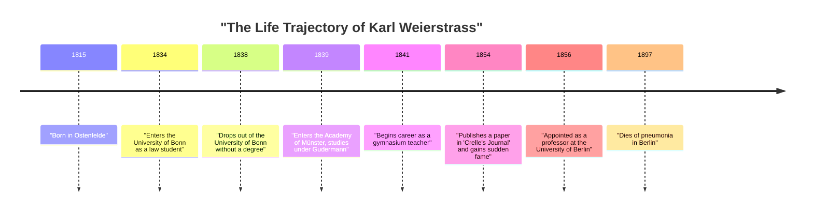
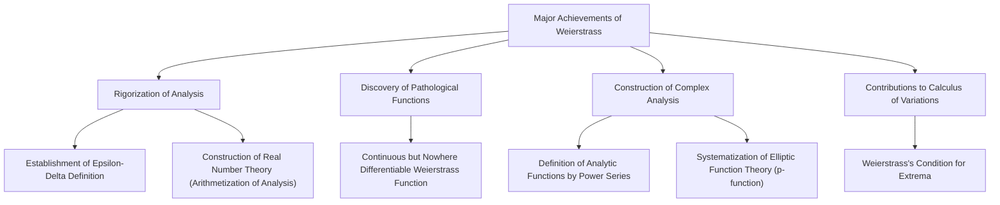

## Introduction

In the history of mathematics, the person most renowned for establishing calculus on a rigorous foundation is **[Karl Weierstrass](https://kenji.blog/en/p/weierstrass/)** (1815–1897). He is hailed as the "father of modern analysis" and established the foundations of differential and integral calculus (especially the $\epsilon-\delta$ definition) that we study in universities today. His achievements go beyond merely discovering theorems; he fundamentally transformed the "narrative" and "way of thinking" in the discipline of mathematics itself. In this article, we will delve deeply into the episodes of his turbulent life and his astonishing achievements in mathematics.

## Historical Context: The 19th Century Mathematical World and the Crisis in Analysis

Calculus, founded in the 17th century by [Isaac Newton](https://kenji.blog/en/p/newton/) and Gottfried Wilhelm Leibniz, achieved phenomenal development throughout the 18th century in the hands of [Leonhard Euler](https://kenji.blog/en/p/euler/) and others. While its applications in physics and astronomy yielded remarkable results, the underlying concepts of "infinitesimals" and "limits" remained highly ambiguous. The intuitive explanation of "a number that approaches infinitely close to zero but is not zero" became the target of philosophical criticism and lacked logical rigor.

Entering the 19th century, [Augustin-Louis Cauchy](https://kenji.blog/en/p/cauchy/), Bernhard Bolzano, and others set out to rigorize analysis, but their definitions still could not completely eliminate intuition. It was Weierstrass who took on the historical mission of breaking through this situation, which could be called the "crisis in analysis," and rebuilding analysis using purely arithmetical methods without relying on geometric intuition.

## Early Life and Frustrating Student Days

[Karl Weierstrass](https://kenji.blog/en/p/weierstrass/) was born on October 31, 1815, in Ostenfelde, Kingdom of Prussia (present-day Germany). His father was a government official and a very strict man. His father strongly desired his son to become an excellent Prussian administrator just like himself, and Weierstrass's early life was bound by these strong expectations.

In 1834, following his father's wishes, he entered the University of Bonn to study law and finance. However, his heart was not in law or economics, but strongly drawn to mathematics. As a result, instead of attending law lectures, he spent his time fencing and drinking beer, leading a freewheeling student life. At the same time, he personally devoured mathematical books (especially the works of Pierre-Simon Laplace, [Carl Gustav Jacob Jacobi](https://kenji.blog/en/p/jacobi/), and [Niels Henrik Abel](https://kenji.blog/en/p/abel/)) and taught himself advanced mathematics. Ultimately, he dropped out of the university four years later without obtaining a degree.

This setback was a major turning point for him and deeply disappointed his father. However, the spirit of independence and self-study cultivated during this period undoubtedly had a great influence on his later research style.

## Long Years of Obscurity as a Teacher: Solitary Research Life

After dropping out of the university, Weierstrass could not give up on mathematics. On the advice of a friend, he re-entered the Academy of Münster (now the University of Münster). Here, he studied mathematics under the guidance of Christoph Gudermann, a prominent mathematician of the time. Gudermann was an expert in the theory of elliptic functions, and Weierstrass became fascinated by them. Gudermann recognized Weierstrass's extraordinary talent and highly praised him.

After obtaining his teaching certificate, Weierstrass worked as a gymnasium (secondary school) teacher in various rural towns in Prussia for 15 years starting in 1841. His life was by no means privileged. It is said that he taught not only mathematics but also physics, botany, geography, history, and even gymnastics and calligraphy.

Despite being busy with harsh daily teaching duties, he stayed up late into the night to continue his mathematical research. He had no opportunities to interact with cutting-edge mathematicians of the time and rarely submitted papers to academic journals. In a completely isolated environment, unknown to anyone, he was conducting magnificent research that questioned the foundations of analysis from the ground up. Overwork during this period undermined his health and caused the severe dizzy spells that would later plague him.

## Spectacular Return to the Mathematical World and Glory

After a long period of obscurity as a rural school teacher, a dramatic turning point came for Weierstrass in 1854. He published a groundbreaking paper on Abelian functions in "Crelle's Journal" (Journal for Pure and Applied Mathematics), the most authoritative mathematical journal at the time.

This paper immediately attracted the attention of mathematicians across Europe. His research brilliantly solved difficult problems that prominent mathematicians of the time had been tackling for years, and the novelty of his methods and the perfection of his logic were unparalleled. The University of Königsberg awarded him an honorary doctorate in recognition of his achievements, and the Prussian Ministry of Education also took steps to relieve him from his duties as a gymnasium teacher.

Finally, in 1856, he was welcomed as a professor at the University of Berlin. It was a late-blooming debut over the age of 40, but from here his rapid advance began, and he would elevate the University of Berlin to the center of mathematics of the highest global standard.

## Great Mathematical Achievements

Weierstrass's achievements span a wide range of fields, but here we will explain in detail three particularly famous contributions.

### 1. Rigorization of Analysis (Epsilon-Delta Definition)

As mentioned earlier, calculus relied on intuitive "infinitesimals". Weierstrass completely formulated the concepts of limits and continuity using only inequalities, entirely eliminating ambiguous words. This is the **$\epsilon-\delta$ definition**, the most important foundation in modern mathematics.

The definition of a function $f(x)$ being continuous at $x = a$ was rigorously described by him as follows:

$$
\forall \epsilon > 0, \exists \delta > 0 \text{ s.t. } \forall x, |x - a| < \delta \implies |f(x) - f(a)| < \epsilon
$$

The revolutionary aspect of this definition is that it transformed the concept involving time, "dynamic change," into a "static logical state." This made it possible to construct analysis using purely arithmetical methods without relying on geometric intuition. He also gave a rigorous definition regarding the continuity of real numbers, successfully placing analysis on a solid logical foundation (this is called the arithmetization of analysis).

### 2. A Counterexample Defying Intuition: The Shock of the Weierstrass Function

Furthermore, he presented a single function that caused a massive shock in the mathematical world. It is a "function that is continuous everywhere but differentiable nowhere." This is now known as the **Weierstrass function**.

$$
f(x) = \sum_{n=0}^{\infty} a^n \cos(b^n \pi x)
$$
(where $0 < a < 1$, $b$ is a positive odd integer, and $ab > 1 + \frac{3}{2}\pi$)

At the time, it was common sense and intuition among mathematicians that "a continuous curve is smooth, and except for a few exceptional points where it is sharp, a tangent line can be drawn anywhere (it is differentiable)." However, by presenting this function, Weierstrass showed that there exists a curve that is infinitely jagged and never becomes smooth no matter how much it is magnified.

This discovery made mathematicians painfully realize how unreliable geometric intuition could be, and how important proofs by rigorous logic were. This function, which can be seen as a forerunner to later fractal geometry, is considered one of the most important counterexamples in the history of mathematics.

### 3. Construction of Complex Analysis and Elliptic Function Theory

Weierstrass also played a decisive role in the theory of complex functions. While Cauchy and Riemann emphasized geometric intuition and integration, Weierstrass adopted an algebraic approach based on "power series". He rigorously defined complex functions using the concept of analytic continuation and established the standard methods of modern complex analysis.

He also constructed an extremely beautiful system in the fields of elliptic function theory and Abelian function theory. Weierstrass's $\wp$-function (p-function) is still widely used today as the most fundamental function in handling elliptic functions.

## His True Face as a Great Educator

At the University of Berlin, Weierstrass was not only a researcher but also an exceptionally outstanding educator. His lectures were very clear, without any leaps in logic, steadily approaching the truth step by step. His lecture notes circulated among students and were treated like textbooks in universities across Europe.

Hearing of his fame, excellent students from all over Europe gathered around him. His disciples and mathematicians influenced by him include [Georg Cantor](https://kenji.blog/en/p/cantor/) (founder of set theory), Felix Klein, Ferdinand Georg Frobenius, Hermann Schwarz, and many other giants who later left their names in the history of mathematics.

### Mentorship and Affection with Sofia Kovalevskaya

Indispensable when talking about Weierstrass's aspect as an educator is the episode with **Sofia Kovalevskaya**, a female mathematician from Russia.

In late 19th-century Europe, it was almost unrecognized for women to enter universities and receive a formal education. Kovalevskaya wished to study at the University of Berlin, but the university refused her auditing request. However, Weierstrass immediately recognized her extraordinary mathematical talent and, unbound by university regulations, decided to give her personal guidance free of charge.

Under Weierstrass's dedicated guidance, Kovalevskaya achieved magnificent results in partial differential equations and celestial mechanics, later becoming the first woman to be appointed as a full professor at a modern university (Stockholm University). Weierstrass deeply loved her not just as a student but as one of his closest friends. The vast number of letters exchanged between the two convey their strong bond and deep respect. When Kovalevskaya died of illness at the young age of 41, Weierstrass's sorrow was immeasurable.

## Later Years and Legacy

In his later years, Weierstrass experienced a fierce dispute over the foundations of mathematics with Leopold Kronecker, a colleague and former student. Kronecker stated, "God made the integers, all else is the work of man," and severely criticized Weierstrass's analysis and Cantor's set theory from an intuitionist standpoint. This conflict deeply wounded Weierstrass's heart.

His health also gradually deteriorated, and in his later years, he suffered from dizziness and bronchitis, forcing him to live in a wheelchair. Nevertheless, he never lost his passion for mathematics until the end, working on compiling his own collected works with the help of his disciples.

On February 19, 1897, [Karl Weierstrass](https://kenji.blog/en/p/weierstrass/) passed away from pneumonia in Berlin at the age of 81.

## Conclusion

Through his rigorous logic and indomitable spirit, [Karl Weierstrass](https://kenji.blog/en/p/weierstrass/) evolved mathematics into something more solid and beautiful. Overcoming youthful setbacks and a long, lonely period of obscurity as a rural teacher to eventually rise to the top of the world, his life gives immense courage to us living in the modern era.

Without the solid foundation of "rigor" that he built, the development of modern advanced mathematics, physics, and engineering would have been impossible. The achievements he left behind continue to shine brilliantly without fading in modern mathematics, and that is precisely why he is praised as the "father of modern analysis." The name of Weierstrass will be passed down forever as a great symbol proving that mathematics is an art of logic.
