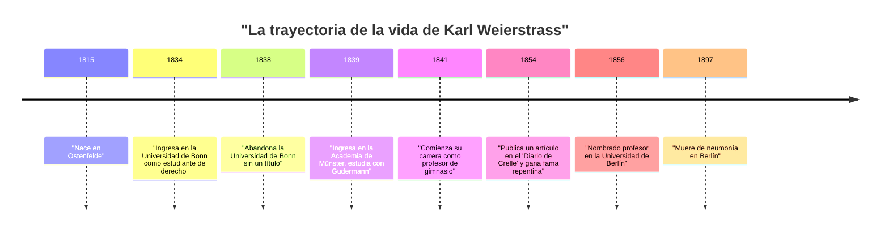
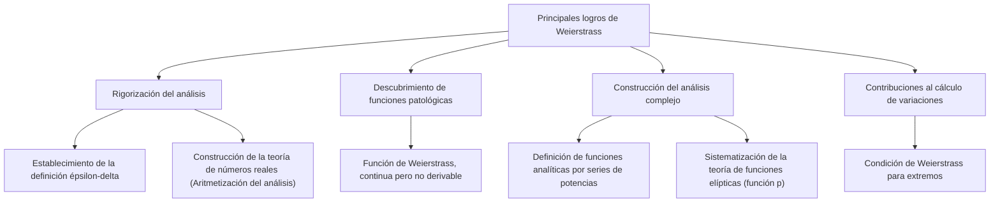

## Introducción

En la historia de las matemáticas, la persona más famosa por haber establecido el cálculo sobre una base rigurosa es **[Karl Weierstrass](https://kenji.blog/es/p/weierstrass/)** (1815-1897). Es aclamado como el "padre del análisis moderno" y estableció los fundamentos del cálculo diferencial e integral (especialmente la definición $\epsilon-\delta$) que estudiamos hoy en las universidades. Sus logros van más allá del mero descubrimiento de teoremas; transformó fundamentalmente la "narrativa" y la "forma de pensar" en la propia disciplina de las matemáticas. En este artículo, profundizaremos en los episodios de su turbulenta vida y sus asombrosos logros en las matemáticas.

## Contexto histórico: El mundo matemático del siglo XIX y la crisis del análisis

El cálculo, fundado en el siglo XVII por [Isaac Newton](https://kenji.blog/es/p/newton/) y Gottfried Wilhelm Leibniz, logró un desarrollo fenomenal a lo largo del siglo XVIII en manos de [Leonhard Euler](https://kenji.blog/es/p/euler/) y otros. Si bien sus aplicaciones en física y astronomía arrojaron resultados notables, los conceptos subyacentes de "infinitesimales" y "límites" seguían siendo muy ambiguos. La explicación intuitiva de "un número que se acerca infinitamente a cero pero que no es cero" se convirtió en blanco de críticas filosóficas y carecía de rigor lógico.

Al entrar en el siglo XIX, [Augustin-Louis Cauchy](https://kenji.blog/es/p/cauchy/), Bernhard Bolzano y otros se propusieron dar rigor al análisis, pero sus definiciones aún no lograban eliminar por completo la intuición. Fue Weierstrass quien asumió la misión histórica de superar esta situación, que podría llamarse la "crisis del análisis", y reconstruir el análisis utilizando métodos puramente aritméticos sin depender de la intuición geométrica.

## Juventud y años de estudio frustrantes

[Karl Weierstrass](https://kenji.blog/es/p/weierstrass/) nació el 31 de octubre de 1815 en Ostenfelde, Reino de Prusia (actual Alemania). Su padre era un funcionario del gobierno y un hombre muy estricto. Su padre deseaba fervientemente que su hijo se convirtiera en un excelente administrador prusiano al igual que él, y los primeros años de la vida de Weierstrass estuvieron condicionados por estas fuertes expectativas.

En 1834, siguiendo los deseos de su padre, ingresó en la Universidad de Bonn para estudiar derecho y finanzas. Sin embargo, su corazón no estaba en el derecho o la economía, sino que se sentía fuertemente atraído por las matemáticas. Como resultado, en lugar de asistir a clases de derecho, pasaba su tiempo practicando esgrima y bebiendo cerveza, llevando una vida estudiantil despreocupada. Al mismo tiempo, devoraba personalmente libros de matemáticas (especialmente las obras de Pierre-Simon Laplace, [Carl Gustav Jacob Jacobi](https://kenji.blog/es/p/jacobi/) y [Niels Henrik Abel](https://kenji.blog/es/p/abel/)) y aprendió matemáticas avanzadas de forma autodidacta. Finalmente, abandonó la universidad cuatro años después sin obtener un título.

Este revés fue un gran punto de inflexión para él y decepcionó profundamente a su padre. Sin embargo, el espíritu de independencia y autoestudio cultivado durante este período sin duda tuvo una gran influencia en su estilo de investigación posterior.

## Largos años de oscuridad como profesor: La vida de investigación solitaria

Después de abandonar la universidad, Weierstrass no podía renunciar a las matemáticas. Por consejo de un amigo, volvió a ingresar en la Academia de Münster (ahora Universidad de Münster). Aquí, estudió matemáticas bajo la dirección de Christoph Gudermann, un matemático prominente de la época. Gudermann era un experto en la teoría de funciones elípticas, y Weierstrass quedó fascinado por ellas. Gudermann reconoció el talento extraordinario de Weierstrass y lo elogió mucho.

Después de obtener su certificado de enseñanza, Weierstrass trabajó como profesor de gimnasio (escuela secundaria) en varias ciudades rurales de Prusia durante 15 años a partir de 1841. Su vida no era en absoluto privilegiada. Se dice que enseñaba no solo matemáticas sino también física, botánica, geografía, historia e incluso gimnasia y caligrafía.

A pesar de estar ocupado con las duras tareas de enseñanza diarias, se quedaba despierto hasta altas horas de la noche para continuar su investigación matemática. No tenía oportunidades de interactuar con matemáticos de vanguardia de la época y rara vez enviaba artículos a revistas académicas. En un entorno completamente aislado, desconocido para todos, llevaba a cabo una magnífica investigación que cuestionaba los fundamentos del análisis desde cero. El exceso de trabajo durante este período minó su salud y causó los severos mareos que lo afectarían más tarde.

## Regreso espectacular al mundo matemático y la gloria

Después de un largo período de oscuridad como maestro de escuela rural, un dramático punto de inflexión llegó para Weierstrass en 1854. Publicó un artículo pionero sobre funciones abelianas en el "Diario de Crelle" (Diario de Matemáticas Puras y Aplicadas), la revista matemática más prestigiosa de la época.

Este artículo atrajo inmediatamente la atención de matemáticos de toda Europa. Su investigación resolvió brillantemente problemas difíciles que matemáticos prominentes de la época habían estado abordando durante años, y la novedad de sus métodos y la perfección de su lógica no tenían precedentes. La Universidad de Königsberg le otorgó un doctorado honoris causa en reconocimiento a sus logros, y el Ministerio de Educación de Prusia también tomó medidas para relevarlo de sus deberes como profesor de gimnasio.

Finalmente, en 1856, fue recibido como profesor en la Universidad de Berlín. Fue un debut tardío a la edad de más de 40 años, pero a partir de aquí comenzó su rápido ascenso, y elevaría a la Universidad de Berlín al centro de las matemáticas del más alto nivel mundial.

## Grandes logros matemáticos

Los logros de Weierstrass abarcan una amplia gama de campos, pero aquí explicaremos en detalle tres contribuciones particularmente famosas.

### 1. Rigorización del análisis (Definición épsilon-delta)

Como se mencionó anteriormente, el cálculo se basaba en "infinitesimales" intuitivos. Weierstrass formuló completamente los conceptos de límites y continuidad utilizando únicamente desigualdades, eliminando por completo las palabras ambiguas. Esta es la **definición $\epsilon-\delta$**, la base más importante de las matemáticas modernas.

La definición de que una función $f(x)$ sea continua en $x = a$ fue descrita rigurosamente por él de la siguiente manera:

$$
\forall \epsilon > 0, \exists \delta > 0 \text{ t.q. } \forall x, |x - a| < \delta \implies |f(x) - f(a)| < \epsilon
$$

El aspecto revolucionario de esta definición es que transformó el concepto que involucra tiempo, "cambio dinámico", en un "estado lógico estático". Esto hizo posible construir el análisis utilizando métodos puramente aritméticos sin depender de la intuición geométrica. También dio una definición rigurosa sobre la continuidad de los números reales, colocando exitosamente el análisis sobre una base lógica sólida (esto se llama la aritmetización del análisis).

### 2. Un contraejemplo que desafía la intuición: El impacto de la función de Weierstrass

Además, presentó una función única que causó un gran impacto en el mundo matemático. Es una "función que es continua en todas partes pero derivable en ninguna". Ahora se la conoce como la **función de Weierstrass**.

$$
f(x) = \sum_{n=0}^{\infty} a^n \cos(b^n \pi x)
$$
(donde $0 < a < 1$, $b$ es un número entero impar positivo, y $ab > 1 + \frac{3}{2}\pi$)

En ese momento, era de sentido común e intuitivo entre los matemáticos que "una curva continua es suave, y salvo por unos pocos puntos excepcionales donde es puntiaguda, se puede trazar una línea tangente en cualquier lugar (es derivable)". Sin embargo, al presentar esta función, Weierstrass mostró que existe una curva que es infinitamente dentada y nunca se vuelve suave, por mucho que se amplíe.

Este descubrimiento hizo que los matemáticos se dieran cuenta dolorosamente de lo poco confiable que podía ser la intuición geométrica, y de lo importantes que eran las pruebas mediante una lógica rigurosa. Esta función, que puede considerarse un precursor de la geometría fractal posterior, se considera uno de los contraejemplos más importantes en la historia de las matemáticas.

### 3. Construcción del análisis complejo y teoría de funciones elípticas

Weierstrass también desempeñó un papel decisivo en la teoría de funciones complejas. Mientras que Cauchy y Riemann enfatizaron la intuición geométrica y la integración, Weierstrass adoptó un enfoque algebraico basado en "series de potencias". Definió rigurosamente las funciones complejas utilizando el concepto de continuación analítica y estableció los métodos estándar del análisis complejo moderno.

También construyó un sistema extremadamente hermoso en los campos de la teoría de funciones elípticas y la teoría de funciones abelianas. La función $\wp$ (función p) de Weierstrass todavía se usa ampliamente en la actualidad como la función más fundamental en el manejo de funciones elípticas.

## Su verdadero rostro como un gran educador

En la Universidad de Berlín, Weierstrass no solo fue un investigador, sino también un educador excepcionalmente destacado. Sus conferencias eran muy claras, sin saltos lógicos, acercándose constantemente a la verdad paso a paso. Las notas de sus clases circulaban entre los estudiantes y se trataban como libros de texto en las universidades de toda Europa.

Al enterarse de su fama, excelentes estudiantes de toda Europa se reunieron a su alrededor. Sus discípulos y matemáticos influenciados por él incluyen a [Georg Cantor](https://kenji.blog/es/p/cantor/) (fundador de la teoría de conjuntos), Felix Klein, Ferdinand Georg Frobenius, Hermann Schwarz y muchos otros gigantes que luego dejaron sus nombres en la historia de las matemáticas.

### Mentoría y afecto por Sofia Kovalévskaya

Indispensable cuando se habla del aspecto de Weierstrass como educador es el episodio con **Sofia Kovalévskaya**, una matemática de Rusia.

En la Europa de finales del siglo XIX, casi no se reconocía que las mujeres ingresaran a las universidades y recibieran una educación formal. Kovalévskaya deseaba estudiar en la Universidad de Berlín, pero la universidad rechazó su solicitud de oyente. Sin embargo, Weierstrass reconoció de inmediato su extraordinario talento matemático y, sin estar atado a las regulaciones de la universidad, decidió brindarle orientación personal de forma gratuita.

Bajo la dedicada guía de Weierstrass, Kovalévskaya logró magníficos resultados en ecuaciones diferenciales parciales y mecánica celeste, convirtiéndose más tarde en la primera mujer en ser nombrada profesora titular en una universidad moderna (Universidad de Estocolmo). Weierstrass la amaba profundamente no solo como estudiante sino como una de sus amigas más cercanas. La gran cantidad de cartas intercambiadas entre los dos transmiten su fuerte vínculo y profundo respeto. Cuando Kovalévskaya murió de enfermedad a la temprana edad de 41 años, la tristeza de Weierstrass fue inmensurable.

## Últimos años y legado

En sus últimos años, Weierstrass experimentó una feroz disputa sobre los fundamentos de las matemáticas con Leopold Kronecker, un colega y antiguo alumno. Kronecker declaró: "Dios hizo los números enteros, todo lo demás es obra del hombre", y criticó duramente el análisis de Weierstrass y la teoría de conjuntos de Cantor desde un punto de vista intuicionista. Este conflicto hirió profundamente el corazón de Weierstrass.

Su salud también se deterioró gradualmente, y en sus últimos años sufrió de mareos y bronquitis, lo que lo obligó a vivir en una silla de ruedas. Sin embargo, nunca perdió su pasión por las matemáticas hasta el final, trabajando en la compilación de sus propias obras completas con la ayuda de sus discípulos.

El 19 de febrero de 1897, [Karl Weierstrass](https://kenji.blog/es/p/weierstrass/) falleció de neumonía en Berlín a la edad de 81 años.

## Conclusión

A través de su rigurosa lógica y su espíritu indomable, [Karl Weierstrass](https://kenji.blog/es/p/weierstrass/) hizo evolucionar las matemáticas hacia algo más sólido y hermoso. Superando los reveses de la juventud y un largo y solitario período de oscuridad como maestro rural para eventualmente llegar a la cima del mundo, su vida nos da un inmenso valor a quienes vivimos en la era moderna.

Sin la sólida base de "rigor" que construyó, el desarrollo de las matemáticas avanzadas modernas, la física y la ingeniería habría sido imposible. Los logros que dejó continúan brillando intensamente sin desvanecerse en las matemáticas modernas, y es precisamente por eso que se le elogia como el "padre del análisis moderno". El nombre de Weierstrass se transmitirá para siempre como un gran símbolo que demuestra que las matemáticas son un arte de la lógica.
