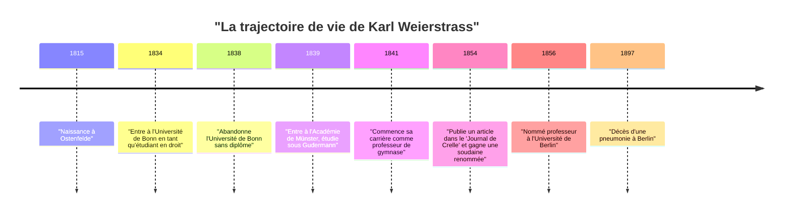
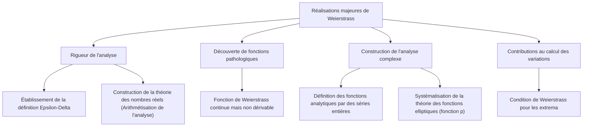

## Introduction

Dans l'histoire des mathématiques, la personne la plus célèbre pour avoir fondé le calcul différentiel et intégral sur des bases rigoureuses est **[Karl Weierstrass](https://kenji.blog/fr/p/weierstrass/)** (1815-1897). Il est salué comme le "père de l'analyse moderne" et a établi les fondements du calcul (en particulier la définition $\epsilon-\delta$) que nous étudions aujourd'hui dans les universités. Ses réalisations vont au-delà de la simple découverte de théorèmes ; il a fondamentalement transformé la "narration" et la "façon de penser" dans la discipline mathématique elle-même. Dans cet article, nous plongerons profondément dans les épisodes de sa vie mouvementée et ses réalisations étonnantes en mathématiques.

## Contexte historique : Le monde mathématique du 19ème siècle et la crise de l'analyse

Le calcul infinitésimal, fondé au 17ème siècle par [Isaac Newton](https://kenji.blog/fr/p/newton/) et Gottfried Wilhelm Leibniz, a connu un développement phénoménal tout au long du 18ème siècle entre les mains de [Leonhard Euler](https://kenji.blog/fr/p/euler/) et d'autres. Bien que ses applications en physique et en astronomie aient donné des résultats remarquables, les concepts sous-jacents d'"infiniment petits" et de "limites" restaient très ambigus. L'explication intuitive d'"un nombre qui s'approche infiniment près de zéro mais qui n'est pas zéro" est devenue la cible de critiques philosophiques et manquait de rigueur logique.

Au début du 19ème siècle, [Augustin-Louis Cauchy](https://kenji.blog/fr/p/cauchy/), Bernhard Bolzano et d'autres ont entrepris de rendre l'analyse rigoureuse, mais leurs définitions ne pouvaient toujours pas éliminer complètement l'intuition. C'est Weierstrass qui a assumé la mission historique de surmonter cette situation, que l'on pourrait appeler la "crise de l'analyse", et de reconstruire l'analyse en utilisant des méthodes purement arithmétiques sans se fier à l'intuition géométrique.

## Jeunesse et années d'études frustrantes

[Karl Weierstrass](https://kenji.blog/fr/p/weierstrass/) est né le 31 octobre 1815 à Ostenfelde, dans le Royaume de Prusse (actuelle Allemagne). Son père était un fonctionnaire du gouvernement et un homme très strict. Son père désirait ardemment que son fils devienne un excellent administrateur prussien tout comme lui, et le début de la vie de Weierstrass a été lié par ces fortes attentes.

En 1834, suivant les souhaits de son père, il entre à l'Université de Bonn pour étudier le droit et la finance. Cependant, son cœur n'était pas dans le droit ou l'économie, mais fortement attiré par les mathématiques. En conséquence, au lieu d'assister aux cours de droit, il passait son temps à l'escrime et à boire de la bière, menant une vie d'étudiant insouciante. En même temps, il dévorait personnellement des livres de mathématiques (en particulier les œuvres de Pierre-Simon Laplace, [Carl Gustav Jacob Jacobi](https://kenji.blog/fr/p/jacobi/) et [Niels Henrik Abel](https://kenji.blog/fr/p/abel/)) et apprenait seul les mathématiques avancées. Finalement, il abandonne l'université quatre ans plus tard sans obtenir de diplôme.

Cet échec a été un tournant majeur pour lui et a profondément déçu son père. Cependant, l'esprit d'indépendance et d'auto-apprentissage cultivé au cours de cette période a sans aucun doute eu une grande influence sur son style de recherche ultérieur.

## Longues années d'obscurité en tant qu'enseignant : La vie de recherche solitaire

Après avoir abandonné l'université, Weierstrass ne pouvait renoncer aux mathématiques. Sur les conseils d'un ami, il entre à nouveau à l'Académie de Münster (aujourd'hui l'Université de Münster). Ici, il a étudié les mathématiques sous la direction de Christoph Gudermann, un mathématicien éminent de l'époque. Gudermann était un expert dans la théorie des fonctions elliptiques, et Weierstrass est devenu fasciné par elles. Gudermann a reconnu le talent extraordinaire de Weierstrass et l'a hautement loué.

Après avoir obtenu son certificat d'enseignement, Weierstrass a travaillé comme professeur de gymnase (école secondaire) dans diverses villes rurales de Prusse pendant 15 ans à partir de 1841. Sa vie n'était en aucun cas privilégiée. On dit qu'il enseignait non seulement les mathématiques mais aussi la physique, la botanique, la géographie, l'histoire, et même la gymnastique et la calligraphie.

Malgré le fait d'être occupé par de dures tâches d'enseignement quotidiennes, il veillait tard dans la nuit pour poursuivre ses recherches mathématiques. Il n'avait aucune occasion d'interagir avec les mathématiciens de pointe de l'époque et soumettait rarement des articles à des revues académiques. Dans un environnement complètement isolé, à l'insu de tous, il menait de magnifiques recherches qui remettaient en question les fondements de l'analyse. Le surmenage pendant cette période a miné sa santé et a causé les graves crises de vertige qui l'affligeront plus tard.

## Retour spectaculaire dans le monde mathématique et gloire

Après une longue période d'obscurité en tant que maître d'école rurale, un tournant dramatique s'est produit pour Weierstrass en 1854. Il a publié un article novateur sur les fonctions abéliennes dans le "Journal de Crelle" (Journal pour les mathématiques pures et appliquées), la revue mathématique la plus influente de l'époque.

Cet article a immédiatement attiré l'attention des mathématiciens de toute l'Europe. Ses recherches résolvaient brillamment des problèmes difficiles auxquels les mathématiciens éminents de l'époque s'attaquaient depuis des années, et la nouveauté de ses méthodes et la perfection de sa logique étaient sans précédent. L'Université de Königsberg lui a décerné un doctorat honorifique en reconnaissance de ses réalisations, et le ministère de l'Éducation prussien a également pris des mesures pour le relever de ses fonctions de professeur de gymnase.

Enfin, en 1856, il a été accueilli comme professeur à l'Université de Berlin. C'était un début tardif à l'âge de plus de 40 ans, mais c'est d'ici qu'a commencé son ascension fulgurante, et il élèvera l'Université de Berlin au centre des mathématiques du plus haut niveau mondial.

## Grandes réalisations mathématiques

Les réalisations de Weierstrass couvrent un large éventail de domaines, mais nous expliquerons ici en détail trois contributions particulièrement célèbres.

### 1. Rigueur de l'analyse (Définition epsilon-delta)

Comme mentionné précédemment, le calcul s'appuyait sur des "infiniment petits" intuitifs. Weierstrass a complètement formulé les concepts de limites et de continuité en n'utilisant que des inégalités, éliminant entièrement les mots ambigus. C'est la **définition $\epsilon-\delta$**, le fondement le plus important des mathématiques modernes.

La définition d'une fonction $f(x)$ étant continue en $x = a$ a été rigoureusement décrite par lui comme suit :

$$
\forall \epsilon > 0, \exists \delta > 0 \text{ s.t. } \forall x, |x - a| < \delta \implies |f(x) - f(a)| < \epsilon
$$

L'aspect révolutionnaire de cette définition est qu'elle a transformé le concept impliquant le temps, "changement dynamique", en un "état logique statique". Cela a permis de construire l'analyse en utilisant des méthodes purement arithmétiques sans se fier à l'intuition géométrique. Il a également donné une définition rigoureuse concernant la continuité des nombres réels, plaçant avec succès l'analyse sur une base logique solide (c'est ce qu'on appelle l'arithmétisation de l'analyse).

### 2. Un contre-exemple défiant l'intuition : Le choc de la fonction de Weierstrass

De plus, il a présenté une fonction unique qui a provoqué un choc massif dans le monde mathématique. Il s'agit d'une "fonction qui est continue partout mais différentiable nulle part". Elle est maintenant connue sous le nom de **fonction de Weierstrass**.

$$
f(x) = \sum_{n=0}^{\infty} a^n \cos(b^n \pi x)
$$
(où $0 < a < 1$, $b$ est un entier impair positif, et $ab > 1 + \frac{3}{2}\pi$)

À l'époque, il était de bon sens et intuitif parmi les mathématiciens qu'"une courbe continue est lisse, et à l'exception de quelques points exceptionnels où elle est pointue, une ligne tangente peut être tracée n'importe où (elle est différentiable)". Cependant, en présentant cette fonction, Weierstrass a montré qu'il existe une courbe infiniment dentelée et qui ne devient jamais lisse, peu importe son niveau de grossissement.

Cette découverte a fait douloureusement réaliser aux mathématiciens à quel point l'intuition géométrique pouvait être peu fiable, et combien les preuves par la logique rigoureuse étaient importantes. Cette fonction, qui peut être considérée comme un précurseur de la géométrie fractale ultérieure, est considérée comme l'un des contre-exemples les plus importants de l'histoire des mathématiques.

### 3. Construction de l'analyse complexe et théorie des fonctions elliptiques

Weierstrass a également joué un rôle décisif dans la théorie des fonctions complexes. Alors que [Cauchy](https://kenji.blog/fr/p/cauchy/) et [Riemann](https://kenji.blog/fr/p/riemann/) mettaient l'accent sur l'intuition géométrique et l'intégration, Weierstrass a adopté une approche algébrique basée sur les "séries entières". Il a rigoureusement défini les fonctions complexes en utilisant le concept de prolongement analytique et a établi les méthodes standard de l'analyse complexe moderne.

Il a également construit un système extrêmement beau dans les domaines de la théorie des fonctions elliptiques et de la théorie des fonctions abéliennes. La fonction $\wp$ de Weierstrass (fonction p) est encore largement utilisée aujourd'hui comme la fonction la plus fondamentale dans le traitement des fonctions elliptiques.

## Son vrai visage de grand éducateur

À l'Université de Berlin, Weierstrass n'était pas seulement un chercheur mais aussi un éducateur exceptionnellement remarquable. Ses cours étaient très clairs, sans aucun saut logique, s'approchant progressivement de la vérité étape par étape. Ses notes de cours circulaient parmi les étudiants et étaient traitées comme des manuels dans les universités de toute l'Europe.

Entendant parler de sa renommée, d'excellents étudiants de toute l'Europe se sont rassemblés autour de lui. Ses disciples et les mathématiciens influencés par lui comprennent [Georg Cantor](https://kenji.blog/fr/p/cantor/) (fondateur de la théorie des ensembles), Felix Klein, Ferdinand Georg Frobenius, Hermann Schwarz et de nombreux autres géants qui ont ensuite laissé leur nom dans l'histoire des mathématiques.

### Mentorat et affection pour Sofia Kovalevskaïa

Indispensable lorsqu'on parle de l'aspect de Weierstrass en tant qu'éducateur est l'épisode avec **Sofia Kovalevskaïa**, une mathématicienne originaire de Russie.

Dans l'Europe de la fin du 19ème siècle, il était presque méconnu que les femmes entrent à l'université et reçoivent une éducation formelle. Kovalevskaïa souhaitait étudier à l'Université de Berlin, mais l'université a refusé sa demande d'auditrice. Cependant, Weierstrass a immédiatement reconnu son talent mathématique extraordinaire et, non lié par les règlements de l'université, a décidé de lui donner des conseils personnels gratuitement.

Sous la direction dévouée de Weierstrass, Kovalevskaïa a obtenu de magnifiques résultats dans les équations aux dérivées partielles et la mécanique céleste, devenant plus tard la première femme à être nommée professeur titulaire dans une université moderne (Université de Stockholm). Weierstrass l'aimait profondément non seulement comme élève mais comme l'une de ses amies les plus proches. Le grand nombre de lettres échangées entre les deux témoigne de leur lien fort et de leur profond respect. Lorsque Kovalevskaïa est décédée de maladie au jeune âge de 41 ans, le chagrin de Weierstrass était incommensurable.

## Dernières années et héritage

Dans ses dernières années, Weierstrass a connu un conflit féroce sur les fondements des mathématiques avec Leopold [Kronecker](https://kenji.blog/fr/p/kronecker/), un collègue et ancien élève. [Kronecker](https://kenji.blog/fr/p/kronecker/) a déclaré : "Dieu a fait les nombres entiers, tout le reste est l'œuvre de l'homme", et a sévèrement critiqué l'analyse de Weierstrass et la théorie des ensembles de Cantor d'un point de vue intuitionniste. Ce conflit a profondément blessé le cœur de Weierstrass.

Sa santé s'est également progressivement détériorée, et dans ses dernières années, il a souffert de vertiges et de bronchites, l'obligeant à vivre en fauteuil roulant. Néanmoins, il n'a jamais perdu sa passion pour les mathématiques jusqu'à la fin, travaillant à la compilation de ses propres œuvres complètes avec l'aide de ses disciples.

Le 19 février 1897, [Karl Weierstrass](https://kenji.blog/fr/p/weierstrass/) est décédé d'une pneumonie à Berlin à l'âge de 81 ans.

## Conclusion

Grâce à sa logique rigoureuse et à son esprit indomptable, [Karl Weierstrass](https://kenji.blog/fr/p/weierstrass/) a fait évoluer les mathématiques vers quelque chose de plus solide et de plus beau. Surmontant les échecs de jeunesse et une longue période de solitude et d'obscurité en tant qu'enseignant rural pour finalement s'élever au sommet du monde, sa vie donne un courage immense à ceux d'entre nous qui vivent à l'ère moderne.

Sans le solide fondement de "rigueur" qu'il a construit, le développement des mathématiques avancées modernes, de la physique et de l'ingénierie aurait été impossible. Les réalisations qu'il a laissées continuent de briller de mille feux sans s'estomper dans les mathématiques modernes, et c'est précisément pourquoi il est salué comme le "père de l'analyse moderne". Le nom de Weierstrass sera transmis pour toujours comme un grand symbole prouvant que les mathématiques sont un art de la logique.
