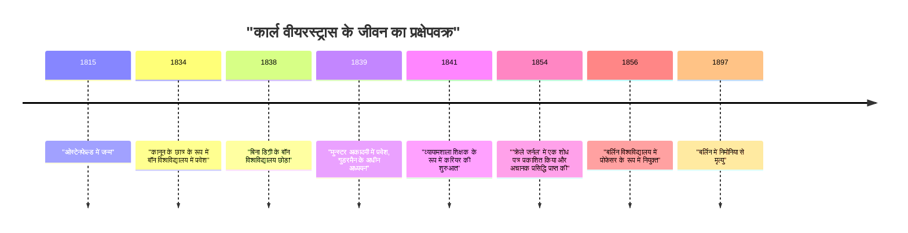
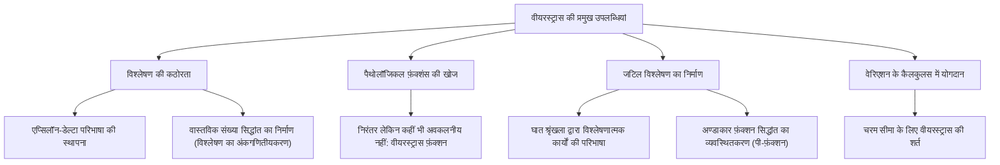

## परिचय

गणित के इतिहास में, कैलकुलस को एक कठोर नींव पर स्थापित करने के लिए सबसे प्रसिद्ध व्यक्ति **[कार्ल वीयरस्ट्रास](https://kenji.blog/hi/p/weierstrass/)** (1815-1897) हैं। उन्हें "आधुनिक विश्लेषण का पिता" कहा जाता है और उन्होंने अवकल और समाकलन गणित (विशेष रूप से $\epsilon-\delta$ परिभाषा) की नींव रखी जिसका अध्ययन हम आज विश्वविद्यालयों में करते हैं। उनकी उपलब्धियां केवल प्रमेयों की खोज से परे हैं; उन्होंने गणित के अनुशासन में ही "कथा" और "सोचने के तरीके" को मौलिक रूप से बदल दिया। इस लेख में, हम उनके उथल-पुथल भरे जीवन के प्रसंगों और गणित में उनकी आश्चर्यजनक उपलब्धियों के बारे में गहराई से जानेंगे।

## ऐतिहासिक संदर्भ: 19वीं सदी की गणितीय दुनिया और विश्लेषण में संकट

[आइजैक न्यूटन](https://kenji.blog/hi/p/newton/) और गॉटफ्रीड विल्हेम लीबनिज़ द्वारा 17वीं शताब्दी में स्थापित कैलकुलस ने [लियोनहार्ड यूलर](https://kenji.blog/hi/p/euler/) और अन्य लोगों के हाथों 18वीं शताब्दी में अभूतपूर्व विकास हासिल किया। जबकि भौतिकी और खगोल विज्ञान में इसके अनुप्रयोगों ने उल्लेखनीय परिणाम दिए, "अनंतसूक्ष्म" (infinitesimals) और "सीमा" (limits) की अंतर्निहित अवधारणाएं अत्यधिक अस्पष्ट रहीं। "एक संख्या जो अनंत रूप से शून्य के करीब पहुंचती है लेकिन शून्य नहीं है" की सहज व्याख्या दार्शनिक आलोचना का लक्ष्य बन गई और इसमें तार्किक कठोरता का अभाव था।

19वीं शताब्दी में प्रवेश करते हुए, ऑगस्टिन-लुई कॉची, बर्नहार्ड बोलजानो और अन्य लोगों ने विश्लेषण को कठोर बनाने के लिए कदम उठाए, लेकिन उनकी परिभाषाएं अभी भी अंतर्ज्ञान को पूरी तरह से समाप्त नहीं कर सकीं। यह वीयरस्ट्रास ही थे जिन्होंने इस स्थिति से बाहर निकलने का ऐतिहासिक मिशन अपने कंधों पर लिया, जिसे "विश्लेषण में संकट" कहा जा सकता है, और ज्यामितीय अंतर्ज्ञान पर भरोसा किए बिना विशुद्ध रूप से अंकगणितीय तरीकों का उपयोग करके विश्लेषण का पुनर्निर्माण किया।

## प्रारंभिक जीवन और निराशाजनक छात्र दिन

[कार्ल वीयरस्ट्रास](https://kenji.blog/hi/p/weierstrass/) का जन्म 31 अक्टूबर, 1815 को प्रुशिया साम्राज्य (वर्तमान जर्मनी) के ओस्टेनफेल्ड में हुआ था। उनके पिता एक सरकारी अधिकारी थे और बहुत सख्त व्यक्ति थे। उनके पिता की तीव्र इच्छा थी कि उनका बेटा उन्हीं की तरह एक उत्कृष्ट प्रुशियन प्रशासक बने, और वीयरस्ट्रास का प्रारंभिक जीवन इन मजबूत उम्मीदों से बंधा हुआ था।

1834 में, अपने पिता की इच्छा का पालन करते हुए, उन्होंने कानून और वित्त का अध्ययन करने के लिए बॉन विश्वविद्यालय में प्रवेश लिया। हालाँकि, उनका दिल कानून या अर्थशास्त्र में नहीं था, बल्कि गणित की ओर बहुत आकर्षित था। नतीजतन, कानून के व्याख्यानों में भाग लेने के बजाय, उन्होंने अपना समय तलवारबाजी और बीयर पीने में बिताया, जिससे उनका छात्र जीवन बहुत ही उन्मुक्त रहा। उसी समय, उन्होंने व्यक्तिगत रूप से गणितीय पुस्तकों (विशेष रूप से पियरे-साइमन लैपलेस, [कार्ल गुस्ताव जैकब जैकोबी](https://kenji.blog/hi/p/jacobi/) और [नील्स हेनरिक एबेल](https://kenji.blog/hi/p/abel/) के कार्यों) का गहन अध्ययन किया और स्वयं को उन्नत गणित सिखाया। अंततः, उन्होंने चार साल बाद बिना डिग्री प्राप्त किए विश्वविद्यालय छोड़ दिया।

यह झटका उनके लिए एक प्रमुख महत्वपूर्ण मोड़ था और इसने उनके पिता को बहुत निराश किया। हालाँकि, इस अवधि के दौरान पैदा हुई स्वतंत्रता और स्व-अध्ययन की भावना का निस्संदेह उनकी बाद की शोध शैली पर बहुत प्रभाव पड़ा।

## एक शिक्षक के रूप में गुमनामी के लंबे वर्ष: एकांत शोध जीवन

विश्वविद्यालय छोड़ने के बाद, वीयरस्ट्रास गणित नहीं छोड़ सके। एक दोस्त की सलाह पर, उन्होंने मुन्स्टर अकादमी (अब मुन्स्टर विश्वविद्यालय) में फिर से प्रवेश लिया। यहाँ, उन्होंने उस समय के एक प्रमुख गणितज्ञ क्रिस्तोफ गुडरमैन के मार्गदर्शन में गणित का अध्ययन किया। गुडरमैन अण्डाकार कार्यों (elliptic functions) के सिद्धांत के विशेषज्ञ थे, और वीयरस्ट्रास उनके प्रति बहुत आकर्षित हुए। गुडरमैन ने वीयरस्ट्रास की असाधारण प्रतिभा को पहचाना और उनकी अत्यधिक प्रशंसा की।

अपना शिक्षण प्रमाण पत्र प्राप्त करने के बाद, वीयरस्ट्रास ने 1841 से शुरू होकर 15 वर्षों तक प्रुशिया के विभिन्न ग्रामीण कस्बों में एक व्यायामशाला (माध्यमिक विद्यालय) के शिक्षक के रूप में काम किया। उनका जीवन किसी भी तरह से विशेषाधिकार प्राप्त नहीं था। ऐसा कहा जाता है कि उन्होंने न केवल गणित बल्कि भौतिकी, वनस्पति विज्ञान, भूगोल, इतिहास और यहां तक कि जिम्नास्टिक और सुलेख (calligraphy) भी पढ़ाया।

शिक्षण के कठोर दैनिक कर्तव्यों में व्यस्त रहने के बावजूद, वह अपने गणितीय शोध को जारी रखने के लिए देर रात तक जागते थे। उन्हें उस समय के शीर्ष गणितज्ञों के साथ बातचीत करने का कोई अवसर नहीं मिला और उन्होंने शायद ही कभी अकादमिक पत्रिकाओं में शोध पत्र प्रस्तुत किए। पूरी तरह से अलग-थलग माहौल में, किसी के भी अनजान, वह शानदार शोध कर रहे थे जिसने खरोंच से विश्लेषण की नींव पर सवाल उठाया। इस अवधि के दौरान अत्यधिक काम करने से उनके स्वास्थ्य पर बुरा असर पड़ा और गंभीर चक्कर आने लगे जो बाद में उन्हें परेशान करते रहे।

## गणितीय दुनिया में शानदार वापसी और गौरव

एक ग्रामीण स्कूल शिक्षक के रूप में गुमनामी की एक लंबी अवधि के बाद, 1854 में वीयरस्ट्रास के लिए एक नाटकीय मोड़ आया। उन्होंने "क्रेले जर्नल" (शुद्ध और अनुप्रयुक्त गणित के लिए पत्रिका) में एबेलियन कार्यों पर एक महत्वपूर्ण शोध पत्र प्रकाशित किया, जो उस समय की सबसे आधिकारिक गणितीय पत्रिका थी।

इस शोध पत्र ने तुरंत पूरे यूरोप के गणितज्ञों का ध्यान आकर्षित किया। उनके शोध ने उन कठिन समस्याओं को शानदार ढंग से हल किया जिनसे उस समय के प्रमुख गणितज्ञ वर्षों से निपट रहे थे, और उनके तरीकों की नवीनता और उनके तर्क की पूर्णता बेजोड़ थी। कोनिग्सबर्ग विश्वविद्यालय ने उनकी उपलब्धियों की मान्यता में उन्हें मानद डॉक्टरेट की उपाधि से सम्मानित किया, और प्रशिया शिक्षा मंत्रालय ने भी उन्हें व्यायामशाला शिक्षक के रूप में उनके कर्तव्यों से मुक्त करने के लिए कदम उठाए।

अंततः, 1856 में, बर्लिन विश्वविद्यालय में एक प्रोफेसर के रूप में उनका स्वागत किया गया। यह 40 वर्ष की आयु से अधिक में एक देर से शुरुआत थी, लेकिन यहाँ से उनकी तीव्र प्रगति शुरू हुई, और वह बर्लिन विश्वविद्यालय को उच्चतम वैश्विक स्तर के गणित के केंद्र में बदल देंगे।

## महान गणितीय उपलब्धियां

वीयरस्ट्रास की उपलब्धियां कई क्षेत्रों में फैली हुई हैं, लेकिन यहाँ हम तीन विशेष रूप से प्रसिद्ध योगदानों के बारे में विस्तार से बताएंगे।

### 1. विश्लेषण की कठोरता (एप्सिलॉन-डेल्टा परिभाषा)

जैसा कि पहले उल्लेख किया गया है, कैलकुलस सहज "अनंतसूक्ष्म" पर निर्भर था। वीयरस्ट्रास ने अस्पष्ट शब्दों को पूरी तरह से समाप्त करते हुए, केवल असमानताओं (inequalities) का उपयोग करके सीमा और निरंतरता की अवधारणाओं को पूरी तरह से तैयार किया। यह **$\epsilon-\delta$ परिभाषा** है, जो आधुनिक गणित की सबसे महत्वपूर्ण नींव है।

एक फलन $f(x)$ का $x = a$ पर निरंतर (continuous) होने की परिभाषा को उनके द्वारा इस प्रकार कठोरता से वर्णित किया गया था:

$$
\forall \epsilon > 0, \exists \delta > 0 \text{ s.t. } \forall x, |x - a| < \delta \implies |f(x) - f(a)| < \epsilon
$$

इस परिभाषा का क्रांतिकारी पहलू यह है कि इसने समय से जुड़ी अवधारणा, "गतिशील परिवर्तन" को "स्थिर तार्किक स्थिति" में बदल दिया। इससे ज्यामितीय अंतर्ज्ञान पर भरोसा किए बिना विशुद्ध रूप से अंकगणितीय तरीकों का उपयोग करके विश्लेषण का निर्माण करना संभव हो गया। उन्होंने वास्तविक संख्याओं की निरंतरता के संबंध में एक कठोर परिभाषा भी दी, विश्लेषण को सफलतापूर्वक एक ठोस तार्किक आधार पर रखा (इसे विश्लेषण का अंकगणितीयकरण कहा जाता है)।

### 2. अंतर्ज्ञान को चुनौती देने वाला प्रति-उदाहरण: वीयरस्ट्रास फ़ंक्शन का झटका

इसके अलावा, उन्होंने एक ऐसा फ़ंक्शन प्रस्तुत किया जिससे गणितीय दुनिया में भारी झटका लगा। यह एक "फ़ंक्शन है जो हर जगह निरंतर है लेकिन कहीं भी अवकलनीय (differentiable) नहीं है।" इसे अब **वीयरस्ट्रास फ़ंक्शन** के रूप में जाना जाता है।

$$
f(x) = \sum_{n=0}^{\infty} a^n \cos(b^n \pi x)
$$
(जहाँ $0 < a < 1$, $b$ एक धनात्मक विषम पूर्णांक है, और $ab > 1 + \frac{3}{2}\pi$)

उस समय, गणितज्ञों के बीच यह सामान्य ज्ञान और अंतर्ज्ञान था कि "एक निरंतर वक्र चिकना होता है, और कुछ अपवाद वाले बिंदुओं को छोड़कर जहां यह नुकीला होता है, कहीं भी एक स्पर्शरेखा खींची जा सकती है (यह अवकलनीय है)।" हालांकि, इस फ़ंक्शन को प्रस्तुत करके, वीयरस्ट्रास ने दिखाया कि एक ऐसा वक्र मौजूद है जो असीम रूप से दांतेदार है और कभी भी चिकना नहीं होता है, चाहे उसे कितना भी बड़ा किया जाए।

इस खोज ने गणितज्ञों को दर्दनाक रूप से महसूस कराया कि ज्यामितीय अंतर्ज्ञान कितना अविश्वसनीय हो सकता है, और कठोर तर्क द्वारा प्रमाण कितने महत्वपूर्ण थे। इस फ़ंक्शन को, जिसे बाद की भग्न ज्यामिति (fractal geometry) का अग्रदूत माना जा सकता है, गणित के इतिहास में सबसे महत्वपूर्ण प्रति-उदाहरणों (counterexamples) में से एक माना जाता है।

### 3. जटिल विश्लेषण का निर्माण और अण्डाकार कार्य सिद्धांत

वीयरस्ट्रास ने जटिल कार्यों के सिद्धांत में भी निर्णायक भूमिका निभाई। जबकि कॉची और रीमैन ने ज्यामितीय अंतर्ज्ञान और एकीकरण पर जोर दिया, वीयरस्ट्रास ने "घात श्रृंखला" (power series) के आधार पर एक बीजगणितीय दृष्टिकोण अपनाया। उन्होंने विश्लेषणात्मक निरंतरता (analytic continuation) की अवधारणा का उपयोग करके जटिल कार्यों को कठोरता से परिभाषित किया और आधुनिक जटिल विश्लेषण के मानक तरीके स्थापित किए।

उन्होंने अण्डाकार फ़ंक्शन सिद्धांत और एबेलियन फ़ंक्शन सिद्धांत के क्षेत्रों में एक अत्यंत सुंदर प्रणाली भी बनाई। वीयरस्ट्रास का $\wp$ फ़ंक्शन (p-फ़ंक्शन) आज भी अण्डाकार कार्यों को संभालने में सबसे मौलिक फ़ंक्शन के रूप में व्यापक रूप से उपयोग किया जाता है।

## एक महान शिक्षक के रूप में उनका सच्चा चेहरा

बर्लिन विश्वविद्यालय में, वीयरस्ट्रास न केवल एक शोधकर्ता थे, बल्कि एक असाधारण रूप से उत्कृष्ट शिक्षक भी थे। उनके व्याख्यान बहुत स्पष्ट थे, बिना किसी तार्किक छलांग के, कदम दर कदम सच्चाई के करीब पहुंचते थे। उनके व्याख्यान के नोट्स छात्रों के बीच प्रसारित होते थे और पूरे यूरोप के विश्वविद्यालयों में पाठ्यपुस्तकों की तरह उपयोग किए जाते थे।

उनकी प्रसिद्धि सुनकर पूरे यूरोप से उत्कृष्ट छात्र उनके पास जमा हो गए। उनके शिष्यों और उनसे प्रभावित गणितज्ञों में [जॉर्ज कैंटर](https://kenji.blog/hi/p/cantor/) (सेट थ्योरी के संस्थापक), फेलिक्स क्लेन, फर्डिनेंड जॉर्ज फ्रोबेनियस, हरमन श्वार्ज़ और कई अन्य दिग्गज शामिल हैं जिन्होंने बाद में गणित के इतिहास में अपना नाम छोड़ा।

### सोफिया कोवालेव्स्काया के साथ गुरुत्वाकर्षण और स्नेह

एक शिक्षक के रूप में वीयरस्ट्रास के पहलू के बारे में बात करते समय अपरिहार्य बात रूस की एक महिला गणितज्ञ **सोफिया कोवालेव्स्काया** के साथ का प्रसंग है।

19वीं सदी के अंत में यूरोप में, महिलाओं के लिए विश्वविद्यालयों में प्रवेश करना और औपचारिक शिक्षा प्राप्त करना लगभग अमान्य था। कोवालेव्स्काया बर्लिन विश्वविद्यालय में अध्ययन करना चाहती थीं, लेकिन विश्वविद्यालय ने उनके अनुरोध को अस्वीकार कर दिया। हालांकि, वीयरस्ट्रास ने तुरंत उनकी असाधारण गणितीय प्रतिभा को पहचान लिया और विश्वविद्यालय के नियमों से बंधे बिना, उन्हें मुफ्त में व्यक्तिगत मार्गदर्शन देने का फैसला किया।

वीयरस्ट्रास के समर्पित मार्गदर्शन के तहत, कोवालेव्स्काया ने आंशिक अवकल समीकरणों और आकाशीय यांत्रिकी में शानदार परिणाम प्राप्त किए, बाद में एक आधुनिक विश्वविद्यालय (स्टॉकहोम विश्वविद्यालय) में पूर्ण प्रोफेसर के रूप में नियुक्त होने वाली पहली महिला बनीं। वीयरस्ट्रास उन्हें केवल एक छात्र के रूप में नहीं बल्कि अपने सबसे करीबी दोस्तों में से एक के रूप में गहराई से प्यार करते थे। दोनों के बीच आदान-प्रदान किए गए बड़ी संख्या में पत्र उनके मजबूत बंधन और गहरे सम्मान को व्यक्त करते हैं। जब कोवालेव्स्काया की 41 वर्ष की कम उम्र में बीमारी से मृत्यु हो गई, तो वीयरस्ट्रास का दुख अथाह था।

## बाद के वर्ष और विरासत

अपने बाद के वर्षों में, वीयरस्ट्रास ने अपने सहयोगी और पूर्व छात्र लियोपोल्ड क्रोनकर के साथ गणित की नींव पर एक भयंकर विवाद का अनुभव किया। क्रोनकर ने कहा, "भगवान ने पूर्णांक बनाए, बाकी सब मनुष्य का काम है," और एक अंतर्ज्ञानवादी दृष्टिकोण से वीयरस्ट्रास के विश्लेषण और कैंटर के सेट सिद्धांत की कड़ी आलोचना की। इस संघर्ष ने वीयरस्ट्रास के दिल को गहराई से घायल कर दिया।

उनका स्वास्थ्य भी धीरे-धीरे बिगड़ गया, और अपने बाद के वर्षों में, उन्हें चक्कर आने और ब्रोंकाइटिस से पीड़ित होना पड़ा, जिससे उन्हें व्हीलचेयर पर रहने के लिए मजबूर होना पड़ा। फिर भी, उन्होंने अंत तक गणित के प्रति अपना जुनून नहीं खोया, और अपने शिष्यों की मदद से अपने स्वयं के एकत्रित कार्यों को संकलित करने पर काम किया।

19 फरवरी, 1897 को 81 वर्ष की आयु में बर्लिन में निमोनिया से [कार्ल वीयरस्ट्रास](https://kenji.blog/hi/p/weierstrass/) का निधन हो गया।

## निष्कर्ष

अपने कठोर तर्क और अदम्य भावना के माध्यम से, [कार्ल वीयरस्ट्रास](https://kenji.blog/hi/p/weierstrass/) ने गणित को कुछ अधिक ठोस और सुंदर रूप में विकसित किया। एक ग्रामीण शिक्षक के रूप में युवा झटकों और गुमनामी के एक लंबे, अकेले दौर पर काबू पाकर अंततः दुनिया के शीर्ष पर पहुंचना, उनका जीवन आधुनिक युग में रहने वाले हम लोगों को अपार साहस देता है।

उनके द्वारा निर्मित "कठोरता" की ठोस नींव के बिना, आधुनिक उन्नत गणित, भौतिकी और इंजीनियरिंग का विकास असंभव होता। उनके द्वारा छोड़ी गई उपलब्धियां आधुनिक गणित में फीकी पड़े बिना शानदार ढंग से चमकती रहती हैं, और यही कारण है कि उन्हें "आधुनिक विश्लेषण का पिता" कहा जाता है। वीयरस्ट्रास का नाम हमेशा के लिए एक महान प्रतीक के रूप में पारित किया जाएगा जो यह साबित करता है कि गणित तर्क की एक कला है।
