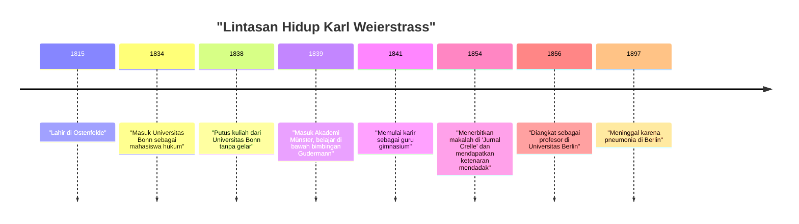
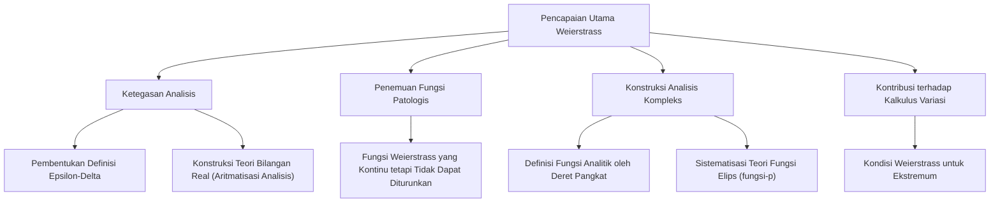

## Pengantar

Dalam sejarah matematika, orang yang paling terkenal karena membangun kalkulus di atas fondasi yang ketat adalah **[Karl Weierstrass](https://kenji.blog/p/weierstrass/)** (1815–1897). Ia dipuji sebagai "bapak analisis modern" dan membangun dasar-dasar kalkulus diferensial dan integral (terutama definisi $\epsilon-\delta$) yang kita pelajari di universitas saat ini. Pencapaiannya lebih dari sekadar menemukan teorema; ia secara mendasar mengubah "naratif" dan "cara berpikir" dalam disiplin matematika itu sendiri. Dalam artikel ini, kita akan menggali lebih dalam episode-episode kehidupannya yang penuh gejolak dan pencapaiannya yang menakjubkan dalam matematika.

## Konteks Sejarah: Dunia Matematika Abad ke-19 dan Krisis dalam Analisis

Kalkulus, yang didirikan pada abad ke-17 oleh [Isaac Newton](https://kenji.blog/p/newton/) dan Gottfried Wilhelm Leibniz, mencapai perkembangan fenomenal sepanjang abad ke-18 di tangan [Leonhard Euler](https://kenji.blog/p/euler/) dan lainnya. Sementara penerapannya dalam fisika dan astronomi membuahkan hasil yang luar biasa, konsep-konsep yang mendasarinya tentang "infinitesimal" dan "limit" tetap sangat ambigu. Penjelasan intuitif tentang "angka yang mendekati nol tak terhingga tetapi bukan nol" menjadi sasaran kritik filosofis dan tidak memiliki ketegasan logis.

Memasuki abad ke-19, [Augustin-Louis Cauchy](https://kenji.blog/p/cauchy/), Bernhard Bolzano, dan lainnya mulai memperketat analisis, tetapi definisi mereka masih belum dapat sepenuhnya menghilangkan intuisi. Weierstrass-lah yang mengambil misi bersejarah untuk menerobos situasi ini, yang bisa disebut "krisis dalam analisis," dan membangun kembali analisis menggunakan metode murni aritmatika tanpa mengandalkan intuisi geometris.

## Kehidupan Awal dan Masa Mahasiswa yang Membuat Frustrasi

[Karl Weierstrass](https://kenji.blog/p/weierstrass/) lahir pada 31 Oktober 1815, di Ostenfelde, Kerajaan Prusia (sekarang Jerman). Ayahnya adalah seorang pejabat pemerintah dan seorang pria yang sangat tegas. Ayahnya sangat mendambakan putranya menjadi administrator Prusia yang luar biasa seperti dirinya, dan kehidupan awal Weierstrass terikat oleh harapan-harapan kuat ini.

Pada tahun 1834, mengikuti keinginan ayahnya, ia masuk Universitas Bonn untuk belajar hukum dan keuangan. Namun, hatinya tidak berada pada hukum atau ekonomi, melainkan sangat tertarik pada matematika. Akibatnya, alih-alih menghadiri kuliah hukum, ia menghabiskan waktunya dengan anggar dan minum bir, menjalani kehidupan mahasiswa yang bebas. Pada saat yang sama, ia secara pribadi melahap buku-buku matematika (terutama karya-karya Pierre-Simon Laplace, [Carl Gustav Jacob Jacobi](https://kenji.blog/p/jacobi/), dan [Niels Henrik Abel](https://kenji.blog/p/abel/)) dan belajar matematika tingkat lanjut secara otodidak. Pada akhirnya, ia putus kuliah empat tahun kemudian tanpa mendapatkan gelar.

Kemunduran ini merupakan titik balik besar baginya dan sangat mengecewakan ayahnya. Namun, semangat kemandirian dan belajar otodidak yang dibudayakan selama periode ini tidak diragukan lagi memberikan pengaruh besar pada gaya penelitiannya di kemudian hari.

## Tahun-tahun Panjang dalam Keterasingan sebagai Guru: Kehidupan Penelitian yang Sepi

Setelah putus dari universitas, Weierstrass tidak bisa menyerah pada matematika. Atas saran seorang teman, ia mendaftar kembali di Akademi Münster (sekarang Universitas Münster). Di sini, ia belajar matematika di bawah bimbingan Christoph Gudermann, seorang matematikawan terkemuka pada masa itu. Gudermann adalah seorang ahli dalam teori fungsi elips, dan Weierstrass menjadi terpesona olehnya. Gudermann mengenali bakat luar biasa Weierstrass dan sangat memujinya.

Setelah mendapatkan sertifikat mengajarnya, Weierstrass bekerja sebagai guru gimnasium (sekolah menengah) di berbagai kota pedesaan di Prusia selama 15 tahun mulai tahun 1841. Kehidupannya sama sekali tidak istimewa. Dikatakan bahwa ia tidak hanya mengajar matematika tetapi juga fisika, botani, geografi, sejarah, dan bahkan senam dan kaligrafi.

Meskipun sibuk dengan tugas mengajar harian yang berat, ia begadang hingga larut malam untuk melanjutkan penelitian matematikanya. Ia tidak memiliki kesempatan untuk berinteraksi dengan matematikawan mutakhir pada masa itu dan jarang mengirimkan makalah ke jurnal akademik. Di lingkungan yang benar-benar terisolasi, tanpa diketahui siapa pun, ia melakukan penelitian luar biasa yang mempertanyakan dasar-dasar analisis dari bawah ke atas. Terlalu banyak bekerja selama periode ini merusak kesehatannya dan menyebabkan serangan pusing parah yang nantinya akan mengganggunya.

## Kembalinya yang Spektakuler ke Dunia Matematika dan Kejayaan

Setelah sekian lama tidak dikenal sebagai guru sekolah pedesaan, titik balik dramatis datang bagi Weierstrass pada tahun 1854. Ia menerbitkan makalah terobosan tentang fungsi Abelian di "Jurnal Crelle" (Jurnal untuk Matematika Murni dan Terapan), jurnal matematika paling otoritatif pada saat itu.

Makalah ini segera menarik perhatian para matematikawan di seluruh Eropa. Penelitiannya secara brilian memecahkan masalah sulit yang telah diselesaikan oleh para matematikawan terkemuka saat itu selama bertahun-tahun, dan kebaruan metodenya serta kesempurnaan logikanya tak tertandingi. Universitas Königsberg memberinya gelar doktor kehormatan sebagai pengakuan atas pencapaiannya, dan Kementerian Pendidikan Prusia juga mengambil langkah-langkah untuk membebaskannya dari tugasnya sebagai guru gimnasium.

Akhirnya, pada tahun 1856, ia disambut sebagai profesor di Universitas Berlin. Ini adalah debut yang terlambat di usia lebih dari 40 tahun, tetapi dari sinilah kemajuan pesatnya dimulai, dan ia akan mengangkat Universitas Berlin menjadi pusat matematika berstandar global tertinggi.

## Pencapaian Matematika Hebat

Pencapaian Weierstrass mencakup berbagai bidang, tetapi di sini kita akan menjelaskan secara rinci tiga kontribusi yang sangat terkenal.

### 1. Ketegasan Analisis (Definisi Epsilon-Delta)

Seperti yang disebutkan sebelumnya, kalkulus bergantung pada "infinitesimal" yang intuitif. Weierstrass sepenuhnya merumuskan konsep batas dan kontinuitas dengan hanya menggunakan pertidaksamaan, sepenuhnya menghilangkan kata-kata ambigu. Ini adalah **definisi $\epsilon-\delta$**, fondasi paling penting dalam matematika modern.

Definisi fungsi $f(x)$ yang kontinu pada $x = a$ dideskripsikan secara ketat olehnya sebagai berikut:

$$
\forall \epsilon > 0, \exists \delta > 0 \text{ s.t. } \forall x, |x - a| < \delta \implies |f(x) - f(a)| < \epsilon
$$

Aspek revolusioner dari definisi ini adalah mengubah konsep yang melibatkan waktu, "perubahan dinamis," menjadi "keadaan logis statis." Ini memungkinkan untuk membangun analisis menggunakan metode murni aritmatika tanpa mengandalkan intuisi geometris. Ia juga memberikan definisi yang ketat mengenai kesinambungan bilangan real, berhasil menempatkan analisis pada dasar logis yang kuat (ini disebut aritmatisasi analisis).

### 2. Contoh Tandingan yang Menentang Intuisi: Kejutan dari Fungsi Weierstrass

Selain itu, ia menyajikan satu fungsi yang menyebabkan kejutan besar di dunia matematika. Itu adalah "fungsi yang kontinu di mana-mana tetapi tidak dapat diturunkan di mana pun." Ini sekarang dikenal sebagai **fungsi Weierstrass**.

$$
f(x) = \sum_{n=0}^{\infty} a^n \cos(b^n \pi x)
$$
(di mana $0 < a < 1$, $b$ adalah bilangan bulat ganjil positif, dan $ab > 1 + \frac{3}{2}\pi$)

Pada saat itu, merupakan akal sehat dan intuisi di kalangan matematikawan bahwa "kurva kontinu itu halus, dan kecuali beberapa titik luar biasa yang tajam, garis singgung dapat ditarik di mana saja (dapat diturunkan)." Namun, dengan menghadirkan fungsi ini, Weierstrass menunjukkan bahwa ada kurva yang bergerigi tak terhingga dan tidak pernah menjadi halus tidak peduli seberapa banyak ia diperbesar.

Penemuan ini membuat matematikawan sadar dengan menyakitkan betapa tidak dapat diandalkannya intuisi geometris, dan betapa pentingnya bukti dengan logika yang ketat. Fungsi ini, yang dapat dilihat sebagai cikal bakal geometri fraktal di kemudian hari, dianggap sebagai salah satu contoh tandingan paling penting dalam sejarah matematika.

### 3. Konstruksi Analisis Kompleks dan Teori Fungsi Elips

Weierstrass juga memainkan peran yang menentukan dalam teori fungsi kompleks. Sementara Cauchy dan Riemann menekankan intuisi dan integrasi geometris, Weierstrass mengadopsi pendekatan aljabar berdasarkan "deret pangkat". Ia secara ketat mendefinisikan fungsi kompleks menggunakan konsep kelanjutan analitik dan menetapkan metode standar analisis kompleks modern.

Ia juga membangun sistem yang sangat indah di bidang teori fungsi elips dan teori fungsi Abelian. Fungsi $\wp$ (p-function) Weierstrass masih banyak digunakan saat ini sebagai fungsi paling mendasar dalam menangani fungsi elips.

## Wajah Aslinya sebagai Pendidik yang Hebat

Di Universitas Berlin, Weierstrass tidak hanya seorang peneliti tetapi juga seorang pendidik yang luar biasa. Kuliahnya sangat jelas, tanpa lompatan logika apa pun, dengan mantap mendekati kebenaran selangkah demi selangkah. Catatan kuliahnya beredar di kalangan mahasiswa dan diperlakukan seperti buku teks di universitas-universitas di seluruh Eropa.

Mendengar ketenarannya, siswa-siswa berprestasi dari seluruh Eropa berkumpul di sekelilingnya. Murid-muridnya dan matematikawan yang dipengaruhi olehnya termasuk [Georg Cantor](https://kenji.blog/p/cantor/) (pendiri teori himpunan), Felix Klein, Ferdinand Georg Frobenius, Hermann Schwarz, dan banyak raksasa lain yang kemudian meninggalkan nama mereka dalam sejarah matematika.

### Bimbingan dan Kasih Sayang dengan Sofia Kovalevskaya

Sangat penting ketika berbicara tentang aspek Weierstrass sebagai seorang pendidik adalah episode dengan **Sofia Kovalevskaya**, seorang matematikawan wanita dari Rusia.

Di Eropa akhir abad ke-19, hampir tidak diakui bagi perempuan untuk masuk universitas dan menerima pendidikan formal. Kovalevskaya ingin belajar di Universitas Berlin, tetapi universitas menolak permintaannya untuk mengaudit kelas. Namun, Weierstrass segera menyadari bakat matematikanya yang luar biasa dan, tanpa terikat oleh peraturan universitas, memutuskan untuk memberinya bimbingan pribadi secara gratis.

Di bawah bimbingan Weierstrass yang berdedikasi, Kovalevskaya mencapai hasil yang luar biasa dalam persamaan diferensial parsial dan mekanika benda langit, yang kemudian menjadi wanita pertama yang diangkat sebagai profesor penuh di universitas modern (Universitas Stockholm). Weierstrass sangat mencintainya bukan hanya sebagai murid tetapi sebagai salah satu teman terdekatnya. Sejumlah besar surat yang dipertukarkan di antara keduanya menyampaikan ikatan kuat dan rasa hormat mereka yang dalam. Ketika Kovalevskaya meninggal karena penyakit di usia muda 41 tahun, kesedihan Weierstrass tak terukur.

## Tahun-Tahun Terakhir dan Warisan

Di tahun-tahun terakhirnya, Weierstrass mengalami perselisihan sengit mengenai dasar matematika dengan Leopold Kronecker, seorang kolega dan mantan mahasiswanya. Kronecker menyatakan, "Tuhan menciptakan bilangan bulat, yang lainnya adalah karya manusia," dan mengkritik tajam analisis Weierstrass serta teori himpunan Cantor dari sudut pandang intuisionis. Konflik ini sangat melukai hati Weierstrass.

Kesehatannya juga berangsur-angsur memburuk, dan pada tahun-tahun terakhirnya, ia menderita pusing dan bronkitis, yang memaksanya hidup di kursi roda. Meskipun demikian, ia tidak pernah kehilangan hasratnya terhadap matematika sampai akhir hayatnya, mengerjakan kompilasi karya-karyanya sendiri dengan bantuan murid-muridnya.

Pada 19 Februari 1897, [Karl Weierstrass](https://kenji.blog/p/weierstrass/) meninggal dunia karena pneumonia di Berlin pada usia 81 tahun.

## Kesimpulan

Melalui logikanya yang ketat dan semangatnya yang gigih, [Karl Weierstrass](https://kenji.blog/p/weierstrass/) mengembangkan matematika menjadi sesuatu yang lebih solid dan indah. Mengatasi kemunduran masa muda dan periode isolasi yang panjang sebagai guru pedesaan untuk akhirnya naik ke puncak dunia, hidupnya memberi kita, yang hidup di era modern, keberanian yang luar biasa.

Tanpa landasan "ketegasan" yang kuat yang ia bangun, perkembangan matematika lanjutan, fisika, dan teknik modern akan mustahil terjadi. Pencapaian yang ditinggalkannya terus bersinar cemerlang tanpa memudar dalam matematika modern, dan itulah sebabnya ia dipuji sebagai "bapak analisis modern." Nama Weierstrass akan diwariskan selamanya sebagai simbol kebesaran yang membuktikan bahwa matematika adalah seni logika.
