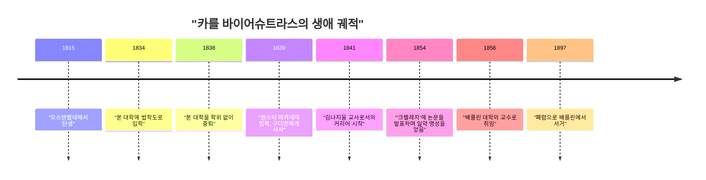
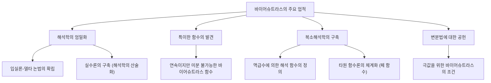

## 머리말

수학의 역사에 있어서, 미적분학을 엄밀한 기초 위에 확립시킨 인물로 가장 유명한 사람이 바로 **카를 바이어슈트라스** (Karl Weierstrass, 1815–1897) 입니다. 그는 "현대 해석학의 아버지"로 불리며, 오늘날 우리가 대학에서 배우는 미적분학의 기초(특히 $\epsilon-\delta$ 논법)를 확립했습니다. 그의 업적은 단순히 정리를 발견한 것에 그치지 않고, 수학이라는 학문 자체의 "서술 방식"과 "사고방식"을 근본적으로 변화시켰다는 점에 있습니다. 본 기사에서는 그의 파란만장한 생애의 에피소드와 수학에서의 놀라운 업적에 대해 깊이 파헤쳐 보겠습니다.

## 시대적 배경: 19세기 수학계와 해석학의 위기

17세기에 아이작 뉴턴과 고트프리트 빌헬름 라이프니츠에 의해 창시된 미적분학은 18세기를 거치며 레온하르트 오일러 등의 손에 의해 경이로운 발전을 이룩했습니다. 물리학과 천문학への 응용은 눈부신 성과를 거두고 있었지만, 그 근저에 있는 "무한소"나 "극한"의 개념은 매우 모호한 상태였습니다. "한없이 0에 가까워지지만 0은 아닌 수"라는 직관적인 설명은 철학적인 비판의 대상이 되었으며, 논리적인 엄밀성이 결여되어 있었습니다.

19세기에 들어서면서 오귀스탱 루이 코시나 베르나르트 볼차노 등이 해석학의 엄밀화에 나섰지만, 그들의 정의 역시 아직 직관을 완전히 배제하지는 못했습니다. 이러한 "해석학의 위기"라고도 할 수 있는 상황을 타파하고, 기하학적인 직관에 의존하지 않고 순수하게 산술적인 기법으로 해석학을 재구축한다는 역사적 사명을 짊어진 사람이 바로 바이어슈트라스였습니다.

## 유년기와 좌절의 학생 시절

카를 바이어슈트라스는 1815년 10월 31일, 프로이센 왕국(현재의 독일)의 오스텐펠데에서 태어났습니다. 아버지는 정부 관리로 매우 엄격한 인물이었습니다. 아버지는 아들 역시 자신처럼 훌륭한 프로이센의 행정관이 되기를 간절히 바랐으며, 바이어슈트라스의 초기 삶은 이러한 아버지의 강한 기대에 얽매여 있었습니다.

1834년, 그는 아버지의 뜻에 따라 본 대학에 입학하여 법학과 재정학을 공부하기 시작했습니다. 하지만 그의 마음은 법학이나 경제학에 있지 않았고 수학에 강하게 끌리고 있었습니다. 결과적으로 그는 법학 강의에 출석하는 대신 펜싱을 하거나 맥주를 마시는 데 시간을 보내며 자유분방한 학생 생활을 보냈습니다. 동시에 개인적으로 수학 서적(특히 피에르시몽 라플라스나 카를 구스타프 야코프 야코비, 닐스 헨리크 아벨의 저작)을 탐독하며 독학으로 고등 수학을 익혀 나갔습니다. 결국 그는 4년 뒤 학위를 얻지 못하고 대학을 중퇴하게 됩니다.

이 좌절은 그에게 큰 전환점이었으며 아버지를 깊이 실망시켰습니다. 그러나 이 시기에 길러진 독립심과 독학의 정신이 이후 그의 연구 스타일에 큰 영향을 미쳤음은 틀림없습니다.

## 교사로서의 긴 무명 시절: 고고한 연구 생활

대학 중퇴 후, 바이어슈트라스는 수학의 길을 포기할 수 없었습니다. 친구의 조언을 얻어 뮌스터 아카데미(현재의 뮌스터 대학)에 다시 입학했습니다. 이곳에서 그는 당시의 저명한 수학자 크리스토프 구더만의 지도 아래 수학을 공부했습니다. 구더만은 타원 함수론의 전문가였고, 바이어슈트라스는 여기서 타원 함수의 매력에 흠뻑 빠지게 됩니다. 구더만은 바이어슈트라스의 비범한 재능을 알아보고 그를 높이 평가했습니다.

교원 자격을 얻은 후, 바이어슈트라스는 1841년부터 15년 동안 프로이센의 여러 시골 마을에서 김나지움(중등 교육 기관)의 교사로 일하기 시작했습니다. 그의 삶은 결코 유복하지 않았습니다. 그는 수학뿐만 아니라 물리학, 식물학, 지리, 역사, 나아가 체조나 서예까지도 가르쳤다고 전해집니다.

매일의 고된 교육 업무에 시달리면서도, 그는 밤늦게까지 깨어 수학 연구를 계속했습니다. 그는 당시 최첨단의 수학자들과 교류할 기회를 갖지 못했고 학술지에 논문을 투고하는 일조차 드물었습니다. 그는 완전히 고립된 환경 속에서 아무도 모르게 해석학의 기초를 근본부터 다시 묻는 장대한 연구를 진행하고 있었던 것입니다. 이 시기의 과로는 그의 건강을 해쳤고, 훗날 그를 괴롭히는 현기증 발작의 원인이 되었습니다.

## 수학계로의 화려한 복귀와 영광

시골 학교 교사로서의 긴 무명 시절을 거쳐, 바이어슈트라스에게 극적인 전환기가 찾아온 것은 1854년이었습니다. 그는 아벨 함수에 관한 획기적인 논문을 당시 가장 권위 있던 수학 잡지인 '크렐레지'(순수 및 응용 수학 잡지)에 발표했습니다.

이 논문은 순식간에 유럽 전역의 수학자들의 이목을 집중시켰습니다. 그의 연구는 당시 저명한 수학자들이 오랜 세월 매달려 온 난제를 훌륭하게 해결한 것이었으며, 그 수법의 참신함과 논리의 완벽함은 타의 추종을 불허하는 것이었습니다. 쾨니히스베르크 대학은 그의 업적을 기려 명예 박사 학위를 수여했고, 프로이센 교육부 역시 그를 김나지움 교사 직무에서 해방시키기 위한 조치를 취했습니다.

그리고 마침내 1856년, 그는 베를린 대학의 교수로 초빙되었습니다. 40세가 넘어서야 이루어진 늦깎이 데뷔였지만, 이때부터 그의 쾌속 진격이 시작되어 베를린 대학을 세계 최고 수준의 수학 중심지로 끌어올리게 됩니다.

## 위대한 수학적 업적

바이어슈트라스의 업적은 다방면에 걸쳐 있지만, 여기서는 특히 유명한 세 가지 공헌에 대해 자세히 설명합니다.

### 1. 해석학의 엄밀화 (입실론-델타 논법)

앞서 언급했듯이, 미적분학은 직관적인 "무한소"에 의존하고 있었습니다. 바이어슈트라스는 극한이나 연속성의 개념을 모호한 단어를 일절 배제하고 부등식만을 사용하여 완전히 정식화했습니다. 이것이 현대 수학에서 가장 중요한 기초인 **$\epsilon-\delta$ 논법** 입니다.

함수 $f(x)$ 가 $x = a$ 에서 연속이라는 것의 정의는 그에 의해 다음과 같이 엄밀하게 기술되었습니다:

$$
\forall \epsilon > 0, \exists \delta > 0 \text{ s.t. } \forall x, |x - a| < \delta \implies |f(x) - f(a)| < \epsilon
$$

이 정의의 획기적인 점은 "동적인 변화"라는 시간을 동반하는 개념을 "정적인 논리 상태"로 변환했다는 것입니다. 이로 인해 기하학적인 직관에 의존하지 않고 순수하게 산술적인 기법으로 해석학을 구축하는 것이 가능해졌습니다. 그는 또한 실수의 연속성에 관해서도 엄밀한 정의를 부여하여, 해석학을 확고한 논리적 기반 위에 올려놓는 데 성공했습니다(이를 해석학의 산술화라고 부릅니다).

### 2. 직관을 깨뜨리는 반례: 바이어슈트라스 함수의 충격

나아가 그는 수학계에 큰 충격을 주는 하나의 함수를 발표했습니다. 그것은 "모든 곳에서 연속이지만 어느 곳에서도 미분 불가능한 함수"입니다. 이것은 현재 **바이어슈트라스 함수** 라고 불립니다.

$$
f(x) = \sum_{n=0}^{\infty} a^n \cos(b^n \pi x)
$$
(단, $0 < a < 1$ 이며, $b$ 는 양의 홀수 정수로 $ab > 1 + \frac{3}{2}\pi$ 를 만족함)

당시 수학자들 사이에서는 "연속인 곡선은 매끄러우며, 뾰족한 소수의 예외점을 제외하면 어디서든 접선을 그을 수 있다(미분 가능하다)"는 것이 상식이자 직관이었습니다. 하지만 바이어슈트라스는 이 함수를 제시함으로써 무한히 미세하게 뾰족뾰족하여 아무리 확대해도 매끄러워지지 않는 곡선이 존재함을 보여주었습니다.

이 발견은 기하학적 직관이 얼마나 믿을 수 없는지, 그리고 엄밀한 논리에 의한 증명이 얼마나 중요한지를 수학자들에게 뼈저리게 느끼게 했습니다. 훗날 프랙탈 기하학의 선구자라고도 할 수 있는 이 함수는 수학의 역사에 있어서 가장 중요한 반례 중 하나로 여겨지고 있습니다.

### 3. 복소해석학과 타원 함수론의 체계화

바이어슈트라스는 복소 함수 이론에서도 결정적인 역할을 했습니다. 코시나 리만이 기하학적 직관과 적분을 중시했던 것에 비해, 바이어슈트라스는 "멱급수"를 기초로 하는 대수적인 접근법을 채택했습니다. 그는 해석적 연속의 개념을 사용하여 복소 함수를 엄밀하게 정의하고, 현대 복소해석학의 표준적인 수법을 확립했습니다.

또한 그는 타원 함수론과 아벨 함수론 분야에서도 지극히 아름다운 체계를 구축했습니다. 바이어슈트라스의 $\wp$ 함수(페 함수)는 타원 함수를 다루는 데 있어 가장 기본적인 함수로서 현재까지도 널리 쓰이고 있습니다.

## 위대한 교육자로서의 맨얼굴

베를린 대학에서의 바이어슈트라스는 연구자로서뿐만 아니라 대단히 뛰어난 교육자이기도 했습니다. 그의 강의는 매우 명쾌했고 논리의 비약이 일절 없었으며, 한 걸음 한 걸음 착실하게 진리를 향해 다가가는 것이었습니다. 그의 강의 노트는 학생들 사이에서 돌아다녔고, 유럽 전역의 대학에서 교과서처럼 취급되었습니다.

그의 명성을 듣고 유럽 각지에서 우수한 학생들이 그의 곁으로 모여들었습니다. 그의 제자나 영향을 받은 수학자로는 집합론의 창시자인 게오르크 칸토어, 펠릭스 클라인, 페르디난트 게오르크 프로베니우스, 헤르만 슈바르츠 등 훗날 수학사에 이름을 남기는 거성들이 수없이 많습니다.

### 소피아 코발레프스카야와의 사제애

바이어슈트라스의 교육자로서의 측면을 말하는 데 있어 빼놓을 수 없는 것이 러시아 출신의 여성 수학자 **소피아 코발레프스카야** 와의 에피소드입니다.

19세기 후반의 유럽에서는 여성이 대학에 입학하여 정식 교육을 받는 것이 거의 인정되지 않았습니다. 코발레프스카야는 베를린 대학에서 공부하기를 희망했지만, 대학 측은 그녀의 청강을 거부했습니다. 그러나 바이어슈트라스는 그녀의 비범한 수학적 재능을 단번에 알아보고 대학의 규정에 얽매이지 않고 무상으로 개인 지도를 할 것을 결심했습니다.

바이어슈트라스의 헌신적인 지도 아래, 코발레프스카야는 편미분 방정식과 천체 역학에서 훌륭한 성과를 올렸고 훗날 여성 최초로 근대적인 대학의 정교수(스톡홀름 대학)에 취임하게 됩니다. 바이어슈트라스는 그녀를 단순한 제자로서가 아니라 가장 친한 친구 중 한 명으로서 깊이 아꼈으며, 두 사람 사이에 오간 방대한 편지는 그들의 강한 유대와 깊은 존경심을 전해줍니다. 코발레프스카야가 41세의 젊은 나이로 병사했을 때, 바이어슈트라스의 슬픔은 헤아릴 수 없는 것이었습니다.

## 말년과 유산

말년의 바이어슈트라스는 동료이자 옛 제자이기도 했던 레오폴트 크로네커와 수학의 기초를 둘러싼 격렬한 논쟁을 겪었습니다. 크로네커는 "신은 정수를 창조하셨고, 그 외의 모든 것은 인간이 만든 것이다"라고 말하며 직관주의적인 입장에서 바이어슈트라스의 해석학과 칸토어의 집합론을 엄하게 비판했습니다. 이 대립은 바이어슈트라스의 마음에 깊은 상처를 남겼습니다.

건강 상태도 점차 악화되어, 말년에는 현기증과 기관지염에 시달리며 휠체어 생활을 해야만 했습니다. 그럼에도 그는 제자들의 도움을 받아 자신의 저작집 편찬에 몰두하는 등 끝까지 수학에 대한 열정을 잃지 않았습니다.

1897년 2월 19일, 카를 바이어슈트라스는 폐렴으로 인해 베를린에서 81세를 일기로 세상을 떠났습니다.

## 맺음말

카를 바이어슈트라스는 그 엄격한 논리와 불굴의 정신으로 수학을 보다 견고하고 아름다운 것으로 진화시켰습니다. 젊은 시절의 좌절이나 시골 교사로서의 길고 고독한 무명 시절을 이겨내고 마침내 세계의 정상에 올라선 그의 삶은 현대 시대를 살아가는 우리에게도 커다란 용기를 줍니다.

그가 쌓아 올린 "엄밀성"이라는 확고한 토대가 없었다면, 현대의 고도화된 수학이나 물리학, 그리고 공학의 발전은 있을 수 없었습니다. 그가 남긴 업적은 현대의 수학에서도 퇴색되지 않고 찬란하게 빛나고 있으며, 그가 "현대 해석학의 아버지"라고 칭송받는 이유는 바로 거기에 있습니다. 바이어슈트라스의 이름은 수학이 논리의 예술임을 증명한 위대한 상징으로서 영원히 이야기될 것입니다.
