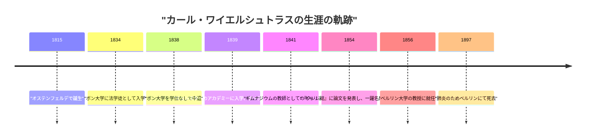
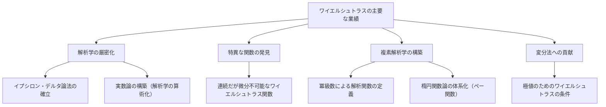

## はじめに

数学の歴史において、微積分学を厳密な基礎の上に立脚させた人物として最も名高いのが、 **カール・ワイエルシュトラス** (Karl Weierstrass, 1815–1897) です。彼は「現代解析学の父」と称され、今日私たちが大学で学ぶ微分積分の基礎（とくに $\epsilon-\delta$ 論法）を確立しました。彼の業績は単に定理を発見したことに留まらず、数学という学問そのものの「語り口」や「考え方」を根底から変革した点にあります。本記事では、彼の波乱に満ちた生涯のエピソードと、数学における驚異的な業績について深く掘り下げていきます。

## 時代背景：19世紀の数学界と解析学の危機

17世紀にアイザック・ニュートンとゴットフリート・ライプニッツによって創始された微積分学は、18世紀を通じてレオンハルト・オイラーらの手により驚異的な発展を遂げました。物理学や天文学への応用は目覚ましい成果を上げていましたが、その根底にある「無限小」や「極限」の概念は非常に曖昧なままでした。「限りなくゼロに近づくがゼロではない数」という直感的な説明は、哲学的な批判の的となっており、論理的な厳密性に欠けていたのです。

19世紀に入り、オーギュスタン＝ルイ・コーシーやベルンハルト・ボルツァーノらが解析学の厳密化に乗り出しましたが、彼らの定義もまだ完全に直感を排除しきれていませんでした。こうした「解析学の危機」とも言える状況を打破し、幾何学的な直感に頼らず純粋に算術的な手法で解析学を再構築するという歴史的使命を背負ったのが、ワイエルシュトラスでした。

## 幼少期と挫折の学生時代

カール・ワイエルシュトラスは1815年10月31日、プロイセン王国（現在のドイツ）のオステンフェルデで生まれました。父親は政府の役人で、非常に厳格な人物でした。父親は息子にも自身と同じようにプロイセンの優秀な行政官になってほしいと強く望んでおり、ワイエルシュトラスの人生の初期はこの父親の強い期待に縛られることになります。

1834年、彼は父親の希望に従い、ボン大学に入学して法学と財政学を学び始めました。しかし、彼の心は法律や経済にはなく、数学に強く惹かれていました。結果として、彼は法学の講義に出席する代わりにフェンシングやビールを飲むことに時間を費やし、自由奔放な学生生活を送りました。同時に、個人的に数学書（特にピエール＝シモン・ラプラスやカール・グスタフ・ヤコブ・ヤコビ、ニールス・アーベルの著作）を読み漁り、独学で高度な数学を習得していきました。結局、4年後に学位を取得することなく大学を中退することになります。

この挫折は彼にとって大きな転機であり、父親を深く失望させました。しかし、この時期に培われた独立心と独学の精神が、後の彼の研究スタイルに大きな影響を与えたことは間違いありません。

## 教師としての長い下積み時代：孤高の研究生活

大学中退後、ワイエルシュトラスは数学の道を諦めきれず、友人の助言もあってミュンスターのアカデミー（現在のミュンスター大学）に入学し直しました。ここで彼は、当時の著名な数学者クリストフ・グーデルマンの指導の下で数学を学びました。グーデルマンは楕円関数論の専門家であり、ワイエルシュトラスはここで楕円関数の魅力に取り憑かれます。グーデルマンはワイエルシュトラスの並外れた才能を見抜き、彼を高く評価しました。

教員資格を得た後、ワイエルシュトラスは1841年から15年間にわたり、プロイセンの様々な田舎町でギムナジウム（中等教育機関）の教師として働き始めました。彼の生活は決して恵まれたものではありませんでした。彼は数学だけでなく、物理学、植物学、地理、歴史、さらには体操や習字までも教えていたと言われています。

日々の過酷な教育業務に追われながらも、彼は夜遅くまで起きて数学の研究を続けました。彼は当時の最先端の数学者たちと交流する機会を持たず、学術雑誌に論文を投稿することすら稀でした。彼は完全に孤立した環境の中で、誰にも知られることなく、解析学の基礎を根本から問い直す壮大な研究を進めていたのです。この時期の過労は彼の健康を蝕み、後に彼を苦しめるめまいや発作の原因となりました。

## 数学界への華麗なる復帰と栄光

田舎の学校教師としての長い下積み時代を経て、ワイエルシュトラスに劇的な転機が訪れたのは1854年のことでした。彼はアーベル関数に関する画期的な論文を、当時最も権威のあった数学雑誌である『クレレ誌』（純粋・応用数学雑誌）に発表しました。

この論文は瞬く間にヨーロッパ中の数学者の注目を集めました。彼の研究は、当時の著名な数学者たちが長年取り組んできた難問を見事に解決するものであり、その手法の斬新さと論理の完璧さは他の追随を許さないものでした。ケーニヒスベルク大学は彼の業績を讃えて名誉博士号を授与し、プロイセン教育省も彼をギムナジウムの教師から解放するための措置を取りました。

そしてついに1856年、彼はベルリン大学の教授として迎えられました。40歳を過ぎてからの遅咲きのデビューでしたが、ここから彼の快進撃が始まり、ベルリン大学を世界最高峰の数学の中心地へと押し上げていくことになります。

## 偉大なる数学的業績

ワイエルシュトラスの業績は多岐にわたりますが、ここでは特に有名な三つの貢献について詳しく解説します。

### 1. 解析学の厳密化（イプシロン・デルタ論法）

前述の通り、微積分学は直感的な「無限小」に依存していました。ワイエルシュトラスは、極限や連続性の概念を、曖昧な言葉を一切排除し、不等式のみを用いて完全に定式化しました。これが現代の数学において最も重要な基礎である **$\epsilon-\delta$ 論法** です。

関数 $f(x)$ が $x = a$ で連続であることの定義は、彼によって次のように厳密に記述されました。

$$
\forall \epsilon > 0, \exists \delta > 0 \text{ s.t. } \forall x, |x - a| < \delta \implies |f(x) - f(a)| < \epsilon
$$

この定義の画期的な点は、「動的な変化」という時間を伴う概念を、「静的な論理状態」へと変換したことです。これにより、幾何学的な直感に頼らずに、純粋に算術的な手法で解析学を構築することが可能になりました。彼はまた、実数の連続性に関しても厳密な定義を与え、解析学を確固たる論理的基盤の上に置くことに成功しました（これを解析学の算術化と呼びます）。

### 2. 直感を打ち破る反例：ワイエルシュトラス関数の衝撃

さらに彼は、数学界に大きな衝撃を与える一つの関数を発表しました。それは、「至る所で連続であるが、どこにおいても微分不可能な関数」です。これは現在 **ワイエルシュトラス関数** と呼ばれています。

$$
f(x) = \sum_{n=0}^{\infty} a^n \cos(b^n \pi x)
$$
（ただし、$0 < a < 1$、$b$ は正の奇数の整数で、$ab > 1 + \frac{3}{2}\pi$ を満たす）

当時、「連続な曲線は滑らかであり、尖っているような少数の例外点を除けば、どこでも接線を引くことができる（微分可能である）」というのが、数学者たちの間の常識であり直感でした。しかし、ワイエルシュトラスはこの関数を提示することで、無限に細かくギザギザしていて、どんなに拡大しても滑らかにならない曲線が存在することを示したのです。

この発見は、幾何学的な直感がいかに当てにならないか、そして厳密な論理による証明がいかに重要であるかを数学者たちに痛感させました。後のフラクタル幾何学の先駆けとも言えるこの関数は、数学の歴史において最も重要な反例の一つとされています。

### 3. 複素解析学と楕円関数論の体系化

ワイエルシュトラスは、複素関数の理論においても決定的な役割を果たしました。コーシーやリーマンが幾何学的な直感や積分を重視したのに対し、ワイエルシュトラスは「冪級数（べききゅうすう）」を基礎とする代数的なアプローチを採用しました。彼は、解析接続の概念を用いて複素関数を厳密に定義し、現代の複素解析学の標準的な手法を確立しました。

また、彼は楕円関数論やアーベル関数論の分野でも、極めて美しい体系を構築しました。ワイエルシュトラスの $\wp$ 関数（ペー関数）は、楕円関数を扱う上で最も基本的な関数として、現在でも広く用いられています。

## 偉大なる教育者としての素顔

ベルリン大学でのワイエルシュトラスは、研究者としてだけでなく、並外れて優れた教育者でもありました。彼の講義は非常に明快で、論理の飛躍が一切なく、一歩一歩着実に真理へと近づいていくものでした。彼の講義ノートは学生たちの間で出回り、ヨーロッパ中の大学で教科書のように扱われました。

彼の名声を聞きつけ、ヨーロッパ各地から優秀な学生たちが彼の元へと集まりました。彼の教え子や影響を受けた数学者には、集合論の創始者であるゲオルク・カントール、フェリックス・クライン、フェルディナント・ゲオルク・フロベニウス、ヘルマン・シュヴァルツなど、後に数学史に名を残す巨星たちが数多くいます。

### ソフィア・コワレフスカヤとの師弟愛

ワイエルシュトラスの教育者としての側面を語る上で欠かせないのが、ロシア出身の女性数学者 **ソフィア・コワレフスカヤ** とのエピソードです。

19世紀後半のヨーロッパでは、女性が大学に入学して正式な教育を受けることはほとんど認められていませんでした。コワレフスカヤはベルリン大学で学ぶことを希望しましたが、大学側は彼女の聴講を拒否しました。しかし、ワイエルシュトラスは彼女の非凡な数学的才能をすぐに見抜き、大学の規定にとらわれることなく、無償で個人的な指導を行うことを決意しました。

ワイエルシュトラスの献身的な指導の下、コワレフスカヤは偏微分方程式や天体力学において素晴らしい成果を上げ、後に女性として初めて近代的な大学の正教授（ストックホルム大学）に就任することになります。ワイエルシュトラスは彼女を単なる生徒としてだけでなく、最も親しい友人の一人として深く愛し、二人の間で交わされた膨大な手紙は、彼らの強い絆と深い尊敬の念を伝えています。コワレフスカヤが41歳の若さで病死した時、ワイエルシュトラスの悲しみは計り知れないものでした。

## 晩年と遺産

晩年のワイエルシュトラスは、同僚でありかつての教え子でもあったレオポルド・クロネッカーとの間に、数学の基礎を巡る激しい論争を経験しました。クロネッカーは「神は整数を創り給うた。それ以外は人間の手によるものである」と述べ、直観主義的な立場からワイエルシュトラスの解析学やカントールの集合論を厳しく批判しました。この対立は、ワイエルシュトラスの心を深く傷つけました。

健康状態も次第に悪化し、晩年はめまいや気管支炎に悩まされ、車椅子での生活を余儀なくされました。それでも彼は、教え子たちの助けを借りて自らの著作集の編纂に取り組むなど、最後まで数学への情熱を失うことはありませんでした。

1897年2月19日、カール・ワイエルシュトラスは肺炎のためベルリンにて81歳でこの世を去りました。

## まとめ

カール・ワイエルシュトラスは、その厳格な論理と不屈の精神により、数学をより強固で美しいものへと進化させました。若き日の挫折や、田舎の教師としての長い孤独な下積み時代を乗り越え、やがて世界のトップへと上り詰めた彼の人生は、現代を生きる私たちにも大いなる勇気を与えてくれます。

彼が築き上げた「厳密性」という強固な土台がなければ、現代の高度な数学や物理学、そして工学の発展はあり得ませんでした。彼の遺した業績は、現代の数学においても色褪せることなく燦然と輝き続けており、彼が「現代解析学の父」と称賛される理由はまさにそこにあります。ワイエルシュトラスの名前は、数学が論理の芸術であることを証明した偉大な象徴として、永遠に語り継がれることでしょう。
