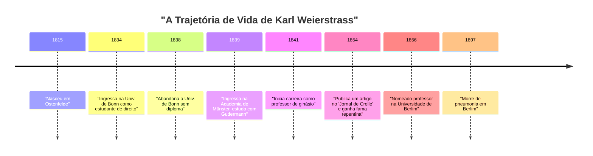
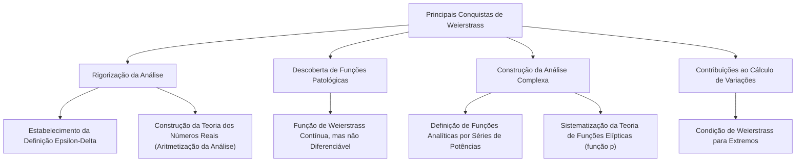

## Introdução

Na história da matemática, a pessoa mais famosa por ter estabelecido o cálculo sobre bases rigorosas é **[Karl Weierstrass](https://kenji.blog/pt/p/weierstrass/)** (1815-1897). Ele é aclamado como o "pai da análise moderna" e estabeleceu os fundamentos do cálculo diferencial e integral (especialmente a definição $\epsilon-\delta$) que estudamos hoje nas universidades. Suas conquistas vão além da mera descoberta de teoremas; ele transformou fundamentalmente a "narrativa" e a "forma de pensar" na própria disciplina da matemática. Neste artigo, vamos nos aprofundar nos episódios de sua vida turbulenta e em suas conquistas surpreendentes na matemática.

## Contexto Histórico: O Mundo Matemático do Século XIX e a Crise na Análise

O cálculo, fundado no século XVII por [Isaac Newton](https://kenji.blog/pt/p/newton/) e Gottfried Wilhelm Leibniz, alcançou um desenvolvimento fenomenal ao longo do século XVIII nas mãos de [Leonhard Euler](https://kenji.blog/pt/p/euler/) e outros. Embora suas aplicações na física e astronomia tenham rendido resultados notáveis, os conceitos subjacentes de "infinitesimais" e "limites" permaneceram altamente ambíguos. A explicação intuitiva de "um número que se aproxima infinitamente de zero, mas não é zero" tornou-se alvo de críticas filosóficas e carecia de rigor lógico.

No início do século XIX, [Augustin-Louis Cauchy](https://kenji.blog/pt/p/cauchy/), Bernhard Bolzano e outros começaram a rigorizar a análise, mas suas definições ainda não conseguiam eliminar completamente a intuição. Foi Weierstrass quem assumiu a missão histórica de romper essa situação, que poderia ser chamada de "crise na análise", e de reconstruir a análise usando métodos puramente aritméticos, sem depender da intuição geométrica.

## Início da Vida e Tempos de Estudante Frustrantes

[Karl Weierstrass](https://kenji.blog/pt/p/weierstrass/) nasceu em 31 de outubro de 1815, em Ostenfelde, Reino da Prússia (atual Alemanha). Seu pai era um funcionário do governo e um homem muito rigoroso. Seu pai desejava muito que seu filho se tornasse um excelente administrador prussiano como ele, e o início da vida de Weierstrass foi condicionado por essas fortes expectativas.

Em 1834, seguindo a vontade de seu pai, ingressou na Universidade de Bonn para estudar direito e finanças. No entanto, seu coração não estava no direito ou na economia, mas sim fortemente atraído pela matemática. Como resultado, em vez de assistir às aulas de direito, passava seu tempo praticando esgrima e bebendo cerveja, levando uma vida de estudante despreocupada. Ao mesmo tempo, ele devorava secretamente livros de matemática (especialmente as obras de Pierre-Simon Laplace, [Carl Gustav Jacob Jacobi](https://kenji.blog/pt/p/jacobi/) e [Niels Henrik Abel](https://kenji.blog/pt/p/abel/)) e aprendeu matemática avançada sozinho. Por fim, ele abandonou a universidade quatro anos depois, sem obter um diploma.

Este revés foi um grande ponto de virada para ele e decepcionou profundamente seu pai. No entanto, o espírito de independência e autoestudo cultivado durante este período teve, sem dúvida, grande influência em seu estilo de pesquisa posterior.

## Longos Anos de Obscuridade como Professor: Vida de Pesquisa Solitária

Depois de abandonar a universidade, Weierstrass não conseguiu desistir da matemática. Seguindo o conselho de um amigo, ele ingressou novamente na Academia de Münster (hoje Universidade de Münster). Lá, ele estudou matemática sob a orientação de Christoph Gudermann, um proeminente matemático da época. Gudermann era um especialista na teoria das funções elípticas, e Weierstrass ficou fascinado por elas. Gudermann reconheceu o talento extraordinário de Weierstrass e o elogiou muito.

Após obter seu certificado de ensino, Weierstrass trabalhou como professor de ginásio (escola secundária) em várias cidades rurais da Prússia por 15 anos, a partir de 1841. Sua vida não era de forma alguma privilegiada. Diz-se que ele ensinava não apenas matemática, mas também física, botânica, geografia, história e até mesmo ginástica e caligrafia.

Apesar de estar ocupado com árduas tarefas diárias de ensino, ele ficava acordado até tarde da noite para continuar suas pesquisas matemáticas. Ele não tinha oportunidades de interagir com matemáticos de ponta da época e raramente submetia artigos a revistas acadêmicas. Em um ambiente completamente isolado, sem que ninguém soubesse, ele estava conduzindo pesquisas magníficas que questionavam os fundamentos da análise desde a base. O excesso de trabalho durante este período minou a sua saúde e causou as graves tonturas que mais tarde o afligiriam.

## Retorno Espetacular ao Mundo da Matemática e à Glória

Após um longo período de obscuridade como professor de uma escola rural, um momento dramático de virada aconteceu para Weierstrass em 1854. Ele publicou um artigo inovador sobre funções abelianas no "Jornal de Crelle" (Jornal de Matemática Pura e Aplicada), a revista matemática mais respeitada da época.

Este artigo atraiu imediatamente a atenção de matemáticos em toda a Europa. Sua pesquisa resolveu de forma brilhante problemas difíceis que os matemáticos proeminentes da época vinham enfrentando há anos, e a novidade de seus métodos e a perfeição de sua lógica eram incomparáveis. A Universidade de Königsberg concedeu-lhe um doutorado honorário em reconhecimento por suas realizações, e o Ministério da Educação da Prússia também tomou medidas para dispensá-lo de seus deveres como professor de ginásio.

Finalmente, em 1856, foi recebido como professor na Universidade de Berlim. Foi uma estreia tardia aos mais de 40 anos, mas a partir daí começou a sua rápida ascensão, e ele elevaria a Universidade de Berlim ao centro da matemática do mais alto nível mundial.

## Grandes Conquistas Matemáticas

As conquistas de Weierstrass abrangem uma ampla gama de áreas, mas aqui explicaremos em detalhes três contribuições particularmente famosas.

### 1. Rigorização da Análise (Definição Epsilon-Delta)

Como mencionado anteriormente, o cálculo baseava-se em "infinitesimais" intuitivos. Weierstrass formulou completamente os conceitos de limites e continuidade usando apenas desigualdades, eliminando totalmente palavras ambíguas. Esta é a **definição $\epsilon-\delta$**, a base mais importante da matemática moderna.

A definição de uma função $f(x)$ ser contínua em $x = a$ foi rigorosamente descrita por ele da seguinte forma:

$$
\forall \epsilon > 0, \exists \delta > 0 \text{ t.q. } \forall x, |x - a| < \delta \implies |f(x) - f(a)| < \epsilon
$$

O aspecto revolucionário dessa definição é que ela transformou o conceito que envolvia tempo, "mudança dinâmica", num "estado lógico estático". Isso tornou possível construir a análise usando métodos puramente aritméticos, sem depender da intuição geométrica. Ele também deu uma definição rigorosa sobre a continuidade dos números reais, colocando a análise com sucesso em uma base lógica sólida (isso é chamado de aritmetização da análise).

### 2. Um Contraexemplo Desafiando a Intuição: O Choque da Função de Weierstrass

Além disso, ele apresentou uma função que causou um choque massivo no mundo matemático. Trata-se de uma "função que é contínua em todos os lugares, mas diferenciável em nenhum". Hoje, ela é conhecida como a **função de Weierstrass**.

$$
f(x) = \sum_{n=0}^{\infty} a^n \cos(b^n \pi x)
$$
(onde $0 < a < 1$, $b$ é um número inteiro ímpar positivo, e $ab > 1 + \frac{3}{2}\pi$)

Naquela época, era senso comum e intuitivo entre os matemáticos que "uma curva contínua é suave e, exceto por alguns pontos excepcionais onde é aguda, uma linha tangente pode ser desenhada em qualquer lugar (é diferenciável)". No entanto, ao apresentar esta função, Weierstrass mostrou que existe uma curva infinitamente irregular e que nunca se torna suave, não importa o quanto seja ampliada.

Esta descoberta fez com que os matemáticos percebessem dolorosamente o quão não confiável a intuição geométrica poderia ser, e quão importantes eram as provas por lógica rigorosa. Esta função, que pode ser vista como precursora da geometria fractal posterior, é considerada um dos contraexemplos mais importantes na história da matemática.

### 3. Construção da Análise Complexa e Teoria das Funções Elípticas

Weierstrass também teve um papel decisivo na teoria das funções complexas. Enquanto Cauchy e Riemann enfatizavam a intuição geométrica e a integração, Weierstrass adotou uma abordagem algébrica baseada em "séries de potências". Ele definiu rigorosamente as funções complexas usando o conceito de continuação analítica e estabeleceu os métodos padrão da análise complexa moderna.

Ele também construiu um sistema extremamente belo nas áreas da teoria das funções elípticas e da teoria das funções abelianas. A função $\wp$ de Weierstrass (função p) ainda é amplamente usada hoje como a função mais fundamental no tratamento de funções elípticas.

## O Seu Verdadeiro Rosto como um Grande Educador

Na Universidade de Berlim, Weierstrass não foi apenas um pesquisador, mas também um educador excepcionalmente notável. As suas palestras eram muito claras, sem saltos lógicos, aproximando-se da verdade passo a passo. As suas anotações de aulas circularam entre os alunos e foram tratadas como livros nas universidades de toda a Europa.

Ao saberem da sua fama, excelentes estudantes de toda a Europa reuniram-se ao seu redor. Seus discípulos e matemáticos influenciados por ele incluem [Georg Cantor](https://kenji.blog/pt/p/cantor/) (fundador da teoria dos conjuntos), Felix Klein, Ferdinand Georg Frobenius, Hermann Schwarz e muitos outros gigantes que mais tarde deixaram os seus nomes na história da matemática.

### Tutoria e Afeto com Sofia Kovalevskaya

Indispensável quando se fala da faceta de Weierstrass como educador é o episódio com **Sofia Kovalevskaya**, uma matemática da Rússia.

Na Europa do final do século XIX, era quase irreconhecível que as mulheres ingressassem nas universidades e recebessem educação formal. Kovalevskaya desejava estudar na Universidade de Berlim, mas a universidade recusou seu pedido como ouvinte. No entanto, Weierstrass reconheceu imediatamente o seu extraordinário talento matemático e, desvinculado dos regulamentos da universidade, decidiu orientá-la pessoalmente de forma gratuita.

Sob a orientação dedicada de Weierstrass, Kovalevskaya obteve resultados magníficos em equações diferenciais parciais e mecânica celeste, tornando-se mais tarde a primeira mulher a ser nomeada professora catedrática numa universidade moderna (Universidade de Estocolmo). Weierstrass a amava profundamente, não apenas como estudante, mas como uma de suas amigas mais próximas. O grande número de cartas trocadas entre os dois demonstra o seu forte vínculo e profundo respeito. Quando Kovalevskaya morreu devido a doença na tenra idade de 41 anos, a tristeza de Weierstrass foi imensurável.

## Últimos Anos e Legado

Nos seus últimos anos, Weierstrass viveu uma disputa acirrada sobre os fundamentos da matemática com Leopold Kronecker, um colega e ex-aluno. Kronecker afirmou: "Deus fez os números inteiros, tudo o resto é obra do homem", e criticou severamente a análise de Weierstrass e a teoria dos conjuntos de Cantor de um ponto de vista intuicionista. Esse conflito feriu profundamente o coração de Weierstrass.

Sua saúde também piorou gradualmente e, nos seus últimos anos, sofreu de tonturas e bronquite, sendo forçado a viver numa cadeira de rodas. No entanto, ele nunca perdeu a paixão pela matemática até ao fim, trabalhando na compilação de suas próprias obras completas com a ajuda dos seus discípulos.

Em 19 de fevereiro de 1897, [Karl Weierstrass](https://kenji.blog/pt/p/weierstrass/) faleceu de pneumonia em Berlim, aos 81 anos.

## Conclusão

Através de sua lógica rigorosa e do seu espírito indomável, [Karl Weierstrass](https://kenji.blog/pt/p/weierstrass/) fez a matemática evoluir para algo mais sólido e belo. Superando os contratempos da juventude e um longo e solitário período de obscuridade como professor rural, para finalmente chegar ao topo do mundo, a sua vida dá imensa coragem a nós que vivemos na era moderna.

Sem a base sólida de "rigor" que ele construiu, o desenvolvimento da matemática avançada, física e engenharia modernas teria sido impossível. As conquistas que ele deixou continuam a brilhar intensamente, sem desaparecer, na matemática moderna, e é exatamente por isso que ele é elogiado como o "pai da análise moderna". O nome de Weierstrass será transmitido para sempre como um grande símbolo, provando que a matemática é uma arte da lógica.
