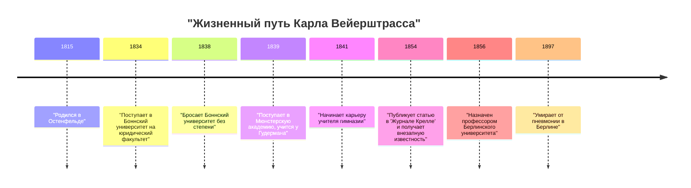
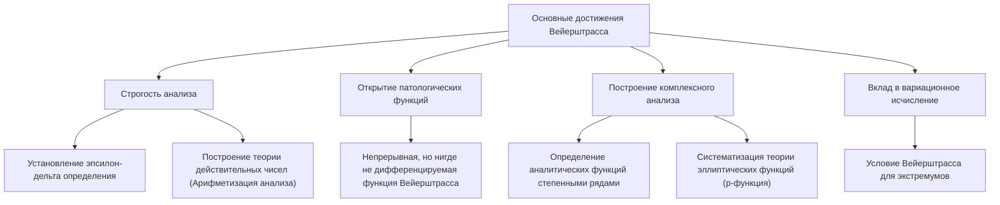

## Введение

В истории математики человеком, наиболее известным тем, что он подвел под математический анализ строгую основу, является **[Карл Вейерштрасс](https://kenji.blog/ru/p/weierstrass/)** (1815–1897). Его называют «отцом современного анализа» и именно он заложил основы дифференциального и интегрального исчисления (в частности, $\epsilon-\delta$ определение), которые мы сегодня изучаем в университетах. Его достижения выходят за рамки простого открытия теорем; он фундаментально изменил «повествование» и «образ мышления» в самой математической дисциплине. В этой статье мы подробно остановимся на эпизодах его бурной жизни и его удивительных достижениях в математике.

## Исторический контекст: Математический мир 19 века и кризис в анализе

Математический анализ, основанный в 17 веке Исааком Ньютоном и Готфридом Вильгельмом Лейбницем, добился феноменального развития на протяжении 18 века в трудах Леонарда Эйлера и других. Хотя его применение в физике и астрономии дало замечательные результаты, основополагающие понятия «бесконечно малых» и «пределов» оставались весьма двусмысленными. Интуитивное объяснение «числа, которое бесконечно близко приближается к нулю, но не является нулем» стало объектом философской критики и было лишено логической строгости.

В начале 19 века Огюстен-Луи Коши, Бернард Больцано и другие задались целью придать анализу строгость, но их определения всё еще не могли полностью исключить интуицию. Именно Вейерштрасс взял на себя историческую миссию преодоления этой ситуации, которую можно назвать «кризисом в анализе», и перестройки анализа с использованием чисто арифметических методов, без опоры на геометрическую интуицию.

## Ранние годы и разочаровывающие студенческие дни

[Карл Вейерштрасс](https://kenji.blog/ru/p/weierstrass/) родился 31 октября 1815 года в Остенфельде, Королевство Пруссия (ныне Германия). Его отец был правительственным чиновником и очень строгим человеком. Он очень хотел, чтобы сын стал отличным прусским администратором, как и он сам, и ранняя жизнь Вейерштрасса была скована этими высокими ожиданиями.

В 1834 году, следуя воле отца, он поступил в Боннский университет, чтобы изучать право и финансы. Однако его сердце не лежало к праву или экономике, его сильно тянуло к математике. В результате вместо посещения лекций по праву он проводил время, фехтуя и распивая пиво, ведя вольную студенческую жизнь. В то же время он самостоятельно запоем читал математические книги (особенно труды Пьера Симона Лапласа, Карла Густава Якоба Якоби и Нильса Хенрика Абеля) и самостоятельно изучал высшую математику. В конце концов, через четыре года он бросил университет, не получив степени.

Эта неудача стала для него важным поворотным моментом и глубоко разочаровала его отца. Однако дух независимости и самообразования, взращенный в этот период, несомненно, оказал огромное влияние на его более поздний стиль исследований.

## Долгие годы безвестности в качестве учителя: Одинокая исследовательская жизнь

Бросив университет, Вейерштрасс не смог отказаться от математики. По совету друга он вновь поступил в Мюнстерскую академию (ныне Мюнстерский университет). Здесь он изучал математику под руководством Христофора Гудермана, выдающегося математика того времени. Гудерман был экспертом в теории эллиптических функций, и Вейерштрасс был ими очарован. Гудерман признал выдающийся талант Вейерштрасса и высоко отзывался о нем.

Получив сертификат преподавателя, Вейерштрасс с 1841 года в течение 15 лет работал учителем гимназии (средней школы) в различных провинциальных городах Пруссии. Его жизнь была отнюдь не привилегированной. Говорят, что он преподавал не только математику, но и физику, ботанику, географию, историю и даже гимнастику и каллиграфию.

Несмотря на загруженность тяжелыми повседневными обязанностями преподавателя, он засиживался до поздней ночи, продолжая свои математические исследования. У него не было возможности общаться с ведущими математиками того времени, и он редко отправлял статьи в академические журналы. В полностью изолированной обстановке, никому не известный, он проводил великолепные исследования, которые ставили под сомнение самые основы анализа. Переутомление в этот период подорвало его здоровье и стало причиной сильных головокружений, которые мучили его позже.

## Захватывающее возвращение в математический мир и слава

После длительного периода безвестности в качестве сельского школьного учителя в 1854 году для Вейерштрасса наступил драматический переломный момент. Он опубликовал новаторскую статью об абелевых функциях в «Журнале Крелле» (Журнал чистой и прикладной математики), самом авторитетном математическом журнале того времени.

Эта статья сразу же привлекла внимание математиков всей Европы. В его исследовании блестяще решались сложные задачи, над которыми выдающиеся математики того времени бились годами, а новизна его методов и совершенство логики не имели себе равных. Кёнигсбергский университет присудил ему почетную докторскую степень в знак признания его заслуг, а Министерство образования Пруссии также предприняло шаги, чтобы освободить его от обязанностей учителя гимназии.

Наконец, в 1856 году он был принят профессором в Берлинский университет. Это был поздний дебют, когда ему было за 40, но с этого момента начался его стремительный взлет, и он превратил Берлинский университет в центр математики высочайшего мирового уровня.

## Великие математические достижения

Достижения Вейерштрасса охватывают широкий спектр областей, но здесь мы подробно остановимся на трех наиболее известных его вкладах.

### 1. Строгость анализа (Эпсилон-дельта определение)

Как упоминалось ранее, исчисление опиралось на интуитивные «бесконечно малые». Вейерштрасс полностью сформулировал концепции пределов и непрерывности, используя исключительно неравенства, полностью исключив двусмысленные слова. Это **$\epsilon-\delta$ определение**, важнейшая основа современной математики.

Определение непрерывности функции $f(x)$ в точке $x = a$ было им строго описано следующим образом:

$$
\forall \epsilon > 0, \exists \delta > 0 \text{ t.q. } \forall x, |x - a| < \delta \implies |f(x) - f(a)| < \epsilon
$$
(Примечание: в русском тексте здесь обычно пишут "такое что", но в математической записи сохранена структура).

Революционность этого определения заключается в том, что оно преобразовало концепцию, связанную со временем, «динамическое изменение», в «статическое логическое состояние». Это сделало возможным построение анализа чисто арифметическими методами без опоры на геометрическую интуицию. Он также дал строгое определение непрерывности действительных чисел, успешно подведя под анализ прочную логическую базу (это называется арифметизацией анализа).

### 2. Контрпример, бросающий вызов интуиции: Шок от функции Вейерштрасса

Кроме того, он представил одну функцию, которая вызвала огромный шок в математическом мире. Это «функция, которая непрерывна везде, но нигде не дифференцируема». В настоящее время она известна как **функция Вейерштрасса**.

$$
f(x) = \sum_{n=0}^{\infty} a^n \cos(b^n \pi x)
$$
(где $0 < a < 1$, $b$ — положительное нечетное целое число, и $ab > 1 + \frac{3}{2}\pi$)

В то время среди математиков считалось здравым смыслом и было интуитивно понятно, что «непрерывная кривая является гладкой, и за исключением нескольких особых точек, где она острая, касательную можно провести где угодно (она дифференцируема)». Однако, представив эту функцию, Вейерштрасс показал, что существует кривая, которая бесконечно зазубрена и никогда не становится гладкой, независимо от того, насколько она увеличена.

Это открытие заставило математиков с болью осознать, насколько ненадежной может быть геометрическая интуиция, и насколько важны доказательства с помощью строгой логики. Эта функция, которую можно рассматривать как предшественницу более поздней фрактальной геометрии, считается одним из самых важных контрпримеров в истории математики.

### 3. Построение комплексного анализа и теории эллиптических функций

Вейерштрасс также сыграл решающую роль в теории комплексных функций. В то время как Коши и Риман подчеркивали геометрическую интуицию и интегрирование, Вейерштрасс принял алгебраический подход, основанный на «степенных рядах». Он строго определил комплексные функции, используя концепцию аналитического продолжения, и установил стандартные методы современного комплексного анализа.

Он также построил чрезвычайно красивую систему в области теории эллиптических функций и теории абелевых функций. Функция $\wp$ Вейерштрасса (p-функция) до сих пор широко используется как наиболее фундаментальная функция при работе с эллиптическими функциями.

## Его истинное лицо как великого педагога

В Берлинском университете Вейерштрасс был не только исследователем, но и исключительно выдающимся педагогом. Его лекции были очень ясными, без логических скачков, шаг за шагом неуклонно приближаясь к истине. Его конспекты лекций распространялись среди студентов и служили учебниками в университетах по всей Европе.

Услышав о его славе, вокруг него собрались отличные студенты со всей Европы. Среди его учеников и математиков, на которых он оказал влияние, — [Георг Кантор](https://kenji.blog/ru/p/cantor/) (основатель теории множеств), Феликс Клейн, Фердинанд Георг Фробениус, Герман Шварц и многие другие гиганты, чьи имена впоследствии вошли в историю математики.

### Наставничество и привязанность к Софье Ковалевской

Обязательным при разговоре о роли Вейерштрасса как педагога является эпизод с **Софьей Ковалевской**, женщиной-математиком из России.

В Европе конца 19 века было почти немыслимо, чтобы женщины поступали в университеты и получали формальное образование. Ковалевская хотела учиться в Берлинском университете, но университет отклонил ее просьбу о посещении лекций. Однако Вейерштрасс сразу же разглядел в ней необычайный математический талант и, не связанный правилами университета, решил давать ей личные уроки бесплатно.

Под самоотверженным руководством Вейерштрасса Ковалевская достигла великолепных результатов в уравнениях в частных производных и небесной механике, став впоследствии первой женщиной, назначенной полноправным профессором в современном университете (Стокгольмский университет). Вейерштрасс глубоко любил ее не просто как ученицу, а как одного из своих самых близких друзей. Огромное количество писем, которыми они обменивались, говорит о их сильной связи и глубоком уважении. Когда Ковалевская умерла от болезни в раннем возрасте 41 года, горе Вейерштрасса было безмерным.

## Последние годы и наследие

В свои последние годы Вейерштрасс пережил ожесточенный спор об основаниях математики с Леопольдом Кронекером, коллегой и бывшим учеником. Кронекер заявлял: «Бог создал целые числа, всё остальное — дело рук человека», и резко критиковал анализ Вейерштрасса и теорию множеств Кантора с интуиционистской точки зрения. Этот конфликт глубоко ранил сердце Вейерштрасса.

Его здоровье также постепенно ухудшалось, и в последние годы жизни он страдал от головокружений и бронхита, что заставило его жить в инвалидном кресле. Тем не менее, он до самого конца не терял страсти к математике, работая над составлением собственного собрания сочинений с помощью своих учеников.

19 февраля 1897 года [Карл Вейерштрасс](https://kenji.blog/ru/p/weierstrass/) скончался от пневмонии в Берлине в возрасте 81 года.

## Заключение

Благодаря своей строгой логике и неукротимому духу [Карл Вейерштрасс](https://kenji.blog/ru/p/weierstrass/) превратил математику в нечто более прочное и прекрасное. Преодолев неудачи юности и долгий, одинокий период безвестности в качестве сельского учителя, чтобы в итоге подняться на вершину мира, его жизнь дает огромную смелость тем из нас, кто живет в современную эпоху.

Без прочного фундамента «строгости», который он построил, развитие современной высшей математики, физики и инженерии было бы невозможным. Оставленные им достижения продолжают ярко сиять в современной математике, не тускнея со временем, и именно поэтому его восхваляют как «отца современного анализа». Имя Вейерштрасса навсегда останется великим символом, доказывающим, что математика — это искусство логики.
