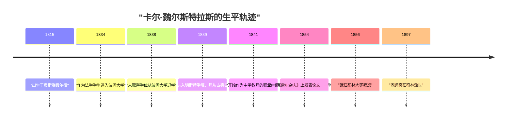
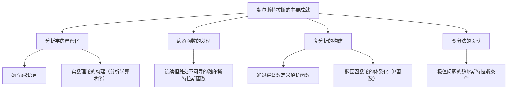

## 引言

在数学的历史长河中，将微积分学建立在严密基础之上的最著名的人物莫过于 **[卡尔·魏尔斯特拉斯](https://kenji.blog/zh-cn/p/weierstrass/)** ([Karl Weierstrass](https://kenji.blog/zh-cn/p/weierstrass/), 1815–1897) 了。他被誉为“现代分析之父”，确立了今天我们在大学里学习的微积分的基础（特别是 $\epsilon-\delta$ 语言）。他的成就不仅限于发现定理，更在于他从根本上改变了数学这门学科的“表达方式”与“思维方式”。在本文中，我们将深入探讨他波澜壮阔的一生以及他在数学领域的惊人成就。

## 时代背景：19世纪的数学界与分析学的危机

由[艾萨克·牛顿](https://kenji.blog/zh-cn/p/newton/)和戈特弗里德·威廉·莱布尼茨在17世纪创立的微积分学，在18世纪经过[莱昂哈德·欧拉](https://kenji.blog/zh-cn/p/euler/)等人的努力，取得了惊人的发展。尽管它在物理学和天文学的应用上成果斐然，但其根基中的“无穷小”与“极限”概念却依然十分模糊。“无限趋近于零但又不是零的数”这种直观的解释，成为了哲学批判的靶子，缺乏逻辑上的严密性。

进入19世纪，[奥古斯丁-路易·柯西](https://kenji.blog/zh-cn/p/cauchy/)和伯纳德·波尔查诺等人开始致力于分析学的严密化，但他们的定义仍未完全摆脱直觉的阴影。打破这种可以说是“分析学危机”的局面，不依赖几何直觉而纯粹用算术方法重构分析学——肩负起这一历史使命的人，正是魏尔斯特拉斯。

## 幼年时期与充满挫折的学生时代

[卡尔·魏尔斯特拉斯](https://kenji.blog/zh-cn/p/weierstrass/)于1815年10月31日出生在普鲁士王国（现德国）的奥斯滕费尔德。他的父亲是一名政府官员，为人非常严厉。父亲强烈希望儿子也能像自己一样成为一名优秀的普鲁士行政官员，而魏尔斯特拉斯早年的生活便被父亲这种强烈的期望所束缚。

1834年，他遵从父亲的意愿，进入波恩大学学习法学和财政学。然而，他的心思完全不在法律或经济上，而是被数学深深吸引。结果，他非但没有去听法学课，反而把时间都花在了击剑和喝啤酒上，过着放荡不羁的学生生活。与此同时，他私下里贪婪地阅读数学书籍（尤其是皮埃尔-西蒙·拉普拉斯、[卡尔·古斯塔夫·雅各布·雅可比](https://kenji.blog/zh-cn/p/jacobi/)以及尼尔斯·亨利克·阿贝尔的著作），自学了高等数学。最终，四年后他没能取得学位便从大学退学了。

这次挫折是他人生中的一个重大转折点，也让他的父亲深感失望。然而，这段时期培养出的独立思考与自学精神，无疑对他后来的研究风格产生了巨大影响。

## 作为教师的漫长蛰伏期：孤高的研究生活

大学辍学后，魏尔斯特拉斯始终无法放弃对数学的追求。在朋友的建议下，他重新进入明斯特学院（现明斯特大学）就读。在这里，他师从当时著名的数学家克里斯托夫·古德曼学习数学。古德曼是椭圆函数论的专家，魏尔斯特拉斯在此深深迷上了椭圆函数。古德曼也看出了魏尔斯特拉斯非凡的才华，对他给予了极高的评价。

取得教师资格后，魏尔斯特拉斯从1841年起，在普鲁士的各个乡镇中学（Gymnasium）当了长达15年的教师。他的生活条件并不优越。据说他不仅要教数学，还要教物理、植物学、地理、历史，甚至还要教体操和书法。

尽管每天被繁重的教学任务所累，他依然坚持熬夜进行数学研究。他没有机会与当时最前沿的数学家们交流，甚至极少向学术期刊投稿。在一个完全与世隔绝的环境中，在无人知晓的情况下，他正在进行着从根本上重新审视分析学基础的宏大研究。这一时期的过度劳累损害了他的健康，也成为了日后折磨他的严重眩晕症的病因。

## 华丽回归数学界与无上荣耀

经历了作为乡村中学教师的漫长蛰伏期后，魏尔斯特拉斯在1854年迎来了戏剧性的转机。他在当时最具权威的数学杂志《克雷尔杂志》（纯粹与应用数学杂志）上发表了一篇关于阿贝尔函数的划时代论文。

这篇论文瞬间吸引了全欧洲数学家的目光。他的研究完美地解决了一直以来困扰众多著名数学家多年的难题，其手法的创新性与逻辑的完美性无人能及。哥尼斯堡大学为表彰他的成就，授予他名誉博士学位；普鲁士教育部也采取措施，将他从中学教师的繁重职务中解脱出来。

终于在1856年，他被聘请为柏林大学的教授。尽管这是一次年过四十的大器晚成的登场，但从此他开始了势不可挡的征程，并将柏林大学推向了世界最高水平数学中心的位置。

## 伟大的数学成就

魏尔斯特拉斯的成就涵盖了多个领域，这里我们将重点详细解说其中最著名的三项贡献。

### 1. 分析学的严密化（ε-δ语言）

如前所述，早期的微积分学依赖于直观的“无穷小”。魏尔斯特拉斯将极限和连续性的概念，完全排除了模糊的日常用语，仅用不等式进行了彻底的形式化。这便是现代数学中最重要的基础—— **$\epsilon-\delta$ 语言**。

他将函数 $f(x)$ 在 $x = a$ 处连续的定义，严密地描述如下：

$$
\forall \epsilon > 0, \exists \delta > 0 \text{ s.t. } \forall x, |x - a| < \delta \implies |f(x) - f(a)| < \epsilon
$$

这个定义的划时代之处在于，它将伴随时间的“动态变化”概念，转换成了“静态的逻辑状态”。这就使得我们能够不依赖几何直觉，纯粹用算术方法来构建分析学成为可能。他还对实数的连续性给出了严密的定义，成功地将分析学置于坚实的逻辑基础之上（这被称为分析学的算术化）。

### 2. 打破直觉的反例：魏尔斯特拉斯函数的冲击

此外，他还发表了一个给数学界带来巨大冲击的函数。这是一个“处处连续但处处不可导的函数”。现在它被称为 **魏尔斯特拉斯函数**。

$$
f(x) = \sum_{n=0}^{\infty} a^n \cos(b^n \pi x)
$$
（其中 $0 < a < 1$，$b$ 是正奇数，且满足 $ab > 1 + \frac{3}{2}\pi$）

在当时，数学家们的常识与直觉是：“连续的曲线必定是光滑的，除了一些尖锐的例外点外，任何地方都可以画出切线（即处处可导）”。然而，魏尔斯特拉斯通过提出这个函数证明了：存在一种无限锯齿状、无论怎么放大都不会变得光滑的曲线。

这一发现让数学家们痛切地认识到，几何直觉是多么的靠不住，而基于严密逻辑的证明又是何等的重要。这个函数也可以看作是后来分形几何学的先驱，被认为是数学史上最重要的反例之一。

### 3. 复分析与椭圆函数论的体系化

魏尔斯特拉斯在复变函数理论中也发挥了决定性的作用。与柯西和黎曼重视几何直觉和积分不同，魏尔斯特拉斯采取了以“幂级数”为基础的代数方法。他利用解析延拓的概念对复函数进行了严密的定义，确立了现代复分析的标准方法。

此外，他在椭圆函数论和阿贝尔函数论领域也构建了极其优美的体系。魏尔斯特拉斯的 $\wp$ 函数（P函数）作为处理椭圆函数时最基本的函数，至今仍被广泛使用。

## 作为伟大教育家的一面

在柏林大学，魏尔斯特拉斯不仅是一位杰出的研究者，更是极其卓越的教育家。他的讲课非常清晰明了，没有任何逻辑上的跳跃，一步一个脚印地逼近真理。他的讲义在学生中广为流传，甚至被全欧洲的大学当作教科书来使用。

听闻他的大名，欧洲各地的优秀学子纷纷汇聚到他的门下。在他的学生及受他影响的数学家名单中，闪耀着众多后来在数学史上留名青史的巨星，如集合论的创始人[格奥尔格·康托尔](https://kenji.blog/zh-cn/p/cantor/)、费利克斯·克莱因、费迪南德·格奥尔格·弗罗贝尼乌斯、赫尔曼·施瓦茨等。

### 与索菲娅·柯瓦列夫斯卡娅的师生情谊

在谈到魏尔斯特拉斯作为教育家的一面时，绝对不能漏掉的是他与俄罗斯女数学家 **索菲娅·柯瓦列夫斯卡娅** 之间的感人故事。

在19世纪后半叶的欧洲，女性进入大学接受正规教育几乎是不被允许的。柯瓦列夫斯卡娅希望能到柏林大学学习，但校方拒绝了她旁听的请求。然而，魏尔斯特拉斯一眼就看出了她非凡的数学天赋，并决定打破大学的规定，无偿为她进行个人辅导。

在魏尔斯特拉斯的倾心指导下，柯瓦列夫斯卡娅在偏微分方程和天体力学方面取得了辉煌的成就，后来成为了第一位在近代大学中担任正教授的女性（斯德哥尔摩大学）。魏尔斯特拉斯不仅将她视为学生，更把她当作自己最亲密的朋友之一深爱着她，两人之间大量的书信往来传递着他们之间坚固的羁绊与深深的敬意。当柯瓦列夫斯卡娅以41岁的年纪英年早逝时，魏尔斯特拉斯的悲痛是难以言喻的。

## 晚年与遗产

在晚年，魏尔斯特拉斯与他的同事、曾经的学生利奥波德·克罗内克之间，围绕着数学的基础发生了一场激烈的论战。克罗内克宣称：“上帝创造了整数，其余都是人的工作”，并从直觉主义的立场严厉批评了魏尔斯特拉斯的分析学和康托尔的集合论。这种对立深深地刺痛了魏尔斯特拉斯的心。

他的健康状况也日益恶化，晚年时饱受眩晕和支气管炎的折磨，不得不依靠轮椅生活。尽管如此，直到生命的最后一刻，他也没有丧失对数学的热情，还在学生们的帮助下致力于编纂自己的著作集。

1897年2月19日，[卡尔·魏尔斯特拉斯](https://kenji.blog/zh-cn/p/weierstrass/)因肺炎在柏林逝世，享年81岁。

## 结语

[卡尔·魏尔斯特拉斯](https://kenji.blog/zh-cn/p/weierstrass/)凭借其严密的逻辑和不屈的精神，促使数学进化为了更加坚固、更加美丽的学科。他克服了年轻时的挫折，熬过了作为乡村教师漫长而孤独的无名岁月，最终登顶世界之巅，他的人生也给生活在现代的我们带来了巨大的勇气。

如果没有他所奠定的“严密性”这一坚固基石，现代高度发达的数学、物理学以及工程学的发展都是不可想象的。他留下的成就在现代数学中依然璀璨夺目，未曾褪色，这正是他被尊称为“现代分析之父”的真正原因。魏尔斯特拉斯的名字，将作为证明“数学是一门逻辑的艺术”的伟大象征，被人们永远传颂。
