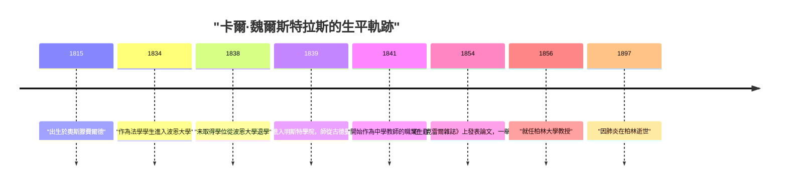
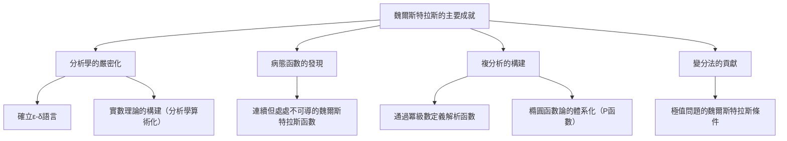

## 引言

在數學的歷史長河中，將微積分學建立在嚴密基礎之上的最著名的人物莫過於 **[卡爾·魏爾斯特拉斯](https://kenji.blog/p/weierstrass/)** ([Karl Weierstrass](https://kenji.blog/p/weierstrass/), 1815–1897) 了。他被譽為「現代分析之父」，確立了今天我們在大學裡學習的微積分的基礎（特別是 $\epsilon-\delta$ 語言）。他的成就不僅限於發現定理，更在於他從根本上改變了數學這門學科的「表達方式」與「思維方式」。在本文中，我們將深入探討他波瀾壯闊的一生以及他在數學領域的驚人成就。

## 時代背景：19世紀的數學界與分析學的危機

由[艾薩克·牛頓](https://kenji.blog/p/newton/)和戈特弗里德·威廉·萊布尼茨在17世紀創立的微積分學，在18世紀經過萊昂哈德·歐拉等人的努力，取得了驚人的發展。儘管它在物理學和天文學的應用上成果斐然，但其根基中的「無窮小」與「極限」概念卻依然十分模糊。「無限趨近於零但又不是零的數」這種直觀的解釋，成為了哲學批判的靶子，缺乏邏輯上的嚴密性。

進入19世紀，[奧古斯丁-路易·柯西](https://kenji.blog/p/cauchy/)和伯納德·波爾查諾等人開始致力於分析學的嚴密化，但他們的定義仍未完全擺脫直覺的陰影。打破這種可以說是「分析學危機」的局面，不依賴幾何直覺而純粹用算術方法重構分析學——肩負起這一歷史使命的人，正是魏爾斯特拉斯。

## 幼年時期與充滿挫折的學生時代

[卡爾·魏爾斯特拉斯](https://kenji.blog/p/weierstrass/)於1815年10月31日出生在普魯士王國（現德國）的奧斯滕費爾德。他的父親是一名政府官員，為人非常嚴厲。父親強烈希望兒子也能像自己一樣成為一名優秀的普魯士行政官員，而魏爾斯特拉斯早年的生活便被父親這種強烈的期望所束縛。

1834年，他遵從父親的意願，進入波恩大學學習法學和財政學。然而，他的心思完全不在法律或經濟上，而是被數學深深吸引。結果，他非但沒有去聽法學課，反而把時間都花在了擊劍和喝啤酒上，過著放蕩不羈的學生生活。與此同時，他私下裡貪婪地閱讀數學書籍（尤其是皮埃爾-西蒙·拉普拉斯、[卡爾·古斯塔夫·雅各布·雅可比](https://kenji.blog/p/jacobi/)以及尼爾斯·亨利克·阿貝爾的著作），自學了高等數學。最終，四年後他沒能取得學位便從大學退學了。

這次挫折是他人生中的一個重大轉折點，也讓他的父親深感失望。然而，這段時期培養出的獨立思考與自學精神，無疑對他後來的研究風格產生了巨大影響。

## 作為教師的漫長蟄伏期：孤高的研究生活

大學輟學後，魏爾斯特拉斯始終無法放棄對數學的追求。在朋友的建議下，他重新進入明斯特學院（現明斯特大學）就讀。在這裡，他師從當時著名的數學家克里斯托夫·古德曼學習數學。古德曼是橢圓函數論的專家，魏爾斯特拉斯在此深深迷上了橢圓函數。古德曼也看出了魏爾斯特拉斯非凡的才華，對他給予了極高的評價。

取得教師資格後，魏爾斯特拉斯從1841年起，在普魯士的各個鄉鎮中學（Gymnasium）當了長達15年的教師。他的生活條件並不優越。據說他不僅要教數學，還要教物理、植物學、地理、歷史，甚至還要教體操和書法。

儘管每天被繁重的教學任務所累，他依然堅持熬夜進行數學研究。他沒有機會與當時最前沿的數學家們交流，甚至極少向學術期刊投稿。在一個完全與世隔絕的環境中，在無人知曉的情況下，他正在進行著從根本上重新審視分析學基礎的宏大研究。這一時期的過度勞累損害了他的健康，也成為了日後折磨他的嚴重眩暈症的病因。

## 華麗回歸數學界與無上榮耀

經歷了作為鄉村中學教師的漫長蟄伏期後，魏爾斯特拉斯在1854年迎來了戲劇性的轉機。他在當時最具權威的數學雜誌《克雷爾雜誌》（純粹與應用數學雜誌）上發表了一篇關於阿貝爾函數的劃時代論文。

這篇論文瞬間吸引了全歐洲數學家的目光。他的研究完美地解決了一直以來困擾眾多著名數學家多年的難題，其手法的創新性與邏輯的完美性無人能及。哥尼斯堡大學為表彰他的成就，授予他名譽博士學位；普魯士教育部也採取措施，將他從中學教師的繁重職務中解脫出來。

終於在1856年，他被聘請為柏林大學的教授。儘管這是一次年過四十的大器晚成的登場，但從此他開始了勢不可擋的征程，並將柏林大學推向了世界最高水準數學中心的位置。

## 偉大的數學成就

魏爾斯特拉斯的成就涵蓋了多個領域，這裡我們將重點詳細解說其中最著名的三項貢獻。

### 1. 分析學的嚴密化（ε-δ語言）

如前所述，早期的微積分學依賴於直觀的「無窮小」。魏爾斯特拉斯將極限和連續性的概念，完全排除了模糊的日常用語，僅用不等式進行了徹底的形式化。這便是現代數學中最重要的基礎—— **$\epsilon-\delta$ 語言**。

他將函數 $f(x)$ 在 $x = a$ 處連續的定義，嚴密地描述如下：

$$
\forall \epsilon > 0, \exists \delta > 0 \text{ s.t. } \forall x, |x - a| < \delta \implies |f(x) - f(a)| < \epsilon
$$

這個定義的劃時代之處在於，它將伴隨時間的「動態變化」概念，轉換成了「靜態的邏輯狀態」。這就使得我們能夠不依賴幾何直覺，純粹用算術方法來構建分析學成為可能。他還對實數的連續性給出了嚴密的定義，成功地將分析學置於堅實的邏輯基礎之上（這被稱為分析學的算術化）。

### 2. 打破直覺的反例：魏爾斯特拉斯函數的衝擊

此外，他還發表了一個給數學界帶來巨大衝擊的函數。這是一個「處處連續但處處不可導的函數」。現在它被稱為 **魏爾斯特拉斯函數**。

$$
f(x) = \sum_{n=0}^{\infty} a^n \cos(b^n \pi x)
$$
（其中 $0 < a < 1$，$b$ 是正奇數，且滿足 $ab > 1 + \frac{3}{2}\pi$）

在當時，數學家們的常識與直覺是：「連續的曲線必定是光滑的，除了一些尖銳的例外點外，任何地方都可以畫出切線（即處處可導）」。然而，魏爾斯特拉斯通過提出這個函數證明了：存在一種無限鋸齒狀、無論怎麼放大都不會變得光滑的曲線。

這一發現讓數學家們痛切地認識到，幾何直覺是多麼的靠不住，而基於嚴密邏輯的證明又是何等的重要。這個函數也可以看作是後來分形幾何學的先驅，被認為是數學史上最重要的反例之一。

### 3. 複分析與橢圓函數論的體系化

魏爾斯特拉斯在複變函數理論中也發揮了決定性的作用。與柯西和黎曼重視幾何直覺和積分不同，魏爾斯特拉斯採取了以「冪級數」為基礎的代數方法。他利用解析延拓的概念對複函數進行了嚴密的定義，確立了現代複分析的標準方法。

此外，他在橢圓函數論和阿貝爾函數論領域也構建了極其優美的體系。魏爾斯特拉斯的 $\wp$ 函數（P函數）作為處理橢圓函數時最基本的函數，至今仍被廣泛使用。

## 作為偉大教育家的一面

在柏林大學，魏爾斯特拉斯不僅是一位傑出的研究者，更是極其卓越的教育家。他的講課非常清晰明了，沒有任何邏輯上的跳躍，一步一個腳印地逼近真理。他的講義在學生中廣為流傳，甚至被全歐洲的大學當作教科書來使用。

聽聞他的大名，歐洲各地的優秀學子紛紛匯聚到他的門下。在他的學生及受他影響的數學家名單中，閃耀著眾多後來在數學史上留名青史的巨星，如集合論的創始人[格奧爾格·康托爾](https://kenji.blog/p/cantor/)、費利克斯·克萊因、費迪南德·格奧爾格·弗羅貝尼烏斯、赫爾曼·施瓦茨等。

### 與索菲婭·柯瓦列夫斯卡婭的師生情誼

在談到魏爾斯特拉斯作為教育家的一面時，絕對不能漏掉的是他與俄羅斯女數學家 **索菲婭·柯瓦列夫斯卡婭** 之間的感人故事。

在19世紀後半葉的歐洲，女性進入大學接受正規教育幾乎是不被允許的。柯瓦列夫斯卡婭希望能到柏林大學學習，但校方拒絕了她旁聽的請求。然而，魏爾斯特拉斯一眼就看出了她非凡的數學天賦，並決定打破大學的規定，無償為她進行個人輔導。

在魏爾斯特拉斯的傾心指導下，柯瓦列夫斯卡婭在偏微分方程和天體力學方面取得了輝煌的成就，後來成為了第一位在近代大學中擔任正教授的女性（斯德哥爾摩大學）。魏爾斯特拉斯不僅將她視為學生，更把她當作自己最親密的朋友之一深愛著她，兩人之間大量的書信往來傳遞著他們之間堅固的羈絆與深深的敬意。當柯瓦列夫斯卡婭以41歲的年紀英年早逝時，魏爾斯特拉斯的悲痛是難以言喻的。

## 晚年與遺產

在晚年，魏爾斯特拉斯與他的同事、曾經的學生利奧波德·克羅內克之間，圍繞著數學的基礎發生了一場激烈的論戰。克羅內克宣稱：「上帝創造了整數，其餘都是人的工作」，並從直覺主義的立場嚴厲批評了魏爾斯特拉斯的分析學和康托爾的集合論。這種對立深深地刺痛了魏爾斯特拉斯的心。

他的健康狀況也日益惡化，晚年時飽受眩暈和支氣管炎的折磨，不得不依靠輪椅生活。儘管如此，直到生命的最後一刻，他也沒有喪失對數學的熱情，還在學生們的幫助下致力於編纂自己的著作集。

1897年2月19日，[卡爾·魏爾斯特拉斯](https://kenji.blog/p/weierstrass/)因肺炎在柏林逝世，享年81歲。

## 結語

[卡爾·魏爾斯特拉斯](https://kenji.blog/p/weierstrass/)憑藉其嚴密的邏輯和不屈的精神，促使數學進化為了更加堅固、更加美麗的學科。他克服了年輕時的挫折，熬過了作為鄉村教師漫長而孤獨的無名歲月，最終登頂世界之巔，他的人生也給生活在現代的我們帶來了巨大的勇氣。

如果沒有他所奠定的「嚴密性」這一堅固基石，現代高度發達的數學、物理學以及工程學的發展都是不可想像的。他留下的成就在現代數學中依然璀璨奪目，未曾褪色，這正是他被尊稱為「現代分析之父」的真正原因。魏爾斯特拉斯的名字，將作為證明「數學是一門邏輯的藝術」的偉大象徵，被人們永遠傳頌。
