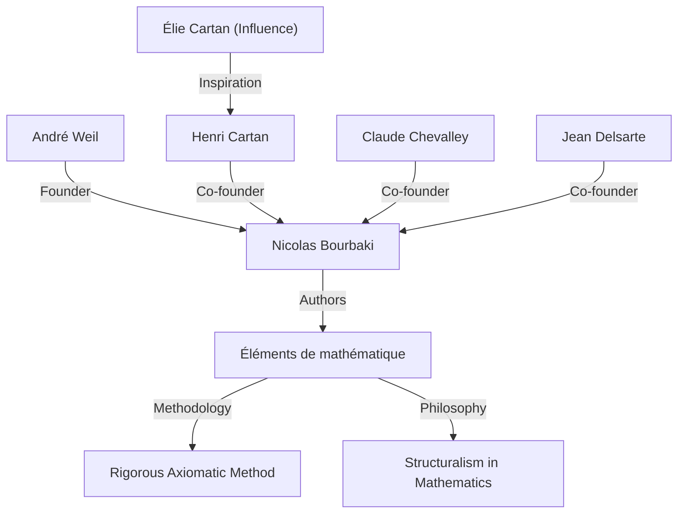
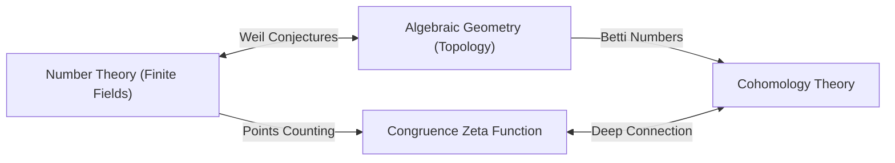

## 1. مقدمة: مهندس الرياضيات الحديثة

كان [أندريه فايل](https://kenji.blog/p/weil/) ([André Weil](https://kenji.blog/p/weil/)، 6 مايو 1906 - 6 أغسطس 1998) أحد أكثر الشخصيات تأثيرًا في العالم الرياضي في القرن العشرين. لقد ربطت أعماله بشكل عميق بين المجالات التي تطورت سابقًا بشكل منفصل - نظرية الأعداد، والهندسة الجبرية، والطوبولوجيا - مما أدى إلى خلق نموذج جديد تمامًا في الرياضيات الحديثة. على وجه الخصوص، كانت **"حدسيات فايل"** (Weil conjectures) التي اقترحها بمثابة بوصلة للبحث الرياضي على مدى العقود التالية، حيث وفرت إلهامًا هائلاً للجيل القادم من العباقرة مثل [ألكسندر غروتينديك](https://kenji.blog/p/grothendieck/) وبيير ديلين. توضح هذه المقالة بالتفصيل حياته غير العادية، ودوره في تأسيس عالم الرياضيات الخيالي **"نيكولا بورباكي"** (Nicolas Bourbaki)، والإرث الرياضي العميق الذي تركه وراءه.

## 2. رحلة المعجزة الشابة: من باريس إلى العالم

ولد فايل في باريس، فرنسا، لعائلة يهودية مثقفة. تركت شقيقته الصغرى، سيمون فايل (Simone Weil)، بصمتها في التاريخ كفيلسوفة وناشطة اجتماعية مشهورة. منذ سن مبكرة، أظهر فايل موهبة غير عادية في كل من اللغات والرياضيات؛ لقد كان معجزة قادرًا على قراءة النصوص الكلاسيكية باللغتين السنسكريتية واليونانية بأشكالها الأصلية.

في سن مبكرة (16 عامًا)، التحق بدار المعلمين العليا (ENS)، المؤسسة التعليمية الرائدة في فرنسا. هناك التقى بعلماء رياضيات لامعين مثل هنري كارتان (Henri Cartan)، الذين أصبحوا أصدقاء له مدى الحياة. بعد التخرج، سافر فايل عبر المراكز الأكاديمية الأوروبية بما في ذلك روما، وغوتينغن، وبرلين، ووسع آفاقه من خلال التعلم مباشرة من كبار علماء الرياضيات في ذلك الوقت، مثل كارل لودفيج سيجل ([Carl Ludwig Siegel](https://kenji.blog/p/siegel/)) و[إيمي نويثر](https://kenji.blog/p/noether/) ([Emmy Noether](https://kenji.blog/p/noether/)).

## 3. الخبرة في الهند والتفاني في الفلسفة

في عام 1930، في سن 24 عامًا، أصبح فايل أستاذًا للرياضيات في جامعة عليكرة الإسلامية في الهند. لقد تركت هذه الإقامة في الهند بصمة عميقة في حياته. كرس نفسه بعمق للأدب السنسكريتي والفلسفة الهندوسية، وخاصة *بهاغافاد غيتا*، التي كانت أفكارها بمثابة دعم روحي له طوال حياته.

في الهند، لم يجر أبحاثًا رياضية فحسب، بل انخرط أيضًا بعمق مع المثقفين المحليين. يقال إن فهم الثقافات المتنوعة والمنظور الواسع الذي تمت تنميته خلال هذه الفترة شكل الأساس الحدسي له عندما اكتشف لاحقًا تشابهات عميقة بين مجالات مختلفة من الرياضيات (مثل نظرية الأعداد والهندسة).

## 4. ولادة نيكولا بورباكي: إعادة بناء الرياضيات

في ثلاثينيات القرن العشرين، كان مجتمع الرياضيات الفرنسي يعاني من الركود، ويرجع ذلك إلى حد كبير إلى فقدان العديد من علماء الرياضيات الشباب الواعدين في الحرب العالمية الأولى. وإزاء هذا الوضع، أطلق فايل، بالتعاون مع كارتان، وكلود شيفالي (Claude Chevalley)، وجان ديلسارت (Jean Delsarte)، وآخرين، مشروعًا كبيرًا لإعادة بناء الرياضيات من الألف إلى الياء.

لقد تبنوا الاسم المستعار لعالم رياضيات روسي خيالي، **"نيكولا بورباكي"** ، وبدأوا بشكل تعاوني في كتابة سلسلة من الكتب بعنوان *أصول الرياضيات* (Éléments de mathématique).

كانت السمة المميزة لبورباكي هي التطور البديهي والصارم تمامًا للرياضيات من منظور **"الهياكل"** (الهياكل الجبرية، والترتيبية، والطوبولوجية). لعبت شخصية فايل القوية، وسعة اطلاعه الساحقة، وصرامته التي لا هوادة فيها دورًا حاسمًا في تحديد أسلوب الكتابة وفلسفة بورباكي. في وقت لاحق، غيرت أنشطة بورباكي أسلوب تعليم الرياضيات والبحث في جميع أنحاء العالم.

## 5. الحرب والسجن: المعجزة في سجن روان

مع اندلاع الحرب العالمية الثانية في عام 1939، تعثر مصير فايل بشدة. رفض الخدمة العسكرية وهرب إلى فنلندا، حيث تم التعرف عليه بالخطأ كجاسوس سوفيتي وكاد أن يُعدم. تم إنقاذه بفضل جهود عالم الرياضيات البارز رولف نيفانلينا (Rolf Nevanlinna)، ولكن تم ترحيله لاحقًا إلى فرنسا وسُجن في روان.

ولكن من اللافت للنظر أن إبداع فايل الرياضي وصل إلى ذروته في ظل هذه الظروف القاسية. داخل زنزانته في السجن، أكمل أحد أعظم إنجازاته: **"إثبات فرضية ريمان للمنحنيات الجبرية فوق الحقول المحدودة"** . وفي رسائل إلى شقيقته سيمون، ناقش بشغف فرحة هذا الاكتشاف وأهمية "القياس" (Analogy) في الرياضيات.

## 6. حدسيات فايل: جسر بين الهندسة الجبرية ونظرية الأعداد

بعد إطلاق سراحه وفترة وجيزة قضاها في الجيش، تمكن فايل بأعجوبة من الفرار مع عائلته إلى الولايات المتحدة. بعد فترة قضاها في جامعة شيكاغو، أصبح أستاذًا دائمًا في معهد الدراسات المتقدمة (IAS) في برينستون.

في عام 1949، نشر عمله المميز، **"حدسيات فايل"** . اقترحت هذه اتصالاً مذهلاً بين عدد النقاط على الأصناف الجبرية (مجموعة الحلول للمعادلات الجبرية) عبر الحقول المحدودة والخصائص الطوبولوجية (مثل عدد الثقوب) التي تمتلكها هذه الأصناف فوق الأعداد المركبة. تتكون حدسيات فايل من الأجزاء الأربعة التالية:

1. **العقلانية (Rationality)**: دالة التطابق زيتا $Z(X, t)$ هي دالة كسرية.
2. **المعادلة الوظيفية (Functional equation)**: دالة زيتا تفي بتناظر معين.
3. **التناظرية لفرضية ريمان (Analogue of the [Riemann hypothesis](https://kenji.blog/p/riemann-hypothesis/))**: تتبع القيم المطلقة لأصفار وأقطاب دالة زيتا قواعد محددة.
4. **الاتصال بأعداد بيتي (Connection with Betti numbers)**: تتطابق درجة دالة زيتا مع أعداد بيتي للصنف.

كصياغة رياضية، يتم تعريف دالة التطابق زيتا لصنف إسقاطي غير مفرد $X$ على حقل محدود $\mathbb{F}_q$ على النحو التالي:

$$ Z(X, t) = \exp \left( \sum_{m=1}^{\infty} \frac{|X(\mathbb{F}_{q^m})|}{m} t^m \right) $$

هنا، يمثل $|X(\mathbb{F}_{q^m})|$ عدد النقاط المنطقية لـ $X$ في حقل الامتداد $\mathbb{F}_{q^m}$.

لإثبات هذه الحدسيات العميقة، بنى [ألكسندر غروتينديك](https://kenji.blog/p/grothendieck/) الإطار النظري الضخم لنظرية المخططات وتماثلات إيتال (étale cohomology) من الصفر. ثم، في عام 1974، أثبت بيير ديلين، تلميذ غروتينديك، العقبة الأخيرة، "التناظرية لفرضية ريمان"، مما أدى إلى حل حدسيات فايل بالكامل. تعتبر هذه الدراما الكبرى واحدة من أعظم الإنجازات الضخمة في رياضيات القرن العشرين.

## 7. إسهامات هامة أخرى: الأديليس والإيديليس وزمرة فايل

لم تقتصر إسهامات فايل على اقتراح الحدسيات. فقد صقل نظريات **"الأديل"** (adeles) و **"الإيديل"** (ideles)، والتي أصبحت لغات أساسية في نظرية الأعداد الحديثة. أكمل هذا إطارًا قويًا في نظرية الأعداد يربط المحلي بالعالمي.

علاوة على ذلك، قدم **"زمرة فايل"** (Weil group)، وهي امتداد لمفهوم زمرة غالوا، والتي لعبت دورًا بالغ الأهمية في توحيد نظرية حقل الفئة المحلي والعالمي. لا تزال هذه المفاهيم تُبحث بنشاط اليوم كأساس لـ "برنامج لانجلاندز" (Langlands program)، وهي مشكلة ضخمة لم تُحل بعد في الرياضيات الحديثة. علاوة على ذلك، فإن الكائنات الرياضية التي تحمل اسمه عديدة جدًا بحيث لا يمكن ذكرها، بما في ذلك "اقتران فايل" (Weil pairing) المستخدم في تشفير المنحنى الإهليلجي و "مقياس فايل-بيترسون" (Weil-Petersson metric) في هندسة مساحات المعامل.

## 8. الحياة اللاحقة والإرث الرياضي

شارك فايل في البحث والتعليم لسنوات عديدة في معهد الدراسات المتقدمة في برينستون، وقام بتوجيه العديد من الخلفاء. كان يمتلك معرفة واسعة وبصيرة ثاقبة، وكان يُعرف أحيانًا بأنه ناقد لاذع. كان لديه أيضًا معرفة عميقة بتاريخ الرياضيات، والكتب التي كتبها حول هذا الموضوع تحظى بتقدير كبير كروائع مليئة بالبصيرة التاريخية.

في عام 1998، توفي [أندريه فايل](https://kenji.blog/p/weil/) عن عمر يناهز 92 عامًا. لقد ازدهرت بذرة "اندماج نظرية الأعداد والهندسة" التي زرعها ببراعة في الرياضيات الحديثة. إن إنجازاته الباقية، وموقفه الذي لا هوادة فيه تجاه الرياضيات، ستستمر بلا شك في إبهار علماء الرياضيات وتوجيههم إلى الأبد. لقد كانت حياته حقًا ملحمة كبرى تقاطع فيها تاريخ القرن العشرين المضطرب مع تألق الفكر البشري.
