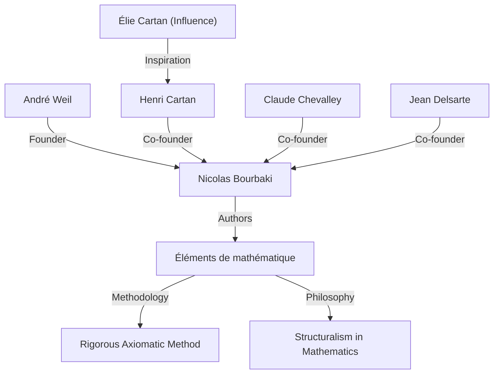
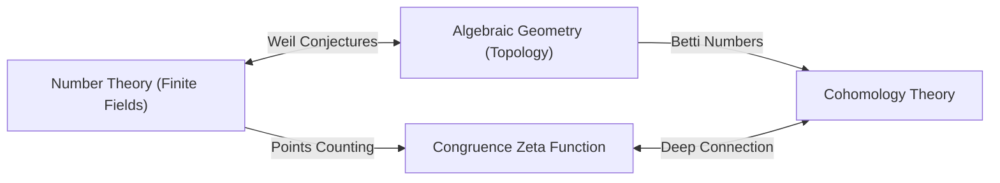

## 1. Einführung: Architekt der modernen Mathematik

[André Weil](https://kenji.blog/de/p/weil/) (6. Mai 1906 - 6. August 1998) war eine der einflussreichsten Persönlichkeiten der mathematischen Welt des 20. Jahrhunderts. Seine Arbeit verband auf tiefgreifende Weise Bereiche, die sich zuvor unabhängig voneinander entwickelt hatten — Zahlentheorie, algebraische Geometrie und Topologie — und schuf ein völlig neues Paradigma in der modernen Mathematik. Insbesondere seine vorgeschlagenen **„Weil-Vermutungen“** (Weil conjectures) dienten in den folgenden Jahrzehnten als Kompass für die mathematische Forschung und gaben der nächsten Generation von Genies wie [Alexander Grothendieck](https://kenji.blog/de/p/grothendieck/) und Pierre Deligne immense Inspiration. Dieser Artikel beschreibt sein außergewöhnliches Leben, seine Rolle bei der Gründung des fiktiven Mathematikers **„Nicolas Bourbaki“** und das tiefgreifende mathematische Erbe, das er hinterlassen hat.

## 2. Die Reise eines jungen Wunderkindes: Von Paris in die Welt

Weil wurde in Paris (Frankreich) in eine kultivierte jüdische Familie geboren. Seine jüngere Schwester Simone Weil ging ebenfalls als renommierte Philosophin und soziale Aktivistin in die Geschichte ein. Schon in jungen Jahren zeigte Weil außergewöhnliches Talent sowohl für Sprachen als auch für Mathematik; er war ein Wunderkind, das klassische Texte in Sanskrit und Griechisch in ihren Originalfassungen lesen konnte.

Im jungen Alter von 16 Jahren trat er in die École Normale Supérieure (ENS), Frankreichs führende Bildungseinrichtung, ein. Dort lernte er brillante Mathematiker wie Henri Cartan kennen, die zu seinen lebenslangen Freunden wurden. Nach seinem Abschluss reiste Weil durch europäische akademische Zentren wie Rom, Göttingen und Berlin und erweiterte seinen Horizont, indem er direkt von den Spitzenmathematikern seiner Zeit wie [Carl Ludwig Siegel](https://kenji.blog/de/p/siegel/) und [Emmy Noether](https://kenji.blog/de/p/noether/) lernte.

## 3. Erfahrung in Indien und Hingabe zur Philosophie

Im Jahr 1930, im Alter von 24 Jahren, wurde Weil Professor für Mathematik an der Aligarh Muslim University in Indien. Dieser Aufenthalt in Indien hinterließ tiefe Spuren in seinem Leben. Er widmete sich intensiv der Sanskrit-Literatur und der Hindu-Philosophie, insbesondere der *Bhagavad Gita*, deren Ideen ihm sein ganzes Leben lang als geistige Stütze dienten.

In Indien betrieb er nicht nur mathematische Forschung, sondern engagierte sich auch intensiv mit lokalen Intellektuellen. Man sagt, dass das Verständnis verschiedener Kulturen und die breite Perspektive, die in dieser Zeit kultiviert wurden, die intuitive Grundlage für ihn bildeten, als er später tiefe Analogien zwischen verschiedenen Bereichen der Mathematik (wie Zahlentheorie und Geometrie) entdeckte.

## 4. Die Geburt von Nicolas Bourbaki: Die Rekonstruktion der Mathematik

In den 1930er Jahren stagnierte die französische Mathematikergemeinschaft, größtenteils aufgrund des Verlusts vieler vielversprechender junger Mathematiker im Ersten Weltkrieg. Besorgt über diese Situation startete Weil zusammen mit Cartan, Claude Chevalley, Jean Delsarte und anderen ein großes Projekt, um die Mathematik von Grund auf neu aufzubauen.

Sie nahmen das Pseudonym eines fiktiven russischen Mathematikers, **„Nicolas Bourbaki“** , an und begannen gemeinsam, eine Buchreihe mit dem Titel *Éléments de mathématique* zu schreiben.

Das bestimmende Merkmal von Bourbaki war seine vollständig axiomatische und strenge Entwicklung der Mathematik aus der Perspektive von **„Strukturen“** (algebraische, Ordnungs- und topologische Strukturen). Weils starke Persönlichkeit, seine überwältigende Gelehrsamkeit und seine kompromisslose Strenge spielten eine entscheidende Rolle bei der Bestimmung von Bourbakis Schreibstil und Philosophie. Die Aktivitäten von Bourbaki sollten in der Folge den Stil der mathematischen Ausbildung und Forschung weltweit verändern.

## 5. Krieg und Gefangenschaft: Das Wunder im Gefängnis von Rouen

Mit dem Ausbruch des Zweiten Weltkriegs 1939 wurde Weils Schicksal schwer erschüttert. Er verweigerte den Militärdienst und floh nach Finnland, wo er fälschlicherweise als sowjetischer Spion identifiziert und fast hingerichtet wurde. Er wurde durch die Bemühungen des prominenten Mathematikers Rolf Nevanlinna gerettet, aber anschließend nach Frankreich deportiert und in Rouen inhaftiert.

Bemerkenswerterweise erreichte Weils mathematische Kreativität unter diesen harten Bedingungen ihren Höhepunkt. In seiner Gefängniszelle vollendete er eine seiner größten Errungenschaften: den **„Beweis der [Riemann](https://kenji.blog/de/p/riemann/)schen Vermutung für algebraische Kurven über endlichen Körpern“** . In Briefen an seine Schwester Simone diskutierte er leidenschaftlich über die Freude dieser Entdeckung und die Bedeutung der „Analogie“ in der Mathematik.

## 6. Die Weil-Vermutungen: Eine Brücke zwischen algebraischer Geometrie und Zahlentheorie

Nach seiner Freilassung und einer kurzen Zeit beim Militär gelang es Weil wie durch ein Wunder, mit seiner Familie in die Vereinigten Staaten zu fliehen. Nach einer Zeit an der University of Chicago wurde er schließlich ständiger Professor am Institute for Advanced Study (IAS) in Princeton.

Im Jahr 1949 veröffentlichte er sein Hauptwerk, die **„Weil-Vermutungen“** . Diese schlugen eine erstaunliche Verbindung vor zwischen der Anzahl der Punkte auf algebraischen Varietäten (der Lösungsmenge algebraischer Gleichungen) über endlichen Körpern und den topologischen Eigenschaften (wie der Anzahl der Löcher), die diese Varietäten über den komplexen Zahlen besitzen. Die Weil-Vermutungen bestehen aus den folgenden vier Teilen:

1.  **Rationalität**: Die Kongruenzzetafunktion $Z(X, t)$ ist eine rationale Funktion.
2.  **Funktionalgleichung**: Die Zetafunktion erfüllt eine spezifische Symmetrie.
3.  **Analogon der [Riemann](https://kenji.blog/de/p/riemann/)schen Vermutung**: Die Absolutbeträge der Nullstellen und Pole der Zetafunktion folgen spezifischen Regeln.
4.  **Verbindung mit den Betti-Zahlen**: Der Grad der Zetafunktion stimmt mit den Betti-Zahlen der Varietät überein.

Als mathematische Formulierung wird die Kongruenzzetafunktion einer nichtsingulären projektiven Varietät $X$ über einem endlichen Körper $\mathbb{F}_q$ wie folgt definiert:

$$ Z(X, t) = \exp \left( \sum_{m=1}^{\infty} \frac{|X(\mathbb{F}_{q^m})|}{m} t^m \right) $$

Hier repräsentiert $|X(\mathbb{F}_{q^m})|$ die Anzahl der rationalen Punkte von $X$ im Erweiterungskörper $\mathbb{F}_{q^m}$.

Um diese tiefgreifenden Vermutungen zu beweisen, baute [Alexander Grothendieck](https://kenji.blog/de/p/grothendieck/) den massiven theoretischen Rahmen der Schema-Theorie und der étale Kohomologie von Grund auf neu auf. Dann, im Jahr 1974, bewies Grothendiecks Schüler Pierre Deligne die letzte Hürde, das „Analogon der [Riemann](https://kenji.blog/de/p/riemann/)schen Vermutung“, und löste damit die Weil-Vermutungen vollständig. Dieses große Drama gilt als eine der größten monumentalen Errungenschaften der Mathematik des 20. Jahrhunderts.

## 7. Weitere bedeutende Beiträge: Adele, Idele und die Weil-Gruppe

Weils Beiträge beschränkten sich nicht darauf, Vermutungen aufzustellen. Er verfeinerte die Theorien der **„Adele“** und **„Idele“** , die zu wesentlichen Sprachen in der modernen Zahlentheorie geworden sind. Dies vervollständigte einen leistungsstarken Rahmen in der Zahlentheorie, der das Lokale mit dem Globalen verbindet.

Darüber hinaus führte er die **„Weil-Gruppe“** ein, eine Erweiterung des Konzepts der [Galois](https://kenji.blog/de/p/galois/)-Gruppe, die eine äußerst wichtige Rolle bei der Vereinheitlichung der lokalen und globalen Klassenkörpertheorie spielte. Diese Konzepte werden auch heute noch aktiv als Grundlage des „Langlands-Programms“, eines massiven ungelösten Problems der modernen Mathematik, erforscht. Darüber hinaus sind die mathematischen Objekte, die seinen Namen tragen, zu zahlreich, um sie alle zu erwähnen, darunter die „Weil-Paarung“ (Weil pairing), die in der Kryptographie mit elliptischen Kurven verwendet wird, und die „Weil-Petersson-Metrik“ in der Geometrie der Modulräume.

## 8. Späteres Leben und mathematisches Erbe

Weil war viele Jahre lang in Forschung und Lehre am Institute for Advanced Study in Princeton tätig und betreute zahlreiche Nachfolger. Er besaß ein enormes Wissen und scharfe Einsichten und war manchmal als bissiger Kritiker bekannt. Er hatte auch tiefes Wissen über die Geschichte der Mathematik, und die Bücher, die er zu diesem Thema schrieb, werden als Meisterwerke voller historischer Einsichten hoch geschätzt.

Im Jahr 1998 verstarb [André Weil](https://kenji.blog/de/p/weil/) im Alter von 92 Jahren. Der Samen der „Verschmelzung von Zahlentheorie und Geometrie“, den er gesät hatte, ist in der modernen Mathematik brillant erblüht. Seine erhaltenen Errungenschaften und seine kompromisslose Haltung gegenüber der Mathematik werden Mathematiker zweifellos für immer faszinieren und leiten. Sein Leben war wahrlich ein großes Epos, in dem sich die turbulente Geschichte des 20. Jahrhunderts mit der Brillanz des menschlichen Intellekts kreuzte.
