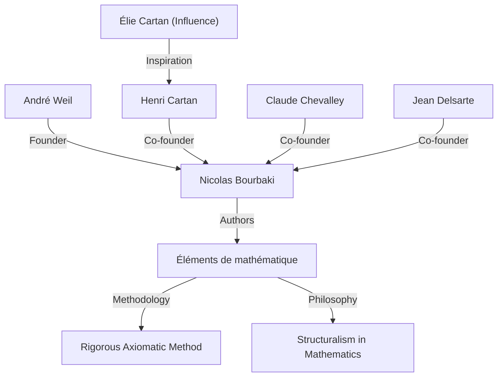
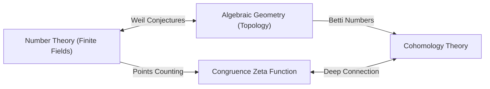

## 1. Introduction: Architect of Modern Mathematics

André Weil (May 6, 1906 - August 6, 1998) was one of the most influential figures in the 20th-century mathematical world. His work profoundly connected fields that had previously developed separately—number theory, algebraic geometry, and topology—creating an entirely new paradigm in modern mathematics. In particular, his proposed **"Weil conjectures"** served as a compass for mathematical research over the following decades, providing immense inspiration to the next generation of geniuses such as Alexander Grothendieck and Pierre Deligne. This article details his extraordinary life, his role in founding the fictional mathematician **"Nicolas Bourbaki"** , and the profound mathematical legacy he left behind.

## 2. Journey of a Young Prodigy: From Paris to the World

Weil was born in Paris, France, to a cultured Jewish family. His younger sister, Simone Weil, also left her mark on history as a renowned philosopher and social activist. From a young age, Weil displayed extraordinary talent in both languages and mathematics; he was a prodigy capable of reading classical texts in Sanskrit and Greek in their original forms.

At the young age of 16, he entered the École Normale Supérieure (ENS), France's premier educational institution. There, he met brilliant mathematicians such as Henri Cartan, who would become his lifelong friends. After graduation, Weil traveled across European academic hubs including Rome, Göttingen, and Berlin, broadening his horizons by learning directly from top-tier mathematicians of the time, such as Carl Ludwig Siegel and Emmy Noether.

## 3. Experience in India and Devotion to Philosophy

In 1930, at the age of 24, Weil became a professor of mathematics at Aligarh Muslim University in India. This stay in India left a deep imprint on his life. He became deeply devoted to Sanskrit literature and Hindu philosophy, especially the *Bhagavad Gita*, whose ideas served as his spiritual support throughout his life.

In India, he not only conducted mathematical research but also engaged deeply with local intellectuals. The understanding of diverse cultures and the broad perspective cultivated during this period are said to have formed the intuitive foundation for him when he later discovered deep analogies between different fields of mathematics (such as number theory and geometry).

## 4. The Birth of Nicolas Bourbaki: Reconstructing Mathematics

In the 1930s, the French mathematical community was stagnating, largely due to the loss of many promising young mathematicians in World War I. Concerned by this situation, Weil, along with Cartan, Claude Chevalley, Jean Delsarte, and others, launched a grand project to reconstruct mathematics from the ground up.

They adopted the pseudonym of a fictional Russian mathematician, **"Nicolas Bourbaki"** , and began collaboratively writing a series of books titled *Éléments de mathématique*.

The defining characteristic of Bourbaki was its completely axiomatic and rigorous development of mathematics from the perspective of **"structures"** (algebraic, order, and topological structures). Weil's forceful personality, overwhelming erudition, and uncompromising rigor played a crucial role in determining Bourbaki's writing style and philosophy. Bourbaki's activities would go on to transform the style of mathematical education and research worldwide.

## 5. War and Imprisonment: The Miracle at Rouen Prison

With the outbreak of World War II in 1939, Weil's fate was severely tossed about. He refused military service and fled to Finland, where he was mistakenly identified as a Soviet spy and nearly executed. He was saved by the efforts of the prominent mathematician Rolf Nevanlinna but was subsequently deported back to France and imprisoned in Rouen.

Remarkably, however, Weil's mathematical creativity reached its zenith under these harsh conditions. Inside his prison cell, he completed one of his greatest achievements: the **"Proof of the [Riemann hypothesis](https://kenji.blog/p/riemann-hypothesis/) for algebraic curves over finite fields"** . In letters to his sister Simone, he passionately discussed the joy of this discovery and the importance of "analogy" in mathematics.

## 6. The Weil Conjectures: A Bridge Between Algebraic Geometry and Number Theory

After his release and a brief stint in the army, Weil miraculously managed to escape with his family to the United States. Following a period at the University of Chicago, he ultimately became a permanent professor at the Institute for Advanced Study (IAS) in Princeton.

In 1949, he published his signature work, the **"Weil conjectures"** . This proposed an astonishing connection between the number of points on algebraic varieties (the set of solutions to algebraic equations) over finite fields and the topological properties (such as the number of holes) those varieties possess over the complex numbers. The Weil conjectures consist of the following four parts:

1.  **Rationality**: The congruence zeta function $Z(X, t)$ is a rational function.
2.  **Functional equation**: The zeta function satisfies a specific symmetry.
3.  **Analogue of the [Riemann hypothesis](https://kenji.blog/p/riemann-hypothesis/)**: The absolute values of the zeros and poles of the zeta function follow specific rules.
4.  **Connection with Betti numbers**: The degree of the zeta function coincides with the Betti numbers of the variety.

As a mathematical formulation, the congruence zeta function of a non-singular projective variety $X$ over a finite field $\mathbb{F}_q$ is defined as follows:

$$ Z(X, t) = \exp \left( \sum_{m=1}^{\infty} \frac{|X(\mathbb{F}_{q^m})|}{m} t^m \right) $$

Here, $|X(\mathbb{F}_{q^m})|$ represents the number of rational points of $X$ in the extension field $\mathbb{F}_{q^m}$.

To prove these profound conjectures, Alexander Grothendieck built the massive theoretical framework of scheme theory and étale cohomology from scratch. Then, in 1974, Grothendieck's student Pierre Deligne proved the final hurdle, the "analogue of the [Riemann hypothesis](https://kenji.blog/p/riemann-hypothesis/)," completely resolving the Weil conjectures. This grand drama is considered one of the greatest monumental achievements in 20th-century mathematics.

## 7. Other Significant Contributions: Adeles, Ideles, and the Weil Group

Weil's contributions were not limited to proposing conjectures. He refined the theories of **"adeles"** and **"ideles"** , which have become essential languages in modern number theory. This completed a powerful framework in number theory that connects the local to the global.

Furthermore, he introduced the **"Weil group"** , an extension of the concept of the Galois group, which played an extremely important role in unifying local and global class field theory. These concepts continue to be actively researched today as the foundation of the "Langlands program," a massive unsolved problem in modern mathematics. Moreover, mathematical objects bearing his name are too numerous to mention, including the "Weil pairing" used in elliptic curve cryptography and the "Weil-Petersson metric" in the geometry of moduli spaces.

## 8. Later Life and Mathematical Legacy

Weil engaged in research and education for many years at the Institute for Advanced Study in Princeton, mentoring numerous successors. He possessed vast knowledge and keen insight, and was sometimes known as a biting critic. He also had a deep knowledge of the history of mathematics, and the books he wrote on the subject are highly regarded as masterpieces full of historical insight.

In 1998, André Weil passed away at the age of 92. The seed of the "fusion of number theory and geometry" that he sowed has blossomed brilliantly in modern mathematics. His surviving achievements, and his uncompromising attitude towards mathematics, will undoubtedly continue to fascinate and guide mathematicians forever. His life was truly a grand epic where the turbulent history of the 20th century intersected with the brilliance of human intellect.
