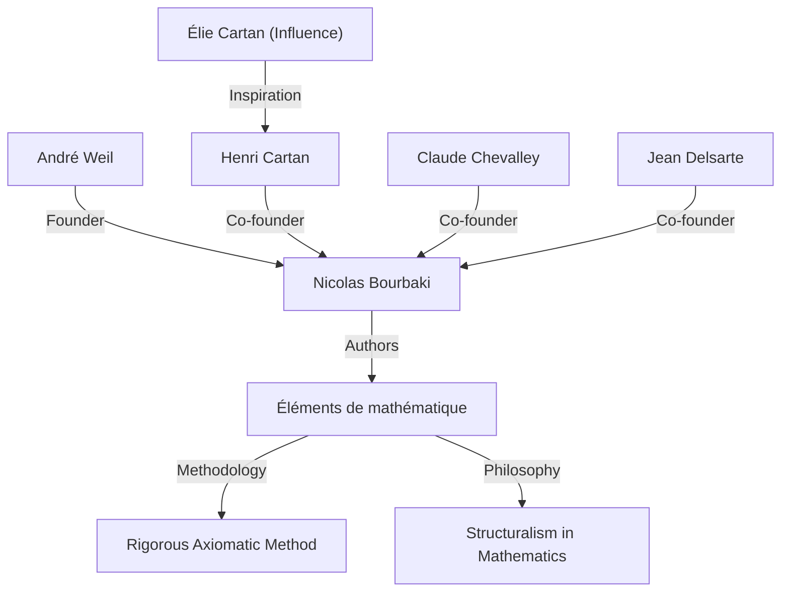
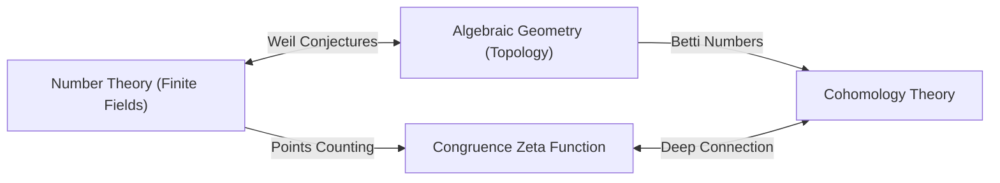

## 1. Introducción: Arquitecto de las Matemáticas Modernas

[André Weil](https://kenji.blog/es/p/weil/) (6 de mayo de 1906 - 6 de agosto de 1998) fue una de las figuras más influyentes del mundo matemático del siglo XX. Su trabajo conectó profundamente campos que previamente se habían desarrollado de manera separada —teoría de números, geometría algebraica y topología— creando un paradigma completamente nuevo en las matemáticas modernas. En particular, sus propuestas **"Conjeturas de Weil"** sirvieron como brújula para la investigación matemática durante las décadas siguientes, brindando una inmensa inspiración a la siguiente generación de genios como [Alexander Grothendieck](https://kenji.blog/es/p/grothendieck/) y Pierre Deligne. Este artículo detalla su extraordinaria vida, su papel en la fundación del matemático ficticio **"Nicolas Bourbaki"** , y el profundo legado matemático que dejó.

## 2. Viaje de un Joven Prodigio: De París al Mundo

Weil nació en París, Francia, en una culta familia judía. Su hermana menor, Simone Weil, también dejó su huella en la historia como renombrada filósofa y activista social. Desde temprana edad, Weil demostró un talento extraordinario tanto para los idiomas como para las matemáticas; era un prodigio capaz de leer textos clásicos en sánscrito y griego en sus formas originales.

A la temprana edad de 16 años, ingresó a la École Normale Supérieure (ENS), la principal institución educativa de Francia. Allí conoció a brillantes matemáticos como Henri Cartan, quienes se convertirían en sus amigos para toda la vida. Después de graduarse, Weil viajó por centros académicos europeos como Roma, Gotinga y Berlín, ampliando sus horizontes aprendiendo directamente de los matemáticos de primer nivel de la época, como [Carl Ludwig Siegel](https://kenji.blog/es/p/siegel/) y [Emmy Noether](https://kenji.blog/es/p/noether/).

## 3. Experiencia en India y Devoción a la Filosofía

En 1930, a los 24 años, Weil se convirtió en profesor de matemáticas en la Universidad Musulmana de Aligarh en India. Esta estadía en India dejó una profunda huella en su vida. Se dedicó profundamente a la literatura sánscrita y la filosofía hindú, especialmente al *Bhagavad Gita*, cuyas ideas le sirvieron de apoyo espiritual a lo largo de toda su vida.

En India, no solo realizó investigaciones matemáticas, sino que también interactuó profundamente con los intelectuales locales. Se dice que la comprensión de diversas culturas y la amplia perspectiva cultivadas durante este período formaron la base intuitiva para él cuando más tarde descubrió profundas analogías entre diferentes campos de las matemáticas (como la teoría de números y la geometría).

## 4. El Nacimiento de Nicolas Bourbaki: Reconstruyendo las Matemáticas

En la década de 1930, la comunidad matemática francesa estaba estancada, en gran parte debido a la pérdida de muchos jóvenes matemáticos prometedores en la Primera Guerra Mundial. Preocupado por esta situación, Weil, junto con Cartan, Claude Chevalley, Jean Delsarte y otros, lanzó un gran proyecto para reconstruir las matemáticas desde cero.

Adoptaron el seudónimo de un matemático ruso ficticio, **"Nicolas Bourbaki"** , y comenzaron a escribir en colaboración una serie de libros titulada *Éléments de mathématique*.

La característica definitoria de Bourbaki fue su desarrollo completamente axiomático y riguroso de las matemáticas desde la perspectiva de las **"estructuras"** (estructuras algebraicas, de orden y topológicas). La enérgica personalidad de Weil, su abrumadora erudición y su rigor intransigente jugaron un papel crucial en la determinación del estilo de escritura y la filosofía de Bourbaki. Las actividades de Bourbaki transformarían más tarde el estilo de la educación y la investigación matemática en todo el mundo.

## 5. Guerra y Encarcelamiento: El Milagro en la Prisión de Ruán

Con el estallido de la Segunda Guerra Mundial en 1939, el destino de Weil se vio gravemente alterado. Se negó al servicio militar y huyó a Finlandia, donde fue identificado por error como un espía soviético y casi ejecutado. Fue salvado por los esfuerzos del destacado matemático Rolf Nevanlinna, pero posteriormente fue deportado a Francia y encarcelado en Ruán.

Sorprendentemente, sin embargo, la creatividad matemática de Weil alcanzó su cenit bajo estas duras condiciones. Dentro de su celda, completó uno de sus mayores logros: la **"Prueba de la hipótesis de Riemann para curvas algebraicas sobre campos finitos"** . En cartas a su hermana Simone, discutió apasionadamente sobre la alegría de este descubrimiento y la importancia de la "analogía" en las matemáticas.

## 6. Las Conjeturas de Weil: Un Puente Entre la Geometría Algebraica y la Teoría de Números

Después de su liberación y un breve período en el ejército, Weil logró escapar milagrosamente con su familia a los Estados Unidos. Después de un período en la Universidad de Chicago, finalmente se convirtió en profesor permanente en el Instituto de Estudios Avanzados (IAS) en Princeton.

En 1949, publicó su obra insignia, las **"Conjeturas de Weil"** . Estas proponían una conexión asombrosa entre el número de puntos en variedades algebraicas (el conjunto de soluciones a ecuaciones algebraicas) sobre campos finitos y las propiedades topológicas (como el número de agujeros) que esas variedades poseen sobre los números complejos. Las conjeturas de Weil constan de las siguientes cuatro partes:

1.  **Racionalidad**: La función zeta de congruencia $Z(X, t)$ es una función racional.
2.  **Ecuación funcional**: La función zeta satisface una simetría específica.
3.  **Análogo de la hipótesis de Riemann**: Los valores absolutos de los ceros y polos de la función zeta siguen reglas específicas.
4.  **Conexión con los números de Betti**: El grado de la función zeta coincide con los números de Betti de la variedad.

Como formulación matemática, la función zeta de congruencia de una variedad proyectiva no singular $X$ sobre un campo finito $\mathbb{F}_q$ se define de la siguiente manera:

$$ Z(X, t) = \exp \left( \sum_{m=1}^{\infty} \frac{|X(\mathbb{F}_{q^m})|}{m} t^m \right) $$

Aquí, $|X(\mathbb{F}_{q^m})|$ representa el número de puntos racionales de $X$ en el campo de extensión $\mathbb{F}_{q^m}$.

Para probar estas profundas conjeturas, [Alexander Grothendieck](https://kenji.blog/es/p/grothendieck/) construyó el marco teórico masivo de la teoría de esquemas y la cohomología étale desde cero. Luego, en 1974, el estudiante de Grothendieck, Pierre Deligne, probó el obstáculo final, el "análogo de la hipótesis de Riemann", resolviendo por completo las conjeturas de Weil. Este gran drama se considera uno de los mayores logros monumentales de las matemáticas del siglo XX.

## 7. Otras Contribuciones Significativas: Adeles, Ideles y el Grupo de Weil

Las contribuciones de Weil no se limitaron a proponer conjeturas. Refinó las teorías de los **"adeles"** e **"ideles"** , que se han convertido en lenguajes esenciales en la teoría de números moderna. Esto completó un poderoso marco en la teoría de números que conecta lo local con lo global.

Además, introdujo el **"grupo de Weil"** , una extensión del concepto de grupo de Galois, que jugó un papel extremadamente importante en la unificación de la teoría de campos de clases local y global. Estos conceptos continúan investigándose activamente hoy en día como la base del "programa de Langlands", un enorme problema no resuelto de las matemáticas modernas. Por otra parte, los objetos matemáticos que llevan su nombre son demasiado numerosos para mencionarlos, incluido el "emparejamiento de Weil" utilizado en la criptografía de curva elíptica y la "métrica de Weil-Petersson" en la geometría de los espacios de módulos.

## 8. Vida Posterior y Legado Matemático

Weil se dedicó a la investigación y la educación durante muchos años en el Instituto de Estudios Avanzados de Princeton, asesorando a numerosos sucesores. Poseía un vasto conocimiento y una aguda perspicacia, y a veces era conocido como un crítico mordaz. También tenía un profundo conocimiento de la historia de las matemáticas, y los libros que escribió sobre el tema son altamente valorados como obras maestras llenas de visión histórica.

En 1998, [André Weil](https://kenji.blog/es/p/weil/) falleció a la edad de 92 años. La semilla de la "fusión de la teoría de números y la geometría" que sembró ha florecido brillantemente en las matemáticas modernas. Sus logros sobrevivientes y su actitud intransigente hacia las matemáticas, sin duda continuarán fascinando y guiando a los matemáticos para siempre. Su vida fue verdaderamente una gran epopeya donde la turbulenta historia del siglo XX se cruzó con la brillantez del intelecto humano.
