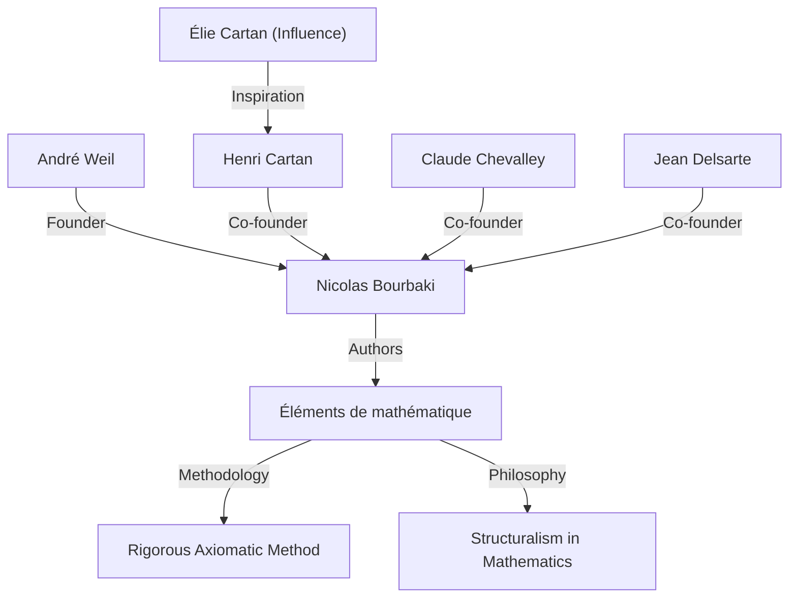
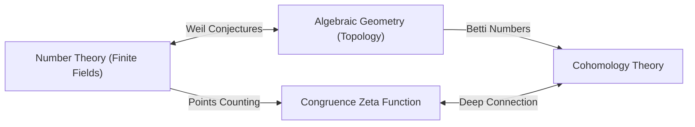

## 1. Introduction : Architecte des Mathématiques Modernes

[André Weil](https://kenji.blog/fr/p/weil/) (6 mai 1906 - 6 août 1998) fut l'une des figures les plus influentes du monde mathématique du 20e siècle. Ses travaux ont profondément relié des domaines qui s'étaient développés séparément jusque-là — la théorie des nombres, la géométrie algébrique et la topologie — créant ainsi un paradigme entièrement nouveau dans les mathématiques modernes. En particulier, les **« conjectures de Weil »** qu'il a proposées ont servi de boussole pour la recherche mathématique au cours des décennies suivantes, inspirant massivement la génération suivante de génies tels qu'[Alexandre Grothendieck](https://kenji.blog/fr/p/grothendieck/) et Pierre Deligne. Cet article détaille sa vie extraordinaire, son rôle dans la fondation du mathématicien fictif **« Nicolas Bourbaki »** , et le profond héritage mathématique qu'il a laissé.

## 2. Le Parcours d'un Jeune Prodige : De Paris au Monde

Weil est né à Paris, en France, dans une famille juive cultivée. Sa sœur cadette, Simone Weil, a également marqué l'histoire en tant que célèbre philosophe et militante sociale. Dès son plus jeune âge, Weil a fait preuve d'un talent extraordinaire tant pour les langues que pour les mathématiques ; c'était un prodige capable de lire des textes classiques en sanskrit et en grec dans leurs versions originales.

À l'âge précoce de 16 ans, il entre à l'École Normale Supérieure (ENS), la plus prestigieuse institution d'enseignement de France. Il y rencontre de brillants mathématiciens comme Henri Cartan, qui deviendront ses amis pour la vie. Après l'obtention de son diplôme, Weil a voyagé dans les centres académiques européens, notamment à Rome, Göttingen et Berlin, élargissant ses horizons en apprenant directement des mathématiciens de premier plan de l'époque, tels que [Carl Ludwig Siegel](https://kenji.blog/fr/p/siegel/) et [Emmy Noether](https://kenji.blog/fr/p/noether/).

## 3. Expérience en Inde et Dévouement à la Philosophie

En 1930, à l'âge de 24 ans, Weil devient professeur de mathématiques à l'Université Musulmane d'Aligarh en Inde. Ce séjour en Inde a laissé une empreinte profonde sur sa vie. Il s'est profondément consacré à la littérature sanskrite et à la philosophie hindoue, en particulier la *Bhagavad Gita*, dont les idées lui ont servi de soutien spirituel tout au long de sa vie.

En Inde, il n'a pas seulement mené des recherches mathématiques, mais s'est également engagé profondément avec les intellectuels locaux. On dit que la compréhension des diverses cultures et la vaste perspective cultivées au cours de cette période ont formé la base intuitive qui lui a permis plus tard de découvrir de profondes analogies entre différents domaines des mathématiques (comme la théorie des nombres et la géométrie).

## 4. La Naissance de Nicolas Bourbaki : Reconstruire les Mathématiques

Dans les années 1930, la communauté mathématique française stagnait, en grande partie à cause de la perte de nombreux jeunes mathématiciens prometteurs lors de la Première Guerre mondiale. Préoccupé par cette situation, Weil, avec Cartan, Claude Chevalley, Jean Delsarte et d'autres, a lancé un grand projet pour reconstruire les mathématiques de fond en comble.

Ils ont adopté le pseudonyme d'un mathématicien russe fictif, **« Nicolas Bourbaki »** , et ont commencé à écrire en collaboration une série de livres intitulée *Éléments de mathématique*.

La caractéristique déterminante de Bourbaki était son développement complètement axiomatique et rigoureux des mathématiques du point de vue des **« structures »** (structures algébriques, d'ordre et topologiques). La personnalité énergique de Weil, son érudition écrasante et sa rigueur intransigeante ont joué un rôle crucial dans la détermination du style d'écriture et de la philosophie de Bourbaki. Les activités de Bourbaki allaient par la suite transformer le style de l'enseignement et de la recherche mathématiques dans le monde entier.

## 5. Guerre et Emprisonnement : Le Miracle à la Prison de Rouen

Avec le déclenchement de la Seconde Guerre mondiale en 1939, le destin de Weil a été gravement bouleversé. Il a refusé le service militaire et s'est enfui en Finlande, où il a été pris par erreur pour un espion soviétique et a failli être exécuté. Il a été sauvé grâce aux efforts de l'éminent mathématicien Rolf Nevanlinna, mais a ensuite été expulsé vers la France et emprisonné à Rouen.

Fait remarquable cependant, la créativité mathématique de Weil a atteint son zénith dans ces conditions difficiles. À l'intérieur de sa cellule de prison, il a achevé l'une de ses plus grandes réalisations : la **« Preuve de l'hypothèse de [Riemann](https://kenji.blog/fr/p/riemann/) pour les courbes algébriques sur les corps finis »** . Dans des lettres adressées à sa sœur Simone, il a discuté avec passion de la joie de cette découverte et de l'importance de « l'analogie » en mathématiques.

## 6. Les Conjectures de Weil : Un Pont Entre Géométrie Algébrique et Théorie des Nombres

Après sa libération et un bref passage dans l'armée, Weil a miraculeusement réussi à s'échapper avec sa famille vers les États-Unis. Après une période à l'Université de Chicago, il est finalement devenu professeur permanent à l'Institute for Advanced Study (IAS) de Princeton.

En 1949, il a publié son œuvre majeure, les **« conjectures de Weil »** . Celles-ci proposaient un lien étonnant entre le nombre de points sur les variétés algébriques (l'ensemble des solutions aux équations algébriques) sur des corps finis et les propriétés topologiques (comme le nombre de trous) que ces variétés possèdent sur les nombres complexes. Les conjectures de Weil se composent des quatre parties suivantes :

1.  **Rationalité** : La fonction zêta de congruence $Z(X, t)$ est une fonction rationnelle.
2.  **Équation fonctionnelle** : La fonction zêta satisfait une symétrie spécifique.
3.  **Analogue de l'hypothèse de [Riemann](https://kenji.blog/fr/p/riemann/)** : Les valeurs absolues des zéros et des pôles de la fonction zêta suivent des règles spécifiques.
4.  **Lien avec les nombres de Betti** : Le degré de la fonction zêta coïncide avec les nombres de Betti de la variété.

En tant que formulation mathématique, la fonction zêta de congruence d'une variété projective non singulière $X$ sur un corps fini $\mathbb{F}_q$ est définie comme suit :

$$ Z(X, t) = \exp \left( \sum_{m=1}^{\infty} \frac{|X(\mathbb{F}_{q^m})|}{m} t^m \right) $$

Ici, $|X(\mathbb{F}_{q^m})|$ représente le nombre de points rationnels de $X$ dans l'extension de corps $\mathbb{F}_{q^m}$.

Pour prouver ces profondes conjectures, [Alexandre Grothendieck](https://kenji.blog/fr/p/grothendieck/) a construit de toutes pièces le cadre théorique massif de la théorie des schémas et de la cohomologie étale. Puis, en 1974, l'élève de Grothendieck, Pierre Deligne, a prouvé l'obstacle final, « l'analogue de l'hypothèse de [Riemann](https://kenji.blog/fr/p/riemann/) », résolvant complètement les conjectures de Weil. Ce grand drame est considéré comme l'une des plus grandes réalisations monumentales des mathématiques du 20e siècle.

## 7. Autres Contributions Significatives : Adèles, Idèles et le Groupe de Weil

Les contributions de Weil ne se sont pas limitées à proposer des conjectures. Il a affiné les théories des **« adèles »** et des **« idèles »** , qui sont devenues des langages essentiels dans la théorie moderne des nombres. Cela a complété un cadre puissant en théorie des nombres qui relie le local au global.

De plus, il a introduit le **« groupe de Weil »** , une extension du concept de groupe de [Galois](https://kenji.blog/fr/p/galois/), qui a joué un rôle extrêmement important dans l'unification de la théorie du corps de classes local et global. Ces concepts continuent d'être activement étudiés aujourd'hui comme fondement du « programme de Langlands », un problème non résolu massif des mathématiques modernes. Par ailleurs, les objets mathématiques portant son nom sont trop nombreux pour être mentionnés, y compris le « couplage de Weil » utilisé dans la cryptographie sur les courbes elliptiques et la « métrique de Weil-Petersson » dans la géométrie des espaces de modules.

## 8. Fin de Vie et Héritage Mathématique

Weil s'est engagé dans la recherche et l'enseignement pendant de nombreuses années à l'Institute for Advanced Study de Princeton, encadrant de nombreux successeurs. Il possédait de vastes connaissances et une perspicacité aiguë, et était parfois connu comme un critique mordant. Il avait également une profonde connaissance de l'histoire des mathématiques, et les livres qu'il a écrits sur le sujet sont très appréciés comme des chefs-d'œuvre pleins de perspicacité historique.

En 1998, [André Weil](https://kenji.blog/fr/p/weil/) est décédé à l'âge de 92 ans. La graine de la « fusion de la théorie des nombres et de la géométrie » qu'il a semée a fleuri brillamment dans les mathématiques modernes. Ses réalisations survivantes, et son attitude intransigeante envers les mathématiques, continueront sans doute à fasciner et à guider les mathématiciens pour toujours. Sa vie fut véritablement une grande épopée où l'histoire turbulente du 20e siècle a croisé l'éclat de l'intellect humain.
