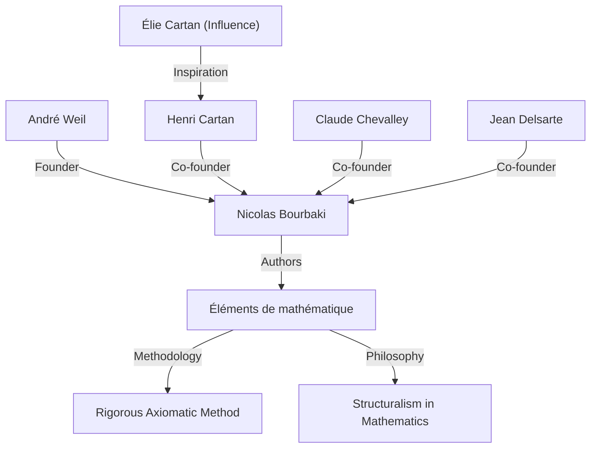
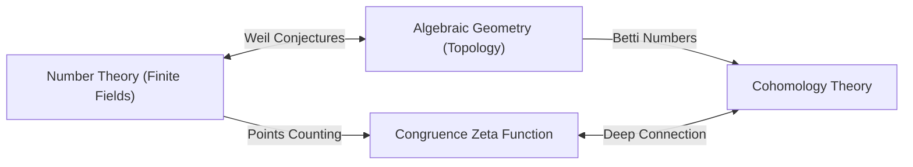

## 1. परिचय: आधुनिक गणित के वास्तुकार

[आंद्रे वेइल](https://kenji.blog/p/weil/) ([André Weil](https://kenji.blog/p/weil/), 6 मई 1906 - 6 अगस्त 1998) 20वीं सदी की गणितीय दुनिया की सबसे प्रभावशाली हस्तियों में से एक थे। उनके काम ने उन क्षेत्रों को गहराई से जोड़ा जो पहले अलग-अलग विकसित हुए थे - संख्या सिद्धांत, बीजीय ज्यामिति और टोपोलॉजी - जिससे आधुनिक गणित में एक बिल्कुल नया प्रतिमान (paradigm) बना। विशेष रूप से, उनके प्रस्तावित **"वेइल अनुमानों"** (Weil conjectures) ने अगले कुछ दशकों में गणितीय शोध के लिए एक कंपास के रूप में कार्य किया, जिससे अलेक्जेंडर ग्रोटेंडिक ([Alexander Grothendieck](https://kenji.blog/p/grothendieck/)) और पियरे डेलिग्ने (Pierre Deligne) जैसे अगली पीढ़ी के प्रतिभाशाली लोगों को अपार प्रेरणा मिली। यह लेख उनके असाधारण जीवन, काल्पनिक गणितज्ञ **"निकोलस बोरबाकी"** (Nicolas Bourbaki) की स्थापना में उनकी भूमिका, और उनके द्वारा छोड़ी गई गहन गणितीय विरासत का विवरण देता है।

## 2. एक युवा विलक्षण प्रतिभा की यात्रा: पेरिस से दुनिया तक

वेइल का जन्म पेरिस, फ्रांस में एक सुसंस्कृत यहूदी परिवार में हुआ था। उनकी छोटी बहन, सिमोन वेइल (Simone Weil) ने भी एक प्रसिद्ध दार्शनिक और सामाजिक कार्यकर्ता के रूप में इतिहास में अपनी छाप छोड़ी। कम उम्र से ही, वेइल ने भाषाओं और गणित दोनों में असाधारण प्रतिभा दिखाई; वह एक विलक्षण प्रतिभा वाले थे जो संस्कृत और ग्रीक में शास्त्रीय ग्रंथों को उनके मूल रूपों में पढ़ सकते थे।

16 साल की छोटी उम्र में, उन्होंने फ्रांस के प्रमुख शैक्षणिक संस्थान इकोले नॉर्मले सुप्रीयर (ENS) में प्रवेश लिया। वहां, उनकी मुलाकात हेनरी कार्टन (Henri Cartan) जैसे मेधावी गणितज्ञों से हुई, जो जीवन भर के लिए उनके दोस्त बन गए। स्नातक होने के बाद, वेइल ने रोम, गौटिंगेन (Göttingen) और बर्लिन सहित यूरोपीय अकादमिक केंद्रों की यात्रा की, और उस समय के शीर्ष गणितज्ञों, जैसे [कार्ल लुडविग सीगल](https://kenji.blog/p/siegel/) ([Carl Ludwig Siegel](https://kenji.blog/p/siegel/)) और एमी नोथेर ([Emmy Noether](https://kenji.blog/p/noether/)) से सीधे सीखकर अपने क्षितिज को व्यापक बनाया।

## 3. भारत में अनुभव और दर्शन के प्रति समर्पण

1930 में, 24 वर्ष की आयु में, वेइल भारत में अलीगढ़ मुस्लिम विश्वविद्यालय में गणित के प्रोफेसर बने। भारत में इस प्रवास ने उनके जीवन पर गहरी छाप छोड़ी। वे संस्कृत साहित्य और हिंदू दर्शन, विशेष रूप से *भगवद गीता* के प्रति गहराई से समर्पित हो गए, जिसके विचारों ने उनके पूरे जीवन में आध्यात्मिक समर्थन के रूप में कार्य किया।

भारत में, उन्होंने न केवल गणितीय शोध किया, बल्कि स्थानीय बुद्धिजीवियों के साथ भी गहराई से जुड़े। ऐसा कहा जाता है कि इस अवधि के दौरान विविध संस्कृतियों की समझ और विकसित व्यापक दृष्टिकोण ने उनके लिए एक सहज ज्ञान युक्त आधार तैयार किया, जब उन्होंने बाद में गणित के विभिन्न क्षेत्रों (जैसे संख्या सिद्धांत और ज्यामिति) के बीच गहरी समानताएं खोजीं।

## 4. निकोलस बोरबाकी का जन्म: गणित का पुनर्निर्माण

1930 के दशक में, फ्रांसीसी गणितीय समुदाय गतिहीन (stagnating) था, जो मुख्य रूप से प्रथम विश्व युद्ध में कई होनहार युवा गणितज्ञों के नुकसान के कारण था। इस स्थिति से चिंतित होकर, वेइल ने कार्टन, क्लाउड चेवेली (Claude Chevalley), जीन डेलसार्टे (Jean Delsarte) और अन्य लोगों के साथ मिलकर, गणित को जमीन से ऊपर तक फिर से बनाने के लिए एक भव्य परियोजना शुरू की।

उन्होंने एक काल्पनिक रूसी गणितज्ञ, **"निकोलस बोरबाकी"** का छद्म नाम अपनाया, और संयुक्त रूप से *Éléments de mathématique* (गणित के तत्व) नामक पुस्तकों की एक श्रृंखला लिखना शुरू किया।

बोरबाकी की परिभाषित विशेषता **"संरचनाओं"** (बीजीय, क्रम और टोपोलॉजिकल संरचनाओं) के परिप्रेक्ष्य से गणित का पूरी तरह से स्वयंसिद्ध (axiomatic) और कठोर विकास था। वेइल के सशक्त व्यक्तित्व, असीम पांडित्य (erudition) और अडिग कठोरता ने बोरबाकी की लेखन शैली और दर्शन को निर्धारित करने में महत्वपूर्ण भूमिका निभाई। बोरबाकी की गतिविधियों ने बाद में दुनिया भर में गणितीय शिक्षा और अनुसंधान की शैली को बदल दिया।

## 5. युद्ध और कारावास: रूएन जेल में चमत्कार

1939 में द्वितीय विश्व युद्ध के प्रकोप के साथ, वेइल का भाग्य बुरी तरह से लड़खड़ा गया। उन्होंने सैन्य सेवा से इनकार कर दिया और फिनलैंड भाग गए, जहां उन्हें गलती से एक सोवियत जासूस के रूप में पहचान लिया गया और लगभग फांसी दे दी गई थी। उन्हें प्रमुख गणितज्ञ रॉल्फ नेवानलिना (Rolf Nevanlinna) के प्रयासों से बचाया गया था, लेकिन बाद में फ्रांस वापस भेज दिया गया और रूएन (Rouen) में जेल में डाल दिया गया।

हालाँकि, उल्लेखनीय रूप से, वेइल की गणितीय रचनात्मकता इन कठोर परिस्थितियों में अपने चरम पर पहुँच गई। अपनी जेल की कोठरी के अंदर, उन्होंने अपनी सबसे बड़ी उपलब्धियों में से एक को पूरा किया: **"परिमित क्षेत्रों पर बीजीय वक्रों के लिए रीमैन परिकल्पना का प्रमाण"** । अपनी बहन सिमोन को लिखे पत्रों में, उन्होंने इस खोज की खुशी और गणित में "समानता" (analogy) के महत्व पर भावुकता से चर्चा की।

## 6. वेइल अनुमान: बीजीय ज्यामिति और संख्या सिद्धांत के बीच एक पुल

अपनी रिहाई और सेना में एक संक्षिप्त कार्यकाल के बाद, वेइल चमत्कारिक ढंग से अपने परिवार के साथ संयुक्त राज्य अमेरिका भागने में सफल रहे। शिकागो विश्वविद्यालय में एक अवधि के बाद, वह अंततः प्रिंसटन में इंस्टीट्यूट फॉर एडवांस्ड स्टडी (IAS) में स्थायी प्रोफेसर बन गए।

1949 में, उन्होंने अपना हस्ताक्षर कार्य, **"वेइल अनुमान"** प्रकाशित किया। इसने परिमित क्षेत्रों (finite fields) पर बीजीय किस्मों (बीजीय समीकरणों के समाधान का समूह) पर बिंदुओं की संख्या और उन किस्मों के जटिल संख्याओं पर होने वाले टोपोलॉजिकल गुणों (जैसे कि छिद्रों की संख्या) के बीच एक आश्चर्यजनक संबंध का प्रस्ताव रखा। वेइल अनुमानों में निम्नलिखित चार भाग होते हैं:

1.  **तार्किकता (Rationality)**: सर्वांगसम जीटा फलन (Congruence zeta function) $Z(X, t)$ एक परिमेय फलन (rational function) है।
2.  **कार्यात्मक समीकरण (Functional equation)**: जीटा फलन एक विशिष्ट समरूपता को संतुष्ट करता है।
3.  **रीमैन परिकल्पना का एनालॉग (Analogue of the [Riemann hypothesis](https://kenji.blog/p/riemann-hypothesis/))**: जीटा फलन के शून्य और ध्रुवों के पूर्ण मान विशिष्ट नियमों का पालन करते हैं।
4.  **बेट्टी संख्याओं के साथ संबंध (Connection with Betti numbers)**: जीटा फलन की डिग्री विविधता की बेट्टी संख्याओं के साथ मेल खाती है।

गणितीय सूत्रीकरण के रूप में, परिमित क्षेत्र $\mathbb{F}_q$ पर गैर-एकवचन प्रक्षेप्य विविधता (non-singular projective variety) $X$ का सर्वांगसम जीटा फलन इस प्रकार परिभाषित किया गया है:

$$ Z(X, t) = \exp \left( \sum_{m=1}^{\infty} \frac{|X(\mathbb{F}_{q^m})|}{m} t^m \right) $$

यहाँ, $|X(\mathbb{F}_{q^m})|$ विस्तार क्षेत्र $\mathbb{F}_{q^m}$ में $X$ के परिमेय बिंदुओं (rational points) की संख्या का प्रतिनिधित्व करता है।

इन गहन अनुमानों को साबित करने के लिए, अलेक्जेंडर ग्रोटेंडिक ने खरोंच (scratch) से योजना सिद्धांत (scheme theory) और एटाले कोहोलॉजी (étale cohomology) का विशाल सैद्धांतिक ढांचा तैयार किया। फिर, 1974 में, ग्रोटेंडिक के छात्र पियरे डेलिग्ने ने अंतिम बाधा, "रीमैन परिकल्पना का एनालॉग" साबित किया, जिससे वेइल अनुमान पूरी तरह से हल हो गए। इस भव्य नाटक को 20वीं सदी के गणित में सबसे बड़ी स्मारकीय उपलब्धियों में से एक माना जाता है।

## 7. अन्य महत्वपूर्ण योगदान: एडेल्स, इडेल्स और वेइल समूह

वेइल का योगदान अनुमान लगाने तक ही सीमित नहीं था। उन्होंने **"एडेल्स"** (adeles) और **"इडेल्स"** (ideles) के सिद्धांतों को परिष्कृत किया, जो आधुनिक संख्या सिद्धांत में आवश्यक भाषाएं बन गई हैं। इसने संख्या सिद्धांत में एक शक्तिशाली रूपरेखा (framework) पूरी की जो स्थानीय को वैश्विक (local to global) से जोड़ती है।

इसके अलावा, उन्होंने **"वेइल समूह"** (Weil group) पेश किया, जो गैल्वा समूह (Galois group) की अवधारणा का एक विस्तार है, जिसने स्थानीय और वैश्विक वर्ग क्षेत्र सिद्धांत को एकजुट करने में अत्यंत महत्वपूर्ण भूमिका निभाई। "लैंगलैंड्स प्रोग्राम" (Langlands program) की नींव के रूप में आज भी इन अवधारणाओं पर सक्रिय रूप से शोध किया जा रहा है, जो आधुनिक गणित में एक विशाल अनसुलझी समस्या है। इसके अलावा, उनके नाम वाले गणितीय वस्तुएं अनगिनत हैं, जिनमें अण्डाकार वक्र क्रिप्टोग्राफी (elliptic curve cryptography) में उपयोग किए जाने वाले "वेइल पेयरिंग" (Weil pairing) और मोडुली रिक्त स्थान की ज्यामिति में "वेइल-पीटरसन मीट्रिक" (Weil-Petersson metric) शामिल हैं।

## 8. बाद का जीवन और गणितीय विरासत

वेइल ने प्रिंसटन में इंस्टीट्यूट फॉर एडवांस्ड स्टडी में कई वर्षों तक अनुसंधान और शिक्षा में भाग लिया, और कई उत्तराधिकारियों का मार्गदर्शन किया। उनके पास व्यापक ज्ञान और गहरी अंतर्दृष्टि थी, और कभी-कभी उन्हें एक तीखे आलोचक के रूप में जाना जाता था। उन्हें गणित के इतिहास का गहरा ज्ञान भी था, और इस विषय पर उनके द्वारा लिखी गई पुस्तकों को ऐतिहासिक अंतर्दृष्टि से भरी उत्कृष्ट कृतियों के रूप में अत्यधिक माना जाता है।

1998 में, [आंद्रे वेइल](https://kenji.blog/p/weil/) का 92 वर्ष की आयु में निधन हो गया। "संख्या सिद्धांत और ज्यामिति के संलयन" का बीज जो उन्होंने बोया था, वह आधुनिक गणित में शानदार ढंग से खिला है। उनकी जीवित उपलब्धियाँ, और गणित के प्रति उनका असंगत रवैया, निस्संदेह हमेशा गणितज्ञों को मोहित और निर्देशित करता रहेगा। उनका जीवन वास्तव में एक भव्य महाकाव्य था जहां 20वीं सदी के अशांत इतिहास ने मानव बुद्धि की चमक को पार कर लिया।
