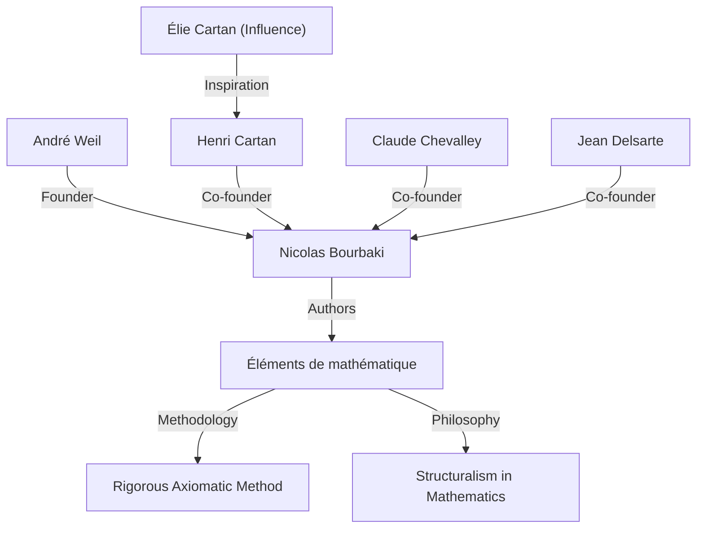
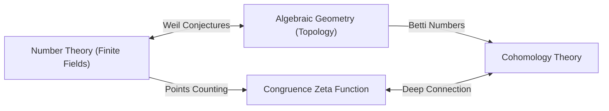

## 1. Pendahuluan: Arsitek Matematika Modern

André Weil (6 Mei 1906 - 6 Agustus 1998) adalah salah satu tokoh paling berpengaruh di dunia matematika abad ke-20. Karyanya sangat menghubungkan bidang-bidang yang sebelumnya berkembang secara terpisah—teori bilangan, geometri aljabar, dan topologi—menciptakan paradigma yang sama sekali baru dalam matematika modern. Secara khusus, **"Dugaan Weil"** (Weil conjectures) yang diusulkannya berfungsi sebagai kompas untuk penelitian matematika selama beberapa dekade berikutnya, memberikan inspirasi luar biasa bagi generasi jenius berikutnya seperti Alexander Grothendieck dan Pierre Deligne. Artikel ini merinci kehidupannya yang luar biasa, perannya dalam mendirikan matematikawan fiksi **"Nicolas Bourbaki"** , dan warisan matematika mendalam yang ditinggalkannya.

## 2. Perjalanan Sang Jenius Muda: Dari Paris ke Dunia

Weil lahir di Paris, Prancis, dari keluarga Yahudi yang berbudaya. Adik perempuannya, Simone Weil, juga meninggalkan jejak dalam sejarah sebagai filsuf dan aktivis sosial yang terkenal. Sejak usia muda, Weil menunjukkan bakat luar biasa dalam bahasa dan matematika; dia adalah anak ajaib yang mampu membaca teks klasik dalam bahasa Sansekerta dan Yunani dalam bentuk aslinya.

Pada usia muda 16 tahun, ia memasuki École Normale Supérieure (ENS), institusi pendidikan terkemuka di Prancis. Di sana, ia bertemu dengan matematikawan brilian seperti Henri Cartan, yang akan menjadi teman seumur hidupnya. Setelah lulus, Weil bepergian melintasi pusat akademik Eropa termasuk Roma, Göttingen, dan Berlin, memperluas wawasannya dengan belajar langsung dari matematikawan tingkat atas pada masanya, seperti Carl Ludwig Siegel dan Emmy Noether.

## 3. Pengalaman di India dan Pengabdian pada Filsafat

Pada tahun 1930, pada usia 24, Weil menjadi profesor matematika di Universitas Muslim Aligarh di India. Tinggal di India ini meninggalkan jejak mendalam dalam hidupnya. Ia menjadi sangat mengabdi pada literatur Sansekerta dan filsafat Hindu, terutama *Bhagavad Gita*, yang gagasan-gagasannya berfungsi sebagai dukungan spiritual baginya sepanjang hidupnya.

Di India, ia tidak hanya melakukan penelitian matematika tetapi juga terlibat secara mendalam dengan kaum intelektual lokal. Dikatakan bahwa pemahaman tentang beragam budaya dan perspektif luas yang dipupuk selama periode ini membentuk landasan intuitif baginya ketika ia kemudian menemukan analogi mendalam antara berbagai bidang matematika (seperti teori bilangan dan geometri).

## 4. Kelahiran Nicolas Bourbaki: Merekonstruksi Matematika

Pada tahun 1930-an, komunitas matematika Prancis mengalami stagnasi, sebagian besar karena hilangnya banyak matematikawan muda yang menjanjikan dalam Perang Dunia I. Khawatir dengan situasi ini, Weil, bersama Cartan, Claude Chevalley, Jean Delsarte, dan lainnya, meluncurkan proyek besar untuk merekonstruksi matematika dari bawah ke atas.

Mereka mengadopsi nama samaran matematikawan Rusia fiksi, **"Nicolas Bourbaki"** , dan mulai menulis serangkaian buku secara kolaboratif berjudul *Éléments de mathématique*.

Karakteristik yang menentukan dari Bourbaki adalah perkembangannya yang sepenuhnya aksiomatik dan ketat dari matematika dari perspektif **"struktur"** (struktur aljabar, urutan, dan topologi). Kepribadian Weil yang kuat, pengetahuannya yang luar biasa, dan ketegasannya yang tanpa kompromi memainkan peran penting dalam menentukan gaya penulisan dan filsafat Bourbaki. Kegiatan Bourbaki nantinya akan mengubah gaya pendidikan dan penelitian matematika di seluruh dunia.

## 5. Perang dan Pemenjaraan: Keajaiban di Penjara Rouen

Dengan pecahnya Perang Dunia II pada tahun 1939, nasib Weil sangat terombang-ambing. Dia menolak dinas militer dan melarikan diri ke Finlandia, di mana dia secara keliru diidentifikasi sebagai mata-mata Soviet dan hampir dieksekusi. Dia diselamatkan oleh upaya matematikawan terkemuka Rolf Nevanlinna tetapi kemudian dideportasi kembali ke Prancis dan dipenjarakan di Rouen.

Namun, yang luar biasa, kreativitas matematika Weil mencapai puncaknya di bawah kondisi yang keras ini. Di dalam sel penjaranya, ia menyelesaikan salah satu pencapaian terbesarnya: **"Bukti hipotesis Riemann untuk kurva aljabar atas lapangan hingga"** . Dalam surat-surat kepada saudara perempuannya Simone, ia dengan penuh semangat mendiskusikan kegembiraan penemuan ini dan pentingnya "analogi" dalam matematika.

## 6. Dugaan Weil: Jembatan Antara Geometri Aljabar dan Teori Bilangan

Setelah pembebasannya dan bertugas sebentar di militer, Weil secara ajaib berhasil melarikan diri bersama keluarganya ke Amerika Serikat. Setelah beberapa waktu di Universitas Chicago, ia akhirnya menjadi profesor tetap di Institute for Advanced Study (IAS) di Princeton.

Pada tahun 1949, ia menerbitkan karya khasnya, **"Dugaan Weil"** . Ini mengusulkan hubungan yang menakjubkan antara jumlah titik pada varietas aljabar (himpunan solusi untuk persamaan aljabar) di atas lapangan hingga dan properti topologi (seperti jumlah lubang) yang dimiliki varietas tersebut di atas bilangan kompleks. Dugaan Weil terdiri dari empat bagian berikut:

1.  **Rasionalitas**: Fungsi zeta kongruensi $Z(X, t)$ adalah fungsi rasional.
2.  **Persamaan fungsional**: Fungsi zeta memenuhi simetri tertentu.
3.  **Analog hipotesis Riemann**: Nilai mutlak dari nol dan kutub fungsi zeta mengikuti aturan tertentu.
4.  **Koneksi dengan bilangan Betti**: Derajat fungsi zeta bertepatan dengan bilangan Betti varietas.

Sebagai formulasi matematika, fungsi zeta kongruensi dari varietas proyektif non-singular $X$ di atas lapangan hingga $\mathbb{F}_q$ didefinisikan sebagai berikut:

$$ Z(X, t) = \exp \left( \sum_{m=1}^{\infty} \frac{|X(\mathbb{F}_{q^m})|}{m} t^m \right) $$

Di sini, $|X(\mathbb{F}_{q^m})|$ mewakili jumlah titik rasional $X$ dalam lapangan ekstensi $\mathbb{F}_{q^m}$.

Untuk membuktikan dugaan mendalam ini, Alexander Grothendieck membangun kerangka teoretis masif dari teori skema dan kohomologi étale dari awal. Kemudian, pada tahun 1974, murid Grothendieck Pierre Deligne membuktikan rintangan terakhir, "analog hipotesis Riemann," sepenuhnya menyelesaikan dugaan Weil. Drama besar ini dianggap sebagai salah satu pencapaian monumental terbesar dalam matematika abad ke-20.

## 7. Kontribusi Signifikan Lainnya: Adele, Idele, dan Grup Weil

Kontribusi Weil tidak terbatas pada mengusulkan dugaan. Ia menyempurnakan teori **"adele"** dan **"idele"** , yang telah menjadi bahasa esensial dalam teori bilangan modern. Ini melengkapi kerangka kerja yang kuat dalam teori bilangan yang menghubungkan lokal ke global.

Selain itu, ia memperkenalkan **"Grup Weil"** , perluasan dari konsep grup Galois, yang memainkan peran sangat penting dalam menyatukan teori medan kelas lokal dan global. Konsep-konsep ini terus diteliti secara aktif saat ini sebagai dasar dari "program Langlands," sebuah masalah besar yang belum terpecahkan dalam matematika modern. Selain itu, objek matematika yang menggunakan namanya terlalu banyak untuk disebutkan, termasuk "pasangan Weil" (Weil pairing) yang digunakan dalam kriptografi kurva eliptik dan "metrik Weil-Petersson" dalam geometri ruang moduli.

## 8. Kehidupan Selanjutnya dan Warisan Matematika

Weil terlibat dalam penelitian dan pendidikan selama bertahun-tahun di Institute for Advanced Study di Princeton, membimbing banyak penerus. Dia memiliki pengetahuan luas dan wawasan yang tajam, dan kadang-kadang dikenal sebagai kritikus yang menggigit. Dia juga memiliki pengetahuan mendalam tentang sejarah matematika, dan buku-buku yang dia tulis tentang masalah ini sangat dihargai sebagai mahakarya yang penuh dengan wawasan sejarah.

Pada tahun 1998, André Weil meninggal dunia pada usia 92 tahun. Benih "perpaduan teori bilangan dan geometri" yang ia tabur telah mekar cemerlang dalam matematika modern. Pencapaiannya yang masih hidup, dan sikapnya yang tanpa kompromi terhadap matematika, tidak diragukan lagi akan terus memesona dan membimbing ahli matematika selamanya. Kehidupannya benar-benar epik agung di mana sejarah bergejolak abad ke-20 bersinggungan dengan kecemerlangan akal budi manusia.
