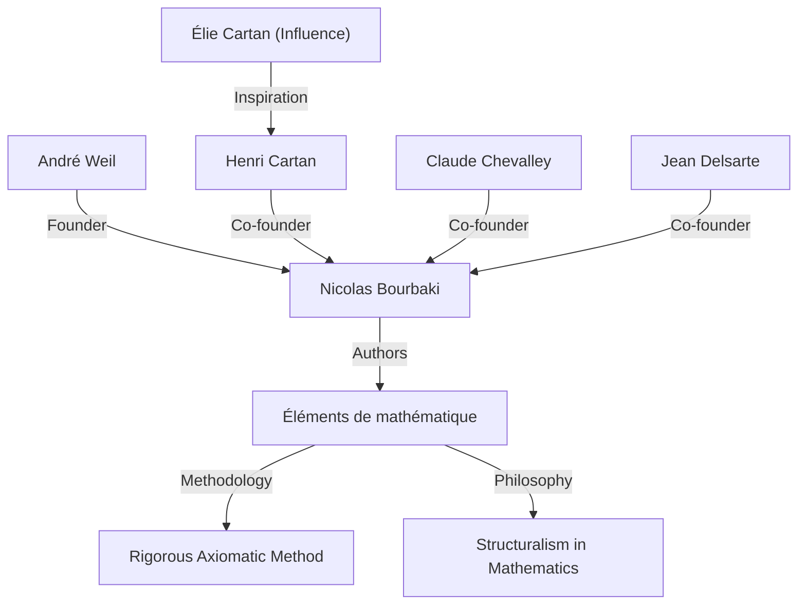
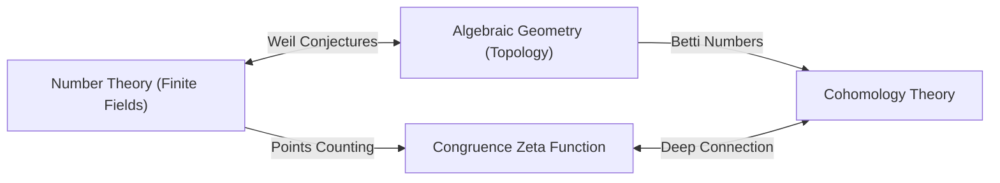

## 1. 서론: 현대 수학의 설계자

[앙드레 베유](https://kenji.blog/ko/p/weil/)([André Weil](https://kenji.blog/ko/p/weil/), 1906년 5월 6일 - 1998년 8월 6일)는 20세기 수학계에서 가장 영향력 있는 인물 중 하나였습니다. 그의 연구는 이전에는 독립적으로 발전했던 분야들—정수론, 대수기하학, 위상수학—을 깊이 연결하여 현대 수학에 완전히 새로운 패러다임을 창출했습니다. 특히 그가 제안한 **'베유 추측'** (Weil conjectures)은 이후 수십 년 동안 수학 연구의 나침반 역할을 했으며, [알렉산더 그로텐디크](https://kenji.blog/ko/p/grothendieck/)와 피에르 들리뉴 같은 다음 세대의 천재들에게 엄청난 영감을 주었습니다. 이 기사는 그의 비범한 삶, 가상의 수학자 **'니콜라 부르바키'** (Nicolas Bourbaki)를 창설하는 데 있어서의 그의 역할, 그리고 그가 남긴 심오한 수학적 유산에 대해 자세히 설명합니다.

## 2. 젊은 신동의 여정: 파리에서 세계로

베유는 프랑스 파리의 교양 있는 유대인 가정에서 태어났습니다. 그의 여동생 시몬 베유(Simone Weil) 역시 저명한 철학자이자 사회 운동가로서 역사에 이름을 남겼습니다. 어린 시절부터 베유는 언어와 수학 모두에서 비범한 재능을 보였으며, 산스크리트어와 그리스어 고전 텍스트를 원어로 읽을 수 있는 신동이었습니다.

16세라는 어린 나이에 그는 프랑스 최고의 교육 기관인 에콜 노르말 슈페리외르(ENS)에 입학했습니다. 그곳에서 그는 앙리 카르탕(Henri Cartan)과 같은 뛰어난 수학자들을 만났고, 이들은 평생의 친구가 되었습니다. 졸업 후 베유는 로마, 괴팅겐, 베를린 등 유럽의 학술 중심지를 여행하며, [카를 루트비히 지겔](https://kenji.blog/ko/p/siegel/)([Carl Ludwig Siegel](https://kenji.blog/ko/p/siegel/)), [에미 뇌터](https://kenji.blog/ko/p/noether/)([Emmy Noether](https://kenji.blog/ko/p/noether/)) 등 당시 최고의 수학자들로부터 직접 배우며 시야를 넓혔습니다.

## 3. 인도에서의 경험과 철학에 대한 헌신

1930년, 24세의 나이에 베유는 인도의 알리가르 이슬람 대학에서 수학 교수가 되었습니다. 이 인도 체류는 그의 삶에 깊은 흔적을 남겼습니다. 그는 산스크리트어 문학과 힌두 철학, 특히 『바가바드 기타』에 깊이 헌신했으며, 이 책의 사상은 평생 동안 그의 정신적 지주가 되었습니다.

인도에서 그는 수학적 연구를 수행했을 뿐만 아니라 현지 지식인들과 깊이 교류했습니다. 이 시기에 배양된 다양한 문화에 대한 이해와 넓은 시각은 나중에 그가 서로 다른 수학 분야(정수론과 기하학 등) 사이의 깊은 유사성을 발견할 때 직관적인 토대가 되었다고 합니다.

## 4. 니콜라 부르바키의 탄생: 수학의 재구성

1930년대 프랑스 수학계는 제1차 세계 대전으로 수많은 유망한 젊은 수학자들을 잃은 탓에 침체되어 있었습니다. 이 상황을 우려한 베유는 카르탕, 클로드 슈발레(Claude Chevalley), 장 델사르트(Jean Delsarte) 등과 함께 처음부터 수학을 재구성하는 거대한 프로젝트를 시작했습니다.

그들은 가상의 러시아 수학자 **'니콜라 부르바키'** 라는 필명을 채택하고, 『수학 원론』(Éléments de mathématique)이라는 일련의 책을 공동으로 집필하기 시작했습니다.

부르바키의 가장 큰 특징은 **'구조'** (대수적, 순서 및 위상적 구조)의 관점에서 수학을 완전히 공리적이고 엄밀하게 전개했다는 것입니다. 베유의 강렬한 성격, 압도적인 박식함, 타협하지 않는 엄밀함은 부르바키의 집필 스타일과 철학을 결정하는 데 결정적인 역할을 했습니다. 부르바키의 활동은 이후 전 세계 수학 교육 및 연구 스타일을 변화시키게 됩니다.

## 5. 전쟁과 투옥: 루앙 감옥에서의 기적

1939년 제2차 세계 대전이 발발하자 베유의 운명은 크게 요동쳤습니다. 그는 병역을 거부하고 핀란드로 피신했지만, 그곳에서 소련 스파이로 오인되어 처형될 뻔했습니다. 그는 저명한 수학자 롤프 네반린나(Rolf Nevanlinna)의 노력으로 구출되었지만, 이후 프랑스로 추방되어 루앙의 감옥에 수감되었습니다.

그러나 놀랍게도 베유의 수학적 창조력은 이 가혹한 조건에서 절정에 달했습니다. 감옥 안에서 그는 그의 가장 위대한 업적 중 하나인 **'유한체상의 대수 곡선에 대한 리만 가설의 증명'** 을 완성했습니다. 여동생 시몬에게 보낸 편지에서 그는 이 발견의 기쁨과 수학에서 "유추"의 중요성에 대해 열정적으로 논의했습니다.

## 6. 베유 추측: 대수기하학과 정수론 사이의 다리

석방 후 군대에서 잠시 복무한 후, 베유는 기적적으로 가족과 함께 미국으로 탈출할 수 있었습니다. 시카고 대학을 거쳐 결국 프린스턴 고등연구소(IAS)의 종신 교수가 되었습니다.

1949년, 그는 자신의 대표작인 **'베유 추측'** 을 발표했습니다. 이것은 유한체상의 대수 다양체(대수 방정식의 해의 집합)에 있는 점의 수와 그 다양체가 복소수체상에서 갖는 위상적 성질(예: 구멍의 수) 사이의 놀라운 연관성을 제안했습니다. 베유 추측은 다음 네 가지 부분으로 구성됩니다.

1.  **유리성(Rationality)**: 합동 제타 함수 $Z(X, t)$는 유리 함수이다.
2.  **함수 방정식(Functional equation)**: 제타 함수는 특정한 대칭성을 만족한다.
3.  **리만 가설의 유사체(Analogue of the [Riemann hypothesis](https://kenji.blog/ko/p/riemann-hypothesis/))**: 제타 함수의 영점과 극점의 절댓값은 특정한 규칙을 따른다.
4.  **베티 수와의 연결(Connection with Betti numbers)**: 제타 함수의 차수는 다양체의 베티 수와 일치한다.

수학적 공식화로서, 유한체 $\mathbb{F}_q$상의 비특이 사영 다양체 $X$의 합동 제타 함수는 다음과 같이 정의됩니다.

$$ Z(X, t) = \exp \left( \sum_{m=1}^{\infty} \frac{|X(\mathbb{F}_{q^m})|}{m} t^m \right) $$

여기서 $|X(\mathbb{F}_{q^m})|$은 확장체 $\mathbb{F}_{q^m}$에서 $X$의 유리점의 수를 나타냅니다.

이 심오한 추측을 증명하기 위해 [알렉산더 그로텐디크](https://kenji.blog/ko/p/grothendieck/)는 스킴 이론과 에탈 코호몰로지라는 거대한 이론적 틀을 처음부터 구축했습니다. 그리고 1974년, 그로텐디크의 제자 피에르 들리뉴가 마지막 장애물인 "리만 가설의 유사체"를 증명함으로써 베유 추측을 완전히 해결했습니다. 이 장대한 드라마는 20세기 수학에서 가장 기념비적인 업적 중 하나로 여겨집니다.

## 7. 기타 중요한 공헌: 아델, 이델, 그리고 베유 군

베유의 공헌은 추측을 제안하는 데 그치지 않았습니다. 그는 현대 정수론에서 필수적인 언어가 된 **'아델'** (adele)과 **'이델'** (idele)의 이론을 정립했습니다. 이것은 국소와 대역을 연결하는 정수론의 강력한 틀을 완성했습니다.

또한 그는 갈루아 군 개념의 확장인 **'베유 군'** (Weil group)을 도입했는데, 이는 국소 및 대역 유체론을 통합하는 데 매우 중요한 역할을 했습니다. 이러한 개념들은 현대 수학의 거대한 미해결 문제인 "랭글랜즈 프로그램"의 토대로서 오늘날에도 활발히 연구되고 있습니다. 게다가 타원 곡선 암호화에 사용되는 '베유 페어링'(Weil pairing)과 모듈라이 공간의 기하학에 있는 '베유-페테르손 계량'(Weil-Petersson metric) 등 그의 이름이 붙은 수학적 대상은 이루 다 말할 수 없을 정도로 많습니다.

## 8. 노년의 삶과 수학적 유산

베유는 프린스턴 고등연구소에서 수년간 연구와 교육에 종사하며 수많은 후계자를 양성했습니다. 그는 방대한 지식과 날카로운 통찰력을 소유했으며, 때로는 신랄한 비평가로 알려지기도 했습니다. 그는 수학사에도 깊은 지식을 가지고 있었으며, 그 주제에 대해 쓴 책들은 역사적 통찰이 가득한 명저로 높은 평가를 받고 있습니다.

1998년 [앙드레 베유](https://kenji.blog/ko/p/weil/)는 92세의 나이로 세상을 떠났습니다. 그가 뿌린 "정수론과 기하학의 융합"이라는 씨앗은 현대 수학에서 화려하게 꽃을 피웠습니다. 그가 남긴 업적과 수학에 대한 타협하지 않는 태도는 틀림없이 수학자들을 영원히 매료시키고 인도할 것입니다. 그의 삶은 20세기의 격동적인 역사와 인간 지성의 빛남이 교차하는 진정 위대한 서사시였습니다.
