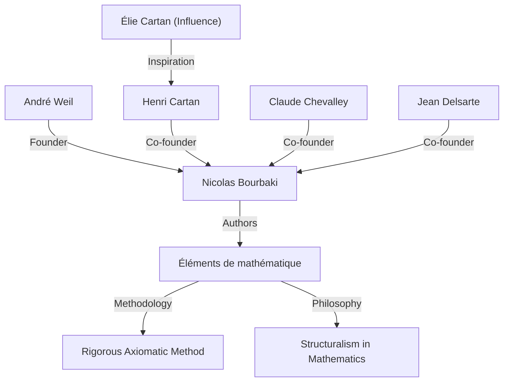
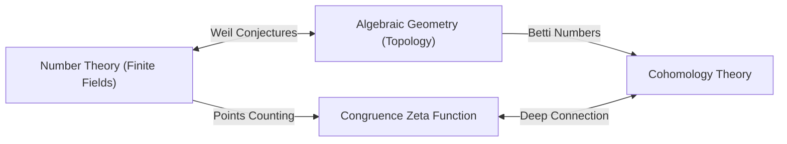

## 1. はじめに：現代数学の設計者

アンドレ・[ヴェイユ](https://kenji.blog/p/weil/)（André Weil, 1906年5月6日 - 1998年8月6日）は、20世紀の数学界において最も影響力のある人物の一人です。彼の業績は、数論、代数幾何学、位相幾何学という当時別々に発展していた分野を深く結びつけ、現代数学の全く新しいパラダイムを創出しました。特に彼が提唱した **「ヴェイユ予想」** （Weil conjectures）は、その後の数十年にわたる数学研究の羅針盤となり、[アレクサンドル・グロタンディーク](https://kenji.blog/p/grothendieck/)やピエール・ドリーニュといった次世代の天才たちに多大なインスピレーションを与えました。本記事では、彼の並外れた生涯と、架空の数学者 **「ニコラ・ブルバキ」** （Nicolas Bourbaki）の創設、そして彼が遺した深遠な数学的遺産について詳細に解説します。

## 2. 若き神童の歩み：パリから世界へ

[ヴェイユ](https://kenji.blog/p/weil/)はフランスのパリで、教養豊かなユダヤ系の家庭に生まれました。妹のシモーヌ・ヴェイユ（Simone Weil）も後に著名な哲学者・社会活動家として歴史に名を残しています。[ヴェイユ](https://kenji.blog/p/weil/)は幼少期から語学と数学において非凡な才能を発揮し、サンスクリット語やギリシャ語の古典を原典で読むことができるほどの天才でした。

16歳という若さで、フランス最高峰の教育機関であるエコール・ノルマル・シュペリウール（高等師範学校、ENS）に入学します。そこで彼はアンリ・カルタン（Henri Cartan）ら生涯の友となる優秀な数学者たちと出会いました。卒業後、[ヴェイユ](https://kenji.blog/p/weil/)はローマ、ゲッティンゲン、ベルリンなどヨーロッパ中の学術都市を巡り、カール・ジーゲル（Carl Ludwig Siegel）やエミー・ネーター（[Emmy Noether](https://kenji.blog/p/noether/)）ら当時のトップクラスの数学者たちから直接教えを受け、視野を大きく広げました。

## 3. インドでの経験と哲学への傾倒

1930年、[ヴェイユ](https://kenji.blog/p/weil/)は24歳でインドの Aligarh Muslim University（アリーガル・ムスリム大学）の数学教授に就任しました。このインド滞在は、彼の人生に深い足跡を残しました。彼はサンスクリット文学やヒンドゥー教の哲学、特に『バガヴァッド・ギーター』に深く傾倒し、その思想は彼の生涯にわたる精神的な支えとなりました。

インドで彼は、数学の研究だけでなく、地元の知識人たちとも深い交流を持ちました。この時期に培われた多様な文化への理解と広い視野は、後に彼が数学の異なる分野（数論と幾何学など）の間に横たわる深いアナロジー（類推）を見出す際の、直感的な基盤になったと言われています。

## 4. ニコラ・ブルバキの誕生：数学の再構築

1930年代のフランス数学界は、第一次世界大戦により多くの有望な若手数学者を失った影響で、旧態依然とした状況にありました。[ヴェイユ](https://kenji.blog/p/weil/)はこの状況を憂い、カルタン、クロード・シュヴァレー（Claude Chevalley）、ジャン・デルサルト（Jean Delsarte）らとともに、数学を根本から再構築するという壮大なプロジェクトを立ち上げました。

彼らは架空のロシア人数学者 **「ニコラ・ブルバキ」** を名乗り、『数学原論』（Éléments de mathématique）というシリーズを共同で執筆し始めました。

ブルバキの最大の特徴は、数学を **「構造」** （代数構造、順序構造、位相構造）という観点から完全に公理的かつ厳密に展開したことです。[ヴェイユ](https://kenji.blog/p/weil/)の強烈な個性、圧倒的な博識、そして妥協を許さない厳密さは、ブルバキの執筆スタイルと哲学を決定づける上で極めて重要な役割を果たしました。ブルバキの活動は、その後の世界の数学教育と研究のスタイルを一変させることになります。

## 5. 戦争と投獄：ルーアン刑務所での奇跡

1939年、第二次世界大戦が勃発すると、[ヴェイユ](https://kenji.blog/p/weil/)の運命は大きく翻弄されます。彼は兵役を拒否してフィンランドに逃れましたが、そこでソビエト連邦のスパイと誤認され、あわや処刑という危機に陥ります。著名な数学者ロルフ・ネヴァンリンナ（Rolf Nevanlinna）の尽力により命を取り留めましたが、フランスへ送還され、ルーアンの刑務所に収監されてしまいました。

しかし、驚くべきことに、[ヴェイユ](https://kenji.blog/p/weil/)の数学的創造力はこの劣悪な環境下で最高潮に達しました。彼は刑務所の独房の中で、彼の最も偉大な業績の一つである **「有限体上の代数曲線に関するリーマン予想の証明」** （Proof of the [Riemann hypothesis](https://kenji.blog/p/riemann-hypothesis/) for algebraic curves over finite fields）を完成させたのです。彼は妹シモーヌへの手紙の中で、この発見の喜びと、数学における「類推」の重要性について熱く語っています。

## 6. [ヴェイユ](https://kenji.blog/p/weil/)予想：代数幾何学と数論の架け橋

釈放後、軍隊への一時的な従軍を経て、[ヴェイユ](https://kenji.blog/p/weil/)は家族とともに奇跡的にアメリカ合衆国へと亡命を果たしました。シカゴ大学を経て、最終的にプリンストン高等研究所（IAS）の終身教授となります。

1949年、彼は自身の代表的な業績である **「[ヴェイユ](https://kenji.blog/p/weil/)予想」** を発表しました。これは、有限体上の代数多様体（代数方程式の解の集合）における点の数と、その多様体が複素数体上で持つ位相的性質（穴の数など）との間に、驚くべき関連性があることを主張するものでした。[ヴェイユ](https://kenji.blog/p/weil/)予想は以下の4つの部分から構成されます。

1.  **有理性（Rationality）**：合同ゼータ関数 $Z(X, t)$ は有理関数である。
2.  **関数等式（Functional equation）**：ゼータ関数は特定の対称性を満たす。
3.  **[リーマン予想](https://kenji.blog/p/riemann-hypothesis/)の類似（Analogue of the [Riemann hypothesis](https://kenji.blog/p/riemann-hypothesis/)）**：ゼータ関数の零点と極の絶対値は、特定の規則に従う。
4.  **ベッチ数との関係（Connection with Betti numbers）**：ゼータ関数の次数は多様体のベッチ数に一致する。

数学的な定式化として、有限体 $\mathbb{F}_q$ 上の非特異射影多様体 $X$ の合同ゼータ関数は次のように定義されます。

$$ Z(X, t) = \exp \left( \sum_{m=1}^{\infty} \frac{|X(\mathbb{F}_{q^m})|}{m} t^m \right) $$

ここで $|X(\mathbb{F}_{q^m})|$ は拡大体 $\mathbb{F}_{q^m}$ における $X$ の有理点の数を表します。

この深遠な予想を証明するために、[アレクサンドル・グロタンディーク](https://kenji.blog/p/grothendieck/)はスキーム論とエタール・コホモロジーという巨大な理論体系をゼロから構築しました。そして1974年、グロタンディークの弟子であるピエール・ドリーニュによって、最後の難関であった「リーマン予想の類似」が証明され、[ヴェイユ](https://kenji.blog/p/weil/)予想は完全に解決されました。この壮大なドラマは、20世紀数学における最大の金字塔の一つとされています。

## 7. その他の重要な貢献：アデール、イデール、そして[ヴェイユ](https://kenji.blog/p/weil/)群

[ヴェイユ](https://kenji.blog/p/weil/)の貢献は予想の提示だけにとどまりません。彼は現代数論において不可欠な言語となっている **「アデール」** （adele）と **「イデール」** （idele）の理論を整備しました。これにより、局所と大域を結びつける数論の強力な枠組みが完成しました。

さらに、[ガロア](https://kenji.blog/p/galois/)群の概念を拡張した **「ヴェイユ群」** （Weil group）を導入し、局所類体論と大域類体論の統合に極めて重要な役割を果たしました。これらの概念は、現代数学の巨大な未解決問題である「ラングランズ・プログラム」の基盤として、現在も盛んに研究されています。また、楕円曲線暗号などで用いられる「ヴェイユ・ペアリング（Weil pairing）」や、モジュライ空間の幾何学における「[ヴェイユ](https://kenji.blog/p/weil/)・ペーターソン計量（Weil-Petersson metric）」など、彼の名を冠した数学的対象は枚挙にいとまがありません。

## 8. 後年の生活と数学的遺産

[ヴェイユ](https://kenji.blog/p/weil/)はプリンストン高等研究所で長年にわたり研究と教育に従事し、数多くの後進を育成しました。彼は広範な知識と鋭い洞察力を持ち、時には辛辣な批評家としても知られていました。数学史にも深い造詣を持ち、彼の著した数学史の書籍は、歴史的洞察に満ちた名著として評価されています。

1998年、アンドレ・[ヴェイユ](https://kenji.blog/p/weil/)は92歳でこの世を去りました。彼が蒔いた「数論と幾何学の融合」という種は、現代数学において大輪の花を咲かせています。彼の残した業績、そして数学に対する妥協なき姿勢は、これからも永遠に数学者たちを魅了し、導き続けることでしょう。彼の人生は、まさに20世紀の歴史の激動と、人間の知性の輝きが交差する、壮大な叙事詩であったと言えます。
