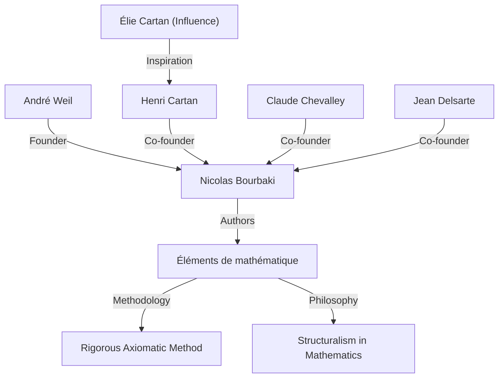
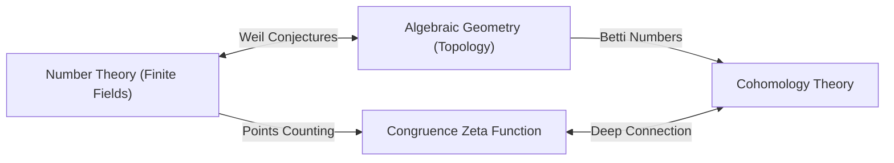

## 1. Introdução: Arquiteto da Matemática Moderna

André Weil (6 de maio de 1906 - 6 de agosto de 1998) foi uma das figuras mais influentes do mundo matemático do século XX. O seu trabalho conectou profundamente campos que anteriormente se haviam desenvolvido separadamente — a teoria dos números, a geometria algébrica e a topologia — criando um paradigma inteiramente novo na matemática moderna. Em particular, as suas propostas **"Conjecturas de Weil"** serviram de bússola para a investigação matemática durante as décadas seguintes, fornecendo imensa inspiração para a geração seguinte de génios, como Alexander Grothendieck e Pierre Deligne. Este artigo detalha a sua vida extraordinária, o seu papel na fundação do matemático fictício **"Nicolas Bourbaki"** , e o profundo legado matemático que deixou para trás.

## 2. A Jornada de um Jovem Prodígio: De Paris para o Mundo

Weil nasceu em Paris, França, numa família judaica culta. A sua irmã mais nova, Simone Weil, também deixou a sua marca na história como renomada filósofa e ativista social. Desde tenra idade, Weil demonstrou um talento extraordinário tanto para línguas como para matemática; era um prodígio capaz de ler textos clássicos em sânscrito e grego nas suas formas originais.

Com a tenra idade de 16 anos, ingressou na École Normale Supérieure (ENS), a principal instituição de ensino da França. Lá conheceu brilhantes matemáticos como Henri Cartan, que se tornariam seus amigos para toda a vida. Após a graduação, Weil viajou pelos centros académicos europeus, incluindo Roma, Göttingen e Berlim, ampliando os seus horizontes aprendendo diretamente com os matemáticos de topo da época, como Carl Ludwig Siegel e Emmy Noether.

## 3. Experiência na Índia e Devoção à Filosofia

Em 1930, aos 24 anos, Weil tornou-se professor de matemática na Universidade Muçulmana de Aligarh, na Índia. Esta estadia na Índia deixou uma marca profunda na sua vida. Dedicou-se profundamente à literatura sânscrita e à filosofia hindu, especialmente ao *Bhagavad Gita*, cujas ideias lhe serviram de apoio espiritual ao longo de toda a sua vida.

Na Índia, não só conduziu investigação matemática como também se envolveu profundamente com os intelectuais locais. Diz-se que a compreensão das diversas culturas e a ampla perspetiva cultivadas durante este período formaram a base intuitiva para ele quando, mais tarde, descobriu analogias profundas entre diferentes campos da matemática (como a teoria dos números e a geometria).

## 4. O Nascimento de Nicolas Bourbaki: Reconstruindo a Matemática

Na década de 1930, a comunidade matemática francesa estava estagnada, em grande parte devido à perda de muitos jovens matemáticos promissores na Primeira Guerra Mundial. Preocupado com esta situação, Weil, juntamente com Cartan, Claude Chevalley, Jean Delsarte e outros, lançou um grande projeto para reconstruir a matemática a partir do zero.

Adotaram o pseudónimo de um matemático russo fictício, **"Nicolas Bourbaki"** , e começaram a escrever colaborativamente uma série de livros intitulada *Éléments de mathématique*.

A característica definidora de Bourbaki foi o seu desenvolvimento completamente axiomático e rigoroso da matemática na perspetiva de **"estruturas"** (estruturas algébricas, de ordem e topológicas). A personalidade forte de Weil, a sua enorme erudição e o seu rigor intransigente desempenharam um papel crucial na determinação do estilo de escrita e da filosofia de Bourbaki. As atividades de Bourbaki viriam mais tarde a transformar o estilo do ensino e da investigação em matemática em todo o mundo.

## 5. Guerra e Prisão: O Milagre na Prisão de Rouen

Com o eclodir da Segunda Guerra Mundial em 1939, o destino de Weil foi gravemente abalado. Recusou o serviço militar e fugiu para a Finlândia, onde foi erradamente identificado como um espião soviético e quase executado. Foi salvo pelos esforços do proeminente matemático Rolf Nevanlinna, mas foi posteriormente deportado para a França e aprisionado em Rouen.

No entanto, notavelmente, a criatividade matemática de Weil atingiu o seu zénite sob estas duras condições. Dentro da sua cela de prisão, completou uma das suas maiores realizações: a **"Prova da hipótese de Riemann para curvas algébricas sobre corpos finitos"** . Em cartas à sua irmã Simone, ele discutiu apaixonadamente a alegria desta descoberta e a importância da "analogia" na matemática.

## 6. As Conjecturas de Weil: Uma Ponte entre a Geometria Algébrica e a Teoria dos Números

Após a sua libertação e um breve período no exército, Weil conseguiu, milagrosamente, escapar com a sua família para os Estados Unidos. Após um período na Universidade de Chicago, tornou-se finalmente professor permanente no Institute for Advanced Study (IAS) em Princeton.

Em 1949, publicou a sua obra de assinatura, as **"Conjecturas de Weil"** . Estas propuseram uma espantosa ligação entre o número de pontos nas variedades algébricas (o conjunto de soluções para equações algébricas) sobre corpos finitos e as propriedades topológicas (como o número de buracos) que essas variedades possuem sobre os números complexos. As conjecturas de Weil consistem nas quatro partes seguintes:

1.  **Racionalidade**: A função zeta de congruência $Z(X, t)$ é uma função racional.
2.  **Equação funcional**: A função zeta satisfaz uma simetria específica.
3.  **Análogo da hipótese de Riemann**: Os valores absolutos dos zeros e polos da função zeta seguem regras específicas.
4.  **Conexão com os números de Betti**: O grau da função zeta coincide com os números de Betti da variedade.

Como formulação matemática, a função zeta de congruência de uma variedade projetiva não singular $X$ sobre um corpo finito $\mathbb{F}_q$ é definida da seguinte forma:

$$ Z(X, t) = \exp \left( \sum_{m=1}^{\infty} \frac{|X(\mathbb{F}_{q^m})|}{m} t^m \right) $$

Aqui, $|X(\mathbb{F}_{q^m})|$ representa o número de pontos racionais de $X$ no corpo de extensão $\mathbb{F}_{q^m}$.

Para provar estas conjecturas profundas, Alexander Grothendieck construiu a enorme estrutura teórica da teoria dos esquemas e da cohomologia étale do zero. Depois, em 1974, o aluno de Grothendieck, Pierre Deligne, provou o obstáculo final, o "análogo da hipótese de Riemann", resolvendo completamente as conjecturas de Weil. Este grande drama é considerado uma das maiores realizações monumentais da matemática do século XX.

## 7. Outras Contribuições Significativas: Adeles, Ideles e o Grupo de Weil

As contribuições de Weil não se limitaram a propor conjecturas. Ele refinou as teorias dos **"adeles"** e **"ideles"** , que se tornaram linguagens essenciais na teoria dos números moderna. Isto completou uma estrutura poderosa na teoria dos números que conecta o local ao global.

Além disso, introduziu o **"Grupo de Weil"** , uma extensão do conceito de grupo de Galois, que desempenhou um papel extremamente importante na unificação da teoria dos corpos de classes local e global. Estes conceitos continuam a ser ativamente investigados hoje em dia como a base do "Programa Langlands", um enorme problema não resolvido da matemática moderna. Além disso, os objetos matemáticos que ostentam o seu nome são demasiado numerosos para mencionar, incluindo o "emparelhamento de Weil" utilizado na criptografia de curvas elípticas e a "métrica de Weil-Petersson" na geometria dos espaços de moduli.

## 8. Vida Posterior e Legado Matemático

Weil dedicou-se à investigação e ao ensino durante muitos anos no Institute for Advanced Study em Princeton, orientando numerosos sucessores. Possuía um vasto conhecimento e uma perspicácia aguçada, sendo por vezes conhecido como um crítico mordaz. Tinha também um profundo conhecimento da história da matemática, e os livros que escreveu sobre o assunto são muito conceituados como obras-primas cheias de visão histórica.

Em 1998, André Weil faleceu aos 92 anos. A semente da "fusão da teoria dos números e geometria" que ele semeou floresceu brilhantemente na matemática moderna. As suas realizações sobreviventes e a sua atitude intransigente perante a matemática continuarão, sem dúvida, a fascinar e guiar os matemáticos para sempre. A sua vida foi verdadeiramente um grande épico onde a história turbulenta do século XX se cruzou com o brilho do intelecto humano.
