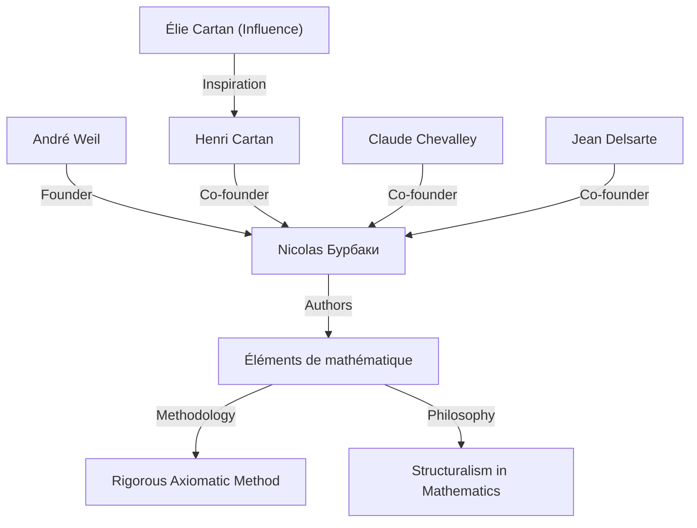
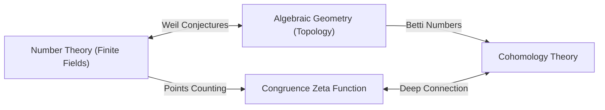

## 1. Введение: Архитектор современной математики

[Андре Вейль](https://kenji.blog/ru/p/weil/) (6 мая 1906 г. - 6 августа 1998 г.) был одной из самых влиятельных фигур в математическом мире 20-го века. Его работы глубоко связали области, которые ранее развивались отдельно — теорию чисел, алгебраическую геометрию и топологию — создав совершенно новую парадигму в современной математике. В частности, предложенные им **«гипотезы Вейля»** служили компасом для математических исследований в последующие десятилетия, даря огромное вдохновение следующему поколению гениев, таких как [Александр Гротендик](https://kenji.blog/ru/p/grothendieck/) и Пьер Делинь. В этой статье подробно рассказывается о его выдающейся жизни, его роли в создании вымышленного математика **«Николя Бурбаки»** и о том глубоком математическом наследии, которое он оставил.

## 2. Путь юного вундеркинда: Из Парижа в мир

Вейль родился в Париже, Франция, в культурной еврейской семье. Его младшая сестра, Симона Вейль, также оставила свой след в истории как известный философ и общественный деятель. С юных лет Вейль проявлял необычайный талант как к языкам, так и к математике; он был вундеркиндом, способным читать классические тексты на санскрите и греческом языке в оригиналах.

В раннем возрасте 16 лет он поступил в Высшую нормальную школу (ENS), ведущее учебное заведение Франции. Там он познакомился с блестящими математиками, такими как Анри Картан, которые стали его друзьями на всю жизнь. После окончания учебы Вейль путешествовал по европейским академическим центрам, включая Рим, Геттинген и Берлин, расширяя свой кругозор, обучаясь непосредственно у ведущих математиков того времени, таких как [Карл Людвиг Зигель](https://kenji.blog/ru/p/siegel/) и [Эмми Нётер](https://kenji.blog/ru/p/noether/).

## 3. Опыт в Индии и преданность философии

В 1930 году, в возрасте 24 лет, Вейль стал профессором математики в Алигархском мусульманском университете в Индии. Это пребывание в Индии наложило глубокий отпечаток на его жизнь. Он глубоко увлекся санскритской литературой и индуистской философией, особенно *Бхагавадгитой*, идеи которой служили ему духовной опорой на протяжении всей жизни.

В Индии он не только проводил математические исследования, но и активно общался с местной интеллигенцией. Говорят, что понимание различных культур и широкая перспектива, взращенные в этот период, сформировали интуитивную основу для него, когда он позже обнаружил глубокие аналогии между различными областями математики (такими как теория чисел и геометрия).

## 4. Рождение Николя Бурбаки: Реконструкция математики

В 1930-х годах французское математическое сообщество находилось в состоянии стагнации, во многом из-за потери многих многообещающих молодых математиков в Первой мировой войне. Обеспокоенный этой ситуацией, Вейль вместе с Картаном, Клодом Шевалле, Жаном Дельсартом и другими запустил грандиозный проект по реконструкции математики с нуля.

Они взяли псевдоним вымышленного русского математика **«Николя Бурбаки»** и начали совместно писать серию книг под названием *Éléments de mathématique* (Элементы математики).

Определяющей характеристикой Бурбаки было полностью аксиоматическое и строгое развитие математики с точки зрения **«структур»** (алгебраических, порядковых и топологических). Сильная личность Вейля, его потрясающая эрудиция и бескомпромиссная строгость сыграли решающую роль в определении стиля письма и философии Бурбаки. Деятельность Бурбаки в дальнейшем изменила стиль математического образования и исследований во всем мире.

## 5. Война и тюремное заключение: Чудо в Руанской тюрьме

С началом Второй мировой войны в 1939 году судьба Вейля круто изменилась. Он отказался от военной службы и бежал в Финляндию, где его по ошибке приняли за советского шпиона и чуть не казнили. Он был спасен благодаря усилиям выдающегося математика Рольфа Неванлинны, но впоследствии был депортирован во Францию и заключен в тюрьму в Руане.

Однако примечательно, что математическое творчество Вейля достигло своего зенита именно в этих суровых условиях. В тюремной камере он завершил одно из своих величайших достижений: **«Доказательство гипотезы Римана для алгебраических кривых над конечными полями»** . В письмах к своей сестре Симоне он страстно обсуждал радость этого открытия и важность «аналогии» в математике.

## 6. Гипотезы Вейля: Мост между алгебраической геометрией и теорией чисел

После освобождения и непродолжительной службы в армии Вейлю чудом удалось бежать с семьей в США. После работы в Чикагском университете он в конечном итоге стал постоянным профессором в Институте перспективных исследований (IAS) в Принстоне.

В 1949 году он опубликовал свою знаковую работу — **«гипотезы Вейля»** . В ней предлагалась удивительная связь между количеством точек на алгебраических многообразиях (множестве решений алгебраических уравнений) над конечными полями и топологическими свойствами (такими как количество «дыр»), которыми эти многообразия обладают над комплексными числами. Гипотезы Вейля состоят из следующих четырех частей:

1.  **Рациональность**: Дзета-функция конгруэнций $Z(X, t)$ является рациональной функцией.
2.  **Функциональное уравнение**: Дзета-функция удовлетворяет определенной симметрии.
3.  **Аналог гипотезы Римана**: Абсолютные значения нулей и полюсов дзета-функции подчиняются определенным правилам.
4.  **Связь с числами Бетти**: Степень дзета-функции совпадает с числами Бетти многообразия.

В качестве математической формулировки дзета-функция конгруэнций несингулярного проективного многообразия $X$ над конечным полем $\mathbb{F}_q$ определяется следующим образом:

$$ Z(X, t) = \exp \left( \sum_{m=1}^{\infty} \frac{|X(\mathbb{F}_{q^m})|}{m} t^m \right) $$

Здесь $|X(\mathbb{F}_{q^m})|$ представляет количество рациональных точек $X$ в расширении поля $\mathbb{F}_{q^m}$.

Чтобы доказать эти глубокие гипотезы, [Александр Гротендик](https://kenji.blog/ru/p/grothendieck/) построил масштабную теоретическую основу теории схем и этальных когомологий с нуля. Затем, в 1974 году, ученик Гротендика Пьер Делинь доказал последнее препятствие — «аналог гипотезы Римана», полностью разрешив гипотезы Вейля. Эта великая драма считается одним из величайших монументальных достижений математики 20-го века.

## 7. Другие значительные вклады: Адели, идели и группа Вейля

Вклад Вейля не ограничивался выдвижением гипотез. Он усовершенствовал теории **«аделей»** и **«иделей»** , которые стали важными языками в современной теории чисел. Это завершило мощную структуру в теории чисел, связывающую локальное с глобальным.

Более того, он ввел **«группу Вейля»** , расширение концепции группы Галуа, которая сыграла чрезвычайно важную роль в объединении локальной и глобальной теории полей классов. Эти концепции продолжают активно исследоваться и сегодня как основа «программы Ленглендса», масштабной нерешенной проблемы современной математики. Кроме того, математические объекты, носящие его имя, слишком многочисленны, чтобы их перечислять, включая «спаривание Вейля», используемое в криптографии на эллиптических кривых, и «метрику Вейля-Петерссона» в геометрии пространств модулей.

## 8. Поздние годы и математическое наследие

Вейль много лет занимался исследованиями и образованием в Институте перспективных исследований в Принстоне, наставляя многочисленных преемников. Он обладал обширными знаниями и проницательностью, и иногда был известен как язвительный критик. Он также обладал глубокими знаниями истории математики, и книги, которые он написал на эту тему, высоко ценятся как шедевры, полные исторического понимания.

В 1998 году [Андре Вейль](https://kenji.blog/ru/p/weil/) скончался в возрасте 92 лет. Семя «слияния теории чисел и геометрии», которое он посеял, ярко расцвело в современной математике. Его сохранившиеся достижения и его бескомпромиссное отношение к математике, несомненно, будут продолжать очаровывать и направлять математиков вечно. Его жизнь была поистине великим эпосом, в котором бурная история 20-го века пересеклась с блеском человеческого интеллекта.
