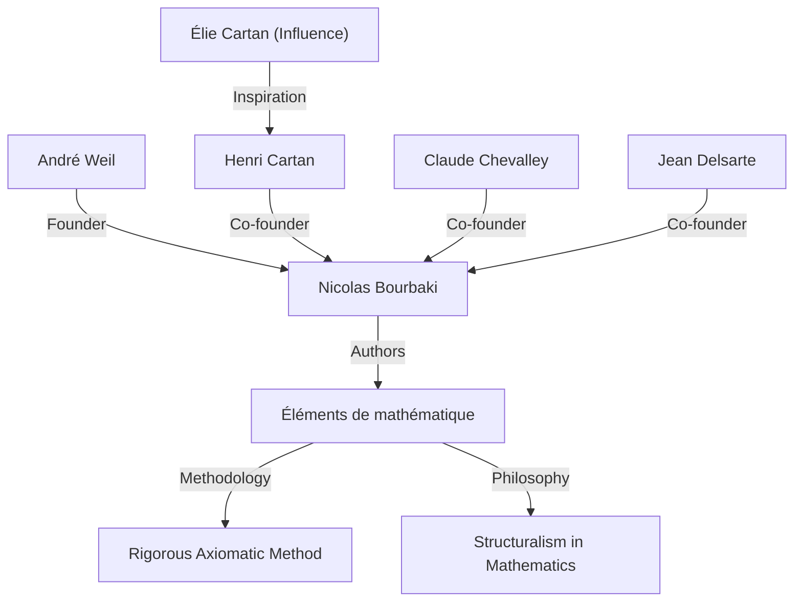
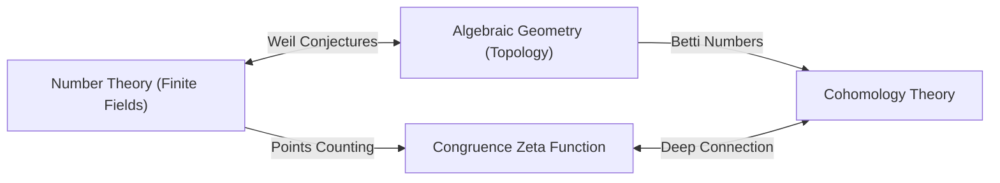

## 1. 简介：现代数学的建筑师

安德烈·韦伊（André Weil，1906年5月6日 - 1998年8月6日）是20世纪数学界最具影响力的人物之一。他的工作深刻地将以往各自独立发展的领域——数论、代数几何和拓扑学——联系在一起，在现代数学中开创了一个全新的范式。特别是他提出的 **“韦伊猜想”** （Weil conjectures），成为了此后几十年数学研究的指南针，为亚历山大·格罗滕迪克和皮埃尔·德利涅等下一代天才提供了巨大的灵感。本文详细介绍了他的非凡一生、他在创立虚构数学家 **“尼古拉·布尔巴基”** （Nicolas Bourbaki）中的作用，以及他留下的深远数学遗产。

## 2. 年轻神童的旅程：从巴黎走向世界

韦伊出生于法国巴黎的一个有教养的犹太家庭。他的妹妹西蒙娜·韦伊（Simone Weil）后来也作为著名哲学家和社会活动家名留青史。从小，韦伊就在语言和数学方面展现出了非凡的天赋；他是一个能够阅读梵文和希腊文古典文本原著的神童。

在16岁这个年纪，他考入了法国顶尖教育机构——巴黎高等师范学院（ENS）。在那里，他结识了亨利·嘉当（Henri Cartan）等杰出的数学家，他们后来成为了他一生的挚友。毕业后，韦伊游历了罗马、哥廷根和柏林等欧洲学术中心，通过直接向卡尔·路德维希·西格尔（Carl Ludwig Siegel）和埃米·诺特（Emmy Noether）等当时顶尖的数学家学习，大大拓宽了自己的视野。

## 3. 在印度的经历与对哲学的倾心

1930年，24岁的韦伊成为印度阿里格尔穆斯林大学的数学教授。在印度的这段经历给他的一生留下了深刻的印记。他深深沉醉于梵文文学和印度教哲学，尤其是《薄伽梵歌》，其思想成为他一生的精神支柱。

在印度，他不仅进行数学研究，还与当地知识分子进行了深入的交流。据说，这段时期培养出的对多元文化的理解和广阔视野，构成了他后来发现数学不同领域（如数论和几何）之间深刻类比时的直觉基础。

## 4. 尼古拉·布尔巴基的诞生：重构数学

在20世纪30年代，由于在第一次世界大战中失去了许多有前途的年轻数学家，法国数学界处于停滞状态。由于对这种状况感到担忧，韦伊与嘉当、克劳德·谢瓦莱（Claude Chevalley）、让·德尔萨特（Jean Delsarte）等人发起了一个旨在从根本上重构数学的宏大项目。

他们采用了虚构的俄罗斯数学家 **“尼古拉·布尔巴基”** 的笔名，开始合作撰写名为《数学原理》（Éléments de mathématique）的系列丛书。

布尔巴基最显著的特征是其从 **“结构”** （代数结构、序结构和拓扑结构）的角度，对数学进行了完全公理化和严格的发展。韦伊强烈的个性、渊博的学识以及不妥协的严谨性，在决定布尔巴基的写作风格和哲学方面发挥了至关重要的作用。布尔巴基的活动后来改变了全世界数学教育和研究的风格。

## 5. 战争与入狱：鲁昂监狱的奇迹

1939年第二次世界大战爆发后，韦伊的命运遭到了严重的颠簸。他拒绝服兵役并逃往芬兰，在那里他被误认为是苏联间谍并险遭处决。在著名数学家罗尔夫·内万林纳（Rolf Nevanlinna）的努力下，他获救了，但随后被驱逐回法国并关押在鲁昂。

然而令人惊叹的是，在这些恶劣的条件下，韦伊的数学创造力却达到了顶峰。在牢房里，他完成了他最伟大的成就之一： **“有限域上代数曲线的黎曼猜想的证明”** 。在给妹妹西蒙娜的信中，他热情地讨论了这一发现的喜悦，以及数学中“类比”的重要性。

## 6. 韦伊猜想：代数几何与数论的桥梁

获释并短暂服役后，韦伊奇迹般地与家人逃到了美国。在芝加哥大学度过一段时间后，他最终成为普林斯顿高等研究院（IAS）的终身教授。

1949年，他发表了自己的标志性著作 **“韦伊猜想”** 。该猜想提出了有限域上的代数簇（代数方程解的集合）上的点的数量，与这些簇在复数上所具有的拓扑性质（如孔洞的数量）之间，存在着惊人的联系。韦伊猜想由以下四个部分组成：

1.  **有理性质（Rationality）**：同余黎曼Zeta函数 $Z(X, t)$ 是一个有理函数。
2.  **函数方程（Functional equation）**：Zeta函数满足一种特定的对称性。
3.  **黎曼猜想的类比（Analogue of the [Riemann hypothesis](https://kenji.blog/p/riemann-hypothesis/)）**：Zeta函数的零点和极点的绝对值遵循特定的规则。
4.  **与贝蒂数的关系（Connection with Betti numbers）**：Zeta函数的次数与簇的贝蒂数一致。

作为数学公式化，有限域 $\mathbb{F}_q$ 上非奇异射影簇 $X$ 的同余Zeta函数定义如下：

$$ Z(X, t) = \exp \left( \sum_{m=1}^{\infty} \frac{|X(\mathbb{F}_{q^m})|}{m} t^m \right) $$

在这里，$|X(\mathbb{F}_{q^m})|$ 表示在扩张域 $\mathbb{F}_{q^m}$ 中 $X$ 的有理点的数量。

为了证明这些深奥的猜想，亚历山大·格罗滕迪克从零开始构建了概形理论和平展上同调的庞大理论框架。然后，在1974年，格罗滕迪克的学生皮埃尔·德利涅证明了最后的障碍——“黎曼猜想的类比”，彻底解决了韦伊猜想。这场宏大的戏剧被认为是20世纪数学最伟大的不朽成就之一。

## 7. 其他重大贡献：阿代尔、伊代尔与韦伊群

韦伊的贡献不仅限于提出猜想。他完善了 **“阿代尔”** （adeles）和 **“伊代尔”** （ideles）理论，这些已经成为现代数论中必不可少的语言。这在数论中完善了一个将局部与全局联系起来的强大框架。

此外，他引入了 **“韦伊群”** （Weil group），这是伽罗瓦群概念的扩展，在统一局部和全局类域论中发挥了极其重要的作用。这些概念今天作为“朗兰兹纲领”（现代数学中一个巨大的未决问题）的基础仍在被积极研究。此外，以他的名字命名的数学对象多得数不胜数，包括用于椭圆曲线密码学的“韦伊配对”（Weil pairing），以及模空间几何中的“韦伊-彼得松度量”（Weil-Petersson metric）。

## 8. 晚年生活与数学遗产

韦伊在普林斯顿高等研究院从事研究和教育多年，培养了众多后继者。他拥有渊博的知识和敏锐的洞察力，有时以尖锐的批评家而闻名。他对数学史也有着深刻的了解，他写的关于该主题的著作被高度评价为充满历史洞察力的杰作。

1998年，安德烈·韦伊逝世，享年92岁。他播下的“数论与几何融合”的种子在现代数学中灿烂绽放。他留下的成就以及他对数学不妥协的态度，无疑将永远吸引和指引着数学家们。他的一生确是一部宏大的史诗，20世纪动荡的历史与人类智慧的光辉在其中交汇。
