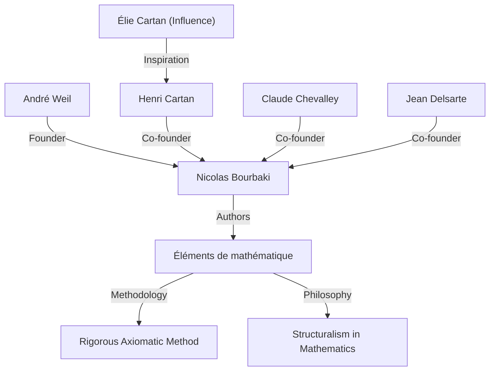
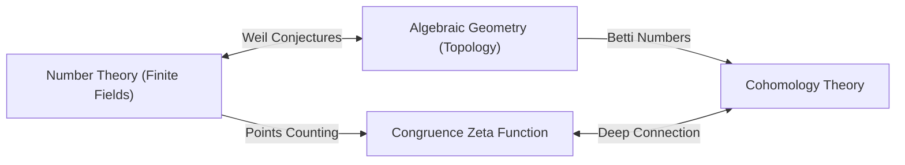

## 1. 簡介：現代數學的建築師

[安德烈·韋伊](https://kenji.blog/zh-tw/p/weil/)（André Weil，1906年5月6日 - 1998年8月6日）是20世紀數學界最具影響力的人物之一。他的工作深刻地將以往各自獨立發展的領域——數論、代數幾何和拓撲學——聯繫在一起，在現代數學中開創了一個全新的範式。特別是他提出的 **「韋伊猜想」** （Weil conjectures），成為了此後幾十年數學研究的指南針，為[亞歷山大·格羅滕迪克](https://kenji.blog/zh-tw/p/grothendieck/)和皮埃爾·德利涅等下一代天才提供了巨大的靈感。本文詳細介紹了他的非凡一生、他在創立虛構數學家 **「尼古拉·布爾巴基」** （Nicolas Bourbaki）中的作用，以及他留下的深遠數學遺產。

## 2. 年輕神童的旅程：從巴黎走向世界

韋伊出生於法國巴黎的一個有教養的猶太家庭。他的妹妹西蒙娜·韋伊（Simone Weil）後來也作為著名哲學家和社會活動家名留青史。從小，韋伊就在語言和數學方面展現出了非凡的天賦；他是一個能夠閱讀梵文和希臘文古典文本原著的神童。

在16歲這個年紀，他考入了法國頂尖教育機構——巴黎高等師範學院（ENS）。在那裡，他結識了亨利·嘉當（Henri Cartan）等傑出的數學家，他們後來成為了他一生的摯友。畢業後，韋伊遊歷了羅馬、哥廷根和柏林等歐洲學術中心，通過直接向[卡爾·路德維希·西格爾](https://kenji.blog/zh-tw/p/siegel/)（Carl Ludwig Siegel）和埃米·諾特（[Emmy Noether](https://kenji.blog/zh-tw/p/noether/)）等當時頂尖的數學家學習，大大拓寬了自己的視野。

## 3. 在印度的經歷與對哲學的傾心

1930年，24歲的韋伊成為印度阿里格爾穆斯林大學的數學教授。在印度的這段經歷給他的一生留下了深刻的印記。他深深沉醉於梵文文學和印度教哲學，尤其是《薄伽梵歌》，其思想成為他一生的精神支柱。

在印度，他不僅進行數學研究，還與當地知識份子進行了深入的交流。據說，這段時期培養出的對多元文化的理解和廣闊視野，構成了他後來發現數學不同領域（如數論和幾何）之間深刻類比時的直覺基礎。

## 4. 尼古拉·布爾巴基的誕生：重構數學

在20世紀30年代，由於在第一次世界大戰中失去了許多有前途的年輕數學家，法國數學界處於停滯狀態。由於對這種狀況感到擔憂，韋伊與嘉當、克勞德·謝瓦萊（Claude Chevalley）、讓·德爾薩特（Jean Delsarte）等人發起了一個旨在從根本上重構數學的宏大項目。

他們採用了虛構的俄羅斯數學家 **「尼古拉·布爾巴基」** 的筆名，開始合作撰寫名為《數學原理》（Éléments de mathématique）的系列叢書。

布爾巴基最顯著的特徵是其從 **「結構」** （代數結構、序結構和拓撲結構）的角度，對數學進行了完全公理化和嚴格的發展。韋伊強烈的個性、淵博的學識以及不妥協的嚴謹性，在決定布爾巴基的寫作風格和哲學方面發揮了至關重要的作用。布爾巴基的活動後來改變了全世界數學教育和研究的風格。

## 5. 戰爭與入獄：魯昂監獄的奇蹟

1939年第二次世界大戰爆發後，韋伊的命運遭到了嚴重的顛簸。他拒絕服兵役並逃往芬蘭，在那裡他被誤認為是蘇聯間諜並險遭處決。在著名數學家羅爾夫·內萬林納（Rolf Nevanlinna）的努力下，他獲救了，但隨後被驅逐回法國並關押在魯昂。

然而令人驚嘆的是，在這些惡劣的條件下，韋伊的數學創造力卻達到了頂峰。在牢房裡，他完成了他最偉大的成就之一： **「有限體上代數曲線的黎曼猜想的證明」** 。在給妹妹西蒙娜的信中，他熱情地討論了這一發現的喜悅，以及數學中「類比」的重要性。

## 6. 韋伊猜想：代數幾何與數論的橋樑

獲釋並短暫服役後，韋伊奇蹟般地與家人逃到了美國。在芝加哥大學度過一段時間後，他最終成為普林斯頓高等研究院（IAS）的終身教授。

1949年，他發表了自己的標誌性著作 **「韋伊猜想」** 。該猜想提出了有限體上的代數簇（代數方程式解的集合）上的點的數量，與這些簇在複數上所具有的拓撲性質（如孔洞的數量）之間，存在著驚人的聯繫。韋伊猜想由以下四個部分組成：

1.  **有理性質（Rationality）**：同餘黎曼Zeta函數 $Z(X, t)$ 是一個有理函數。
2.  **函數方程式（Functional equation）**：Zeta函數滿足一種特定的對稱性。
3.  **黎曼猜想的類比（Analogue of the [Riemann hypothesis](https://kenji.blog/zh-tw/p/riemann-hypothesis/)）**：Zeta函數的零點和極點的絕對值遵循特定的規則。
4.  **與貝蒂數的關係（Connection with Betti numbers）**：Zeta函數的次數與簇的貝蒂數一致。

作為數學公式化，有限體 $\mathbb{F}_q$ 上非奇異射影簇 $X$ 的同餘Zeta函數定義如下：

$$ Z(X, t) = \exp \left( \sum_{m=1}^{\infty} \frac{|X(\mathbb{F}_{q^m})|}{m} t^m \right) $$

在這裡，$|X(\mathbb{F}_{q^m})|$ 表示在擴張體 $\mathbb{F}_{q^m}$ 中 $X$ 的有理點的數量。

為了證明這些深奧的猜想，[亞歷山大·格羅滕迪克](https://kenji.blog/zh-tw/p/grothendieck/)從零開始構建了概形理論和平展上同調的龐大理論框架。然後，在1974年，格羅滕迪克的學生皮埃爾·德利涅證明了最後的障礙——「黎曼猜想的類比」，徹底解決了韋伊猜想。這場宏大的戲劇被認為是20世紀數學最偉大的不朽成就之一。

## 7. 其他重大貢獻：阿代爾、伊代爾與韋伊群

韋伊的貢獻不僅限於提出猜想。他完善了 **「阿代爾」** （adeles）和 **「伊代爾」** （ideles）理論，這些已經成為現代數論中必不可少的語言。這在數論中完善了一個將局部與全域聯繫起來的強大框架。

此外，他引入了 **「韋伊群」** （Weil group），這是伽羅瓦群概念的擴展，在統一局部和全域類體論中發揮了極其重要的作用。這些概念今天作為「朗蘭茲綱領」（現代數學中一個巨大的未決問題）的基礎仍在被積極研究。此外，以他的名字命名的數學物件多得數不勝數，包括用於橢圓曲線密碼學的「韋伊配對」（Weil pairing），以及模空間幾何中的「韋伊-彼得松度量」（Weil-Petersson metric）。

## 8. 晚年生活與數學遺產

韋伊在普林斯頓高等研究院從事研究和教育多年，培養了眾多後繼者。他擁有淵博的知識和敏銳的洞察力，有時以尖銳的批評家而聞名。他對數學史也有著深刻的了解，他寫的關於該主題的著作被高度評價為充滿歷史洞察力的傑作。

1998年，[安德烈·韋伊](https://kenji.blog/zh-tw/p/weil/)逝世，享年92歲。他播下的「數論與幾何融合」的種子在現代數學中燦爛綻放。他留下的成就以及他對數學不妥協的態度，無疑將永遠吸引和指引著數學家們。他的一生確是一部宏大的史詩，20世紀動盪的歷史與人類智慧的光輝在其中交匯。
