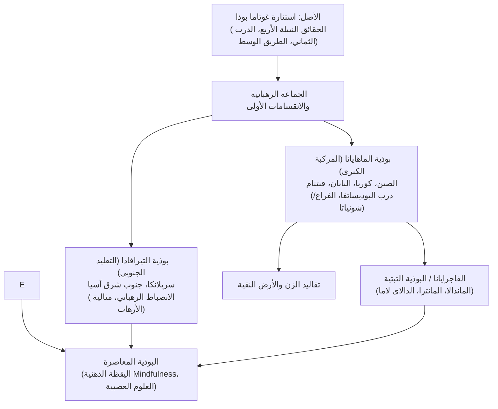

## مقدمة: الاستنارة العقلانية والشفقة الشاملة

نشأت البوذية في الهند القديمة في القرن الخامس قبل الميلاد، وتتميز عن الديانات التوحيدية بعدم ارتكازها على إله خالق مطلق. إنها مسار استكشافي عميق: **رؤية حقيقة الوجود كما هي (الدّارما)، والتخلص من المعاناة عبر نبذ التعلق والأنانية، وتجسيد الرحمة تجاه جميع الكائنات الحية**.

## 1. سيرة بوذا التاريخي
تخلى الأمير غوتاما عن رغد القصور بعد أن رأى المشاهد الأربعة: الشيخوخة والمرض والموت والناسك المتجول. ورفض التقشف القاسي ليجد **الطريق الوسط**. وتحت شجرة بودي في بودغايا، بلغ الاستنارة الكاملة في سن الخامسة والثلاثين وظل يُعلّم لمدة 45 عاماً حتى وفاته.

## 2. جوهر الدّارما
- **النشأة المشروطة (براتيتيا ساموتبادا)**: لا شيء يوجد بشكل منعزل ودائم؛ كل ظاهرة تنشأ معتمدة على شبكة مترابطة من الأسباب والشروط.
- **سمات الوجود الثلاث**: التغير المستمر (*أنيتشا*)، وغياب الذات الثابتة (*أناتّا*)، وعدم الرضا الوجودي (*دوكخا*).
- **الحقائق النبيلة الأربع**: 1. حقيقة المعاناة؛ 2. حقيقة منشأ المعاناة (التعلق والرغبة الأنانية)؛ 3. حقيقة زوال المعاناة (النيرفانا)؛ 4. حقيقة الطريق المؤدي لزوال المعاناة (الدرب الثماني النبيل).

## 3. المدارس الكبرى
- **التيرافادا**: تحافظ على أقدم النصوص البالية وتركّز على الانضباط الرهباني وبلوغ رتبة الأرهات.
- **الماهايانا**: تركز على مثل **البوديساتفا** الذي يسعى لتحرير كل الكائنات، وتؤسس لفلسفة **الفراغ (شونياتا)** مع فلاسفة كناغارجونا.
- **الفاجرايانا**: تيار باطني ازدهر في التبت يعتمد على طقوس الماندالا والتأمل الصارم تحت إشراف الدالاي لاما.

## 4. تقاليد الزن والعلوم الحديثة
تطورت في اليابان تقاليد الزن (تأمل *زازين* الصامت). واليوم، أعيد تقديم التأمل البوذي عالمياً عبر برامج «اليقظة الذهنية» (Mindfulness) التي أثبتت أبحاث الدماغ فوائدها الملموسة في علاج التوتر والاضطرابات النفسية.
