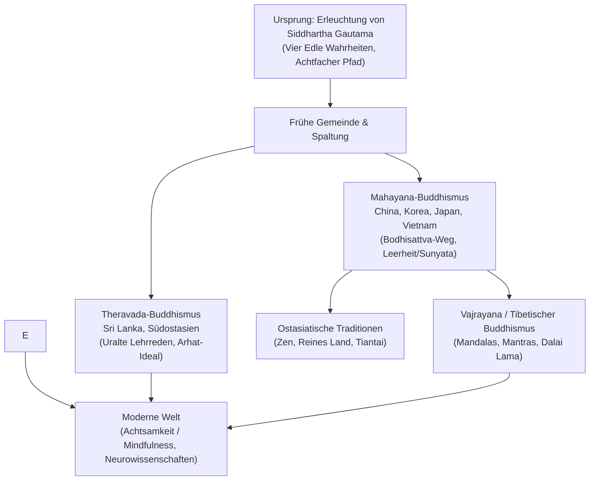

## Einleitung: Rationale Erleuchtung und grenzenloses Mitgefühl

Im 5. Jahrhundert v. Chr. im antiken Nordindien entstanden, unterscheidet sich der Buddhismus grundlegend von theistischen Religionen: Er kennt keinen allmächtigen Schöpfergott, der blinden Glauben verlangt. Im Zentrum steht die **Erkenntnis der Wirklichkeit (Dharma), die Überwindung des Leidens durch Selbsterkenntnis und das Mitgefühl für alle fühlenden Wesen**.

## 1. Das Leben des Buddha
Siddhartha Gautama, Prinz des Shakya-Geschlechts, verließ im Alter von 29 Jahren nach dem Anblick von Alter, Krankheit, Tod und Askese seinen Palast. Nach Jahren fruchtloser Askese entdeckte er den **Mittleren Pfad**. Unter dem Bodhi-Baum in Bodh Gaya erlangte er mit 35 Jahren die Erleuchtung und lehrte 45 Jahre lang bis zu seinem Eingehen ins Parinirvana.

## 2. Die Grundlehren des Dharma
- **Bedingtes Entstehen (Pratityasamutpada)**: Nichts existiert aus sich selbst heraus; alles entsteht in gegenseitiger Abhängigkeit von Ursachen und Bedingungen.
- **Die drei Daseinsmerkmale**: Unbeständigkeit (*Anicca*), Nicht-Selbst (*Anatta*) und Leidhaftigkeit unreflektierten Daseins (*Dukkha*).
- **Die Vier Edlen Wahrheiten**: 1. Wahrheit vom Leiden; 2. Wahrheit von der Ursache (Begehren/Gier); 3. Wahrheit von der Aufhebung des Leidens (Nirvana); 4. Wahrheit vom Achtfachen Pfad.

## 3. Theravada, Mahayana und Vajrayana
- **Theravada**: Älteste überlebende Schule, betont klösterliche Disziplin und das Arhat-Ideal.
- **Mahayana**: Betont den **Bodhisattva-Weg** (Erlösung aller Wesen), Nagarjunas Philosophie der **Leerheit (Sunyata)** und das universelle Buddha-Wesen.
- **Vajrayana**: Nutzt tantrische Rituale, Meditationen über Mandalas und Mantras zur raschen Verwirklichung der Buddhaschaft (tibetische Schulen wie Gelug mit dem Dalai Lama).

## 4. Japanischer Buddhismus und Zen
In Japan entwickelte sich der Buddhismus über die Shingon- und Tendai-Mystik hin zur Kamakura-Reform: Zen (Soto von Dogen mit *Zazen*; Rinzai mit Koans), Reines Land (Shinran) und Nichiren.

## 5. Buddhismus im 21. Jahrhundert
Durch Jon Kabat-Zinns MBSR-Programm wurde die buddhistische Achtsamkeit (*Sati*) säkularisiert und durch Neurowissenschaften belegt. Der engagierte Buddhismus (Thich Nhat Hanh) verbindet Meditation mit Umwelt- und Friedensarbeit.
