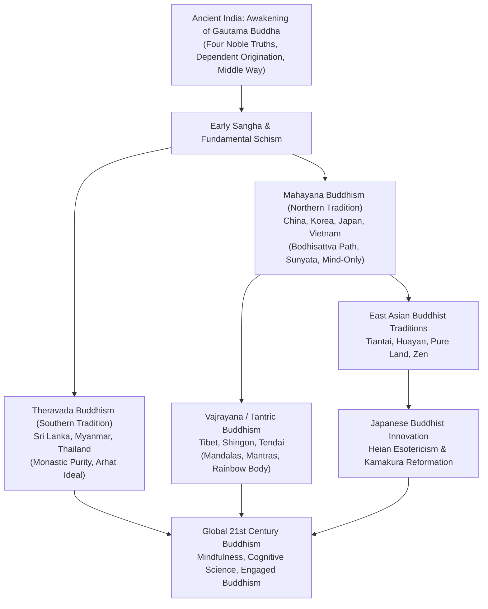

## Introduction: Rational Awakening and Universal Compassion

Arising in ancient India along the Ganges basin in the fifth century BCE, Buddhism stands alongside Christianity and Islam as one of the world's great spiritual traditions. Yet unlike the Abrahamic monotheisms, Buddhism is distinct: it recognizes no omnipotent creator deity demanding dogmatic obedience.

Instead, Buddhism presents a rational, phenomenological path: **observing the true nature of reality (Dharma) as it is, extinguishing craving and clinging through disciplined cultivation, and embodying boundless compassion for all sentient beings**. 

The title "Buddha" is not a proper name, but an epithet meaning "The Awakened One." Siddhartha Gautama never claimed to be a divine messenger; he insisted that the truths he discovered were eternal laws of existence that anyone could verify through disciplined introspection.

From India, Buddhism radiated across the globe: spreading south to Sri Lanka and Southeast Asia (**Theravada**), moving north along the Silk Road into China, Korea, Japan, and Vietnam (**Mahayana**), ascending the Himalayas into Tibet and Mongolia (**Vajrayana**), and arriving in modern Western societies as **Mindfulness** in psychology and neuroscience.

## Chapter 1: The Historical Buddha: Life and Enlightenment
Born Siddhartha Gautama to the ruling Shakya clan in Kapilavastu (modern southern Nepal), the prince was shielded within luxurious palaces. Yet confronting the "Four Sights"—an old man, a sick person, a corpse, and an ascetic monk—he was struck by the universal reality of suffering (*dukkha*). 

At age twenty-nine, he abandoned his royal inheritance. After mastering high meditative absorptions under prominent gurus and enduring six years of severe mortification that nearly killed him, he recognized the futility of extreme asceticism and discovered the **Middle Way** (*Majjhima Patipada*).

Resting beneath the Bodhi tree at Bodh Gaya, he withstood the illusions of Mara and attained unexcelled awakening (*Samyak-sambodhi*) at age thirty-five. At the Deer Park in Sarnath, he delivered his first sermon (*Dhammacakkappavattana Sutta*), turning the Wheel of the Dharma and establishing the Three Jewels: the Buddha, the Dharma (the teaching), and the Sangha (the community). For forty-five years, he walked across northern India teaching all social strata before entering final Parinirvana at Kushinagar at age eighty.

## Chapter 2: The Core Dharma: Dependent Origination, Four Seals, and Four Noble Truths

### 2.1 Dependent Origination (Pratityasamutpada)
The cornerstone of Buddhist ontology:
> "When this exists, that comes to be; with the arising of this, that arises. When this does not exist, that does not come to be; with the cessation of this, that ceases."

Nothing exists independently as an isolated, permanent essence. All phenomena arise interdependent upon antecedent causes and auxiliary conditions. The Twelve Links (*Nidanas*) trace how primal ignorance (*Avidya*) sparks karmic formations, craving (*Tanha*), grasping, and the recurring cycle of suffering.

### 2.2 The Four Dharma Seals
1. **All conditioned things are impermanent (*Anitya / Anicca*)**.
2. **All contaminated phenomena are suffering (*Duhkha / Dukkha*)**.
3. **All phenomena are devoid of self-entity (*Anatman / Anatta*)**.
4. **Nirvana is unconditioned peace (*Santa*)**.

### 2.3 The Four Noble Truths and the Eightfold Path
Presented as a spiritual medical diagnosis:
1. **The Truth of Suffering (*Dukkha*)**: Life inherently contains physical and existential friction.
2. **The Truth of the Cause (*Samudaya*)**: Suffering originates in craving and ignorant attachment.
3. **The Truth of Cessation (*Nirodha*)**: Nirvana is the extinction of the fires of greed, hatred, and delusion.
4. **The Truth of the Path (*Magga*)**: The Noble Eightfold Path—Right View, Right Intention, Right Speech, Right Action, Right Livelihood, Right Effort, Right Mindfulness, and Right Concentration.

## Chapter 3: From Monastic Schisms to the Mahayana Revolution
Following the Buddha's passing, disciples held the First Council at Rajgir to recite the Vinaya (monastic discipline) and Suttas. A century later, divergent interpretations triggered the Great Schism between the elder **Sthaviravadins** (ancestors of Theravada) and the progressive majority **Mahasamghikas**.

As monastic scholars retreated into technical Abhidharma scholasticism seeking individual Arhatship, a populist reform movement arose: **Mahayana (The Great Vehicle)**. Mahayana shifted the spiritual ideal from the Arhat to the **Bodhisattva**—an enlightened being who postpones final nirvana to liberate all suffering beings through the practice of the Six Paramitas (Generosity, Morality, Patience, Diligence, Meditation, Wisdom).

## Chapter 4: Mahayana Metaphysics: Emptiness, Mind-Only, and Buddha-Nature
- **Nagarjuna and Sunyata (Emptiness)**: Founder of the Madhyamaka school, Nagarjuna demonstrated that because all things are dependently originated, they are "empty" (*sunya*) of inherent existence (*svabhava*). Emptiness is not nihilism, but infinite relational openness.
- **Yogacara (Mind-Only / Vijnanavada)**: Founded by Asanga and Vasubandhu, this tradition analyzed consciousness, uncovering the subterranean **Alaya-vijnana** (storehouse consciousness) where karmic seeds accumulate.
- **Tathagatagarbha (Buddha-Nature)**: Affirmed that every sentient being inherently possesses the seed of complete enlightenment beneath transient defilements.

## Chapter 5: Vajrayana: Tantra, Mandalas, and Tibetan Traditions
Emerging in late classical India, **Vajrayana (The Diamond Vehicle)** utilized esoteric ritual, sacred mantras, mudras, and geometric **mandalas** to accelerate the realization of Buddhahood in a single lifetime. Preserved in Tibet, it flourished into four major lineages: Nyingma, Kagyu, Sakya, and Gelug, the latter headed by the Dalai Lama and Panchen Lama.

## Chapter 6: East Asian and Japanese Buddhist Evolution
Transmitted to China via the Silk Road, Buddhism synthesized with Daoism, producing indigenous traditions: Tiantai, Huayan, Pure Land, and Chan (Zen).
In Japan, Buddhism evolved from state-protecting Nara scholasticism into the esoteric mountain bastions of Saicho's Tendai and Kukai's Shingon. 

The Kamakura period witnessed a spiritual revolution:
- **Pure Land (Honen) & Shin Buddhism (Shinran)**: Salvation for ordinary sinners through absolute reliance on Amida Buddha's vow (*Nembutsu*).
- **Zen (Eisai's Rinzai & Dogen's Soto)**: Direct insight through rigorous seated meditation (*Zazen*) and paradoxical koans.
- **Nichiren**: Unwavering devotion to the Lotus Sutra (*Nam-myoho-renge-kyo*).

## Chapter 7: Buddhism in the 21st Century: Science and Social Action
- **Mindfulness Revolution**: Jon Kabat-Zinn's secular MBSR program adapted Buddhist *Sati* (mindfulness) into clinical medicine and corporate leadership, validated by neuroimaging studies demonstrating changes in prefrontal cortex and amygdala activity.
- **Dialogue with Physics and Cognitive Science**: Quantum entanglement and cognitive neuroscience mirror Nagarjuna's emptiness and the doctrine of non-self.
- **Engaged Buddhism**: Pioneered by Thich Nhat Hanh, applying Buddhist ethics directly to climate justice, peace activism, and human rights.

## Conclusion: An Unfading Light for the Modern Spirit
Two and a half millennia after the Buddha sat beneath the Bodhi tree, his timeless message remains pristine: investigate reality without illusions, cultivate compassion without borders, and discover the peace that lies right here, right now, in the awakened heart.
