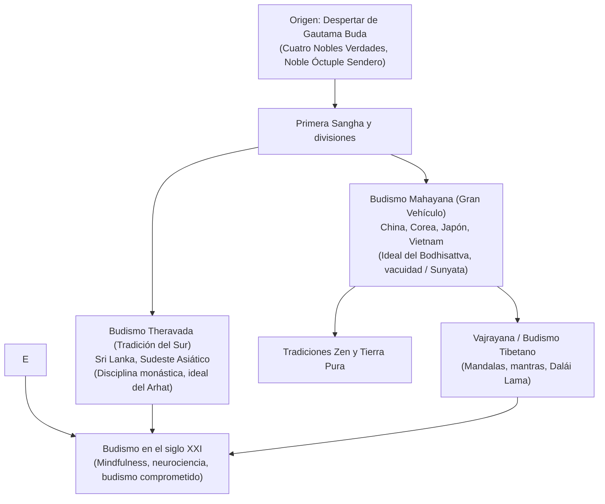

## Introducción: Despertar racional y compasión universal

Surgido en la antigua India en el siglo V a. C., el budismo se distingue de las religiones teístas por prescindir de un dios creador absoluto. Propone una senda de observación empírica: **comprender la realidad tal como es (Dharma), extinguir el sufrimiento mediante el desapego y manifestar compasión activa hacia todos los seres sintientes**.

## 1. La vida del Buda
Siddhartha Gautama renunció a su vida principesca tras presenciar la vejez, la enfermedad, la muerte y a un monje renunciante. Tras descartar el ascetismo extremo, halló el **Camino Medio**. Bajo el árbol Bodhi alcanzó el Despertar supremo y enseñó durante 45 años hasta su entrada en el Parinirvana.

## 2. Los fundamentos del Dharma
- **Originación dependiente (Pratityasamutpada)**: Todo existe interconectado; ningún fenómeno posee una esencia permanente y aislada.
- **Las tres marcas de la existencia**: Impermanencia (*Anicca*), no-yo (*Anatta*) y sufrimiento existencial (*Dukkha*).
- **Las Cuatro Nobles Verdades**: 1. La verdad del sufrimiento; 2. La verdad de su causa (el apego egoísta); 3. La verdad de su cesación (Nirvana); 4. La verdad del Noble Óctuple Sendero.

## 3. Escuelas principales
- **Theravada**: Custodia los cánones más antiguos en lengua pali, enfatizando el esfuerzo monástico y el ideal del Arhat.
- **Mahayana**: Proclama la vía del **Bodhisattva**, consagrado a liberar a todos los seres, y desarrolla la doctrina de la **vacuidad (Sunyata)** con filósofos como Nagarjuna.
- **Vajrayana**: Vertiente esotérica rica en rituales y mandalas, desarrollada en el Tíbet en cuatro grandes linajes liderados por figuras como el Dalái Lama.

## 4. El Zen y la expansión en Japón
En Japón, el budismo floreció a través del misticismo de Shingon y la gran renovación de Kamakura: la Tierra Pura (Shinran) y el budismo Zen (Soto de Dogen con su práctica de *zazen*, y Rinzai con sus koans).

## 5. El budismo hoy: Ciencia y mindfulness
Mediante adaptaciones científicas como el programa MBSR de Jon Kabat-Zinn, la atención plena budista se ha incorporado a la medicina y la psicología occidentales, ratificando la perenne lucidez del mensaje del Buda.
