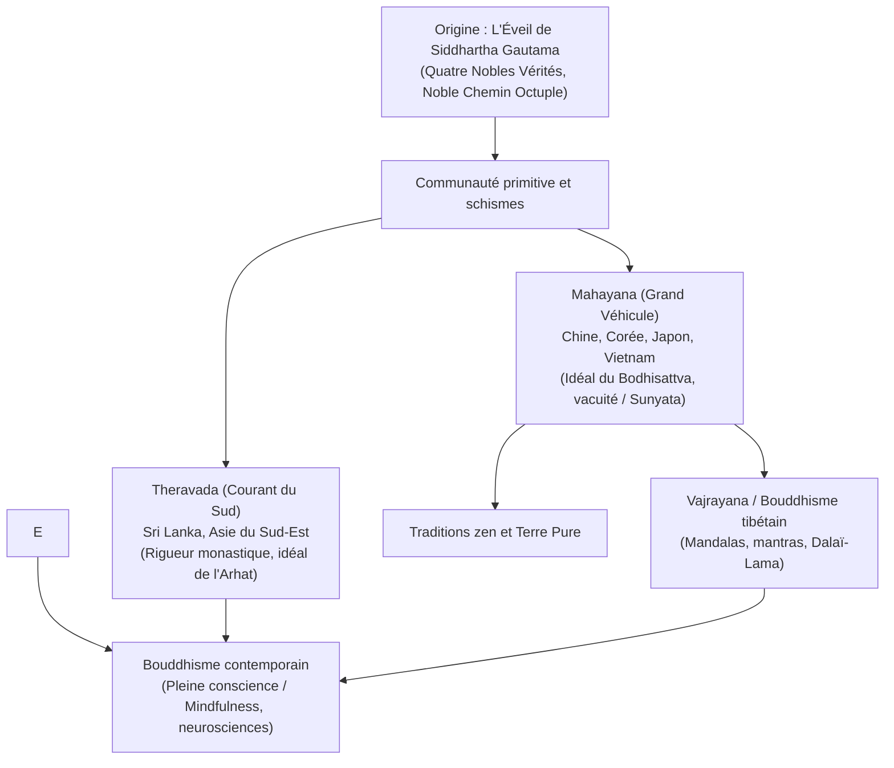

## Introduction : L'Éveil de la conscience et la compassion universelle

Né en Inde ancienne au Ve siècle avant notre ère, le bouddhisme se singularise parmi les grandes traditions spirituelles par l'absence d'un dieu créateur suprême. Il s'agit d'une voie d'investigation phénoménologique : **voir la réalité telle qu'elle est (Dharma), dissiper l'attachement égotique et incarner une compassion bienveillante envers tous les êtres**.

## 1. La vie de Siddhartha Gautama
Prince du clan des Shakya, Gautama renonce à ses privilèges après avoir croisé un vieillard, un malade, un mort et un moine errant. Rejetant les mortifications extrêmes, il découvre la **Voie du Milieu**. Sous l'arbre de la Bodhi, à 35 ans, il atteint l'Illumination parfaite, puis consacre quarante-cinq années à transmettre sa doctrine.

## 2. Le cœur du Dharma
- **La coproduction conditionnée (Pratityasamutpada)** : Rien n'existe de manière isolée ou permanente ; tout phénomène dépend de causes et de conditions interdépendantes.
- **Les trois caractéristiques de l'existence** : L'impermanence (*Anitya*), le non-soi (*Anatman*) et la nature insatisfaisante de l'existence non éveillée (*Duhkha*).
- **Les Quatre Nobles Vérités** : La vérité de la souffrance ; la vérité de son origine (le désir égoïste) ; la vérité de sa cessation (le Nirvana) ; la vérité du Noble Chemin Octuple.

## 3. Les trois grands véhicules
- **Theravada** : Conserve les enseignements les plus anciens en langue pali et met l'accent sur la quête individuelle de l'Arhat.
- **Mahayana** : Propose la voie du **Bodhisattva**, qui fait le vœu d'éclairer tous les êtres, et développe la philosophie de la **vacuité (Sunyata)** avec Nagarjuna.
- **Vajrayana** : Voie tantrique utilisant la visualisation de déités et de mandalas, préservée au Tibet autour de ses quatre lignées majeures.

## 4. Épanouissement au Japon et tradition Zen
Au Japon, le bouddhisme s'épanouit avec le Shingon ésotérique de Kukai et le renouveau de l'époque de Kamakura : la Terre Pure (Shinran), le Zen Soto (Dogen, centré sur la méditation assise *zazen*) et le Zen Rinzai (koans).

## 5. Résonance contemporaine : Pleine conscience et science
Sous l'impulsion de Jon Kabat-Zinn et de maîtres comme Thich Nhat Hanh, la méditation de pleine conscience s'est intégrée aux neurosciences modernes et au dialogue interdisciplinaire, illustrant l'intemporalité de la sagesse bouddhique.
