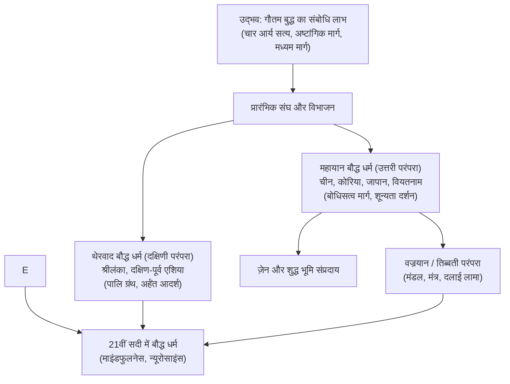

## प्रस्तावना: तार्किक आत्म-जागरण और सार्वभौमिक करुणा

ईसा पूर्व 5वीं शताब्दी में प्राचीन भारत में जन्मे बौद्ध धर्म की अपनी अनोखी विशेषता है: यह किसी सर्वशक्तिमान सृष्टिकर्ता ईश्वर की अवधारणा पर आधारित नहीं है। यह एक व्यावहारिक दर्शन है: **सत्य (धर्म) को यथार्थ रूप में जानना, तृष्णा और आसक्ति को समाप्त कर निर्वाण प्राप्त करना और सभी प्राणियों के प्रति करुणा का भाव रखना**।

## 1. भगवान बुद्ध का जीवन
कपिलवस्तु के राजकुमार सिद्धार्थ ने 'चार दृश्य' (वृद्ध, रोगी, शव और संन्यासी) देखकर सांसारिक सुखों का त्याग किया। कठोर तपस्या की व्यर्थता समझकर उन्होंने **मध्यम मार्ग** अपनाया। बोधगया में बोधिवृक्ष के नीचे 35 वर्ष की आयु में संबोधि प्राप्त की और सारनाथ में प्रथम धर्मोपदेश दिया।

## 2. धर्म के मूल सिद्धांत
- **प्रतीत्यसमुत्पाद (कारण-कार्य नियम)**: "इसके होने से वह होता है।" कोई भी वस्तु स्वतंत्र रूप से नहीं उपजती; सब कुछ परस्पर निर्भर कारणों पर टिका है।
- **अस्तित्व के तीन लक्षण**: अनित्यता (*अनिच्च*), अनात्म (*अनत्ता*) और दुःख (*दुक्ख*)।
- **चार आर्य सत्य**: 1. दुःख सत्य; 2. दुःख समुदय (तृष्णा); 3. दुःख निरोध (निर्वाण); 4. दुःख निरोध गामिनी प्रतिपदा (अष्टांगिक मार्ग)।

## 3. प्रमुख संप्रदाय
- **थेरवाद**: प्राचीन पालि साहित्य और भिक्षु जीवन की पवित्रता पर जोर देता है।
- **महायान**: सभी प्राणियों के उद्धार के लिए **बोधिसत्व** मार्ग और नागार्जुन के **शून्यता** दर्शन को प्रधानता देता है।
- **वज्रयान**: तिब्बत में विकसित गूढ़ तांत्रिक साधना, जिसमें दलाई लामा आध्यात्मिक नेतृत्व करते हैं।

## 4. ज़ेन परंपरा और आधुनिक विज्ञान
जापान में ज़ेन साधना (*ज़ाज़ेन*) का विकास हुआ। 21वीं सदी में जॉन कबाट-ज़िन ने बौद्ध स्मृति (*सति*) को 'माइंडफुलनेस' के रूप में विज्ञान और चिकित्सा से जोड़ा, जिससे बुद्ध का दर्शन आधुनिक तनावमुक्ति का वैश्विक आधार बन गया है।
