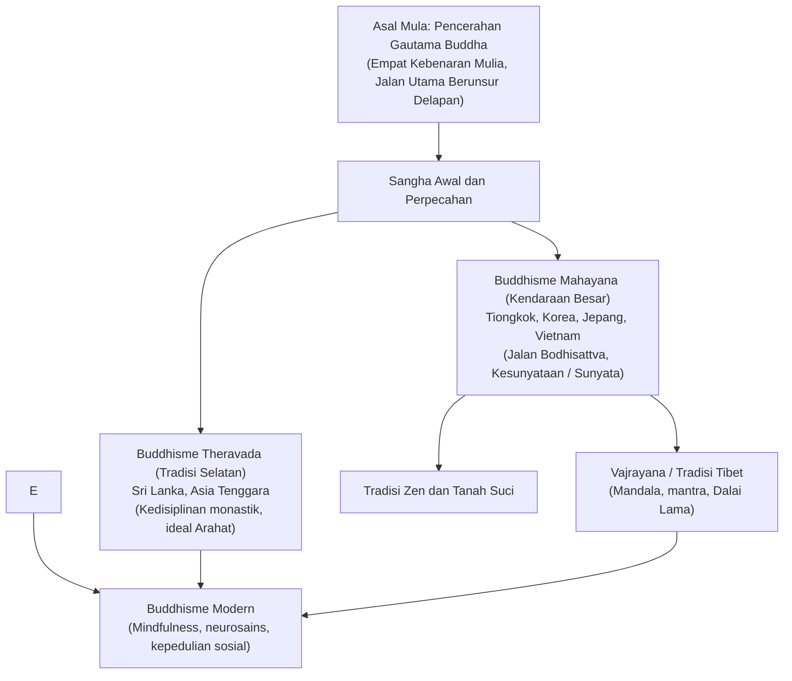

## Pengantar: Pencerahan Rasional dan Welas Asih Universal

Lahir di India kuno pada abad ke-5 SM, Buddhisme berbeda dari tradisi monoteistis: ia tidak mengenal dewa pencipta mutlak. Buddhisme adalah jalan penyelidikan rasional: **melihat hakikat kenyataan sebagaimana adanya (Dharma), melenyapkan penderitaan dengan melepaskan kemelekatan, dan mewujudkan welas asih universal bagi semua makhluk**.

## 1. Riwayat Hidup Buddha Gautama
Pangeran Siddharta meninggalkan kemewahan istana setelah melihat empat pemandangan: orang tua, orang sakit, jenazah, dan pertapa. Menolak penyiksaan diri ekstrem, ia menemukan **Jalan Tengah**. Di bawah pohon Bodhi di Bodh Gaya, ia mencapai Pencerahan Sempurna pada usia 35 tahun dan membabarkan Dharma selama 45 tahun hingga Parinirvana.

## 2. Inti Ajaran Dharma
- **Paticcasamuppada (Sebab Musabab yang Saling Bergantungan)**: Tiada fenomena yang berdiri sendiri secara kekal; segala sesuatu timbul akibat ketergantungan pada kondisi-kondisi pendahulu.
- **Tiga Corak Keberadaan (Tilakkhana)**: Ketidakkekalan (*Anicca*), Tanpa-Aku (*Anatta*), dan Ketidakpuasan (*Dukkha*).
- **Empat Kebenaran Mulia**: 1. Kebenaran Dukkha; 2. Kebenaran Asal Mula Dukkha (kemelekatan/kehausan nafsu); 3. Kebenaran Lenyapnya Dukkha (Nirwana); 4. Kebenaran Jalan Menuju Lenyapnya Dukkha (Jalan Utama Berunsur Delapan).

## 3. Mazhab-Mazhab Utama
- **Theravada**: Menjaga Kanon Pali orisinal dengan fokus pada disiplin kebiaraan dan pencapaian Arahat.
- **Mahayana**: Menekankan cita-cita **Bodhisattva** demi keselamatan semua makhluk, serta merumuskan filosofi **Kesunyataan (Sunyata)**.
- **Vajrayana**: Aliran tantra di Tibet yang menggunakan mandala dan visualisasi meditatif mendalam.

## 4. Tradisi Zen di Jepang
Di Jepang, Buddhisme berkembang melalui Zen (aliran Soto dengan meditasi duduk *zazen*, dan Rinzai dengan teka-teki *koan*), serta mazhab Tanah Suci (Shinran).

## 5. Buddhisme Abad ke-21: Sains dan Mindfulness
Melalui program MBSR Jon Kabat-Zinn, latihan kesadaran penuh (*Sati*) terbukti secara ilmiah menyehatkan otak, sementara gerakan Buddhisme Terlibat (Thich Nhat Hanh) membawa kedamaian ke dalam aktivisme lingkungan dan kemanusiaan.
