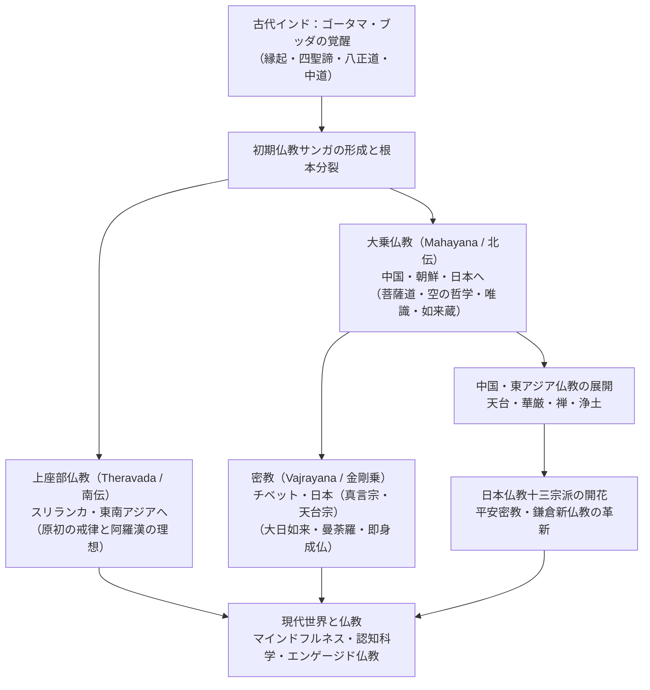
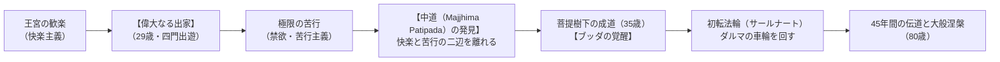
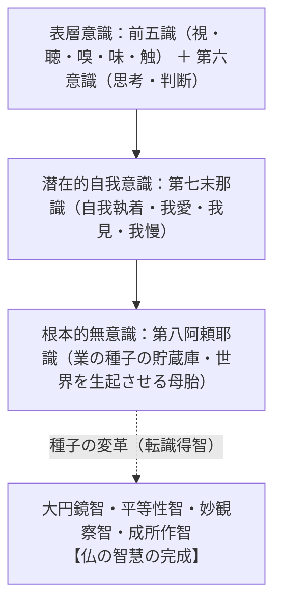
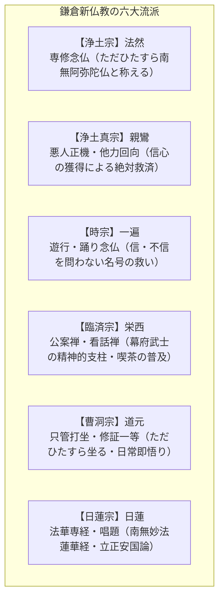
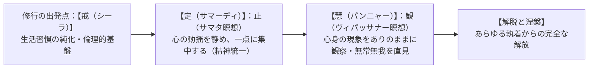

## 序論：世界宗教としての仏教――理性的覚醒と慈悲の思想体系

紀元前5世紀頃の古代インド、ガンジス河流域に生起した仏教（Buddhism）は、キリスト教、イスラム教と並ぶ世界三大宗教の一つとして数えられながらも、他の啓示宗教（一神教）とは際立って異なる本質的特質を備えている。

仏教には、世界を創造し審判を下す「超越的な唯一絶対神（造物主）」が存在しない。仏教が提示するのは、信仰箇条への盲従ではなく、**「世界と人間のありのままの実相（真理＝ダルマ）」を客観的・合理的に見極め（如実知見）、あらゆる執着から自己を解放して心の平安（涅槃寂静）を獲得し、他者への無条件の慈悲を行じること**である。

「ブッダ（Buddha）」とは、固有名詞ではなく「目覚めた人」「真理を悟った人」を意味する普通名詞である。開祖ゴータマ・シッダールタは、自らが神の預言者や使徒であるとは決して名乗らず、「私が見出した法（ダルマ）は、私が作ったものではなく、宇宙に古くから存在し続けてきた普遍の法則である。私はその古道を発見し、歩んだ者に過ぎない」と説いた。

仏教はインドの地を超えて、スリランカ、ミャンマー、タイ、カンボジアなどの東南アジアへ（上座部仏教・南伝仏教）、シルクロードを越えて中国、朝鮮半島、日本、ベトナムへ（大乗仏教・北伝仏教）、そしてヒマラヤを越えてチベット、モンゴルへ（金剛乗・チベット密教）と伝播し、各地域の土着文化や哲学と融合しながら豊穣な精神文化を開花させた。

さらに21世紀の今日、仏教の心理学的アプローチや瞑想法は、欧米社会を中心に「マインドフルネス（Mindfulness）」として再発見され、心理療法、認知科学、神経科学、さらには量子力学との対話を通じて、世界的な広がりを見せている。

本稿では、仏教の起源から根本教義、部派仏教から大乗仏教・密教への思想史的展開、中国・日本仏教の諸宗派、実践論（瞑想・戒律）、そして現代社会における仏教の意義に至るまで、その広大無辺な思想体系を学術的かつ包括的に徹底解説する。




## 第1章：開祖ゴータマ・ブッダ（釈迦牟尼）の実存と生涯

仏教を理解する第一歩は、開祖であるゴータマ・ブッダ（釈迦牟尼 / シャーキャムニ）という一人の人間の実存的歩みを辿ることに他ならない。

### 1.1 王宮の栄華と「四門出遊」の衝撃
紀元前5世紀頃（紀元前6世紀説もある）、現在のネパール南部タライ平原に位置するカピラヴァストゥを拠点とするシャーキヤ（釈迦）族の小王国において、国王シュッドーダナ（浄飯王）と王妃マーヤー（摩耶夫人）の長男として、ゴータマ・シッダールタ（Gautama Siddhartha）が誕生した。ルンビニーの花園においてマーヤー夫人の右脇から生まれ、ただちに七歩歩んで「天上天下唯我独尊（世界においてすべての命は尊い）」と宣言したという伝説が伝わる。生後間もなく母マーヤーを亡くしたシッダールタは、叔母のパジャーパティーによって慈しみ育てられた。

王子として何不自由のない贅沢と歓楽の日々を与えられ、美しい妃ヤソーダラーとの間に長男ラーフラをもうけたシッダールタであったが、その鋭敏な知性は王宮の安逸に甘んじることを許さなかった。彼の精神を根底から揺さぶったのが、有名な**「四門出遊（しもんしゅつゆう）」**の体験である。
- **東門**を出たシッダールタは、腰が曲がり、息も絶え絶えの**「老人」**に出会った。
- **南門**を出た彼は、高熱に呻き苦しむ**「病者」**に出会った。
- **西門**を出た彼は、親族が泣き叫ぶ中で運ばれる**「死者」**に出会った。
- そして**北門**を出た彼は、あらゆる現世的欲望を捨て、威儀を正して歩む清らかな**「出家遊行者（沙門）」**に出会った。

王族の権力も、莫大な富も、若さも美貌も、老・病・死という人間の根本的な苦痛（生老病死の四苦）の前には何の防壁にもならない。人間存在の不可避的な無常さと苦悩を目の当たりにしたシッダールタは、29歳の夜、妻子と王宮の栄華を捨て、愛馬カンタカに跨って城門を出奔した（偉大なる出家）。

### 1.2 二人の師への師事と極限の苦行の限界
出家者となったシッダールタは、当時マガダ国で名を馳せていた高名な瞑想指導者アーラーラ・カーラーマに師事し、無所有処定（一切の執着を離れる無我の境地）を短期間で体得した。続いてウッダカ・ラーマプッタに師事し、非想非非想処定（思索すら超えた最高の精神統一）に達した。しかし、これらの極度のトランス状態（禅定）は一時的な精神の静寂をもたらすだけであり、瞑想から覚めれば再び現実の煩悩と不安が蘇る。シッダールタは師弟関係を解消し、真の解脱を求めて自らの探求へと旅立った。

続いてウルヴェーラーの森（現在のブッダガヤ）において、5人の修行僧（コンダンニャら）とともに、6年間にわたる想像を絶する苛烈な苦行（断食、息止め、炎熱の中での瞑想など）に身を投じた。肉体は骨と皮ばかりに痩せ衰え、胸の肋骨は折れた梁のように浮き彫りになり、触れただけで全身の毛が抜け落ちる極限状態に達したが、肉体をいくら痛めつけても、心の執着や苦悩の根本原因が消え去ることはなかった。

「肉体を極端に苦しめることは、肉体の快楽に耽溺することと同様に、偏った誤った道である」。苦行の限界を悟ったシッダールタは、苦行を放棄してナイランジャナー川（尼連禅河）で身を清め、村の娘スジャータから差し出された乳粥（ミルク粥）の供養を受けて体力を回復した。これを見た5人の仲間は「シッダールタは堕落した」と見限り、彼のもとを去っていった。

### 1.3 菩提樹下の成道と「悪魔（マーラ）の誘惑」
体力を回復したシッダールタは、ブッダガヤのピッパラ樹（菩提樹）の根元に吉祥草を敷いて結跏趺坐し、「この身が枯れ果て、骨が砕け散ろうとも、真の覚りを成就するまでは決してこの座を立たない」と固く誓った。

成道の直前、彼の覚醒を恐れた魔王マーラ（煩悩の化身）が軍勢を率いて襲いかかり、恐怖、暴力、富への執着、美しい娘たちの姿を借りた性的誘惑など、あらゆる手段でシッダールタの心を乱そうとした。しかしシッダールタは右手を下ろして大地に触れ（触地印 / 降魔印）、揺るぎない平安を保って悪魔の軍勢を退けた。

そして紀元前528年頃の12月8日の明け方、東の空に輝く明けの明星を仰ぎ見た瞬間、シッダールタの精神の最後の暗雲が晴れ渡り、宇宙の真理（ダルマ）と生命のメカニズムを完全に覚知した。ここに、35歳のゴータマ・シッダールタは**「ブッダ（覚者）」**となったのである。



### 1.4 初転法輪から大般涅槃へ
覚りの歓喜（法悦）に浸るブッダは、自らが見出した真理があまりにも深遠で難解であるため、「人々に説いても理解されず、徒労に終わるのではないか」と教えを説くことを躊躇した。しかし、インドの主神である梵天（ブラフマー）が三度現れ、「世には煩悩の塵の少ない者もおり、法を聞けば必ず目覚めるでしょう」と懇請した（**梵天勧請**）。慈悲の心から説法を決意したブッダは、かつて去っていった5人の修行僧が滞在するサールナート（鹿野苑）へと向かった。

鹿野苑において、ブッダは5人の僧に向けて人類最初の説法を行った。これを**「初転法輪（しょてんぽうりん）」**と呼ぶ。ブッダの言葉を聞いた5人は直ちに覚りを開き、ここに仏（ブッダ）・法（ダルマ）・僧（サンガ）の**「仏法僧の三宝」**が成立した。

以後45年間にわたり、ブッダはマガダ国やコーサラ国をはじめとするガンジス河流域の全土を素足で歩み、国王、大富豪から、農民、職人、不可触民（賎民）、さらには殺人鬼アングリマーラや遊女アンバパーリーに至るまで、身分や階級を問わずあらゆる人々に教えを説き続けた（対機説法）。

80歳を迎えたブッダは、鍛冶屋チュンダが供養した料理によって激しい食中毒（激痛と下血）に見舞われながらも、最後の目的地クシナガラへと歩み続けた。サーラ双樹（沙羅双樹）の間に頭を北にして横たわったブッダは、悲嘆に暮れる弟子たちに最後の遺誡（ゆいかい）を遺した。

> 「さあ、修行者たちよ。私はお前たちに告げる。**諸々の現象は移ろいゆく（諸行無常）。怠ることなく精進し、自らの務めを成し遂げよ。**」

こうしてブッダは、肉体の生存を終えて完全な静寂である**大般涅槃（マハーパリニルヴァーナ）**へと入った。


## 第2章：仏教の根本教義（ダルマの基本構造）――縁起・四印・四諦・八正道

仏教の思想体系は、高度に論理的で体系的な骨格を持っている。ブッダが覚った真理（ダルマ）は、以下の根本教義によって集約される。

### 2.1 縁起説（Pratityasamutpada）――此があれば彼があり、此が生ずれば彼が生ず
仏教哲学の最重要の基礎であり、すべての仏教思想の母胎となるのが**「縁起（えんぎ / プラティーティヤサムトパーダ）」**の思想である。

> 「此があれば彼があり、此が生ずれば彼が生ずる。
> 此が無ければ彼が無く、此が滅すれば彼が滅す。」（『相応部経典』）

世界に存在するあらゆる現象（物質、心、生命、関係性）は、単独で独立して存在しているもの（固定不変の実体）など一つもない。すべては、**「因（直接的原因）」と「縁（間接的条件・環境）」が相互に関わり合うことによって仮に生起（結果）している**に過ぎない。原因と条件が変化すれば、結果も不可避的に変化・消滅する。

この縁起の法則を、人間の迷いと苦しみの生起プロセスとして12の連鎖で説明したものが**「十二因縁（十二支縁起）」**である。
1. **無明（アヴィディヤー）**：根源的な無知・真理を知らないこと
2. **行（サムスカーラ）**：潜在的な意志・業の形成
3. **識（ヴィジニャーナ）**：識別する意識
4. **名色（ナーマルーパ）**：心と身体の結合
5. **六処（シャダーヤタナ）**：六つの感覚器官（眼・耳・鼻・舌・身・意）
6. **触（スパルシャ）**：感覚器官と対象の接触
7. **受（ヴェーダナー）**：快・不快・中立の感受作用
8. **愛（トリシュナー）**：渇愛・執着・激しい欲望
9. **取（ウパーダーナ）**：執着して我がものとすること
10. **有（バヴァ）**：生存・業の存在
11. **生（ジャーティ）**：生まれ出ること
12. **老死（ジャラーマラナ）**：老い、病み、死ぬこと、憂い、悲しみ、苦しみ

人間が苦しむのは、世界が悪いからでも神の罰でもない。「無明」によって事物の無常・無我の真理が見えず、快楽や自己の存在に「渇愛」を抱いて執着するからである。したがって、智恵によって「無明」を滅すれば、渇愛が滅し、最終的に「老死の苦しみ」も完全に消滅する（縁起の順観と逆観）。

### 2.2 四法印（四つの真理の刻印）
ある教えが真の仏教であるかどうかを判定する基準となる、四つの決定的な真理の旗印（法印）である。

1. **諸行無常（Anitya）**：形あるすべての現象は絶え間なく変化し、一瞬たりとも静止していない。
2. **諸法無我（Anatman）**：いかなる存在も、独立して固定した永遠の「自我（アートマン）」など持たない。
3. **一切皆苦（Duhkha）**：思い通りにならない無常の世界を、思い通りにしようと執着するゆえに、人生のあらゆる生存は「苦（ドゥッカ）」である。
4. **涅槃寂静（Nirvana）**：執着と煩悩の炎を吹き消したとき、絶対の平安と自由の境地（涅槃）が現成する。

### 2.3 四聖諦（四つの聖なる真理）と八正道
四聖諦（ししょうたい）は、ブッダが初転法輪で説いた、人生の苦しみを診断し根治するための「精神の医学的処方箋」である。

| 四聖諦 | サンスクリット | 意味と医学的アナロジー |
| :--- | :--- | :--- |
| **苦諦（くたい）** | Duhkha Satya | **【病の発見】** 人生は苦（思い通りにならないこと）に満ちているという現実を直視する。生老病死の四苦、愛別離苦・怨憎会苦・求不得苦・五蘊盛苦の八苦。 |
| **集諦（じったい）** | Samudaya Satya | **【病因の究明】** 苦しみの根本原因は、無明から生じる激しい「渇愛（トリシュナー）」と執着にある。 |
| **滅諦（めったい）** | Nirodha Satya | **【治癒の目標】** 渇愛と煩悩を完全に断滅すれば、苦しみのない完全な自由と静寂（涅槃・ニルヴァーナ）に到達できる。 |
| **道諦（どうたい）** | Marga Satya | **【治療の実践】** 涅槃に至るための具体的で実践的な道。それが**「八正道」**である。 |

#### 八正道（八つの正しい歩み）
1. **正見（しょうけん）**：縁起や四諦の真理を正しく見ること
2. **正思惟（しょうしゆい）**：貪りや怒り、害意を離れた正しい思い
3. **正語（しょうご）**：嘘、悪口、二枚舌、無駄話を離れた正しい言葉
4. **正業（しょうごう）**：殺生、盗み、不倫などの悪行を離れた正しい行為
5. **正命（しょうみょう）**：他者を傷つけない正当な職業による生活
6. **正精進（しょうしょうじん）**：悪を断ち、善を生み育てる正しい努力
7. **正念（しょうねん）**：身・受・心・法をありのままに気づき続けること（マインドフルネス）
8. **正定（しょうじょう）**：心を一点に集中させ、深い平安に安住する精神統一


## 第3章：部派仏教の展開から大乗仏教の勃興へ――阿羅漢から菩薩への転回

### 3.1 結集（けつじゅう）とサンガの根本分裂
ブッダの死後、弟子たちは教え（法）と規律（律）が散逸し歪曲されることを防ぐため、マガダ国の王舎城（ラージギル）に500人の阿羅漢を集めて**「第1回結集（けつじゅう）」**を開催した。持律第一のウパーリが「律」を暗誦し、多聞第一のアーナンダが「法（経）」を暗誦し、全員の合議によって正典が承認された。

ブッダの死から約100年後、ヴァイシャーリーで開かれた第2回結集において、戒律の解釈（塩の保存や金銭の受領を認めるか否か）を巡って意見が対立。保守的な長老たちの**「上座部（Sthaviravada）」**と、柔軟な解釈を求める革新派の多数派**「大衆部（Mahasamghika）」**とにサンガが真っ二つに分裂した（**根本分裂**）。

その後、上座部と大衆部はさらに教理解釈をめぐって枝分かれし、20前後の部派が成立した（**枝末分裂 / 部派仏教の時代**）。

### 3.2 アビダルマ哲学の極致と「小乗」への批判
部派仏教の僧侶たちは、都市の壮大な僧院（ヴィハーラ）に籠もり、ブッダの言葉を極めて細分化された哲学的範疇によって分類・分析する「対法（アビダルマ）」の構築に没頭した（特に説一切有部など）。

彼らは自己の煩悩を断ち切って覚りを開く聖者**「阿羅漢（アラハン / アルハット）」**を目指したが、その緻密な学問体系は民衆から完全に遊離し、僧院のエリート主義へと閉塞していった。

紀元前1世紀頃から紀元後にかけて、この自己保身的な僧院仏教に対して、出家僧と在家信者が結託した広範な宗教改革運動が爆発した。彼らは自らを「あらゆる人々を一度に乗せて彼岸（覚りの岸）へと渡す大きな乗り物」という意味を込めて**「大乗（Mahayana / マハーヤーナ）」**と誇り高く名乗り、自己の救済のみに汲々とする部派仏教を「小さな乗り物＝小乗（Hinayana / ヒーナヤーナ）」と批判した。

```mermaid
flowchart TD
    subgraph 部派仏教（伝統的僧院仏教）
        A1["理想像：【阿羅漢（Arhat）】"] --> B1["目的：自己の煩悩の滅尽・個人の解脱"]
        B1 --> C1["特徴：厳格な出家戒律・アビダルマ哲学"]
    end

    subgraph 大乗仏教（民衆救済の改革運動）
        A2["理想像：【菩薩（Bodhisattva）】"] --> B2["目的：自利利他・一切衆生の完全な救済"]
        B2 --> C2["特徴：般若波羅蜜・空の思想・利他の慈悲"]
    end
```

### 3.3 菩薩道（Bodhisattva）と六波羅蜜
大乗仏教の理想的実践者こそが**「菩薩（ボーディサットヴァ）」**である。
菩薩とは、「自らは覚りに達する能力を持ちながらも、苦しむすべての衆生が救われない限り、自ら涅槃に入らず、迷いの世界に留まって他者を救済し続ける者」である。この**「上求菩提・下化衆生（上に向かって覚りを求め、下に向かって生きとし生ける者を教化・救済する）」**という自利利他の精神が大乗の核心となった。

菩薩の実践徳目が**「六波羅蜜（ろくはらみつ / 六つの彼岸に至る行）」**である。
1. **布施（ダーナ）**：見返りを求めず、財物、真理の教え、安心を人々に施すこと。
2. **持戒（シーラ）**：自律的な倫理規範を守り、清らかな生活を送ること。
3. **忍辱（クシャーンティ）**：迫害や苦難、怒りに対して耐え忍び、心を平静に保つこと。
4. **精進（ヴィーリヤ）**：怠らずに勇気をもって善行と真理の探求に励むこと。
5. **禅定（ディヤーナ）**：心を乱さず、精神を統一して静寂を保つこと。
6. **般若（プラジュニャー）**：あらゆる事物のありのままの実相（空）を見抜く最高の智恵。前の五つの行も、この般若の智恵があって初めて完成する。


## 第4章：大乗仏教の深遠なる哲学――龍樹の「空」と唯識・如来蔵

大乗仏教は、インドにおいて人類の哲学史上最も深遠で精緻な二大潮流（中観派と瑜伽行派）を生み出した。

### 4.1 龍樹（ナーガールジュナ）と「空（Sunyata）」の哲学
2〜3世紀の南インドに現れた**龍樹（ナーガールジュナ）**は、大乗仏教の理論的支柱を築き、八宗の祖師と仰がれる哲学の巨星である。主著『中論（Mulamadhyamakakarika）』において、龍樹は『般若経』の直観を厳格な論理によって体系化した。

部派仏教の説一切有部は、「現象は無常であるが、現象を構成する最小単位の要素（法 / ダルマ）には固有の不変の本質（自性 / スヴァバーヴァ）がある」と主張した。龍樹はこの「自性」の観念を徹底的に論破した。

> 「縁起するものであるなら、それは自性を持たない（無自性）。
> 自性を持たないものであるなら、それは**『空（シューニャ）』**である。」

**「空」とは、「何もない（虚無）」という意味ではない。**
それは、**「いかなるものも、それ単独で自立して存在する固定的・実体的な本質を持たず、他との相互依存関係（縁起）においてのみ成り立っている」**という動態的真理を意味する。もし事物に固定した自性があるなら、変化することも生成することも不可能になってしまう。事物が「空」であるからこそ、世界は自由に変容し、苦しみを滅して覚りに向かうことができるのである。

龍樹はまた、世俗の言葉による真理（**世俗諦**）と、究極の真理（**勝義諦**）という「二諦（にたい）」を説き、「有（存在する）」という執着と「無（何もない）」という虚無主義の両極端を離れた**「中道（ちゅうどう）」**こそが空の本質であると喝破した。

### 4.2 唯識思想（Yogacara）：万物はただ識（こころ）の現れである
4〜5世紀、北インドの**無着（アサンガ）**と**世親（ヴァスバンドゥ）**の兄弟によって大成されたのが**「唯識（ゆいしき / ヴィジニャプティ・マートラ）」**の哲学である。

唯識は、人間の深層心理の深淵を徹底的に探求した仏教の深層心理学である。我々が「外の世界に客観的に存在する」と信じている物質や他者は、実は我々の内なる「識（心・認識作用）」が投影した映像に過ぎない（唯識無境）。

唯識学派は、従来の六識（視覚・聴覚・嗅覚・味覚・触覚・意識）の奥底に、さらに二つの深層意識を発見した。
1. **第7識：末那識（まなしき / マナス）**：自我執着心。「これが私だ、私のものだ」と無意識のうちにエゴを握りしめ続ける執着の源泉。
2. **第8識：阿頼耶識（あらやしき / アーラヤ・ヴィジニャーナ）**：根本識。「蔵（くら）の識」とも呼ばれる。過去のすべての行為（業 / カルマ）の潜在的エネルギーが「種子（しゅうじ）」として蓄積・貯蔵される無意識の巨大な貯水池。この阿頼耶識の種子が熟して芽吹くことで、我々の身体、心、そして世界全体が現出する。

瞑想修行によって末那識の自我執着を断ち、阿頼耶識の汚れた種子を純粋な智恵へと質的に転換すること（**転識得智**）が、唯識における解脱である。



### 4.3 如来蔵思想（Tathagatagarbha）と本覚思想
「空」が否定的アプローチ（執着の解体）、「唯識」が分析的アプローチ（心の構造）であるのに対し、「すべての生きとし生けるものの内底には、本来的に仏となる可能性（胎児）、すなわち純粋無垢な仏性（ぶっしょう）が宿っている」と肯定的に説いたのが**如来蔵（にょらいぞう）思想**である。

泥にまみれた金塊のように、貪りや怒りの煩悩に覆われていても、人間の本質はすでに仏そのものである（**一切衆生悉有仏性**）。この思想は、後に東アジア（中国・日本）に伝播し、「人間は修行して新たに仏になるのではなく、本来初めから悟っている存在である」とする**「本覚思想（ほんがくしそう）」**へと劇的に発展していった。


## 第5章：密教（金剛乗）の宇宙観とチベット仏教の伝統

### 5.1 密教（Vajrayana / タントラ仏教）の成立と特質
7世紀以降の古代インドにおいて、ヒンドゥー教の隆盛に対抗し、仏教の哲学的深さとインド古来のマントラ（真言）儀礼・身体技法を高度に統合した**「密教（金剛乗 / ヴァジュラヤーナ）」**が成立した。

密教は、言葉で説き明かせる顕教（けんぎょう）に対し、「師から弟子への秘密の儀礼（灌頂）を通じてのみ直伝される、宇宙の真理そのものとの神秘的合一」を教義とする。
- **大日如来（ヴァイローチャナ）**：歴史的人物である釈迦牟尼を超え、宇宙の森羅万象そのものが仏の身体であり真理の現れであるとする根本仏（法身仏）。
- **三密加持（さんみつかじ）**：人間の「身体（身密：印契を結ぶ）」「言葉（口密：真言・マントラを唱える）」「心（意密：曼荼羅を観想する）」の三つの働きを、大日如来の宇宙の働きと完全にシンクロさせることで、この生きた肉体のままで直ちに仏となる（**即身成仏**）。

### 5.2 曼荼羅（Mandala）の象徴体系
曼荼羅とは、サンスクリット語で「本質（manda）を所有するもの（la）」を意味し、悟りの宇宙的秩序を幾何学的に視覚化した聖なる図像である。
- **金剛界曼荼羅**：大日如来の不壊の「智恵」を象徴する。9つの区画（九会）からなり、幾何学的な厳格さを持つ。
- **胎蔵界曼荼羅**：大日如来の無限の「慈悲」が母胎のように万物を育む様を象徴する。中台八葉院を中心として12の大院が展開する。

両者が一対となった「両界曼荼羅」は、宇宙の智恵と慈悲の完璧な統合を体現している。

### 5.3 チベット仏教（ラマ教）の四大学派とダライ・ラマ
インド末期の密教（無上瑜伽タントラ）は、ヒマラヤを越えてチベットへとそのまま移植され、ボン教（土着信仰）を包摂しながら強固な仏教文化圏を形成した。チベット仏教は、師僧（ラマ）を極めて重視することから古くはラマ教とも呼ばれた。

1. **ニンマ派（古派）**：8世紀の密教行者パドマサンバヴァ（グル・リンポチェ）を開祖とする最古の学派。ゾクチェン（大円満）の瞑想を最高峰とする。
2. **カギュ派**：マルパ、ミラレパ、ガンポパへと伝承された実践的瞑想学派。マハームードラー（大手印）の教義を奉じる。
3. **サキャ派**：サキャ寺を拠点とし、元（モンゴル帝国）のフビライ・ハーンの国師となったパスパを輩出した学派。
4. **ゲルク派（黄帽派）**：14〜15世紀、ツォンカパが徹底した戒律復興と中観哲学の再構築を行って創始した最大学派。その高弟が**ダライ・ラマ**および**パンチェン・ラマ**の転生者制度へと連なる。

**転生ラマ制度（トゥルク）**は、高僧の死後、その魂が次の肉体に生まれ変わった幼児を遺品探しや神託によって特定し、後継者として即位させる世界で唯一の霊統継承システムである。現14世ダライ・ラマ（テンジン・ギャツォ）は、中国によるチベット併合と1959年のインド亡命を経て、非暴力平和主義と世界平和への貢献により1989年にノーベル平和賞を受賞し、チベット仏教の知恵を世界中に発信し続けている。


## 第6章：東アジアへの東漸と中国仏教――格義から宗派の成熟へ

シルクロードを通じ、前漢末から後漢初（紀元前後）に中国へ伝来した仏教は、漢字という媒体と道教・儒教の土着思想との劇的な衝突と融合を経て、独自の東アジア仏教へと脱皮した。

### 6.1 格義仏教から鳩摩羅什の訳経事業へ
初期の中国仏教は、仏教の難解な教理（空や涅槃）を、道教の老荘思想の概念（「無」や「無為自然」）を借りて説明する**「格義仏教（かくぎぶっきょう）」**であった。しかしこれでは仏教本来の意図が歪められてしまう。

この限界を打ち破ったのが、4世紀末に長安へ来着した西域クチャ出身の不世出の大訳経僧・**鳩摩羅什（クマーラジーヴァ / 344-413）**である。鳩摩羅什は『摩訶般若波羅蜜経』『妙法蓮華経（法華経）』『維摩経』『中論』など数百巻に及ぶ経典を、格調高く流麗かつ正確無比な漢訳へと翻訳した。今日我々が目にする「色即是空、空即是色」といった名訳は、すべて鳩摩羅什の訳業の結晶である。続いて7世紀には**玄奘三蔵（三蔵法師）**がインド・ナーランダー僧院へ16年の苦難の旅に出て大量のサンスクリット原典を持ち帰り、厳密な新訳を完成させた。

### 6.2 中国仏教の四大宗派
唐代に入ると、インド仏教の忠実な模倣を超え、中国独自の精神的土壌に根ざした壮大な宗派が開花した。

1. **天台宗（智顗）**：天台大師・智顗（ちぎ）が『法華経』を最高峰の経典と位置づけ、仏教経典のすべてを体系化した「五時八教」の教相判釈を確立。一瞬の心の中に全宇宙の三千世界が具わっているとする**「一念三千」**の深遠な実相論と、瞑想実践法『摩訶止観』を大成した。
2. **華厳宗（法蔵）**：『華厳経』に基づき、宇宙のすべての事象（事）と普遍の理法（理）が、互いに妨げることなく無限に重なり合い溶け合っているとする**「事事無礙法界（じじむげほっかい）」**の壮大なコスモロジーを展開した。
3. **浄土教（曇鸞・道綽・善導）**：乱世の民衆に対し、自己の修行の力（自力）の限界を自覚させ、阿弥陀仏の無限の慈悲の本願（他力）にすがって「南無阿弥陀仏」と称えることで、死後に西方極楽浄土へ往生することを説いた。
4. **禅宗（達磨から六祖慧能へ）**：南インドから中国へ渡った菩提達磨（ボーディダルマ）を初祖とし、経典の文字にとらわれず（**不立文字**）、師の心から弟子の心へ直接真理を伝え（**教外別伝**）、自らの本来の心を見極めて成仏する（**直指人心・見性成仏**）純粋実践派。第6祖の**慧能（えのう）**によって、日常の生活そのものがそのまま悟りの場であるとする「頓悟禅（南宗禅）」が確立され、臨済宗や曹洞宗へと分岐していった。


## 第7章：日本仏教の重層的展開――国家鎮護から民衆救済の革命へ

日本における仏教の受容と発展は、世界的にも類を見ない独自の思想的軌跡を描いた。

### 7.1 飛鳥・奈良仏教（南都六宗）と国家鎮護
538年（または552年）、百済の聖明王から欽明天皇への仏像・経典の献上により仏教が公伝した。物部氏と蘇我氏の抗争を経て、**聖徳太子（厩戸皇子）**が『十七条憲法』第二条に「篤く三宝を敬え」と掲げ、『法華経』『勝鬘経』『維摩経』の三経義疏を著して仏教精神を国づくりの根幹に据えた。

奈良時代には、平城京を中心に**南都六宗（三論宗・成実宗・法相宗・倶舎宗・華厳宗・律宗）**が成立した。これらは民衆救済の教団というよりは、国家の安寧と天皇家を守護する（国家鎮護）官立の学問機関であった。聖武天皇は東大寺の大仏（盧舎那仏）を建立し、鑑真和上を唐から招いて正統な戒律（戒壇）を導入した。一方、行基は禁を犯して民衆に直接布教し、道路や架橋、治水などの社会事業を指導して民衆の絶大な信望を集めた。

### 7.2 平安仏教：最澄の天台宗と空海の真言宗
平安遷都に伴い、奈良の旧仏教の政治介入を排し、山岳寺院において新たな精神的刷新を図ったのが最澄と空海である。
- **最澄（伝教大師 / 767-822）**：比叡山延暦寺を開創し、**天台宗**を開いた。『法華経』に基づき、貴賤を問わずあらゆる人が平等に仏になれる「一乗思想」を唱え、従来の小乗戒を廃して大乗菩薩戒壇の独立を勝ち取った。比叡山は、後に鎌倉新仏教の祖師たちをすべて輩出する「日本仏教の母山」となった。
- **空海（弘法大師 / 774-835）**：高野山金剛峯寺と東寺を拠点に、**真言宗**を開いた。長安で恵果から正統密教の奥義をわずか数ヶ月で授かり、日本に体系的密教を確立した万能の天才。『十住心論』を著して人間の心の進化を10段階で分類し、生身の肉体のままで大日如来と合一する「即身成仏」の境地を提示した。

### 7.3 鎌倉新仏教の宗教革命
12世紀末、武士が台頭し、飢饉、疫病、内乱が打ち続いた激動の中世初期、末法思想（仏の正しい教えが行われなくなる暗黒時代）の切迫感の中で、従来の貴族仏教を根底から覆す**「鎌倉新仏教」**の爆発的革新が起きた。彼らは比叡山で修行しながらも、難解な教理と過酷な修行を捨て、**「ただ一つの決定的な実践（易行・選択）」**によって民衆を救済しようとした。



| 宗派 | 開祖 | 核心教義と実践 | 歴史的特徴 |
| :--- | :--- | :--- | :--- |
| **浄土宗** | **法然**（1133-1212） | **専修念仏**<br/>「南無阿弥陀仏」と口に称えることだけが極楽往生への唯一の道。 | 知者も愚者も平等の救済を説き、旧仏教から激しい弾圧を受ける。 |
| **浄土真宗** | **親鸞**（1173-1262） | **悪人正機説・絶対他力**<br/>「善人なおもて往生をとぐ、いわんや悪人をや」。自己の無力を知る悪人こそが阿弥陀仏の救いの主客。 | 肉食妻帯を断行し、非僧非俗の実存を生きる。本願寺教団へ発展。 |
| **時宗** | **一遍**（1239-1289） | **踊り念仏・賦算（ふさん）**<br/>信心の有無すら問わず、名号そのものに救いの力がある。全土を遊行。 | 庶民芸能（念仏踊り）の母胎となり、歌舞伎の源流を形成。 |
| **臨済宗** | **栄西**（1141-1215） | **公案禅・看話禅**<br/>論理を超えた問い（公案）との格闘を通じて直観的覚醒を得る。 | 鎌倉幕府・室町幕府の庇護を受け、五山文学・禅林文化・茶道を育む。 |
| **曹洞宗** | **道元**（1200-1253） | **只管打坐（しかんたざ）・修証一等**<br/>悟りを目的として坐るのではなく、坐禅する姿そのものが悟りの現成である。 | 越前の永平寺に籠もり、妥協なき純粋坐禅を追求。『正法眼蔵』。 |
| **日蓮宗** | **日蓮**（1222-1282） | **法華経至上・唱題（南無妙法蓮華経）**<br/>『法華経』こそが正法であり、法華経を受持することで現世が仏国土となる。 | 『立正安国論』で国難（元寇）を予言。佐渡流罪など不屈の生涯。 |

### 7.4 江戸の寺請制度から近代の廃仏毀釈へ
江戸時代、幕府はキリシタン禁制を徹底するため、すべての民衆をいずれかの仏教寺院の檀家として登録させる**寺請制度（檀家制度）**を敷いた。これにより寺院は戸籍管理と葬祭を独占する特権的地位を得たが、同時に宗教的活力を失い、形式的な「葬式仏教」へと形骸化していった。

明治維新を迎えると、神道を国教化しようとする新政府の神仏分離令を契機に、全国で仏像・経典・伽藍を打ち壊す狂気的な**廃仏毀釈（はいぶつきしゃく）**の嵐が吹き荒れた。この壊滅的打撃の中から、近代仏教学（原典研究に基づく文献学）の導入や、清沢満之による精神主義運動など、内省的な近代仏教の再構築が進められることとなった。


## 第8章：仏教の実践体系――瞑想（バーヴァナー）の技法と解脱へのプロセス

仏教の教理は、机上の抽象理論ではなく、具体的な心身の変容技法（修行・瞑想）と一体不可分である。

### 8.1 止（サマタ）と観（ヴィパッサナー）
初期仏教から現代に至るまで、仏教の瞑想体系は**「止（サマタ）」**と**「観（ヴィパッサナー）」**という二本の車輪によって構成されている。



1. **止（サマタ瞑想 / Samatha）**
   - 呼吸（アーナーパーナ・サティ）、特定の対象（カスィナ）、あるいは慈悲の心（慈悲の瞑想）に意識を集中させ、雑念や妄想の波立ちを完全に静める瞑想法。
   - 心が深く統一されるにつれて、初禅から第四禅に至る**色界四禅定**、さらに無色界の定へと意識の深層へと沈潜し、深い至福と不動の静寂（サマーディ）を体験する。

2. **観（ヴィパッサナー瞑想 / Vipassana）**
   - サマタによって静まった心をレンズとして、自らの心身の現象（呼吸、身体の感覚、湧き上がる感情、思考の生滅）を、善悪のジャッジを下すことなく、ただ一瞬一瞬「ありのままに気づき、観察する（サティ / 念）」瞑想法。
   - 観察を通じて、「あらゆる現象は一瞬も留まらずに生滅している（諸行無常）」「そこに固定した自己など存在しない（諸法無我）」ことを観照し、実存的執着を根本から解体して覚り（涅槃）へと至る。

### 8.2 禅の只管打坐（しかんたざ）と公案
日本の禅宗において独自に研ぎ澄まされた実践が、曹洞宗の**只管打坐**と臨済宗の**公案（こうあん）**である。
- **只管打坐**：道元が説いた「ただひたすらに坐る」こと。何か別の特別な神秘体験を得るために坐るのではなく、雑念を払おうともせず、眠気を払い、背筋を伸ばして坐っているその姿そのものが、仏の悟りのありのままの現成であるとする（修証一等）。
- **公案体系**：「隻手の音声（片手の拍手の音とは何か）」「趙州無字（犬に仏性はあるか）」など、論理的思考や日常の言語では絶対に解けないパラドックス（公案）を師から与えられ、全存在をかけてその問いになりきることで、エゴの論理を内側から爆破し、絶対的覚醒（見性）へと突き抜ける。


## 第9章：仏教の宇宙論と死生観――須弥山、三界六道と業（カルマ）の深層力学

仏教は、人間の内面的な救済にとどまらず、古代インドの壮大な宇宙モデル（コスモロジー）を継承・再解釈した精緻な世界構造論を展開した。

### 9.1 須弥山（シュメール山）を中心とする宇宙構造
仏教の伝統的な世界観（『倶舎論』世間品などに記述）において、宇宙の中心には黄金に輝く巨大な聖山**「須弥山（しゅみせん / メール山・スメール山）」**がそびえ立つ。
- **構造**：須弥山は水面からの高さが8万由旬（ゆじゅん）、水面下の深さも8万由旬あり、周囲を七つの黄金の山脈と七つの内海、そして外海の塩海が同心円状に取り囲んでいる。塩海の東西南北には四つの大陸（四大洲）が浮かび、南に位置する「閻浮提（えんぶだい / 南瞻部洲）」こそが、我々人類が暮らす現実の人間世界である。
- **日月と天界**：須弥山の中腹を太陽と月が巡り、昼夜と季節の変化をもたらす。須弥山の頂上には帝釈天が住まう三十三天（忉利天）が広がり、さらにその上空には夜摩天、兜率天（弥勒菩薩が待機する天界）、化楽天、他化自在天といった欲界の天界が重層的に展開する。

### 9.2 三界（欲界・色界・無色界）の垂直的ヒエラルキー
仏教は、迷いの生存（輪廻の領域）を意識の洗練度に応じて「三界（さんがい）」に区分する。

1. **欲界（よくかい）**：食欲、性欲、睡眠欲などの本能的欲望に支配された世界。地獄・餓鬼・畜生・修羅・人間および欲界六天が含まれる。
2. **色界（しきかい）**：粗大な欲望は離れたが、微細な物質（色）や身体の形態が残る世界。禅定（サマタ瞑想）の深化に対応して初禅天から第四禅天まで18の天界に分かれる。
3. **無色界（むしきかい）**：物質や身体の制約を完全に超え、純粋な精神的意識のみが存在する世界。空無辺処、識無辺処、無所有処、非想非非想処の四つの最極の天界からなる。

重要なのは、無色界の最高天（有頂天）に生まれ変わったとしても、寿命が尽きれば再び下位の世界へと転落する輪廻の牢獄に留まっているという点である。仏教が目指す解脱とは、この「三界のすべての枠組みから完全に脱出（出三界）すること」である。

### 9.3 六道輪廻（ろくどうりんね）の精神分析的解釈
人間が自らの業（カルマ）の力によって生死を繰り返す六つの迷いの世界が**「六道」**である。

| 六道の世界 | 象徴する苦痛と環境 | 現代的・心理学的解釈（心の状態） |
| :--- | :--- | :--- |
| **地獄道** | 炎熱地獄・極寒地獄など、絶え間なき激痛と恐怖の世界。 | 激しい怒り、恨み、恐怖、トラウマによって自他を責め苛む心の極限状態。 |
| **餓鬼道** | 喉が針のように細く、食物が火に変わって決して満たされない世界。 | 際限のない強欲、欠乏感、渇望、アルコールや薬物などの依存症の心理。 |
| **畜生道** | 弱肉強食の恐怖と本能の盲目的な衝動に縛られた世界。 | 知性を失い、目先の快楽や自己保身、本能的な恐怖に衝動的に駆られる心。 |
| **修羅道** | 常に他者と激しい闘争、憎悪、嫉妬に明け暮れる阿修羅の世界。 | プライド、他者への対抗意識、嫉妬、勝ち負けやマウントに執着する心。 |
| **人間道** | 苦楽が相半ばし、生老病死の四苦を抱えるが、仏教の法を聞き覚りを開く好機に恵まれた世界。 | 歓びと悲しみの狭間で揺れ動きながらも、内省と精神的成長が可能な日常的意識。 |
| **天上道** | 望むものが何でも叶い、快楽と長寿を享受できるが、やがて衰え死ぬ世界（五衰の苦しみ）。 | 一時的な成功、富、至福感、陶酔に浸るが、その無常さに怯える心。 |

大乗仏教、特に天台宗では、これら六道に「声聞・縁覚・菩薩・仏」の四聖を加えた**「十界」**を説き、一人の人間の心の中に一瞬にして地獄から仏までのあらゆる境地が具わっており、相互に移行し得る（**十界互具**）と洞察した。

### 9.4 業（カルマ）の法則と「自業自得」のダイナミズム
「業（カルマ / Karman）」とは、単なる「宿命」や「運命」ではない。それは本来、サンスクリット語で**「行為（Action）」**を意味する。

仏教における業は、三業（身業：肉体的行動、口業：発言、意業：心の思考・意志）に分類されるが、ブッダが最も決定的なものとして重視したのは**「意業（意志 / チェータナー）」**であった。
悪意や執着をもってなされた行為は、潜在的なエネルギー（業の薫習）として阿頼耶識に種子を植え付け、必ず自らに苦痛の結果（果報）をもたらす。善意と慈悲をもってなされた行為は、幸福の果報をもたらす（**善因善果・悪因悪果・自業自得**）。

したがって、現在の自分の境遇は過去の自分の行為の結果であるが、**未来の自分の運命は「今、この瞬間の自分の選択と行為」によっていくらでも変革可能である**。仏教のカルマ論は、諦念の決定論ではなく、自己の生の責任を自らの手に引き受ける最も力強い主体性の宣言なのである。


## 第9章：21世紀における仏教の現代的射程――科学との対話とグローバル展開

### 9.1 マインドフルネス（Mindfulness）の世界的爆発
1970年代末、アメリカのマサチューセッツ大学医学部教授ジョン・カバット・ジン（Jon Kabat-Zinn）は、仏教のヴィパッサナー瞑想（八正道の「正念 / サティ」）から宗教的・文化的教条を取り除き、科学的なストレス低減プログラム**「MBSR（マインドフルネスストレス低減法）」**を開発した。

「今、この瞬間の体験に、評価や判断を下さずに、能動的に注意を向ける」というマインドフルネスの技法は、うつ病の再発予防（MBCT）、不安障害、慢性疼痛の緩和、さらにはGoogleなどの巨大IT企業におけるリーダーシップ研修や社員研修へと急速に導入された。

現代の脳機能イメージング研究（fMRI）は、マインドフルネス瞑想の実践が、脳の恐怖や不安を司る「扁桃体」の活動を鎮静化させ、自己制御や共感を司る「前頭前野」や海馬の灰白質の密度を増加させ、さらには脳のデフォルト・モード・ネットワーク（DMN：過去の後悔や未来の不安を反芻するアイドリング状態）の過剰な暴走を抑制することを科学的に実証している。

### 9.2 認知科学・量子力学との驚異的共鳴
仏教の「無我（固定した自我の不在）」の洞察は、現代の認知神経科学の到達点と驚くべき一致を見せている。脳科学は、「脳の中に意思決定を司る司令官（中央のエゴ）など存在せず、多数の神経モジュールが並列分散処理で相互作用した結果として『私』という錯覚が生み出されているに過ぎない」ことを解明しつつある。

また、量子力学における「観測者と観測対象の不可分性」「素粒子の相互連関性（量子もつれ）」は、龍樹の説いた「縁起・空」の哲学、すなわち「あらゆる事物は独立した実体を持たず、相互の関係性の中でのみ現れる」という宇宙観の数学的・実験的記述と極めて親和性が高い。ダライ・ラマ14世が主宰する「心と生命研究所（Mind & Life Institute）」では、数十年にわたり世界屈指の物理学者、脳科学者、心理学者とチベット高僧たちの本格的な学術対話が継続されている。

### 9.3 エンゲージド・ブッディズム（社会参画仏教）
仏教は、個人の心の平穏に閉じこもる静観主義ではない。ベトナム出身の禅僧ティク・ナット・ハン（Thich Nhat Hanh）らが提唱した**「エンゲージド・ブッディズム（Engaged Buddhism / 社会参画仏教）」**は、仏教の慈悲と縁起の洞察を、戦争の終結、貧困の撲滅、人権擁護、環境破壊（気候変動）の抑止といった地球規模の社会課題への実践的行動へと結びつけた。

すべての生命が互いに依存し合って生きている（**インタービーイング / 相互共生**）という認識は、人間中心主義を超えたエコロジー倫理の最先端の羅針盤となっている。

### 9.4 結語：抜苦与楽の不滅の光
今から二千数百年前、ガンジス河のほとりで一人の人間が発見した「ダルマ（真理）」は、迷信や盲信を排した徹底的な事実の凝視から出発した。

生老病死の苦痛、人間関係の軋轢、テクノロジーの激変による精神の疲弊、分断と戦争の危機に直面する21世紀の現代人にとって、仏教が教える「執着を手放し、今ここに目覚め、他者の苦しみに寄り添う慈悲」の教えは、古びた遺物どころか、混迷の暗闇を照らす最も清新で力強い光明であり続けている。
