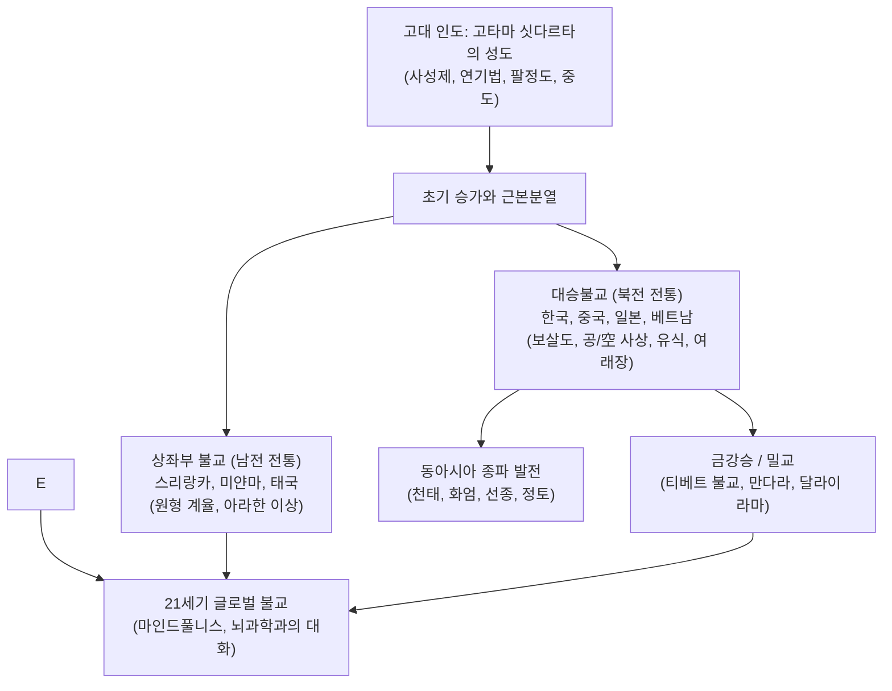

## 서론: 이성적 각성과 자비의 사상 체계

기원전 5세기 고대 인도 갠지스강 유역에서 발흥한 불교(Buddhism)는 기독교, 이슬람교와 함께 세계 3대 종교 중 하나로 꼽히지만, 창조주 유일신을 상정하지 않는다는 점에서 독보적인 특성을 지닙니다.

불교는 맹목적인 믿음이 아닌, **세계와 인간의 참된 실상(진리, 다르마)을 있는 그대로 여실히 통찰(여실지견)하고, 모든 집착을 여의어 열반의 평안을 얻으며, 일체중생에게 무조건적인 자비를 베푸는 실천 철학**입니다.

'붓다(Buddha)'는 고유명사가 아닌 '깨달은 자'를 뜻하는 보통명사입니다. 고타마 싯다르타는 신의 계시자가 아니라 누구나 걸어갈 수 있는 보편적 진리의 길을 발견한 스승이었습니다. 스리랑카와 동남아시아로 전파된 **상좌부 불교**, 실크로드를 거쳐 동아시아로 이어진 **대승불교**, 히말라야를 넘은 **티베트 밀교**, 그리고 현대 서구에서 인지과학과 결합한 **마인드풀니스(명상)**에 이르기까지 불교는 인류 정신사의 찬란한 등불이 되어 왔습니다.

## 1. 부처님의 생애와 깨달음
카필라바스투의 왕자로 태어난 싯다르타는 '사문유관(늙음, 병듦, 죽음, 수행자)'을 목격하고 인간 존재의 근원적 고통을 직시하여 29세에 출가했습니다.
스승들의 선정과 6년간의 극한 고행을 거쳤으나 그것이 번뇌를 없애지 못함을 깨닫고, 쾌락과 고행의 양 극단을 떠난 **중도(中道)**를 발견했습니다. 부다가야의 보리수 아래에서 마라의 유혹을 물리치고 35세에 완전한 깨달음을 얻어 붓다가 되었으며, 사르나트에서 초전법륜을 펼친 후 80세에 쿠시나가라에서 반열반에 들 때까지 45년간 자비의 가르침을 전했습니다.

## 2. 불교의 핵심 교리: 연기, 사법인, 사성제
- **연기설 (Pratityasamutpada)**: "이것이 있으므로 저것이 있고, 이것이 생기므로 저것이 생긴다." 모든 현상은 독립된 실체가 없이 무수한 원인(인)과 조건(연)의 상호작용으로 발생합니다.
- **사법인**: 제행무상(모든 것은 변한다), 제법무아(고정된 자아는 없다), 일체개고(집착하면 괴롭다), 열반적정(집착을 끊으면 평화롭다).
- **사성제와 팔정도**: 고제(삶의 고통 직시), 집제(고통의 원인은 갈애), 멸제(열반의 경지), 도제(해탈에 이르는 8가지 바른 길: 정견, 정사유, 정어, 정업, 정명, 정정진, 정념, 정정).

## 3. 부파불교와 대승보살도의 태동
붓다 입멸 후 승가는 상좌부와 대중부로 근본분열되었습니다. 부파불교 승려들이 학문적 번쇄함에 빠져 개인의 해탈(아라한)에 머물자, 모든 중생을 구제하겠다는 **대승(큰 수레)** 운동이 일어났습니다. 대승불교는 자비와 지혜를 갖춘 **보살(Bodhisattva)**을 이상으로 삼아 육바라밀을 실천합니다.

## 4. 대승철학의 정수: 공(空)과 유식(唯識)
- **용수의 공 사상 (중관학파)**: 모든 것은 연기하므로 고유한 자성(自性)이 없으며, 비어 있기에(空) 무한한 생명과 변화가 가능하다는 역설적 지혜.
- **유식학 (세친, 무착)**: 우리가 인식하는 세계는 마음(식)의 투영이라는 심층심리학. 제8식인 아뢰야식에 훈습된 업의 종자를 지혜로 전환(전식득지)합니다.

## 5. 한국·동아시아 불교와 선(禪)
중국을 거쳐 발전한 불교는 한국에서 원효의 화쟁사상, 의상의 화엄종, 보조국사 지눌의 돈오점수 정혜쌍수로 심화되었습니다. 일본에서는 가마쿠라 신불교(도겐의 조동종 묵조선, 법연·신란의 정토교)를 낳았습니다.

## 6. 21세기 마인드풀니스와 인지과학
존 카밧진의 MBSR(마음챙김 스트레스 완화) 프로그램을 통해 불교의 사티(정념)는 의학과 심리치료의 표준으로 자리 잡았으며, 뇌과학 연구는 명상이 편도체를 안정시키고 뇌 구조를 변화시킴을 밝혀냈습니다. 틱낫한 스님의 참여불교는 환경과 평화 운동으로 승화되어 현대인의 지친 영혼에 영원한 쉼터를 제공하고 있습니다.
