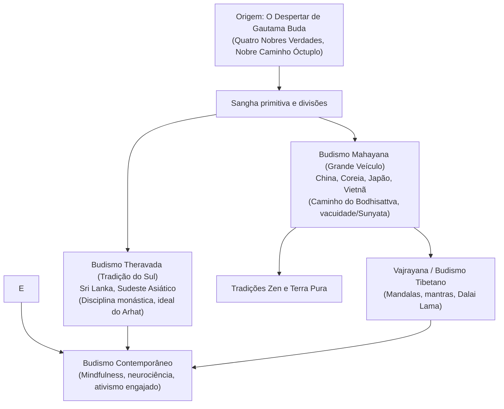

## Introdução: Despertar Racional e Compaixão Universal

Surgido na Índia antiga no século V a.C., o Budismo destaca-se entre as grandes religiões por não preconizar um Deus criador supremo. Propõe uma via de investigação fenomenológica: **compreender a realidade como ela é (Dharma), superar o sofrimento extinguindo o apego e viver com compaixão por todos os seres**.

## 1. A Vida do Buda
Siddhartha Gautama renunciou à opulência palaciana após conhecer a velhice, a doença, a morte e um asceta errante. Ao superar mortificações extremas, descobriu o **Caminho do Meio**. Sob a árvore Bodhi atingiu a iluminação suprema aos 35 anos, ensinando o Dharma por mais de quatro décadas.

## 2. Pilares do Dharma
- **Originação Dependente (Pratityasamutpada)**: Todos os fenômenos existem de forma interconectada, sem uma essência fixa e imutável.
- **As Três Marcas da Existência**: Impermanência (*Anicca*), Não-Eu (*Anatta*) e a insatisfatoriedade da existência cega (*Dukkha*).
- **As Quatro Nobres Verdades**: 1. A verdade do sofrimento; 2. A verdade da origem do sofrimento (o apego egoísta); 3. A verdade da cessação (Nirvana); 4. A verdade do Nobre Caminho Óctuplo.

## 3. As Grandes Tradições
- **Theravada**: Preserva os cânones em páli mais antigos, enfatizando a disciplina monástica e a iluminação do Arhat.
- **Mahayana**: Estabelece o ideal do **Bodhisattva** e aprofunda a filosofia da **vacuidade (Sunyata)** com mestres como Nagarjuna.
- **Vajrayana**: Linhagem esotérica do Tibete que utiliza mandalas e meditações avançadas para acelerar o despertar.

## 4. O Zen e a Tradição Japonesa
No Japão, consolidou-se a tradição Zen (Soto de Dogen com a meditação *zazen*, e Rinzai com os enigmas *koans*), além das escolas da Terra Pura e Nichiren.

## 5. Século XXI: Ciência e Mindfulness
Com o trabalho pioneiro de Jon Kabat-Zinn, a atenção plena budista foi validada pelas neurociências, enquanto o Budismo Engajado de Thich Nhat Hanh alia meditação à defesa ecológica e aos direitos humanos.
