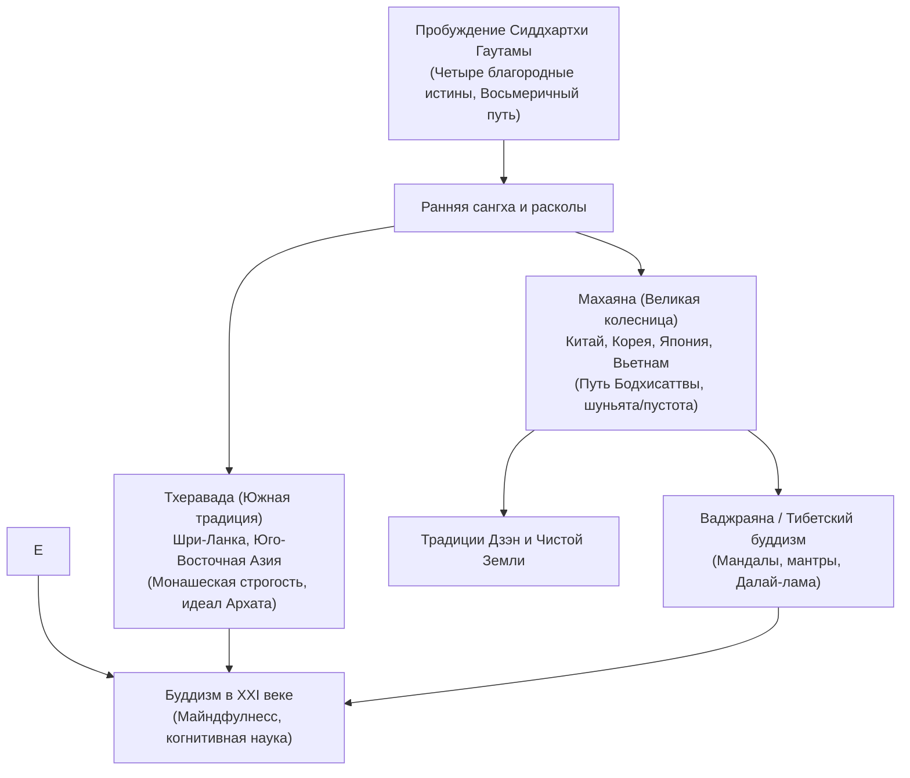

## Введение: Рациональное пробуждение и вселенское сострадание

Возникнув в древней Индии в V веке до н. э., буддизм занимает уникальное место среди мировых религий: в нем нет концепции бога-творца, требующего слепой веры. Это система феноменологического познания: **видеть вещи такими, какие они есть (Дхарма), преодолевать привязанности и взращивать сострадание ко всем живым существам**.

## 1. Жизнь Будды Шакьямуни
Царевич Сиддхартха Гаутама оставил роскошный дворец, потрясенный встречами со стариком, больным, мертвецом и аскетом. Отвергнув умерщвление плоти, он нашел **Срединный путь**. В 35 лет под деревом Бодхи он достиг Пробуждения и учил Дхарме на протяжении сорока пяти лет.

## 2. Основы учения (Дхармы)
- **Взаимозависимое возникновение (Пратитья-самутпада)**: Ничто не существует само по себе; всё в мире взаимосвязано и обусловлено причинами и следствиями.
- **Три признака бытия**: Непостоянство (*Анитья*), отсутствие неизменной души (*Анатман*) и неудовлетворенность омраченного эго (*Духкха*).
- **Четыре благородные истины**: 1. Истина о страдании; 2. Истина о причине (эгоистическое влечение); 3. Истина о прекращении (Нирвана); 4. Истина о Благородном восьмеричном пути.

## 3. Направления буддизма
- **Тхеравада**: Хранит древнейший Палийский канон, ставя во главу угла монашескую дисциплину и достижение состояния Архата.
- **Махаяна**: Провозглашает подвиг **Бодхисаттвы**, стремящегося спасти всех существ, и развивает учение о **пустоте (Шуньяте)** Нагарджуны.
- **Ваджраяна**: Тантрическая традиция Тибета, использующая мандалы и медитации для достижения быстрого просветления.

## 4. Японский буддизм и традиция Дзэн
В Японии буддизм развился в традиции Сингон, школы Чистой Земли и Дзэн (школа Сото с медитацией *сикантадза* Догэна и школа Риндзай с загадками-коанами).

## 5. Буддизм и современный мир
Благодаря Джону Кабат-Зинну буддийская осознанность (*сати*) легла в основу современных программ майндфулнесс, подтвержденных исследованиями нейробиологии.
