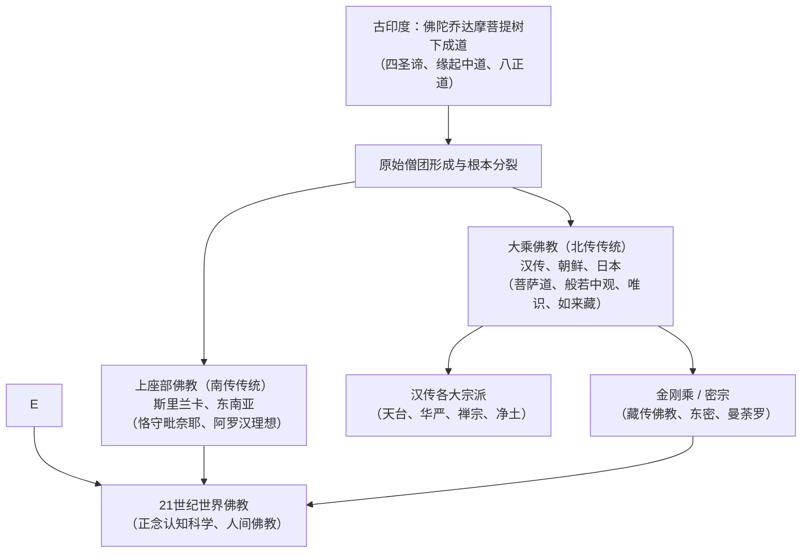

## 序论：理性的觉醒与普世的慈悲

公元前5世纪诞生于古印度的佛教，与基督教、伊斯兰教并列为世界三大宗教，但其内在特质却独树一帜：佛教不承认全知全能、主宰造物的绝对唯一神，也绝非要求信徒盲从教条。

佛教本质上是一门探求宇宙与生命实相的认知哲学：**如实观照万法实相（法 / 达摩），通过戒定慧的修持断除烦恼执念，证得清凉寂静的涅槃，并对一切有情众生践行无条件的慈悲**。

“佛陀（Buddha）”并非专有名词，意为“觉悟者”。悉达多·乔达摩从未自命为神明使者，而是宣称自己发现了一条人人皆可证悟的古老真理大道。从印度向南辐射至斯里兰卡和东南亚（**南传上座部**），沿丝绸之路向北传入中国、朝鲜半岛、日本与越南（**北传大乘**），跨越喜马拉雅进入西藏与蒙古（**金刚乘藏密**），乃至在当代西方演化为风靡全球的心理“正念（Mindfulness）”，佛教展现出博大精深的跨文明生命力。

## 第一章 佛陀乔达摩的觉醒与生涯
释迦族太子悉达多出生于蓝毗尼园，享受王宫无尽欢娱。但在“四门出游”目睹老、病、死及修行沙门后，深感世事无常与生存苦难，遂于29岁夜半逾城出家。

在历经两位仙人的禅定传授与六年的极端苦行后，悉达多悟出苦行非道，接受牧羊女乳糜供养恢复体力，确立了不堕沉溺亦不落极端的**中道**。在菩提迦耶菩提树下，他降伏魔王干扰，于十二月初八破晓睹明星悟道，成就正等正觉。在鹿野苑初转法轮度化五比丘，开启了长达45年的行脚弘法，最终于80岁在拘尸那迦娑罗双树间示寂入大般涅槃。

## 第二章 佛法核心结构：缘起、四法印与四圣谛
- **缘起法则（Pratityasamutpada）**：“此有故彼有，此生故彼生；此无故彼无，此灭故彼灭。”宇宙万物皆由因缘和合而生，并无孤立永恒的本体自性。
- **四法印**：诸行无常、诸法无我、一切皆苦、涅槃寂静。
- **四圣谛与八正道**：苦谛（审视生存之苦）、集谛（探究苦之根源在于无明贪爱）、灭谛（息灭贪嗔痴证得涅槃）、道谛（实践通向解脱的正见、正思惟、正语、正业、正命、正精进、正念、正定）。

## 第三章 部派分立与大乘菩萨道
佛灭后经王舍城第一次结集与吠舍离第二次结集，僧团因戒律与教义产生根本分裂（上座部与大众部）。部派佛教陷入繁复琐碎的阿毗达磨思辨。

公元前后大乘运动兴起，批判罗汉自度为“小乘”，倡导**“自利利他、普度众生”的菩萨道**，以六波罗蜜（布施、持戒、忍辱、精进、禅定、般若）为修行指归。

## 第四章 大乘三大哲学支柱
1. **中观学派（龙树菩萨）**：依《中论》确立“诸法因缘生，我说即是空”，揭示“空”非虚无，而是无自性的动态缘起。
2. **瑜伽行唯识学派（无著、世亲）**：深入阿赖耶识的深层心理结构，阐释“万法唯识所现”，通过转识成智达成解脱。
3. **如来藏思想**：宣示“一切众生悉有佛性”，众生本具清净圆满的成佛潜能。

## 第五章 汉传八宗与日本佛教的革新
佛教东传与儒道相融，在唐代形成天台、华严、禅宗、净土等成熟宗派。六祖慧能倡导“不立文字、见性成佛”的顿悟禅。

传入日本后，从奈良六宗演进至平安时代最澄的天台宗与空海的真言密教。镰仓时代爆发彻底平民化的宗教革命：法然的净土宗、亲鸾的净土真宗、道元的曹洞宗（只管打坐）、荣西的临济宗公案禅与日莲的法华信仰。

## 第六章 21世纪的佛法回响
卡巴金将佛教正念修持提炼为MBSR减压疗法，脑神经科学研究证实正念冥想能显著调节大脑杏仁核与前额叶皮层功能。一行禅师倡导的人间佛教将慈悲投入环境保护与和平运动，展现出古老智慧与现代科学文明的深度交融。
