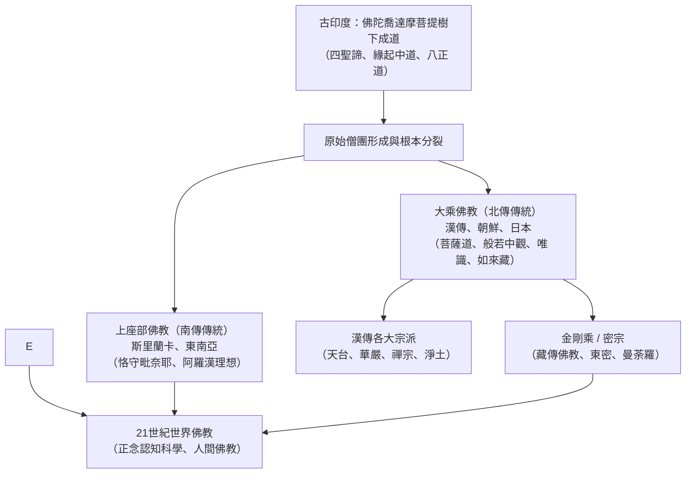

## 序論：理性的覺醒與普世的慈悲

公元前5世紀誕生於古印度的佛教，與基督教、伊斯蘭教並列為世界三大宗教，但其內在特質卻獨樹一幟：佛教不承認全知全能、主宰造物的絕對唯一神，也絕非要求信徒盲從教條。

佛教本質上是一門探求宇宙與生命實相的認知哲學：**如實觀照萬法實相（法 / 達摩），通過戒定慧的修持斷除煩惱執念，證得清涼寂靜的涅槃，並對一切有情眾生踐行無條件的慈悲**。

「佛陀（Buddha）」並非專有名詞，意為「覺悟者」。悉達多·喬達摩從未自命為神明使者，而是宣稱自己發現了一條人人皆可證悟的古老真理大道。從印度向南輻射至斯里蘭卡和東南亞（**南傳上座部**），沿絲綢之路向北傳入中國、朝鮮半島、日本與越南（**北傳大乘**），跨越喜馬拉雅進入西藏與蒙古（**金剛乘藏密**），乃至在當代西方演化為風靡全球的心理「正念（Mindfulness）」，佛教展現出博大精深的跨文明生命力。

## 第一章 佛陀喬達摩的覺醒與生涯
釋迦族太子悉達多出生於藍毗尼園，享受王宮無盡歡娛。但在「四門出遊」目睹老、病、死及修行沙門後，深感世事無常與生存苦難，遂於29歲夜半逾城出家。

在歷經兩位仙人的禪定傳授與六年的極端苦行後，悉達多悟出苦行非道，接受牧羊女乳糜供養恢復體力，確立了不墮沉溺亦不落極端的**中道**。在菩提迦耶菩提樹下，他降伏魔王干擾，於十二月初八破曉睹明星悟道，成就正等正覺。在鹿野苑初轉法輪度化五比丘，開啟了長達45年的行腳弘法，最終於80歲在拘屍那迦娑羅雙樹間示寂入大般涅槃。

## 第二章 佛法核心結構：緣起、四法印與四聖諦
- **緣起法則（Pratityasamutpada）**：「此有故彼有，此生故彼生；此無故彼無，此滅故彼滅。」宇宙萬物皆由因緣和合而生，並無孤立永恆的本體自性。
- **四法印**：諸行無常、諸法無我、一切皆苦、涅槃寂靜。
- **四聖諦與八正道**：苦諦（審視生存之苦）、集諦（探究苦之根源在於無明貪愛）、滅諦（息滅貪嗔癡證得涅槃）、道諦（實踐通向解脫的正見、正思惟、正語、正業、正命、正精進、正念、正定）。

## 第三章 部派分立與大乘菩薩道
佛滅後經王舍城第一次結集與吠舍離第二次結集，僧團因戒律與教義產生根本分裂（上座部與大眾部）。部派佛教陷入繁複瑣碎的阿毗達磨思辨。

公元前後大乘運動興起，批判羅漢自度為「小乘」，倡導**「自利利他、普度眾生」的菩薩道**，以六波羅蜜（布施、持戒、忍辱、精進、禪定、般若）為修行指歸。

## 第四章 大乘三大哲學支柱
1. **中觀學派（龍樹菩薩）**：依《中論》確立「諸法因緣生，我說即是空」，揭示「空」非虛無，而是無自性的動態緣起。
2. **瑜伽行唯識學派（無著、世親）**：深入阿賴耶識的深層心理結構，闡釋「萬法唯識所現」，通過轉識成智達成解脫。
3. **如來藏思想**：宣示「一切眾生悉有佛性」，眾生本具清淨圓滿的成佛潛能。

## 第五章 漢傳八宗與日本佛教的革新
佛教東傳與儒道相融，在唐代形成天台、華嚴、禪宗、淨土等成熟宗派。六祖慧能倡導「不立文字、見性成佛」的頓悟禪。

傳入日本後，從奈良六宗演進至平安時代最澄的天台宗與空海的真言密教。鎌倉時代爆發徹底平民化的宗教革命：法然的淨土宗、親鸞的淨土真宗、道元的曹洞宗（只管打坐）、榮西的臨濟宗公案禪與日蓮的法華信仰。

## 第六章 21世紀的佛法迴響
卡巴金將佛教正念修持提煉為MBSR減壓療法，腦神經科學研究證實正念冥想能顯著調節大腦杏仁核與前額葉皮層功能。一行禪師倡導的人間佛教將慈悲投入環境保護與和平運動，展現出古老智慧與現代科學文明的深度交融。
