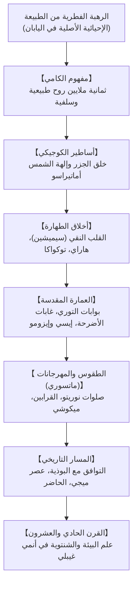

## مقدمة: ديانة طبيعية بلا نبي ولا كتب عقائدية

تمثل الشنتوية («طريق الآلهة») الروحانية الأصلية لليابان منذ فجر التاريخ، وتتميز بعدم وجود **مؤسس تاريخي**، أو **كتاب مقدس عقائدي**، أو **وصايا قسرية**. إنها إحساس حي بالانسجام مع الطبيعة: **تبجيل الحضور المقدس للأرواح (*الكامي*) الكامنة في الجبال، الأشجار المعمرة، الشلالات، والأسلاف**.

## 1. مفهوم أرواح الكامي
عرّف الباحث موتوأوري نوريناغا «الكامي» بأنها كل ما يثير الرهبة الجليلة (*كاشيكوكي*): الجبال الشاهقة، الأشجار العملاقة، الظواهر الكونية (إلهة الشمس أماتيراسو)، وأرواح الأسلاف. وتتسم الكامي بطاقتين: طاقة هادئة ومباركة (*نيغي-ميتاما*)، وأخرى عاصفة ومندفعة (*أرا-ميتاما*).

## 2. الأساطير اليابانية (كوجيكي و نيهون شوكي)
تروي الأساطير كيف خلق الإلهان إيزاناغي وإيزانامي جزر اليابان. وأثناء طقس التطهر بالماء (*ميسوغي*)، ولد من عيني إيزاناغي إلهة الشمس أماتيراسو وإله القمر تسوكويومي، ومن أنفه إله العواصف سوسانو.

## 3. الطهارة وفلسفة التجدد (توكواكا)
- **القلب النقي الشفاف (سيميشين)**: يولد الإنسان طاهراً بطبعه؛ وما يصيبه من دنس وتعب نفسي (*كيغاري*) يُمحى بالاغتسال بالماء (*ميسوغي*) وبركات التطهير الكهنوتية (*هاراي*).
- **التجدد الدائم (توكواكا)**: لا تبحث الشنتوية عن الخلود في الأحجار الثابتة، بل في التجديد الدوري. في ضريح **إيسي جينغو**، يُهدم الضريح الخشبي ويُعاد بناؤه بالكامل كل عشرين عاماً (*شيكينين سينغو*) لنقل مهارات البناء والحفاظ على حيوية المكان.

## 4. الأضرحة والمهرجانات الشعبية (ماتسوري)
تتميز الأضرحة ببوابات **التوري** الحمراء، وحبال القش المقدسة **شيميناوا**، وغابات الأضرحة العذراء (*تشينجو نو موري*). وخلال مهرجانات *ماتسوري*، يسهم هز الهوادج المقدسة (*ميكوشي*) في بث طاقة حيوية جديدة في المجتمع.

## 5. صدى الشنتوية في العصر الحديث
تشكل غابات الأضرحة محميّات بيئية حيوية ألهمت علماء البيئة العالميين. كما تعكس أفلام المخرج هاياو ميازاكي (*المخطوفة*، *الأميرة مونونوكي*) هذا التناغم الساحر بين الإنسان وروح الطبيعة إلى جمهور واسع في شتى أنحاء الأرض.
