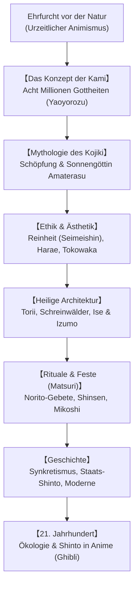

## Einleitung: Eine Religion ohne Stifter und Dogmen

Der Shinto („Weg der Götter“) ist die autochthone Naturspiritualität Japans. Er besitzt **keinen historischen Religionsstifter**, **keine heilige Schrift** wie Bibel oder Koran und **keine dogmatischen Gebote**. Shinto ist vielmehr eine gelebte Haltung tiefer Ehrfurcht vor der Natur und den zahllosen beseelenden Kräften: den **Kami**.

## 1. Das Wesen der Kami
Nach Motoori Norinaga ist Kami alles, was außergewöhnliche Ehrfurcht (*kashikoki*) einflößt: Berggötter, Wasserfälle, majestätische Urwaldriesen, Gestirne (Sonnengöttin Amaterasu) oder Ahnengeister. Kami besitzen zwei dynamische Seiten: die wilde, zornige Kraft (*Ara-mitama*) und die milde, segensreiche Harmonie (*Nigi-mitama*).

## 2. Mythologie: Kojiki und Nihon Shoki
Die Mythen erzählen von den Urgöttern Izanagi und Izanami, die mit dem himmlischen Juwelenspeer die japanischen Inseln schufen. Bei Izanagis ritueller Waschung (*Misogi*) nach der Rückkehr aus dem Totenreich entstanden Amaterasu (Sonne), Tsukuyomi (Mond) und Susanoo (Sturm). Die Eröffnung der himmlischen Felsenhöhle gilt als Ursprung von Fest, Tanz und sakraler Kunst.

## 3. Reinheit (Harae) und die Idee des Tokowaka
- **Reinheit (Seimeishin)**: Der Mensch gilt als von Natur aus gut; Schuld (*Tsumi*) und Makel (*Kegare*) sind wie Staub, der durch rituelle Waschungen (*Misogi*) und Priestersegen (*Harae*) abgewaschen werden kann.
- **Tokowaka (Ewige Jugend)**: Shinto sucht die Ewigkeit nicht im starren Stein, sondern in der zyklischen Erneuerung. Der Schrein von **Ise Jingu** wird alle 20 Jahre komplett abgerissen und identisch neu errichtet (*Shikinen Sengu*).

## 4. Schreine, Rituale und Feste
Gekennzeichnet durch das rote **Torii-Tor**, den heiligen Strohstrick (**Shimenawa**) und den unberührten Schreinwald (*Chinju no Mori*), bildet der Schrein einen heiligen Raum. Bei den Festen (*Matsuri*) belebt das rhythmische Schütteln der tragbaren Schreine (*Mikoshi*) die Lebensenergie der Gemeinschaft.

## 5. Aktualität im 21. Jahrhundert
Die ökologische Schutzfunktion der Schreinwälder inspiriert moderne Renaturierungskonzepte (Miyawaki-Methode). Gleichzeitig vermitteln weltberühmte Anime (Hayao Miyazakis *Prinzessin Mononoke*, *Chihiros Reise ins Zauberland*) Shinto-Werte der Verbundenheit allen Lebens an ein globales Publikum.
