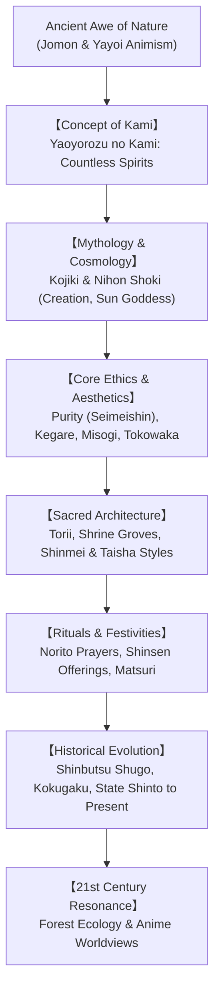

## Introduction: An Indigenous Religion without a Founder or Dogma

Practiced continuously on the Japanese archipelago since prehistoric times, Shinto (the "Way of the Kami") defies conventional definitions of world religions.

Shinto possesses **no historical founder** like the Buddha or Jesus Christ, **no sacred scripture** analogous to the Bible or Quran, and **no dogmatic moral commandments**. Rather than a doctrinal creed, Shinto is an organic worldview woven directly into the fabric of everyday life: **a reverent awareness of sacred vitality (*Kami*) residing in nature's wonders—mountains, ancient cedars, waterfalls, wind, agricultural crops, and ancestral spirits**.

In our twenty-first-century world marked by severe climate crises, Shinto's ancient reverence for nature, its architecture of renewal (*Tokowaka*), and its sacred shrine groves (*Chinju no Mori*) offer profound ecological wisdom.

## Chapter 1: The Concept of Kami: Reverence for the Sublime
The renowned eighteenth-century Kokugaku scholar Motoori Norinaga offered the classic definition of *Kami*:
> "Any being whatsoever which possesses some eminent quality out of the ordinary, and is awe-inspiring (*kashikoki*), is called Kami."

Kami encompass:
1. **Nature Spirits**: Amaterasu Omikami (sun), Tsukuyomi (moon), Susanoo (sea and storm), mountains, rivers, ancient rocks, and lightning.
2. **Ancestral and Heroic Spirits**: Clan deities (*Ujigami*), emperors, and historical figures like Tokugawa Ieyasu.
3. **Pacified Spirits (*Goryo*)**: Those who died tragically, such as Sugawara no Michizane (Tenjin), enshrined to transform wrath into benevolence.

Kami possess dynamic aspects: the fierce, transformative **Ara-mitama** and the gentle, harmonizing **Nigi-mitama**.

## Chapter 2: The Mythology of the Kojiki and Nihon Shoki
The *Kojiki* (712 CE) and *Nihon Shoki* (720 CE) record Japan's creation mythology:
- **Izanagi and Izanami**: Stood upon the Floating Bridge of Heaven, stirring the ocean with the Heavenly Jeweled Spear to form Onogoro Island, before giving birth to the islands of Japan (*Oyashima*) and nature deities.
- **The Descent to the Underworld and Misogi**: Following Izanami's death, Izanagi visited the realm of death (*Yomi*). Escaping its corruption, he washed in the sea at Tachibana; washing his left eye birthed the Sun Goddess **Amaterasu**, his right eye birthed the Moon God **Tsukuyomi**, and his nose birthed the storm god **Susanoo**.
- **The Heavenly Rock Cave (*Ama-no-Iwato*)**: When Amaterasu hid in grief, plunging the world into darkness, the goddess Ame-no-Uzume danced ecstatically, drawing laughter that lured the Sun Goddess out, restoring cosmic illumination.
- **The Divine Descent (*Tenson Korin*)**: Amaterasu's grandson Ninigi-no-Mikoto descended to earth carrying the Three Sacred Treasures (Mirror, Jewel, Sword), establishing the imperial lineage.

## Chapter 3: Ethics and Aesthetics: Purity, Misogi, and Tokowaka
- **Seimeishin (Pure and Cheerful Heart)**: Humans are born naturally pure. Sin is not an innate stain, but accumulated dust (*kegare*) that can be swept away.
- **Kegare and Harae**: *Kegare* (withering of spiritual vitality) is cleansed through ritual purification (*harae*) and cold-water immersion (*misogi*).
- **Tokowaka (Eternal Youthfulness)**: Rather than preserving stone monuments for eternity, Shinto rebuilds wooden shrines from scratch at regular intervals. At **Ise Jingu**, the sacred shrine is rebuilt every twenty years (*Shikinen Sengu*), renewing youth and passing architectural crafts intact across millennia.

## Chapter 4: Shrine Architecture and Sacred Space
Shrine precincts are defined by symbolic thresholds:
- **Torii**: Sacred gateway marking the boundary between the mundane world and the realm of Kami.
- **Shimenawa**: Sacred twisted rice-straw ropes demarcating sanctified ground.
- **Architectural Styles**:
  - *Shinmei-zukuri* (Ise Jingu): Ancient elevated granary design featuring straight gabled roofs, natural cypress, and projecting rafters (*chigi*).
  - *Taisha-zukuri* (Izumo Taisha): Grand ancient palace architecture with a massive central pillar.
  - *Nagare-zukuri* (Fushimi Inari, Kamo shrines): Gracefully extended front roof curve, forming the most widespread style.

## Chapter 5: Rituals, Offerings, and Festivals
Shinto rituals follow a solemn rhythm: purification (*shubatsu*), inviting the deity (*koshin*), presenting fresh local food offerings (*shinsen*), chanting poetic prayers (*norito*), and sharing a celebratory communion feast (*naorai*).
The agricultural year is marked by the spring *Kinensai* (prayers for harvest) and the autumn *Niinamesai* (thanksgiving for first fruits). The raucous communal spirit of **Matsuri**—carrying divine palanquins (*mikoshi*) through streets with vigorous shaking (*tamafuri*)—recharges the life force of both community and deity.

## Chapter 6: Historical Odyssey: Syncretism to Modernity
For a thousand years, Shinto blended with Buddhism under the doctrine of **Honji Suijaku** (Kami viewed as compassionate local manifestations of universal Buddhas). 

The 1868 Meiji Restoration enforced a radical separation of Shinto and Buddhism (*Shinbutsu Bunri*), constructing **State Shinto** as an imperial civic cult. Following World War II, the Allied Powers issued the **Shinto Directive (1945)**, restoring strict religious freedom and separation of church and state. Today, over 80,000 shrines are voluntarily coordinated by the Association of Shinto Shrines (*Jinja Honcho*).

## Chapter 7: Shinto in the 21st Century: Ecology and Global Pop Culture
- **Sacred Shrine Groves (*Chinju no Mori*)**: Ancient pristine forests surrounding shrines preserve Japan's original biodiversity, inspiring Akira Miyawaki's global reforestation techniques.
- **Cinematic Animism**: The masterpieces of Hayao Miyazaki (*Spirited Away*, *Princess Mononoke*, *My Neighbor Totoro*) and Makoto Shinkai (*Your Name*, *Suzume*) celebrate Shinto animism, purification, and the interconnectedness of all life, enchanting audiences across the globe.

## Conclusion: An Unconditional Affirmation of Life
Shinto has no terrifying apocalypse or eternal damnation. It offers an unbroken affirmation of the living present (*Musuhi*—generative vitality). In bowing before ancient cedar trees beneath misty mountain skies, humanity rediscovers its humble, joyful place within the sacred web of nature.
