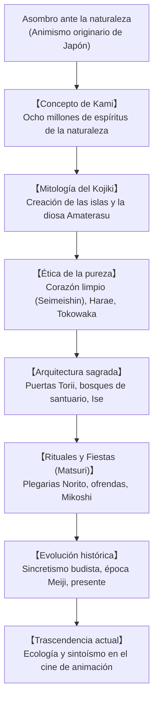

## Introducción: Una espiritualidad sin fundador ni escrituras sagradas

Religión indígena de Japón desde la prehistoria, el sintoísmo («el camino de los dioses») carece de los rasgos habituales de las religiones occidentales: **no tiene un fundador histórico**, **no posee un libro sagrado canónico** y **no impone mandamientos dogmáticos**. Es una comunión intuitiva con la naturaleza: **una reverencia ante la presencia de lo sagrado (*Kami*) en los bosques, manantiales, montes, antepasados y ciclos agrícolas**.

## 1. El concepto de Kami
Según el erudito Motoori Norinaga, todo lo que posee una cualidad extraordinaria y suscita sobrecogimiento reverencial (*kashikoki*) es un Kami: majestuosas montañas, cascadas, árboles milenarios, la diosa del sol Amaterasu o los espíritus de los antepasados. Los Kami manifiestan dos fuerzas activas: la energía impetuosa y bravía (*Ara-mitama*) y la pacífica y bienhechora (*Nigi-mitama*).

## 2. Mitología del Kojiki y el Nihon Shoki
Los mitos relatan cómo los dioses creadores Izanagi e Izanami engendraron el archipiélago nipón. Tras el descenso al inframundo de los muertos, la purificación con agua (*misogi*) de Izanagi dio a luz a Amaterasu (el sol), Tsukuyomi (la luna) y Susanoo (el mar y las tormentas).

## 3. Pureza ritual y la filosofía de Tokowaka
- **Corazón puro y transparente (Seimeishin)**: El ser humano nace noble y puro; las impurezas del día a día (*kegare*) se limpian mediante abluciones de agua (*misogi*) y bendiciones de los sacerdotes (*harae*).
- **Tokowaka (Eterna juventud)**: La eternidad sintoísta no radica en la piedra estática, sino en la renovación cíclica. En el gran santuario de **Ise Jingu**, los templos de madera de ciprés se reconstruyen exactamente iguales cada 20 años (*Shikinen Sengu*).

## 4. Santuarios y festividades (Matsuri)
El acceso a un santuario está presidido por los portales **Torii**, cuerdas sagradas de paja de arroz (**Shimenawa**) y el bosque sagrado (*Chinju no Mori*). En las fiestas populares (*Matsuri*), la enérgica sacudida de los palanquines sagrados (*Mikoshi*) renueva la vitalidad espiritual de toda la comunidad.

## 5. El sintoísmo hoy: Naturaleza y animación global
Los bosques sagrados de los santuarios han protegido ecosistemas autóctonos fundamentales para la ciencia ecológica moderna. En el cine de animación, las obras maestras de Hayao Miyazaki (*La princesa Mononoke*, *El viaje de Chihiro*) y Makoto Shinkai han popularizado esta reverencia animista en todo el mundo.
