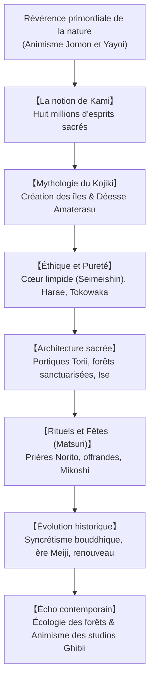

## Introduction : Une spiritualité sans prophète ni dogme

Spiritualité autochtone du Japon, le shinto (« la voie des dieux ») déconcerte les catégories religieuses occidentales : il n'a **ni fondateur historique**, **ni livre saint unique**, **ni code moral dogmatique**. C'est une sensibilité vécue au diapason des forces de la nature : **un respect sacré voué aux esprits et puissances qui animent le cosmos, les Kamis**.

## 1. La nature des Kamis
Selon le lettré Motoori Norinaga, tout ce qui suscite une vénération mystique (*kashikoki*) est un Kami : les sommets majestueux, les arbres millénaires, les éléments naturels (la déesse solaire Amaterasu), ainsi que les esprits des ancêtres défunts. Les Kamis allient une dimension apaisante (*Nigi-mitama*) et une puissance sauvage et impétueuse (*Ara-mitama*).

## 2. Les récits mythologiques du Kojiki
Les chroniques racontent comment le couple originel Izanagi et Izanami donna naissance à l'archipel japonais. Après la mort d'Izanami, la purification par l'eau (*misogi*) d'Izanagi engendra Amaterasu (le soleil), Tsukuyomi (la lune) et Susanoo (les tempêtes). L'épisode de la caverne céleste célèbre la renaissance de la lumière par le rire et la danse.

## 3. Pureté rituelle et philosophie du Tokowaka
- **Le cœur pur et limpide (Seimeishin)** : L'être humain naît pur ; les souillures (*kegare*) accumulées dans l'existence sont dissipées par des ablutions d'eau (*misogi*) et des rituels de purification (*harae*).
- **Le Tokowaka (L'éternelle jeunesse)** : Le shinto n'érige pas d'édifices de pierre millénaires, mais reconstruit intégralement ses sanctuaires en bois à intervalles réguliers. À **Ise Jingu**, le grand sanctuaire est rebâti tous les 20 ans (*Shikinen Sengu*), perpétuant savoir-faire artisanal et vigueur spirituelle.

## 4. Les sanctuaires et les célébrations populaires
Franchir un portique **Torii** et contempler les cordes sacrées **Shimenawa** marque le passage dans un espace purifié protégé par la forêt sacrée (*Chinju no Mori*). Durant les festivals (*Matsuri*), les sanctuaires portatifs (*Mikoshi*) sont vigoureusement secoués pour régénérer la force vitale de la communauté.

## 5. Résonance dans le monde contemporain
Les bosquets shinto constituent de véritables réserves écologiques préservant la biodiversité originelle du Japon. Dans la culture contemporaine, l'animisme poétique d'Hayao Miyazaki (*Princesse Mononoké*, *Le Voyage de Chihiro*) et de Makoto Shinkai fait vibrer cette communion harmonieuse entre l'homme et la nature à travers le monde.
