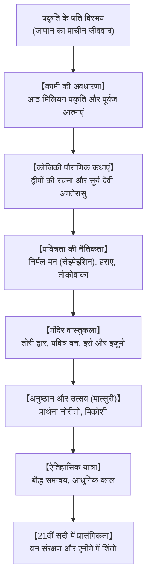

## प्रस्तावना: पैगंबर और धर्मग्रंथ विहीन एक प्राकृतिक परंपरा

जापान की प्राचीन मूल आध्यात्मिक परंपरा 'शिंतो' (देवताओं का मार्ग) किसी एक ऐतिहासिक संस्थापक या विशिष्ट धर्मग्रंथ पर आधारित नहीं है। यह प्रकृति के साथ सामंजस्य का एक जीवंत मार्ग है: **पहाड़ों, प्राचीन वृक्षों, झरनों और पूर्वजों में विद्यमान दैवीय शक्ति (*कामी*) के प्रति गहरी श्रद्धा का भाव**।

## 1. कामी की अवधारणा
विद्वान मोतोओरी नोरिनागा के अनुसार, हर वह वस्तु जो श्रद्धा और विस्मय उत्पन्न करती है, कामी है: पर्वत, नदियाँ, सूर्य देवी अमतेरासु या पूर्वज। कामी के दो पहलू होते हैं: उग्र शक्ति (*आरा-मितामा*) और शांत वरदान देने वाली शक्ति (*निगी-मितामा*)।

## 2. कोजिकी की पौराणिक कथाएं
कथाओं के अनुसार इजानागी और इजानामी देवताओं ने जापानी द्वीपों को जन्म दिया। जल से स्नान कर शुद्धिकरण (*मिसोगी*) करते समय सूर्य देवी अमतेरासु और तूफान के देवता सुसानोओ का जन्म हुआ।

## 3. पवित्रता और तोकोवाका का दर्शन
- **निर्मल मन (सेइमेइशिन)**: मनुष्य जन्म से पवित्र होता है; सांसारिक अशुद्धियों को जल स्नान (*मिसोगी*) और पुरोहितों के मंत्रों (*हराए*) से धोया जाता है।
- **तोकोवाका (सदाबहार यौवन)**: शिंतो में पत्थरों के स्थान पर लकड़ी के मंदिरों को हर 20 वर्ष में उसी रूप में पुनः निर्मित किया जाता है (**इसे जिंगू** का शिकिनेन सेनगु)।

## 4. तोरी द्वार और मात्सुरी उत्सव
लाल **तोरी द्वार** पवित्र सीमा का प्रतीक है। जापानी लोक उत्सवों (*मात्सुरी*) में पालकी (*मिकोशी*) को उत्साह से हिलाना समाज में नई ऊर्जा का संचार करता है।

## 5. प्रकृति और आधुनिक एनीमे
मंदिरों के आसपास के 'चिंजू नो मोरी' जंगल जैव विविधता के अद्भुत केंद्र हैं। हयाओ मियाज़ाकी की एनीमेशन फिल्मों (*स्पिरिटेड अवे*, *प्रिंसेस मोनोनोके*) में शिंतो का प्रकृति प्रेम पूरी दुनिया को प्रभावित करता है।
