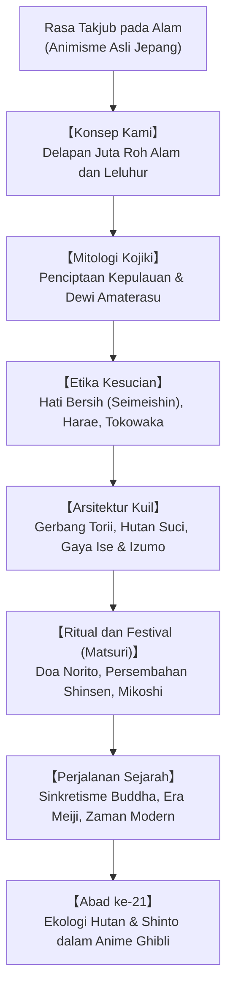

## Pengantar: Spiritualitas Alami Tanpa Pendiri dan Kitab Dogmatis

Dipraktikkan di kepulauan Jepang sejak zaman prasejarah, Shinto ("Jalan para Kami") memiliki ciri khas tersendiri: **tidak memiliki pendiri historis**, **tidak memiliki kitab suci dogmatis**, dan **tidak memiliki aturan moral yang kaku**. Shinto adalah rasa takjub mendalam terhadap alam: **penghormatan terhadap kehadiran roh suci (*Kami*) yang bersemayam dalam gunung, pohon purba, air terjun, angin, dan leluhur**.

## 1. Hakikat Roh Kami
Menurut cendekiawan Motoori Norinaga, apa pun yang menggetarkan hati dan mengundang rasa hormat mendalam (*kashikoki*) disebut Kami: gunung suci, pohon raksasa, fenomena alam (Dewi Matahari Amaterasu), maupun roh leluhur. Kami memiliki dua sisi energi: sisi garang (*Ara-mitama*) dan sisi damai yang menyejahterakan (*Nigi-mitama*).

## 2. Mitologi Kojiki
Naskah kuno mengisahkan bagaimana dewa pencipta Izanagi dan Izanami melahirkan kepulauan Jepang. Ketika Izanagi menyucikan diri di laut (*misogi*), lahirlah tiga dewa utama: Amaterasu (matahari), Tsukuyomi (bulan), dan Susanoo (badai). Kisah Gua Batu Surgawi melambangkan kembalinya cahaya kehidupan melalui tawa dan sukacita.

## 3. Kesucian Hati dan Filosofi Tokowaka
- **Hati Bersih dan Terang (Seimeishin)**: Manusia lahir suci; kekeruhan moral (*kegare*) dihilangkan melalui pembasuhan air (*misogi*) dan ritual penyucian (*harae*).
- **Tokowaka (Kemudaan Abadi)**: Keabadian Shinto bukan dibangun dari batu mati, melainkan dari pembaruan siklis. Kuil agung **Ise Jingu** dibongkar dan dibangun kembali persis sama setiap 20 tahun (*Shikinen Sengu*).

## 4. Kuil dan Matsuri
Ditandai oleh gerbang merah **Torii**, tali jerami **Shimenawa**, dan hutan suci kuil (*Chinju no Mori*), kuil menjadi ruang perjumpaan dengan yang kudus. Dalam festival (*Matsuri*), mengarak dan mengguncang kuil tandu (*Mikoshi*) dipercaya mengalirkan daya hidup baru bagi seluruh warga.

## 5. Relevansi Ekologi dan Budaya Pop
Hutan di sekitar kuil Shinto berfungsi sebagai cagar alam yang menjaga keanekaragaman hayati asli Jepang. Dalam film-film animasi legendaris Hayao Miyazaki (*Spirited Away*, *Princess Mononoke*), nilai-nilai Shinto yang mencintai alam memikat jutaan penonton di seluruh dunia.
